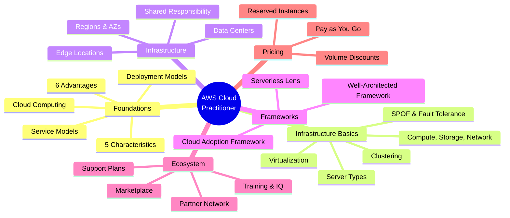

# AWS Cloud Practitioner — Study Notes

**Comprehensive notes on fundamental AWS concepts, services, and cloud computing best practices**

---

## 📋 About

This repository contains structured study notes covering core AWS cloud concepts — from cloud computing fundamentals and global infrastructure to adoption frameworks and the broader AWS ecosystem.

---

## 🗂️ Topics Overview

---

## 📚 Study Modules

| #   | Topic                                                                 | Description                                                                                   |
| --- | --------------------------------------------------------------------- | --------------------------------------------------------------------------------------------- |
| 01  | [Introduction to AWS](./docs/01-introduction-to-aws.md)               | AWS history, cloud computing fundamentals, 5 characteristics, and benefits                    |
| 02  | [Cloud Models & Pricing](./docs/02-cloud-models-and-pricing.md)       | Deployment models, service models (IaaS/PaaS/SaaS), and AWS pricing                           |
| 03  | [AWS Global Infrastructure](./docs/03-aws-global-infrastructure.md)   | Regions, Availability Zones, services architecture, shared responsibility                     |
| 04  | [Cloud Adoption Framework](./docs/04-cloud-adoption-framework.md)     | AWS CAF perspectives, transformation value chain, and adoption phases                         |
| 05  | [Well-Architected Framework](./docs/05-well-architected-framework.md) | Six pillars, serverless best practices, IAM, data protection                                  |
| 06  | [AWS Ecosystem](./docs/06-aws-ecosystem.md)                           | Free tools, Support plans, Marketplace, Training, Partner Network, AMS                        |
| 07  | [Infrastructure](./docs/07-infrastructure.md)                         | SPOF, fault tolerance, server types, clustering, multi-tier architecture                      |
| 08  | [Virtualization](./docs/08-virtualization.md)                         | Virtualization concepts, hypervisors, network/storage/OS virtualization, container technology |
| 09  | [Virtualization Advanced](./docs/09-virtualization-advanced.md)      | Anti-patterns, Linux namespaces, Cgroups, microservices, Kubernetes orchestration, live migration |
| 10  | [Network & Storage](./docs/10-network-storage.md) | Network Virtualization vs NFV by OSI layer, cross-layer technologies, storage virtualization spectrum |
| 11  | [Amazon EC2](./docs/11-amazon-ec2.md) | EC2 instances, capabilities, instance types, user data scripts, pricing models, and lifecycle |
| 12  | [EC2 Instance Types](./docs/12-ec2-instance-types.md) | 6 instance categories, naming convention (m5.2xlarge), configuration attributes, right sizing |
| 13  | [EC2 Purchasing Options](./docs/13-ec2-purchasing-options.md) | 7 pricing options: On-Demand, Reserved, Savings Plans, Spot, Dedicated Hosts/Instances, Capacity Reservations |
| 14  | [EC2 Security & Storage](./docs/14-ec2-security-storage.md) | Security Groups, EBS volumes, snapshots, AMIs, Image Builder, Instance Store, EFS, FSx |
| 15  | [Scalability & HA](./docs/15-scalability-high-availability.md) | Vertical vs horizontal scaling, high availability, scalability vs elasticity vs agility |
| 16  | [Load Balancing & Auto Scaling](./docs/16-load-balancing-auto-scaling.md) | ALB/NLB/GWLB load balancers, ASG scaling strategies (Manual/Step/Target/Scheduled/Predictive) |

---

## 🚀 Quick Start

1. **Start with Module 01**: [Introduction to AWS](./docs/01-introduction-to-aws.md)
2. **Follow the modules in order** — each links to the next
3. **Use the quick-reference table below** for revision

---

## 📝 Quick Reference

| Topic                        | Key Points                                                                                                            |
| ---------------------------- | --------------------------------------------------------------------------------------------------------------------- |
| **Cloud Computing**          | On-demand delivery of IT resources over the internet                                                                  |
| **5 Characteristics**        | On-demand self-service · Broad network access · Multi-tenancy · Rapid elasticity · Measured service                   |
| **6 Advantages**             | CapEx → OpEx · Economies of scale · No capacity guessing · Speed & agility · Stop running DCs · Go global in minutes  |
| **Deployment Models**        | Public (shared) · Private (single org) · Hybrid (both)                                                                |
| **Service Models**           | IaaS (you manage OS/apps) · PaaS (you manage app logic) · SaaS (just use it)                                          |
| **Infrastructure Basics**    | 3 components (Compute, Storage, Network) · SPOF · RAID · Tower/Rack/Blade · Clustering (HA, LB, HPC) · Virtualization |
| **Virtualization**           | Type 1 (Bare Metal, Ring 0) vs Type 2 (Hosted, Ring 3) · NV/NFV/SDN · LVM · Containers (Docker, Kubernetes)              |
| **Virtualization Advanced**  | Anti-patterns · Linux Namespaces/Cgroups · Microservices · Kubernetes · Live Migration · $2.5M ROI                      |
| **Network/Storage**| NV vs NFV by OSI layer · SDN/SD-WAN/Service Mesh · Storage spectrum (Device/Host/Network/Comprehensive)                 |
| **Amazon EC2**     | Virtual servers (IaaS) · 5 categories (GP/CO/MO/SO/GPU) · User Data · EBS/ELB/ASG · 5 pricing models                   |
| **EC2 Instance Types** | 6 categories (GP/CO/MO/AC/SO/HPC) · Naming: m5.2xlarge · Right sizing (start small, scale up)                       |
| **EC2 Purchasing**   | 7 options: On-Demand (0%), Reserved (72%), Savings Plans, Spot (90%), Dedicated, Capacity Reservations                |
| **EC2 Security/Storage**| Security Groups · EBS Volumes · Snapshots · AMIs · Image Builder · Instance Store · EFS · FSx                       |
| **Scalability & HA**     | Vertical vs Horizontal scaling · High Availability (multi-AZ) · Elasticity vs Agility · ASG + ELB                     |
| **Load Balancing & ASG** | ALB (L7) · NLB (L4) · GWLB (L3) · 5 ASG scaling strategies (Manual/Step/Target/Scheduled/Predictive)                  |
| **Infrastructure**           | 36 Regions → 3–6 AZs each → Data Centers · 400+ Edge Locations                                                        |
| **Pricing**                  | Pay as you go · Reserve (up to 75% off) · Volume discounts · Prices drop as AWS grows                                 |
| **CAF Perspectives**         | Business · People · Governance · Platform · Security · Operations                                                     |
| **Well-Architected Pillars** | Operational Excellence · Security · Reliability · Performance · Cost Optimization · Sustainability                    |

---

## 🛠️ Tools & Resources

- [AWS Documentation](https://docs.aws.amazon.com/)
- [AWS Training](https://aws.amazon.com/training/)
- [AWS Well-Architected Framework](https://aws.amazon.com/architecture/well-architected/)

---

## 📝 License

This project is for educational purposes. AWS and related logos are trademarks of Amazon Web Services.

---

_Happy Learning! 🚀_
