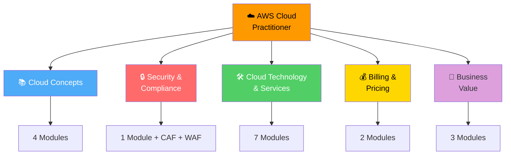
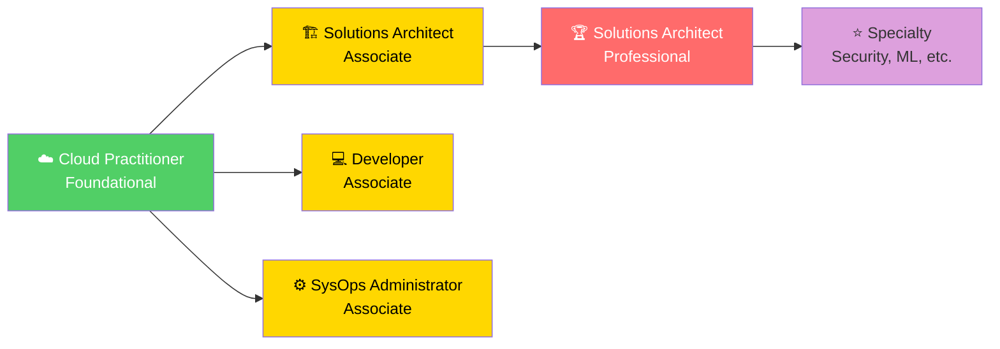

# AWS Cloud Practitioner — Study Notes

**Comprehensive, exam-aligned notes on fundamental AWS concepts, services, and cloud computing best practices**

---

## 📋 About

This repository contains **structured study notes** for the AWS Cloud Practitioner certification, organized into **5 knowledge domains** with **21 focused modules**. Each module includes enhanced Mermaid visualizations, comparison tables, knowledge checks, and exam tips.

### ✨ What's New in This Restructuring

- **🎯 Exam-Aligned**: Organized by the 5 AWS CCP exam domains
- **📊 Enhanced Visualizations**: 200+ Mermaid diagrams and comparison tables
- **✅ Knowledge Checks**: Every module ends with exam-style MCQs
- **🎓 Quick References**: Each module includes a rapid revision summary
- **🔗 Logical Flow**: Prerequisites covered before advanced topics
- **📉 Reduced Redundancy**: 18 files consolidated into 21 focused modules

---

## 🗺️ Knowledge Domain Map

---

## 📚 Study Modules by Domain

### Domain 0: Infrastructure Prerequisites 🏗️

> **Foundational Context** | **1 Module** | Pre-cloud infrastructure concepts

| # | Module | Description | Key Topics |
|---|--------|-------------|------------|
| 0.1 | [Infrastructure Prerequisites](./docs/00-prerequisites/01-infrastructure-fundamentals.md) | SPOF, RAID, server types, clustering, multi-tier architecture | Fault tolerance, ECC memory, IPMI |

---

### Domain 1: Cloud Computing Fundamentals 📚

> **Exam Weight:** ~15-20% | **4 Modules** | Foundation concepts

| # | Module | Description | Key Topics |
|---|--------|-------------|------------|
| 1.1 | [Introduction to Cloud Computing](./docs/01-cloud-fundamentals/01-introduction-to-cloud.md) | AWS overview, cloud definition, 5 NIST characteristics | AWS timeline, 5 characteristics, 6 advantages |
| 1.2 | [Cloud Deployment Models](./docs/01-cloud-fundamentals/02-deployment-models.md) | Public, Private, Hybrid, Multi-Cloud | Deployment comparison, decision matrix |
| 1.3 | [Cloud Service Models](./docs/01-cloud-fundamentals/03-service-models.md) | IaaS, PaaS, SaaS, responsibility layers | Service model comparison, cost-control spectrum |
| 1.4 | [Cloud Economics](./docs/01-cloud-fundamentals/04-cloud-economics.md) | CapEx vs OpEx, trade-offs, cloud economics | Financial fundamentals, break-even analysis |

---

### Domain 2: AWS Global Infrastructure & Shared Responsibility 🔒

> **Exam Weight:** ~15-20% | **3 Modules** | AWS infrastructure and security model

| # | Module | Description | Key Topics |
|---|--------|-------------|------------|
| 2.1 | [AWS Global Infrastructure](./docs/02-aws-infrastructure/01-global-infrastructure.md) | Regions, AZs, Edge Locations | Global architecture, region selection |
| 2.2 | [Shared Responsibility Model](./docs/02-aws-infrastructure/02-shared-responsibility.md) | AWS vs Customer responsibilities | Service model layers, security boundaries |
| 2.3 | [AWS Data Centers](./docs/02-aws-infrastructure/03-data-centers.md) | Physical infrastructure, security, redundancy | Data center design, cooling, compliance |

---

### Domain 3: AWS Core Services 🛠️

> **Exam Weight:** ~30-35% | **7 Modules** | Core AWS services and architecture

| # | Module | Description | Key Topics |
|---|--------|-------------|------------|
| 3.1 | [Amazon EC2](./docs/03-aws-services/01-compute-ec2.md) | Instances, types, pricing, lifecycle | 6 instance types, 7 purchasing options |
| 3.2 | [Storage Services](./docs/03-aws-services/02-storage.md) | S3, EBS, EFS, FSx, Instance Store | Storage decision matrix, EBS snapshots |
| 3.3 | [Networking](./docs/03-aws-services/03-networking.md) | VPC, Route 53, CloudFront, Direct Connect | VPC components, load balancers, CDN |
| 3.4 | [Databases](./docs/03-aws-services/04-databases.md) | RDS, Aurora, DynamoDB, Redshift | Database selection guide |
| 3.5 | [Scalability & HA](./docs/03-aws-services/05-scalability-ha.md) | Auto Scaling, Load Balancers, HA patterns | ALB/NLB/GWLB, ASG strategies |
| 3.6 | [Virtualization Fundamentals](./docs/03-aws-services/06-virtualization-fundamentals.md) | VMs, hypervisors, NV/NFV/SDN | Type 1 vs Type 2, storage virtualization |
| 3.7 | [Containers & Orchestration](./docs/03-aws-services/07-containers-orchestration.md) | Docker, Kubernetes, ECS/EKS/Fargate | VM vs Container, microservices |

---

### Domain 4: Security, Compliance & Architecture 🔒

> **Exam Weight:** ~20-25% | **3 Modules** | Security and best practices

| # | Module | Description | Key Topics |
|---|--------|-------------|------------|
| 4.1 | [Security Fundamentals](./docs/04-security-architecture/01-security-fundamentals.md) | IAM, Security Groups, encryption, compliance | IAM best practices, KMS, WAF, Shield |
| 4.2 | [Cloud Adoption Framework](./docs/04-security-architecture/02-cloud-adoption-framework.md) | CAF 6 perspectives, transformation phases | Business-focused vs Technical-focused |
| 4.3 | [Well-Architected Framework](./docs/04-security-architecture/03-well-architected-framework.md) | 6 pillars, serverless lens | Operational Excellence, Security, Reliability |

---

### Domain 5: Pricing, Billing & Ecosystem 💰

> **Exam Weight:** ~12-15% | **4 Modules** | Cost optimization and AWS resources

| # | Module | Description | Key Topics |
|---|--------|-------------|------------|
| 5.1 | [Pricing Models](./docs/05-pricing-ecosystem/01-pricing-models.md) | 4 pricing principles, 7 EC2 purchasing options | Pay-as-you-go, Reserved, Spot, Savings Plans |
| 5.2 | [Billing Management](./docs/05-pricing-ecosystem/02-billing-management.md) | Cost Explorer, Budgets, TCO Calculator | Cost optimization tools, right sizing |
| 5.3 | [AWS Ecosystem](./docs/05-pricing-ecosystem/03-aws-ecosystem.md) | Support plans, Marketplace, Training, APN | Support tier comparison, certification path |
| 5.4 | [Cloud Transformation](./docs/05-pricing-ecosystem/04-cloud-transformation.md) | Datacenter vs Cloud, migration strategies | 6 Rs of migration, capacity planning |

---

## 🎯 Exam Domain Mapping

| CCP Exam Domain | Coverage | Modules |
|----------------|----------|---------|
| **1. Cloud Concepts** | ✅ Complete | 1.1, 1.2, 1.3, 1.4 |
| **2. Security & Compliance** | ✅ Complete | 2.2, 4.1 |
| **3. Cloud Technology & Services** | ✅ Complete | 2.1, 2.3, 3.1-3.7 |
| **4. Billing & Pricing** | ✅ Complete | 5.1, 5.2 |
| **5. Business Value** | ✅ Complete | 4.2, 4.3, 5.3, 5.4 |

---

## 🚀 Quick Start

### Recommended Study Path

### Study Tips

1. **Start with Domain 1** — Foundation concepts are prerequisites for everything else
2. **Follow the order** — Each module builds on previous knowledge
3. **Use the quick references** — Each module ends with a summary table
4. **Take the knowledge checks** — Verify your understanding before moving on
5. **Focus on exam tips** — Look for 🎯 Exam Tip callouts throughout

---

## 📝 Quick Reference by Domain

### Domain 1: Cloud Concepts

| Topic | Key Points |
|-------|------------|
| **Cloud Computing** | On-demand IT resource delivery over the internet |
| **5 Characteristics** | On-demand · Broad access · Multi-tenancy · Elasticity · Measured |
| **6 Advantages** | CapEx→OpEx · Scale · No guessing · Speed · Global · No datacenters |
| **Deployment Models** | Public · Private · Hybrid · Multi-Cloud |
| **Service Models** | IaaS (you manage OS) · PaaS (you manage apps) · SaaS (just use it) |
| **CapEx vs OpEx** | Cloud converts CapEx to OpEx |

### Domain 2: Infrastructure

| Topic | Key Points |
|-------|------------|
| **Regions** | 36+ geographic areas, completely isolated |
| **Availability Zones** | 3-6 data centers per Region with redundant infrastructure |
| **Edge Locations** | 400+ CDN endpoints for low-latency content delivery |
| **Shared Responsibility** | AWS secures the cloud; you secure in the cloud |
| **High Availability** | Deploy across at least 2 AZs |

### Domain 3: Core Services

| Topic | Key Points |
|-------|------------|
| **EC2** | Virtual servers (IaaS) · 6 instance types · 7 purchasing options |
| **S3** | Object storage · 11 9s durability · HTTP access |
| **EBS** | Block storage for EC2 · AZ-bound · Snapshots |
| **RDS** | Managed relational databases · Multi-AZ for HA |
| **DynamoDB** | NoSQL · Single-digit ms latency · Serverless |
| **VPC** | Isolated virtual network · Subnets, route tables, gateways |
| **Load Balancers** | ALB (L7) · NLB (L4) · GWLB (L3) |
| **Auto Scaling** | 5 strategies · Target Tracking most common |
| **Containers** | Share kernel · 80% isolation · Lightweight |

### Domain 4: Security & Architecture

| Topic | Key Points |
|-------|------------|
| **IAM** | Users, Groups, Roles, Policies · Least privilege |
| **Security Groups** | Stateful instance-level firewall |
| **Encryption** | At rest (KMS) and in transit (TLS/SSL) |
| **CAF Perspectives** | Business · People · Governance · Platform · Security · Operations |
| **CAF Phases** | Envision → Align → Launch → Scale |
| **Well-Architected Pillars** | Operational Excellence · Security · Reliability · Performance · Cost · Sustainability |

### Domain 5: Pricing & Ecosystem

| Topic | Key Points |
|-------|------------|
| **4 Pricing Principles** | Pay as you go · Reserve · Volume · AWS growth |
| **On-Demand** | No commitment, full price |
| **Reserved** | 1-3 years, up to 72% off |
| **Spot** | Up to 90% off, interruptible (2-min notice) |
| **Savings Plans** | Flexible across EC2/Lambda/Fargate |
| **Support Plans** | Basic (free) · Developer ($29) · Business ($100+) · Enterprise (custom) |
| **Cost Tools** | Cost Explorer · Budgets · Pricing Calculator · TCO Calculator |

---

## 🛠️ Tools & Resources

### AWS Official Resources
- [AWS Documentation](https://docs.aws.amazon.com/)
- [AWS Training](https://aws.amazon.com/training/)
- [AWS Well-Architected Framework](https://aws.amazon.com/architecture/well-architected/)
- [AWS Pricing Calculator](https://calculator.aws/)
- [AWS Free Tier](https://aws.amazon.com/free/)

### Exam Preparation
- [AWS Cloud Practitioner Exam Guide](https://d1.awsstatic.com/training-and-certification/cloud-practitioner/AWS-Certified-Cloud-Practitioner_Exam-Guide.pdf)
- [AWS Whitepapers](https://aws.amazon.com/whitepapers/)
- [AWS re:Post](https://repost.aws/)

---

## 📊 Structure Statistics

| Metric | Value |
|--------|-------|
| **Total Modules** | 21 |
| **Domains** | 5 |
| **Mermaid Diagrams** | 200+ |
| **Comparison Tables** | 100+ |
| **Knowledge Check Questions** | 80+ |
| **Total Content** | ~25,000 words |

---

## 🎓 Certification Path

---

## 📝 License

This project is for educational purposes. AWS and related logos are trademarks of Amazon Web Services.

---

## 🙏 Acknowledgments

These notes are based on AWS documentation, training materials, and best practices from the AWS Well-Architected Framework.

---

**Happy Learning! 🚀**

---

*Part of the [AWS Cloud Practitioner Study Notes](./README.md).*