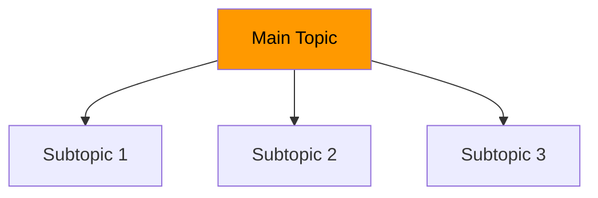
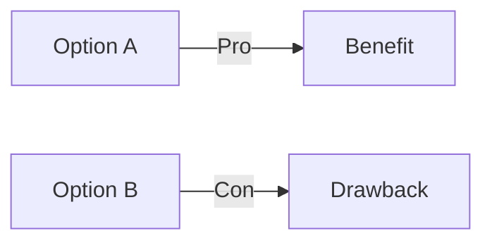
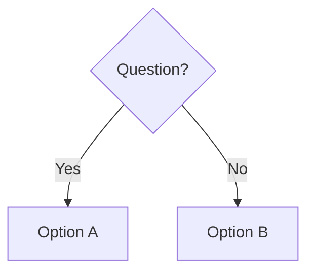

# SPEC.md — AWS Cloud Practitioner Documentation Project

> **Purpose:** This document is the **single source of truth** for this project. It captures the project's architecture, content patterns, design decisions, and conventions. Any new AI context window or contributor **MUST** read this file first to understand how to work with this codebase effectively.

---

## 📋 Table of Contents

1. [Project Overview](#1-project-overview)
2. [Architecture & Structure](#2-architecture--structure)
3. [🚨 CRITICAL: Content Insertion Rules](#3-critical-content-insertion-rules)
4. [Content Standards](#4-content-standards)
5. [Module Template](#5-module-template)
6. [Mermaid Visualization Standards](#6-mermaid-visualization-standards)
7. [AWS CCP Exam Alignment](#7-aws-ccp-exam-alignment)
8. [Naming Conventions](#8-naming-conventions)
9. [Knowledge Check Format](#9-knowledge-check-format)
10. [Navigation Standards](#10-navigation-standards)
11. [File Inventory](#11-file-inventory)
12. [Maintenance Guidelines](#12-maintenance-guidelines)

---

## 1. Project Overview

### 1.1 Project Description

A comprehensive, exam-aligned study guide for the **AWS Cloud Practitioner (CCP) certification**, organized into **6 knowledge domains** with **22 focused modules**. Each module includes enhanced Mermaid visualizations, comparison tables, knowledge checks, and exam tips.

### 1.2 Key Statistics

| Metric | Value |
|--------|-------|
| **Total Modules** | 22 |
| **Domains** | 6 |
| **Total Lines** | ~9,629 |
| **Mermaid Diagrams** | 200+ |
| **Comparison Tables** | 100+ |
| **Knowledge Check Questions** | 80+ |
| **Target Audience** | AWS CCP exam candidates |
| **Certification Alignment** | 100% (all 5 exam domains covered) |

### 1.3 Technology Stack

- **Format:** Markdown (`.md`)
- **Diagrams:** Mermaid (rendered by GitHub/GitLab)
- **Structure:** Domain-organized directories
- **No Build Process:** Pure static markdown files
- **Version Control:** Git

---

## 2. Architecture & Structure

### 2.1 Directory Tree

```
aws-cloud-practitioner/
├── README.md                                    # Main landing page
├── SPEC.md                                      # This file (project reference)
├── docs/
│   ├── 00-prerequisites/                        # Domain 0 (Foundational)
│   │   └── 01-infrastructure-fundamentals.md
│   ├── 01-cloud-fundamentals/                   # Domain 1
│   │   ├── 01-introduction-to-cloud.md
│   │   ├── 02-deployment-models.md
│   │   ├── 03-service-models.md
│   │   └── 04-cloud-economics.md
│   ├── 02-aws-infrastructure/                   # Domain 2
│   │   ├── 01-global-infrastructure.md
│   │   ├── 02-shared-responsibility.md
│   │   └── 03-data-centers.md
│   ├── 03-aws-services/                         # Domain 3
│   │   ├── 01-compute-ec2.md
│   │   ├── 02-storage.md
│   │   ├── 03-networking.md
│   │   ├── 04-databases.md
│   │   ├── 05-scalability-ha.md
│   │   ├── 06-virtualization-fundamentals.md
│   │   └── 07-containers-orchestration.md
│   ├── 04-security-architecture/               # Domain 4
│   │   ├── 01-security-fundamentals.md
│   │   ├── 02-cloud-adoption-framework.md
│   │   └── 03-well-architected-framework.md
│   └── 05-pricing-ecosystem/                    # Domain 5
│       ├── 01-pricing-models.md
│       ├── 02-billing-management.md
│       ├── 03-aws-ecosystem.md
│       └── 04-cloud-transformation.md
```

### 2.2 Domain Structure

| Domain | Name | Exam Weight | Modules |
|--------|------|-------------|---------|
| **00** | Infrastructure Prerequisites | N/A (Foundational) | 1 |
| **01** | Cloud Computing Fundamentals | ~15-20% | 4 |
| **02** | AWS Global Infrastructure & Shared Responsibility | ~15-20% | 3 |
| **03** | AWS Core Services | ~30-35% | 7 |
| **04** | Security, Compliance & Architecture | ~20-25% | 3 |
| **05** | Pricing, Billing & Ecosystem | ~12-15% | 4 |
| **Total** | | | **22 modules** |

### 2.3 File Naming Convention

```
docs/
└── {domain-number}-{domain-name}/
    └── {module-number}-{module-slug}.md
```

**Examples:**
- `docs/01-cloud-fundamentals/01-introduction-to-cloud.md`
- `docs/03-aws-services/01-compute-ec2.md`
- `docs/05-pricing-ecosystem/04-cloud-transformation.md`

---

## 3. 🚨 CRITICAL: Content Insertion Rules

> **⚠️ READ THIS FIRST BEFORE ADDING ANY CONTENT**

### 3.1 The Golden Rule

**ALWAYS analyze existing files BEFORE creating a new file. Insert content into the most matching existing file. Only create a new file when no existing file matches the topic.**

### 3.2 Content Insertion Decision Process

When adding new content, follow this strict process:

```
Step 1: READ all files in the relevant domain
Step 2: IDENTIFY the best matching existing file(s)
Step 3: DECIDE: Insert into existing OR create new
Step 4: IF inserting, ADD a new section to the existing file
Step 5: IF creating new, follow naming conventions strictly
Step 6: UPDATE navigation links in adjacent files
Step 7: UPDATE README.md and SPEC.md file inventory
```

### 3.3 When to INSERT vs CREATE NEW

#### ✅ INSERT into existing file when:

| Scenario | Action | Example |
|----------|--------|---------|
| Topic is a **subtopic** of an existing module | Insert as new section | "EBS Snapshots" → Insert into `02-storage.md` |
| Topic **relates** to existing content | Insert as related section | "Auto Scaling Groups" → Insert into `05-scalability-ha.md` |
| Topic is a **variation** of existing content | Insert as comparison | "Reserved Instances" → Insert into `01-pricing-models.md` |
| Topic covers **same service** with more detail | Insert as deep-dive section | "S3 Glacier" → Insert into `02-storage.md` |
| Topic is **adjacent** to existing content | Insert in same domain | "AWS Organizations" → Insert into `02-billing-management.md` |

#### ✅ CREATE new file when:

| Scenario | Action | Example |
|----------|--------|---------|
| Topic is a **completely new service** not covered | Create new file in appropriate domain | "AWS Lambda" → Create new file in Domain 3 |
| Topic is a **new domain** entirely | Create new domain folder | "AWS Machine Learning" → Create new domain |
| Topic is **fundamentally different** from existing | Create new file | "Disaster Recovery" → Create new file |
| No existing file **even partially** covers the topic | Create new file | "AWS CDK" → Create new file |

### 3.4 Topic-to-File Matching Guide

Use this guide to find the best matching file for common topics:

| Topic | Insert Into | Reason |
|-------|-------------|--------|
| EC2, Instances, AMI | `03-aws-services/01-compute-ec2.md` | Core compute topic |
| EBS, S3, EFS, FSx, Snapshots | `03-aws-services/02-storage.md` | Storage topic |
| VPC, Route 53, CloudFront, Load Balancers | `03-aws-services/03-networking.md` | Networking topic |
| RDS, DynamoDB, Aurora, Redshift | `03-aws-services/04-databases.md` | Database topic |
| Auto Scaling, Load Balancing, HA | `03-aws-services/05-scalability-ha.md` | Scalability topic |
| VMs, Hypervisors, Storage Virtualization | `03-aws-services/06-virtualization-fundamentals.md` | Virtualization topic |
| Containers, Docker, Kubernetes | `03-aws-services/07-containers-orchestration.md` | Containers topic |
| IAM, Security Groups, Encryption, WAF | `04-security-architecture/01-security-fundamentals.md` | Security topic |
| CAF, Transformation | `04-security-architecture/02-cloud-adoption-framework.md` | CAF topic |
| Well-Architected, Pillars | `04-security-architecture/03-well-architected-framework.md` | WAF topic |
| Pricing, Purchasing Options, Cost | `05-pricing-ecosystem/01-pricing-models.md` | Pricing topic |
| Cost Explorer, Budgets, TCO | `05-pricing-ecosystem/02-billing-management.md` | Billing topic |
| Support, Marketplace, Training | `05-pricing-ecosystem/03-aws-ecosystem.md` | Ecosystem topic |
| Migration, Datacenters | `05-pricing-ecosystem/04-cloud-transformation.md` | Transformation topic |
| Cloud basics, Characteristics | `01-cloud-fundamentals/01-introduction-to-cloud.md` | Intro topic |
| Deployment Models | `01-cloud-fundamentals/02-deployment-models.md` | Deployment topic |
| Service Models (IaaS/PaaS/SaaS) | `01-cloud-fundamentals/03-service-models.md` | Service models topic |
| CapEx, OpEx, Economics | `01-cloud-fundamentals/04-cloud-economics.md` | Economics topic |
| Regions, AZs, Edge | `02-aws-infrastructure/01-global-infrastructure.md` | Infrastructure topic |
| Shared Responsibility | `02-aws-infrastructure/02-shared-responsibility.md` | Responsibility topic |
| Data Centers, Physical | `02-aws-infrastructure/03-data-centers.md` | Data center topic |
| Pre-cloud infrastructure | `00-prerequisites/01-infrastructure-fundamentals.md` | Prerequisites topic |

### 3.5 Insertion Procedure

When inserting into an existing file:

1. **Identify the right section** — Find the most relevant existing section
2. **Add as a new subsection** — Use `###` or `####` heading
3. **Follow existing patterns** — Match the style, formatting, and Mermaid conventions
4. **Add knowledge check** — Add 1-2 questions if it's substantial content
5. **Update Quick Reference** — Add the new topic to the summary table
6. **Verify navigation** — Ensure Previous/Next links still work
7. **Don't break existing flow** — Insert in a logical position

### 3.6 Anti-Patterns to Avoid

❌ **DO NOT:**
- Create a new file for every small topic
- Duplicate content across multiple files
- Create a file that overlaps with existing content
- Ignore the domain structure
- Create files in the wrong domain
- Skip updating README.md and SPEC.md

✅ **DO:**
- Always search for matching files first
- Use grep/search to find related content
- Consolidate related topics into existing files
- Follow the topic-to-file matching guide above
- Update all references when adding content

### 3.7 Quick Decision Checklist

Before creating a new file, ask:

- [ ] Have I read all files in the relevant domain?
- [ ] Have I searched for keywords related to my topic?
- [ ] Is there an existing file that partially covers this topic?
- [ ] Would inserting into an existing file reduce redundancy?
- [ ] Is my topic fundamentally different from all existing files?
- [ ] Does my topic fit within an existing domain?

If you answered **YES** to the first 4 questions, **INSERT into existing file**.
If you answered **NO** to the first 4 and **YES** to the last 2, **CREATE new file**.

---

## 4. Content Standards

### 4.1 Module Header (Mandatory)

Every module MUST start with this header block:

```markdown
# {Module Title}

> ⏱️ **Estimated Study Time:** {X} minutes  
> 🎯 **CCP Exam Weight:** ~{X}% (Domain {N}: {Domain Name})

---

## The Big Picture

{2-3 paragraphs explaining the module's core concepts and why they matter}
```

### 4.2 Required Sections (In Order)

Every module MUST contain these sections in this order:

| Section | Required | Description |
|---------|----------|-------------|
| **The Big Picture** | ✅ | Overview and context |
| **Topic Overview/Diagram** | ✅ | High-level visual |
| **Detailed Content** | ✅ | Core concepts with diagrams |
| **Comparison Tables** | ✅ | Where applicable |
| **Decision Flowcharts** | ✅ | Where applicable |
| **Quick Reference** | ✅ | Summary table at the end |
| **Knowledge Check** | ✅ | 3-5 MCQs with answers |
| **Navigation** | ✅ | Previous/Next links |

### 4.3 Writing Style

- **Tone:** Educational, clear, exam-focused
- **Audience:** Beginners to intermediate AWS learners
- **Voice:** Active, direct, concise
- **Length:** 300-500 lines per module (optimal for readability)
- **Focus:** Exam-relevant concepts, not exhaustive details

### 4.4 Content Quality Rules

1. **No redundancy** across modules — cross-reference instead of repeating
2. **Use tables** for comparisons (easier to scan than paragraphs)
3. **Use diagrams** for processes, hierarchies, and relationships
4. **Include exam tips** with 🎯 emoji for frequently tested concepts
5. **End with knowledge checks** to validate understanding
6. **Keep examples AWS-specific** (avoid generic cloud examples)

---

## 5. Module Template

Here's the complete template for creating a new module:

```markdown
# Module Title

> ⏱️ **Estimated Study Time:** 15 minutes  
> 🎯 **CCP Exam Weight:** ~10% (Domain N: Domain Name)

---

## The Big Picture

Opening paragraph explaining the module's purpose and importance.

---

## Section 1: Core Concept



### Subtopic Details

| Column 1 | Column 2 | Column 3 |
|----------|----------|----------|
| Data | Data | Data |
| Data | Data | Data |

> 🎯 **Exam Tip:** Key concept that's frequently tested.

---

## Section 2: Comparison



### Comparison Table

| Feature | Option A | Option B |
|---------|----------|----------|
| Feature 1 | ✅ Yes | ❌ No |
| Feature 2 | ❌ No | ✅ Yes |

---

## Decision Flowchart



---

## Quick Reference

| Concept | Key Point |
|---------|-----------|
| Topic 1 | Key fact |
| Topic 2 | Key fact |
| Topic 3 | Key fact |

---

## 📝 Knowledge Check

<details>
<summary><strong>Q1: Question text?</strong></summary>

**A.** Option A  
**B.** Option B  
**C.** Option C  
**D.** Option D  

**Answer: X** — Explanation of why this is correct and why others are wrong.
</details>

<details>
<summary><strong>Q2: Question text?</strong></summary>

**A.** Option A  
**B.** Option B  
**C.** Option C  
**D.** Option D  

**Answer: X** — Explanation.
</details>

<details>
<summary><strong>Q3: Question text?</strong></summary>

**A.** Option A  
**B.** Option B  
**C.** Option C  
**D.** Option D  

**Answer: X** — Explanation.
</details>

---

## Navigation

⬅️ Previous: [Previous Module](./previous-module.md) | ➡️ Next: [Next Module](./next-module.md)  
🏠 [Back to README](../../README.md)

---

*Part of the [AWS Cloud Practitioner Study Notes](../../README.md).*
```

---

## 6. Mermaid Visualization Standards

### 6.1 Color Palette

Use these consistent colors throughout all diagrams:

```mermaid
%% Primary AWS Orange (main topics, AWS services)
style X fill:#FF9900,color:#000

%% Success Green (positive outcomes, correct answers)
style X fill:#51CF66,color:#fff

%% Error Red (problems, failures, warnings)
style X fill:#FF6B6B,color:#fff

%% Info Blue (informational, neutral)
style X fill:#4DABF7,color:#fff

%% Warning Yellow (cautions, trade-offs)
style X fill:#FFD700,color:#000

%% Purple (special topics, comparisons)
style X fill:#DDA0DD,color:#000

%% Pink (alternatives, secondary options)
style X fill:#FFB6C1,color:#000

%% Light Green (backgrounds, groups)
style X fill:#E6F7E6

%% Light Blue (backgrounds, groups)
style X fill:#E6F3FF
```

### 6.2 Diagram Types by Use Case

| Use Case | Diagram Type | Example |
|----------|-------------|---------|
| **Hierarchical concepts** | `graph TD` | Service categories, taxonomies |
| **Process flows** | `flowchart LR/TD` | Workflows, decision trees |
| **Mindmaps** | `mindmap` | Benefits, use cases, characteristics |
| **Comparisons** | `graph LR` (side-by-side) | Service models, deployment types |
| **Sequences** | `sequenceDiagram` | Request flows, API interactions |
| **State machines** | `stateDiagram-v2` | Lifecycle states |
| **Timelines** | `timeline` | Historical events, evolution |

### 6.3 Mermaid Best Practices

1. **Limit nodes** — Keep diagrams under 15-20 nodes for readability
2. **Use subgraphs** — Group related concepts visually
3. **Apply consistent styling** — Use the color palette above
4. **Label edges clearly** — Avoid unlabeled connections
5. **Test rendering** — Verify diagrams render correctly on GitHub

---

## 7. AWS CCP Exam Alignment

### 7.1 Exam Domains

The 5 exam domains and their weights:

| Domain | Name | Weight |
|--------|------|--------|
| **1** | Cloud Concepts | ~15-20% |
| **2** | Security & Compliance | ~20-25% |
| **3** | Cloud Technology & Services | ~30-35% |
| **4** | Billing & Pricing | ~12-15% |
| **5** | Business Value | ~10-15% |

### 7.2 Frequently Tested Concepts

These concepts appear frequently on the exam and MUST be covered:

#### Domain 1: Cloud Concepts
- ✅ 5 Characteristics of Cloud Computing
- ✅ 6 Advantages of Cloud
- ✅ Deployment Models (Public, Private, Hybrid)
- ✅ Service Models (IaaS, PaaS, SaaS)
- ✅ CapEx vs OpEx

#### Domain 2: Security & Compliance
- ✅ Shared Responsibility Model
- ✅ AWS Responsibilities vs Customer Responsibilities
- ✅ Security Groups vs Network ACLs
- ✅ IAM (Users, Groups, Roles, Policies)
- ✅ Compliance Programs (SOC, PCI, ISO, HIPAA)

#### Domain 3: Cloud Technology & Services
- ✅ EC2 Instance Types (6 categories)
- ✅ EC2 Purchasing Options (7 options)
- ✅ S3 Storage Classes
- ✅ EBS vs Instance Store
- ✅ Database Types (RDS, DynamoDB)
- ✅ Load Balancers (ALB, NLB, GWLB)
- ✅ Auto Scaling Strategies
- ✅ Regions vs Availability Zones
- ✅ Edge Locations

#### Domain 4: Billing & Pricing
- ✅ 4 Pricing Principles
- ✅ On-Demand vs Reserved vs Spot
- ✅ Cost Optimization Tools
- ✅ Support Plans

#### Domain 5: Business Value
- ✅ Well-Architected Framework (6 Pillars)
- ✅ Cloud Adoption Framework (6 Perspectives)
- ✅ AWS Support Plans

### 7.3 Exam Tip Format

Use this format for exam tips throughout modules:

```markdown
> 🎯 **Exam Tip:** {Key concept that's frequently tested. Include the "why" — why AWS tests this concept.}
```

---

## 8. Naming Conventions

### 8.1 File Names

- **Lowercase with hyphens** — `01-introduction-to-cloud.md`
- **Two-digit prefix** — `01-`, `02-`, etc.
- **Descriptive slug** — Clear, searchable topic name
- **No spaces** — Use hyphens, not underscores or spaces
- **English only** — All content in English

### 8.2 Mermaid Node Labels

- **Use emojis sparingly** — Only for main concepts (☁️ AWS, 🖥️ EC2, 💾 S3)
- **Keep labels short** — Max 4-5 words per node
- **Use line breaks** — `<br/>` for multi-line labels in tables/lists
- **Consistent naming** — Same service = same label across modules

### 8.3 Section Headings

- **Use H2 (`##`)** for main sections
- **Use H3 (`###`)** for subsections
- **Use H4 (`####`)** sparingly for deep nesting
- **Descriptive titles** — Not generic ("Details")

### 8.4 Table Conventions

| Convention | Example |
|------------|---------|
| **Checkmarks** | ✅ Yes / ❌ No / ⚠️ Partial |
| **Emojis in headers** | 🎯 Tips / 💰 Cost / ⚡ Performance |
| **Bold for emphasis** | **Key Point** |
| **Consistent columns** | Same column order across comparison tables |

---

## 9. Knowledge Check Format

### 9.1 Structure

Every module MUST end with 3-5 multiple-choice questions using this exact format:

```markdown
<details>
<summary><strong>Q{N}: {Question text}?</strong></summary>

**A.** {Option A}  
**B.** {Option B}  
**C.** {Option C}  
**D.** {Option D}  

**Answer: {Letter}** — {Explanation of why this is correct. Optionally mention why other options are incorrect.}
</details>
```

### 9.2 Question Quality Rules

1. **Exam-relevant** — Test concepts that appear on the CCP exam
2. **Clear wording** — No ambiguity in the question
3. **Plausible distractors** — Wrong answers should be believable
4. **Educational explanations** — Don't just give the answer, explain it
5. **Consistent format** — Always 4 options (A, B, C, D)

---

## 10. Navigation Standards

### 10.1 Footer Template

Every module MUST end with this navigation block:

```markdown
## Navigation

⬅️ Previous: [Previous Module Title](./previous-file.md) | ➡️ Next: [Next Module Title](./next-file.md)  
🏠 [Back to README](../../README.md)

---

*Part of the [AWS Cloud Practitioner Study Notes](../../README.md).*
```

### 10.2 Navigation Order

The learning path follows this sequence:

```
Domain 0 → Domain 1 → Domain 2 → Domain 3 → Domain 4 → Domain 5
```

Each domain's modules are numbered sequentially (01, 02, 03...).

### 10.3 Link Format

- **Relative paths** — `./module-name.md` (not absolute URLs)
- **Descriptive link text** — `[Module Title]` (not `[click here]`)
- **Parent directory** — `../../README.md` for root README
- **Same directory** — `./next-module.md`

---

## 11. File Inventory

### 11.1 Complete File List

| # | File Path | Domain | Module | Topic |
|---|-----------|--------|--------|-------|
| 1 | `docs/00-prerequisites/01-infrastructure-fundamentals.md` | 0 | 0.1 | Infrastructure Prerequisites |
| 2 | `docs/01-cloud-fundamentals/01-introduction-to-cloud.md` | 1 | 1.1 | Cloud Computing Intro |
| 3 | `docs/01-cloud-fundamentals/02-deployment-models.md` | 1 | 1.2 | Deployment Models |
| 4 | `docs/01-cloud-fundamentals/03-service-models.md` | 1 | 1.3 | Service Models |
| 5 | `docs/01-cloud-fundamentals/04-cloud-economics.md` | 1 | 1.4 | Cloud Economics |
| 6 | `docs/02-aws-infrastructure/01-global-infrastructure.md` | 2 | 2.1 | Global Infrastructure |
| 7 | `docs/02-aws-infrastructure/02-shared-responsibility.md` | 2 | 2.2 | Shared Responsibility |
| 8 | `docs/02-aws-infrastructure/03-data-centers.md` | 2 | 2.3 | Data Centers |
| 9 | `docs/03-aws-services/01-compute-ec2.md` | 3 | 3.1 | Amazon EC2 |
| 10 | `docs/03-aws-services/02-storage.md` | 3 | 3.2 | Storage Services |
| 11 | `docs/03-aws-services/03-networking.md` | 3 | 3.3 | Networking |
| 12 | `docs/03-aws-services/04-databases.md` | 3 | 3.4 | Databases |
| 13 | `docs/03-aws-services/05-scalability-ha.md` | 3 | 3.5 | Scalability & HA |
| 14 | `docs/03-aws-services/06-virtualization-fundamentals.md` | 3 | 3.6 | Virtualization |
| 15 | `docs/03-aws-services/07-containers-orchestration.md` | 3 | 3.7 | Containers |
| 16 | `docs/04-security-architecture/01-security-fundamentals.md` | 4 | 4.1 | Security Fundamentals |
| 17 | `docs/04-security-architecture/02-cloud-adoption-framework.md` | 4 | 4.2 | Cloud Adoption Framework |
| 18 | `docs/04-security-architecture/03-well-architected-framework.md` | 4 | 4.3 | Well-Architected Framework |
| 19 | `docs/05-pricing-ecosystem/01-pricing-models.md` | 5 | 5.1 | Pricing Models |
| 20 | `docs/05-pricing-ecosystem/02-billing-management.md` | 5 | 5.2 | Billing Management |
| 21 | `docs/05-pricing-ecosystem/03-aws-ecosystem.md` | 5 | 5.3 | AWS Ecosystem |
| 22 | `docs/05-pricing-ecosystem/04-cloud-transformation.md` | 5 | 5.4 | Cloud Transformation |

### 11.2 Root Files

| File | Purpose |
|------|---------|
| `README.md` | Main landing page with overview, domain map, and quick references |
| `SPEC.md` | This file — project specification and reference |

---

## 12. Maintenance Guidelines

### 12.1 Adding New Content — THE CRITICAL PROCESS

> **⚠️ ALWAYS FOLLOW THIS PROCESS**

#### Step 1: ANALYZE existing files
```bash
# Read all files in the relevant domain
ls docs/{domain}-{name}/

# Search for related content
grep -r "keyword" docs/
```

#### Step 2: DECIDE insertion vs creation

Use the decision matrix in Section 3.3 to determine if you should:
- **INSERT** into an existing file (preferred)
- **CREATE** a new file (only when no match exists)

#### Step 3: If INSERTING
1. Open the matching file
2. Identify the best section to add the new content
3. Add as a new subsection using appropriate heading level
4. Follow existing patterns (Mermaid style, tables, formatting)
5. Add knowledge check question if substantial
6. Update Quick Reference table
7. Verify navigation links

#### Step 4: If CREATING new file
1. Determine the correct domain (or create new domain if needed)
2. Choose the next sequential module number
3. Use the module template (Section 5)
4. Follow naming conventions strictly
5. Update Previous module's "Next" link
6. Update Next module's "Previous" link
7. Update README.md domain table
8. Update SPEC.md file inventory (Section 11.1)

### 12.2 Adding a New Domain

To add a new domain:

1. **Create directory** — `docs/0N-domain-name/`
2. **Create first module** — Following the module template
3. **Update README.md** — Add domain section
4. **Update SPEC.md** — Add to domain table and file inventory

### 12.3 Content Updates

When updating existing content:

1. **Preserve structure** — Don't remove required sections
2. **Update diagrams** — Keep Mermaid syntax valid
3. **Update knowledge checks** — Keep questions exam-relevant
4. **Update navigation** — If module order changes
5. **Verify links** — All relative links must work

### 12.4 Quality Checklist

Before committing changes, verify:

- [ ] **Analyzed all existing files** in the relevant domain
- [ ] **Inserted into existing file** (preferred) OR justified new file creation
- [ ] Module header includes study time and exam weight
- [ ] "The Big Picture" section explains the content
- [ ] At least 2-3 Mermaid diagrams
- [ ] Comparison tables where applicable
- [ ] Quick Reference table at the end
- [ ] 3-5 Knowledge Check questions with answers
- [ ] Navigation footer with Previous/Next links
- [ ] All links resolve correctly
- [ ] Mermaid diagrams render without errors
- [ ] Content is exam-aligned (CCP exam topics)
- [ ] No content duplicated from other modules
- [ ] **SPEC.md updated** (if new file created)
- [ ] **README.md updated** (if new file created)

---

## Appendix A: Complete Mermaid Style Guide

### A.1 Node Styles

```mermaid
%% Filled nodes with text colors
style NodeName fill:#FF9900,color:#000

%% Subgraph styling
subgraph Title
    Node1[Label]
    Node2[Label]
end
```

### A.2 Arrow Styles

```mermaid
A --> B          %% Simple arrow
A -->|Label| B   %% Labeled arrow
A -.-> B         %% Dotted arrow
A ==> B          %% Thick arrow
A ~~~ B          %% Invisible link
```

### A.3 Shape Variations

```mermaid
A[Rectangle] --> B(Rounded edges)
B --> C([Stadium shape])
C --> D[[Subroutine]]
D --> E[(Database/cylinder)]
E --> F>Asymmetric]
F --> G{Diamond/decision}
G --> H{{Hexagon}}
H --> I[/Parallelogram/]
I --> J[\Parallelogram alt\]
```

### A.4 Class Definitions

```mermaid
classDef aws fill:#FF9900,color:#000
classDef success fill:#51CF66,color:#fff
classDef warning fill:#FFD700,color:#000
classDef error fill:#FF6B6B,color:#fff

class A,B aws
class C,D success
class E,F warning
```

---

## Appendix B: Exam Quick Reference

### B.1 The 5 Characteristics of Cloud Computing

1. **On-demand self-service**
2. **Broad network access**
3. **Multi-tenancy & resource pooling**
4. **Rapid elasticity**
5. **Measured service**

### B.2 The 6 Advantages of Cloud

1. **Trade CapEx for OpEx**
2. **Economies of scale**
3. **Stop guessing capacity**
4. **Speed & agility**
5. **Go global in minutes**
6. **Stop running datacenters**

### B.3 The 4 AWS Pricing Principles

1. **Pay as you go**
2. **Save when you reserve**
3. **Pay less by using more** (volume discounts)
4. **Pay less as AWS grows**

### B.4 The 6 Pillars of Well-Architected Framework

1. **Operational Excellence**
2. **Security**
3. **Reliability**
4. **Performance Efficiency**
5. **Cost Optimization**
6. **Sustainability**

### B.5 The 6 Perspectives of CAF

**Business-Focused:**
1. **Business**
2. **People**
3. **Governance**

**Technical-Focused:**
4. **Platform**
5. **Security**
6. **Operations**

### B.6 The 4 CAF Transformation Phases

1. **Envision**
2. **Align**
3. **Launch**
4. **Scale**

---

## Appendix C: Common Acronyms

| Acronym | Full Form |
|---------|-----------|
| **AZ** | Availability Zone |
| **AMI** | Amazon Machine Image |
| **ASG** | Auto Scaling Group |
| **CAF** | Cloud Adoption Framework |
| **CCP** | AWS Certified Cloud Practitioner |
| **CDN** | Content Delivery Network |
| **CW** | CloudWatch |
| **DX** | Direct Connect |
| **EBS** | Elastic Block Store |
| **EC2** | Elastic Compute Cloud |
| **EFS** | Elastic File System |
| **ELB** | Elastic Load Balancer |
| **FSx** | Amazon FSx |
| **GWLB** | Gateway Load Balancer |
| **IAM** | Identity and Access Management |
| **KMS** | Key Management Service |
| **LB** | Load Balancer |
| **MFA** | Multi-Factor Authentication |
| **NACL** | Network Access Control List |
| **NLB** | Network Load Balancer |
| **RDS** | Relational Database Service |
| **RI** | Reserved Instance |
| **S3** | Simple Storage Service |
| **SG** | Security Group |
| **SP** | Savings Plan |
| **VPC** | Virtual Private Cloud |
| **WAF** | Web Application Firewall |
| **WAF** | Well-Architected Framework |

---

## Document Maintenance

**Version:** 2.0  
**Last Updated:** December 2024  
**Maintainer:** Project Contributors  
**License:** Educational Use Only

---

> **⚠️ REMINDER FOR ALL CONTRIBUTORS:**
> 
> 1. **READ** Section 3 (Content Insertion Rules) before adding content
> 2. **ANALYZE** existing files first
> 3. **INSERT** into matching files (preferred)
> 4. **CREATE** new files only when no match exists
> 5. **UPDATE** SPEC.md and README.md when creating new files
> 6. **FOLLOW** all conventions in this document

---

*This SPEC.md is the definitive reference for the AWS Cloud Practitioner Documentation Project. Any new contributor or AI context window **MUST** read this document first to understand the project's structure, standards, and especially the **Content Insertion Rules** in Section 3.*