# Infrastructure Prerequisites

> ⏱️ **Estimated Study Time:** 25 minutes  
> 🎯 **CCP Exam Weight:** ~5% (Foundational context for cloud adoption)

---

## The Big Picture

Before cloud computing existed, organizations ran their own **datacenters** with physical servers, networking equipment, and storage. Understanding this **pre-cloud infrastructure** is essential to appreciate *why* cloud computing is revolutionary. This module covers the foundational concepts: SPOF, fault tolerance, RAID, server types, clustering, and multi-tier architecture.

---

## 1. Application Environment Components

Every application requires a **complete ecosystem** to function — six essential layers:

```mermaid
graph TD
    AppEnv[📱 Application Environment] --> App[Application Layer<br/>Your Code]
    AppEnv --> Libs[Libraries & Dependencies]
    AppEnv --> Bin[Binaries & Supporting Software]
    AppEnv --> OS[Operating System Layer]
    AppEnv --> HW[Hardware Layer<br/>CPU | RAM | Disk]
    AppEnv --> Net[Networking]
    
    OS --> OS1[Linux]
    OS --> OS2[Windows]
    OS --> OS3[macOS]
    
    HW --> H1[CPU Processing]
    HW --> H2[Memory]
    HW --> H3[Storage]
    
    style AppEnv fill:#FF9900,color:#000
```

### Key Components

| Component | Purpose |
|-----------|---------|
| **Libraries** | Pre-written code collections for common functionality |
| **Dependencies** | Software packages required for the application to run |
| **Binaries** | Compiled executable programs and supporting software |
| **Operating System** | Software managing hardware and providing services |
| **Hardware** | Physical resources: CPU, RAM, Disk |
| **Networking** | Connectivity for external communication |

---

## 2. Functional vs Non-Functional Requirements

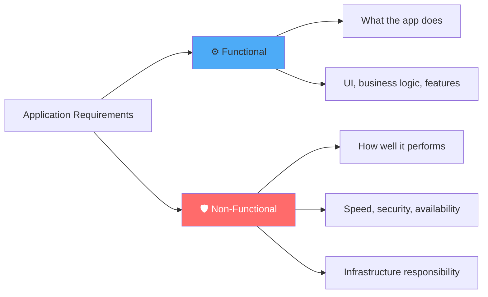

| Requirement Type | Description | Examples |
|------------------|-------------|----------|
| **Functional** | Define **what** the application does | User authentication, data processing, payments |
| **Non-Functional** | Define **how well** it performs | Security, performance, availability, scalability |

> ⚠️ **Critical:** Non-functional requirements are essential. Without them, even the best-designed application will fail. Users expect services to be **fast, secure, and always available**.

---

## 3. Single Point of Failure (SPOF)

A **Single Point of Failure** is any component that, if it fails, causes the **entire system to become unavailable**.

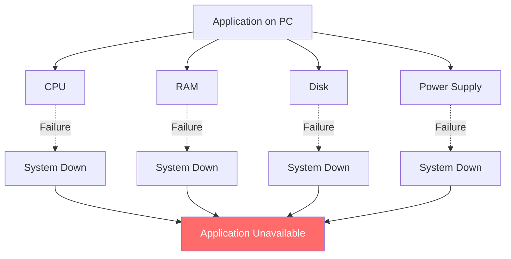

### Common Failure Scenarios

| Component | Failure Impact |
|-----------|---------------|
| **CPU** | Application can't process requests |
| **RAM** | System crashes or data corruption |
| **Storage** | Data loss and unavailability |
| **Power Supply** | Immediate system shutdown |
| **Network Interface** | Application becomes unreachable |

---

## 4. Fault Tolerance

**Fault Tolerance** is the system's ability to **continue operating during failures** through redundancy and intelligent failover.

### Two-Step Process

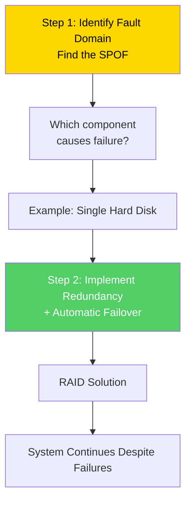

---

## 5. RAID (Redundant Array of Independent Disks)

**RAID** combines multiple physical disks into logical units for **redundancy and performance**.

### Common RAID Levels

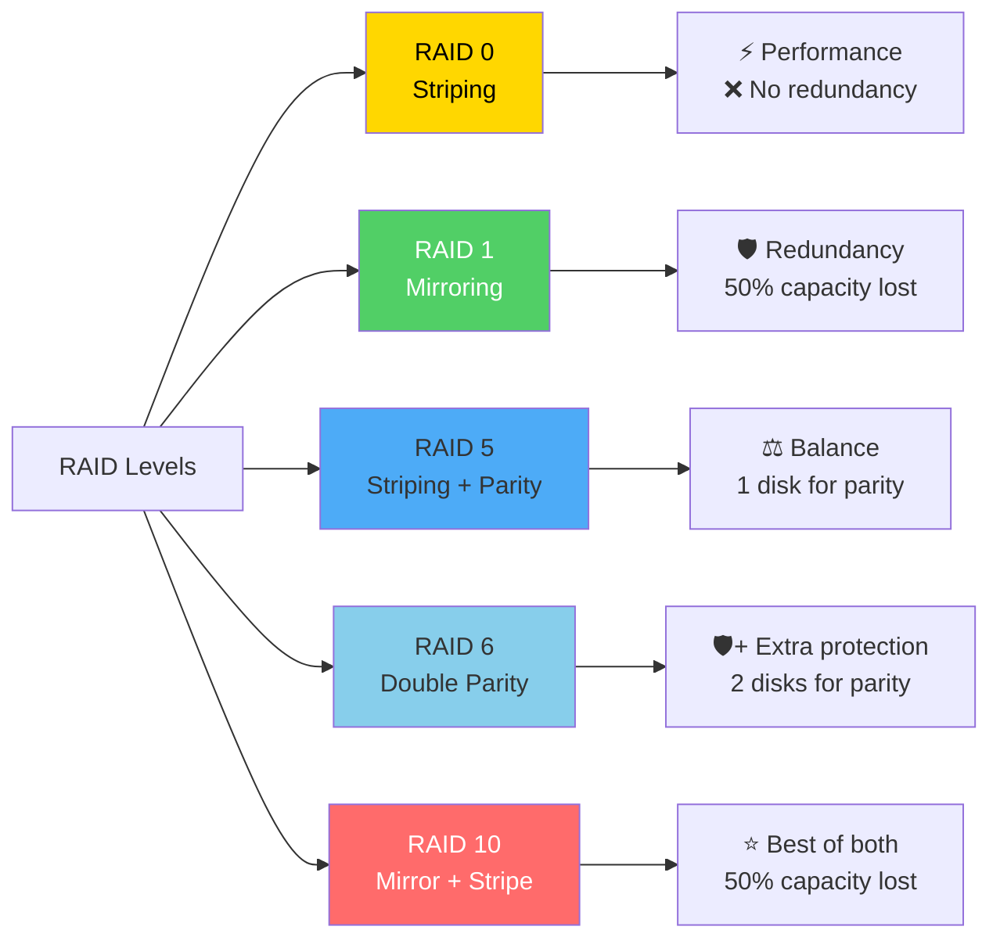

### RAID Comparison Table

| RAID Level | Description | Fault Tolerance | Capacity Penalty | Performance |
|------------|-------------|-----------------|------------------|-------------|
| **RAID 0** | Striping only | ❌ None | None | ⚡ Fastest |
| **RAID 1** | Mirroring | ✅ 1 disk failure | 50% lost | Good reads |
| **RAID 5** | Striping + Parity | ✅ 1 disk failure | 1 disk lost | Good |
| **RAID 6** | Double Parity | ✅ 2 disk failures | 2 disks lost | Good |
| **RAID 10** | Mirror + Stripe | ✅ Multiple failures | 50% lost | ⚡ Fastest |

### RAID 1 (Mirroring) Example

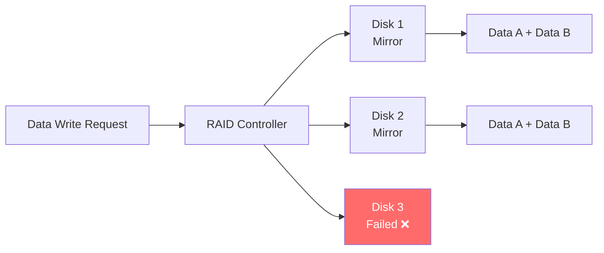

---

## 6. Server Types

Servers come in different physical forms optimized for specific environments.

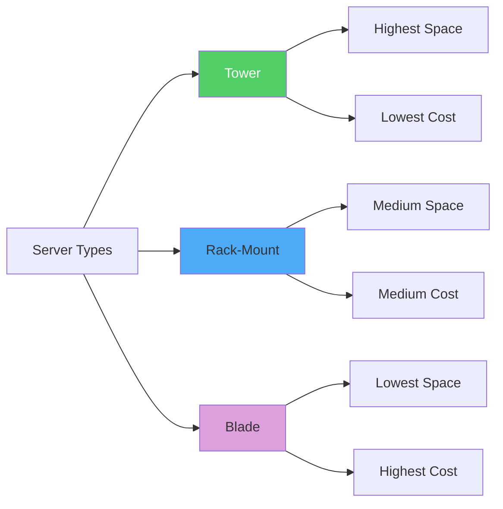

### Server Type Comparison

| Type | Space | Cost | Cabling | Management | Best For |
|------|-------|------|---------|------------|----------|
| **Tower** | Highest | Lowest | Difficult | Individual KVM | Small businesses |
| **Rack-Mount** | Medium | Medium | Better | KVM Switch | Medium datacenters |
| **Blade** | Lowest | Highest | Easiest | Integrated KVM | Large datacenters |

> 📌 **U-Unit:** 1U = 1.75 inches (44.45mm) in height. A typical rack is 42U tall.

### Rack Server Example

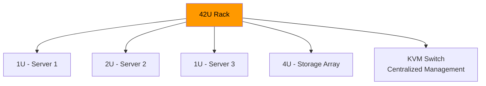

---

## 7. Server Components: ECC Memory & Redundant PSUs

### ECC Memory (Error-Correcting Code)

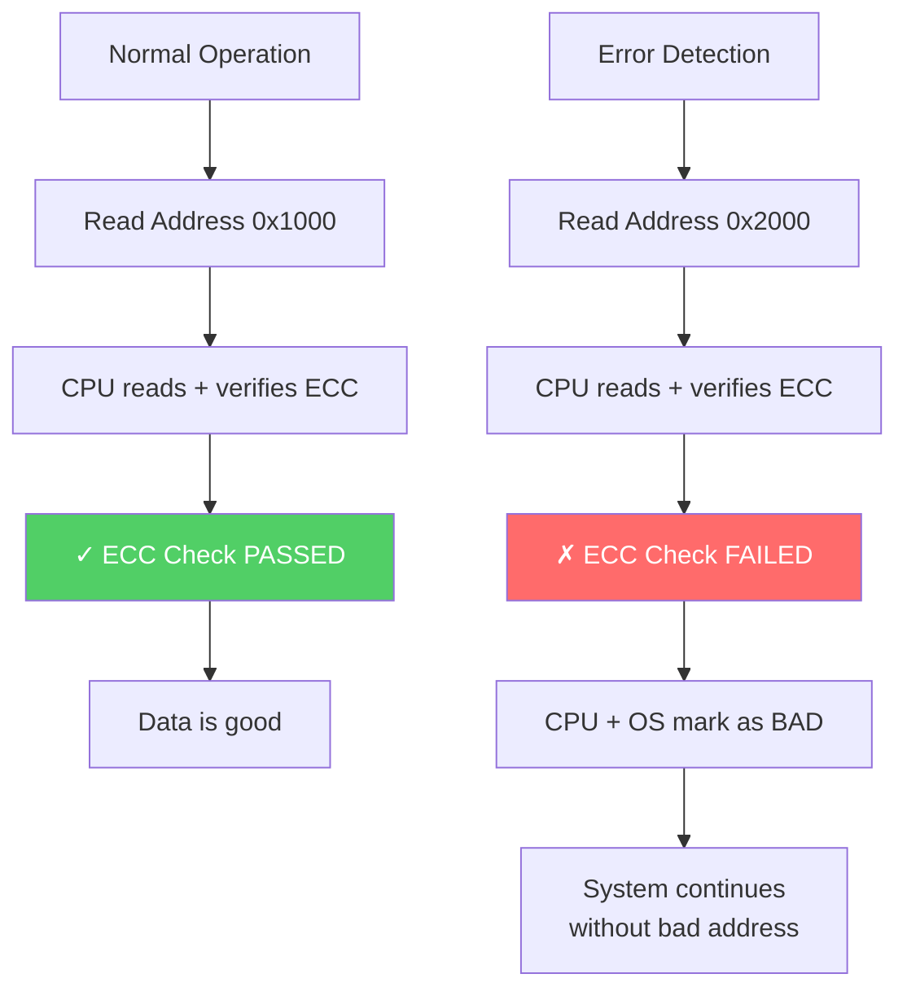

> ⚠️ Normal PCs can't detect "bad addresses" in RAM, causing **Blue Screen of Death** (Windows) or **Purple Screen of Death** (VMware).

### Redundant Power Supplies

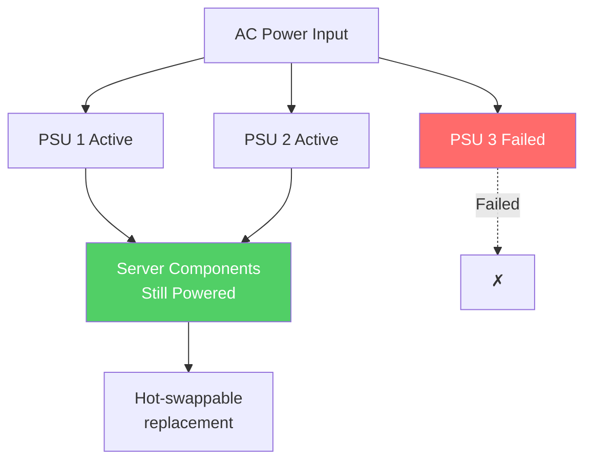

---

## 8. Remote Management: IPMI / iLO / iDRAC

Remote management allows administrators to manage servers **from anywhere in the world**.

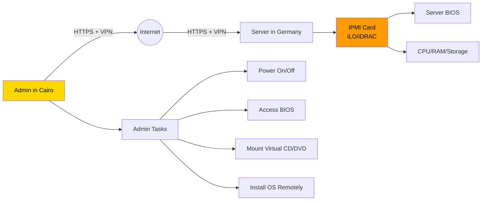

### IPMI Vendor Implementations

| Vendor | Implementation |
|--------|---------------|
| **HP** | iLO (Integrated Lights-Out) |
| **Dell** | iDRAC (Dell Remote Access Controller) |
| **IBM** | IMM (Integrated Management Module) |
| **Cisco** | CIMC (Cisco Integrated Management Controller) |

> ⚠️ **Security:** Never expose IPMI interfaces directly to the internet. Always use VPN or secure internal networks.

---

## 9. Server Clustering

**Clustering** connects multiple devices to work together for redundancy and performance.

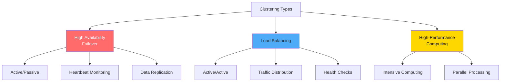

### Clustering Comparison

| Type | Configuration | Purpose | Best For |
|------|--------------|---------|----------|
| **HA/Failover** | Active/Passive | Redundancy | Databases |
| **Load Balancing** | Active/Active | Distribute load | Web servers |
| **HPC** | Parallel | Intensive computation | Scientific apps |

---

## 10. Load Spike & DDoS Scenarios

### Load Spike Challenges

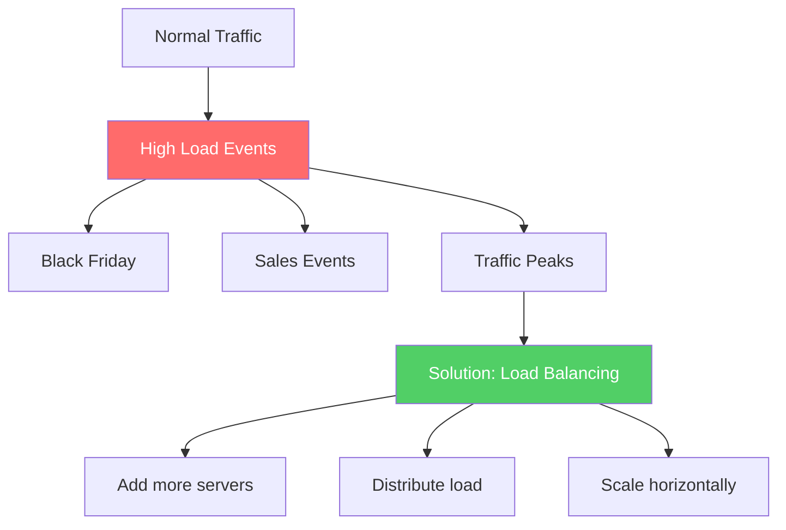

### DoS vs DDoS Attacks

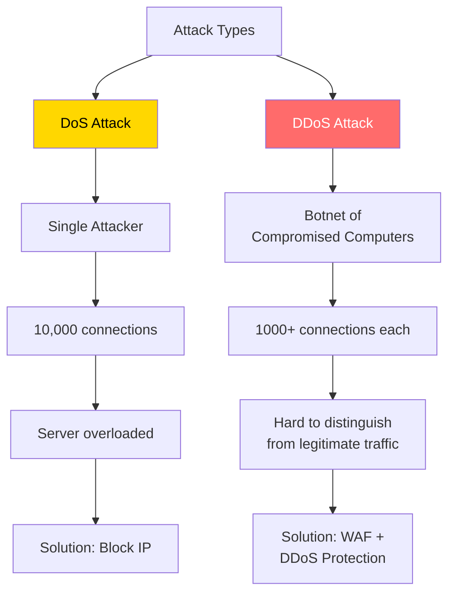

> ⚠️ **Critical:** Adding more servers will **NOT solve a DDoS attack** — you need specialized protection like WAF or DDoS protection services.

---

## 11. Multi-Tier Architecture

Putting all components on a single server creates an obvious SPOF. The solution is **Multi-Tier Architecture**.

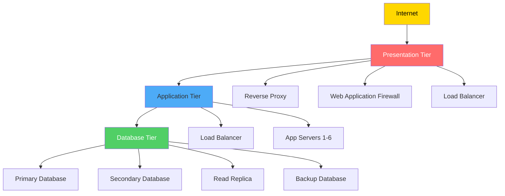

### Tier Functions and Security Zones

| Tier | Network Exposure | Primary Function | Clustering Type |
|------|-----------------|------------------|-----------------|
| **Presentation** | Internet-Exposed | Security, Traffic Management | Load Balancing |
| **Application** | Internal Network | Business Logic Processing | Load Balancing |
| **Database** | Most Secure Network | Data Storage & Management | HA/Replication |

### Multi-Tier Benefits

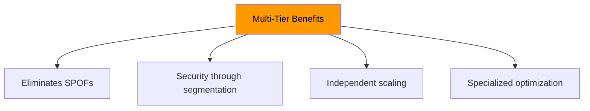

---

## 12. Cost of High Availability

### High Availability Math

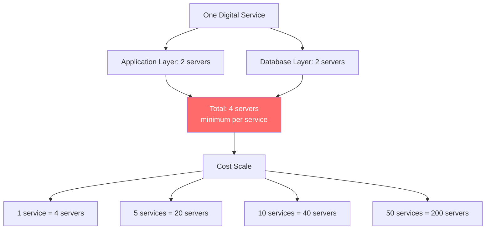

### The Utilization Problem

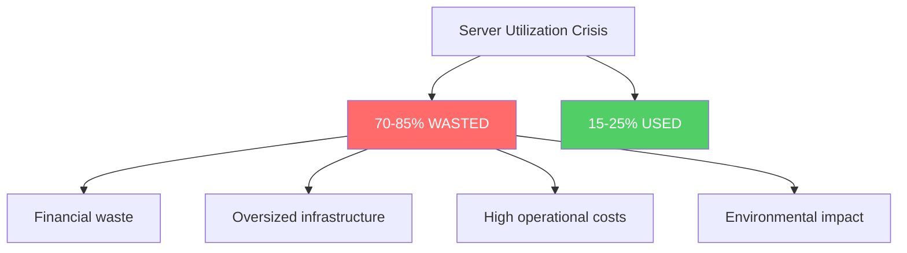

---

## Quick Reference

| Concept | Key Point |
|---------|-----------|
| **SPOF** | Any component whose failure brings down the entire system |
| **Fault Tolerance** | System continues operating despite failures |
| **RAID** | Redundant Array of Independent Disks (RAID 0, 1, 5, 6, 10) |
| **ECC Memory** | Detects and corrects memory errors |
| **Server Types** | Tower (cheap), Rack (balanced), Blade (dense) |
| **IPMI/iLO/iDRAC** | Remote server management |
| **Clustering** | HA (Active/Passive), LB (Active/Active), HPC (Parallel) |
| **Multi-Tier** | Presentation → Application → Database |
| **HA Cost** | 4 servers minimum per service |

---

## 📝 Knowledge Check

<details>
<summary><strong>Q1: What is a Single Point of Failure (SPOF)?</strong></summary>

**A.** A server with high availability  
**B.** Any component that, if it fails, causes the entire system to become unavailable  
**C.** A type of RAID configuration  
**D.** A clustering technique  

**Answer: B** — A SPOF is any component (CPU, RAM, disk, network interface, power supply) whose failure would bring down the entire system. Eliminating SPOFs requires redundancy.
</details>

<details>
<summary><strong>Q2: Which RAID level provides the BEST performance AND redundancy?</strong></summary>

**A.** RAID 0  
**B.** RAID 1  
**C.** RAID 5  
**D.** RAID 10  

**Answer: D** — RAID 10 combines mirroring (RAID 1) and striping (RAID 0), providing both excellent performance and redundancy. The trade-off is 50% capacity loss (like RAID 1).
</details>

<details>
<summary><strong>Q3: What is the minimum number of servers needed for high availability of one service?</strong></summary>

**A.** 1 server  
**B.** 2 servers  
**C.** 4 servers  
**D.** 10 servers  

**Answer: C** — For high availability, you need a minimum of 4 servers per service: 2 application servers (for load balancing/failover) and 2 database servers (for primary/standby or replication).
</details>

<details>
<summary><strong>Q4: What is the purpose of ECC memory?</strong></summary>

**A.** Faster data access  
**B.** Detecting and correcting memory errors  
**C.** Encrypting data in memory  
**D.** Increasing memory capacity  

**Answer: B** — ECC (Error-Correcting Code) memory detects and corrects single-bit memory errors, preventing system crashes and data corruption that would otherwise cause Blue/Purple Screen of Death errors.
</details>

---

## Navigation

⬅️ Previous: (Start) | ➡️ Next: [Introduction to Cloud Computing](../01-cloud-fundamentals/01-introduction-to-cloud.md)  
🏠 [Back to README](../../README.md)

---

*Part of the [AWS Cloud Practitioner Study Notes](../../README.md).*