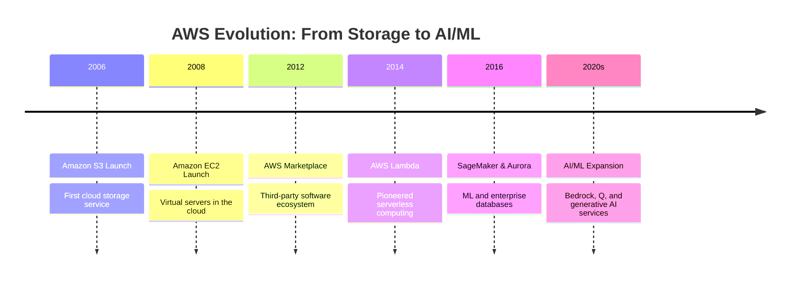
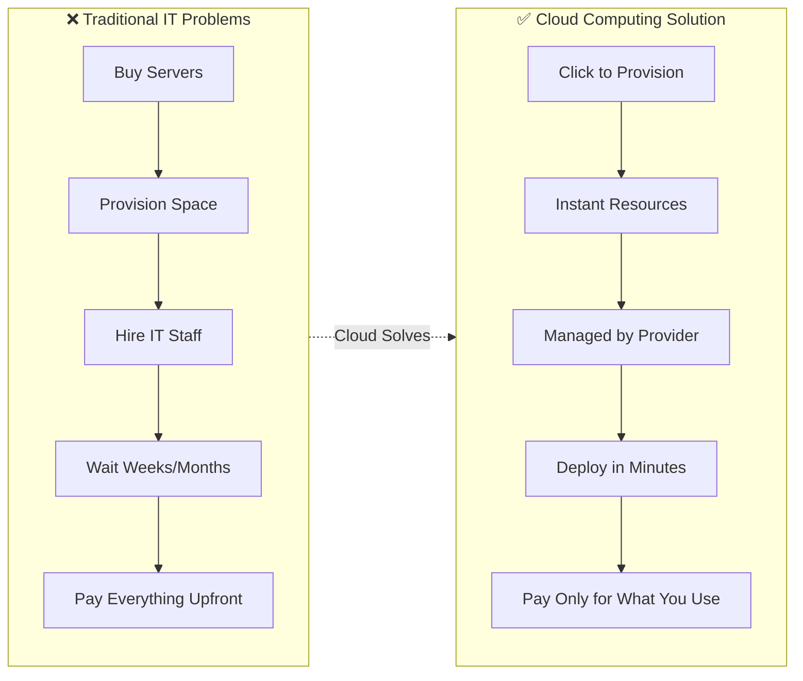
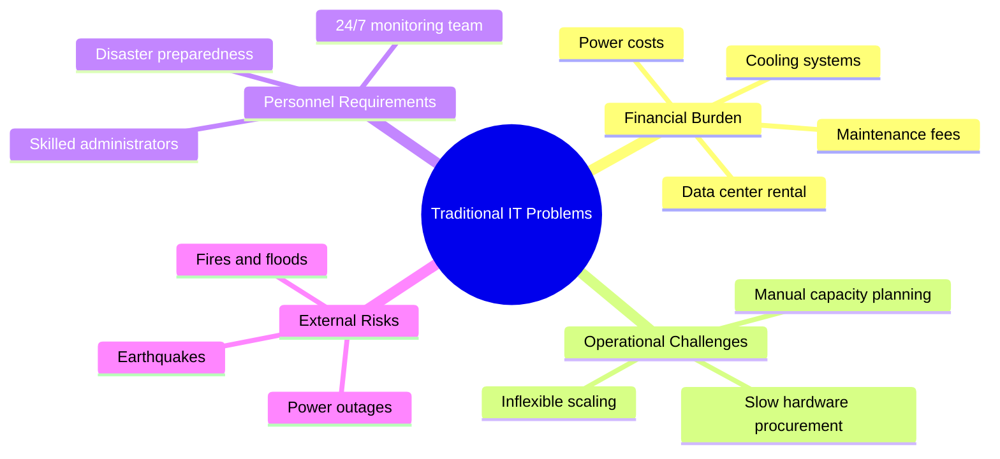
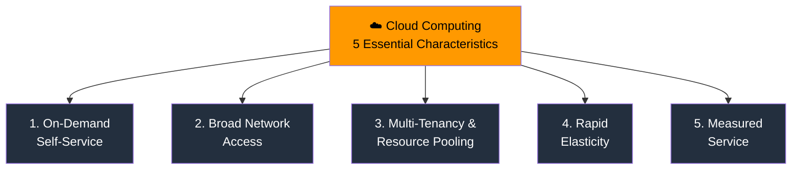
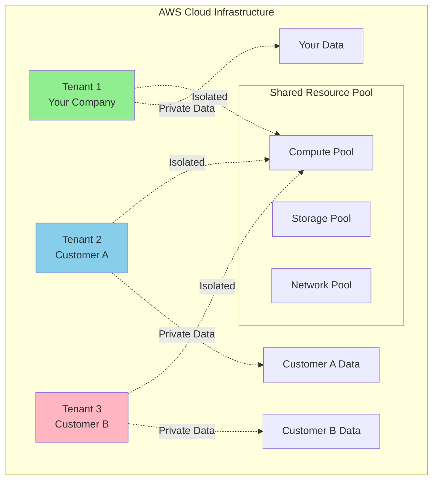
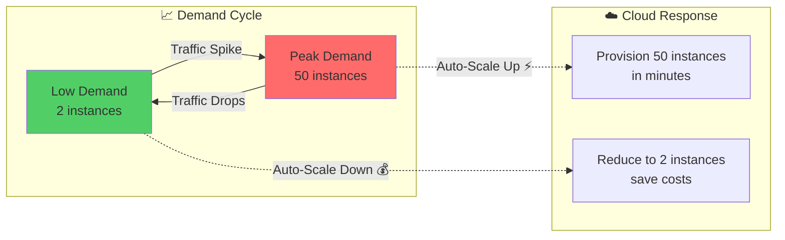
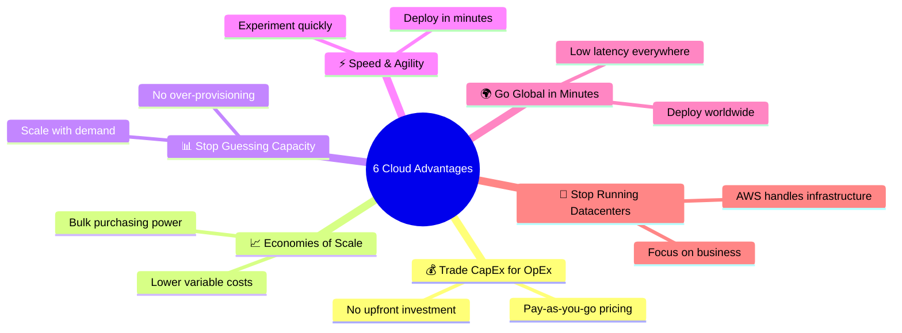
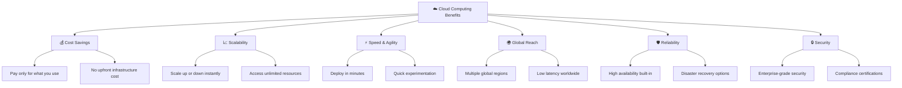

# Introduction to Cloud Computing & AWS

> ⏱️ **Estimated Study Time:** 20 minutes  
> 🎯 **CCP Exam Weight:** ~15-20% (Domain 1: Cloud Concepts)

---

## The Big Picture

**Cloud Computing** fundamentally changed how organizations consume IT resources. Instead of buying and maintaining physical hardware, you rent what you need, when you need it, and pay only for what you use. This module covers the foundations: what cloud computing is, why it matters, and how AWS pioneered the industry.

---

## AWS at a Glance

| Attribute | Detail |
|-----------|--------|
| **Full Name** | Amazon Web Services |
| **Launch Year** | 2006 (S3), 2008 (EC2) |
| **Market Position** | Cloud market leader (~32% share) |
| **Global Reach** | 36+ Regions, 100+ AZs, 400+ Edge Locations |
| **Service Count** | 200+ services |
| **Category** | Infrastructure as a Service (IaaS), Platform as a Service (PaaS), Software as a Service (SaaS) |

---

## AWS Evolution Timeline

> 🎯 **Exam Tip:** Know the 2006 (S3) and 2008 (EC2) launch dates — these are frequently tested milestones.

---

## What is Cloud Computing?

> **Definition:** Cloud computing is the **on-demand delivery of IT resources** over the internet with **pay-as-you-go pricing**.

### Traditional IT vs Cloud Computing

---

## Why Cloud Computing? (The Problems It Solves)

---

## The 5 Essential Characteristics of Cloud Computing (NIST)

These are the **defining traits** that separate cloud from traditional IT. The CCP exam tests these heavily.

### Detailed Breakdown

| # | Characteristic | Definition | AWS Example |
|---|---------------|------------|-------------|
| **1** | **On-Demand Self-Service** | Provision resources automatically without human interaction | Launch EC2 instance via console/API without contacting AWS |
| **2** | **Broad Network Access** | Access from anywhere using standard protocols and devices | Use EC2 from laptop, tablet, or mobile over HTTPS |
| **3** | **Multi-Tenancy & Resource Pooling** | Multiple customers share the same physical infrastructure, logically isolated | Your EC2 runs on the same hardware as other customers (securely isolated) |
| **4** | **Rapid Elasticity** | Scale up or down quickly based on demand | Auto Scaling adds 100 EC2 instances during traffic spikes |
| **5** | **Measured Service** | Usage is monitored, controlled, and billed transparently | AWS bills you per hour/second of EC2 usage |

### Multi-Tenancy Visualized

### Elasticity in Action

> 🎯 **Exam Tip:** The 5 characteristics are **always tested**. Memorize them: *On-demand, Broad access, Multi-tenancy, Elasticity, Measured service*.

---

## The 6 Advantages of Cloud Computing

### Advantages Table

| # | Advantage | What It Means | Business Impact |
|---|-----------|---------------|-----------------|
| **1** | **Trade CapEx for OpEx** | No upfront hardware costs | Convert capital expenses to operational expenses |
| **2** | **Economies of Scale** | AWS aggregates usage across millions of customers | Lower prices than building your own |
| **3** | **Stop Guessing Capacity** | Scale up/down as needed | No wasted resources or shortages |
| **4** | **Speed & Agility** | Provision resources in minutes | Faster innovation and time-to-market |
| **5** | **Go Global in Minutes** | Deploy to any Region worldwide | Serve international users with low latency |
| **6** | **Stop Running Datacenters** | Focus on your business, not infrastructure | Reduce operational overhead |

---

## Cloud Computing Benefits Tree

---

## Quick Reference

| Concept | Key Point |
|---------|-----------|
| **Cloud Computing** | On-demand IT resource delivery over the internet |
| **AWS Launch** | S3 in 2006, EC2 in 2008 |
| **5 Characteristics** | On-demand · Broad access · Multi-tenancy · Elasticity · Measured |
| **6 Advantages** | CapEx→OpEx · Scale · No guessing · Speed · Global · No datacenters |
| **Multi-Tenancy** | Multiple customers share infrastructure with logical isolation |
| **Elasticity** | Automatic scaling based on demand |

---

## 📝 Knowledge Check

<strong>Q1: Which is NOT one of the 5 essential characteristics of cloud computing?</strong>

**A.** On-demand self-service  
**B.** Broad network access  
**C.** Dedicated hardware  
**D.** Measured service  

**Answer: C** — Dedicated hardware is the opposite of cloud computing's multi-tenancy model. The 5 characteristics are: on-demand self-service, broad network access, multi-tenancy/resource pooling, rapid elasticity, and measured service.

<strong>Q2: What is the main advantage of "trading CapEx for OpEx"?</strong>

**A.** Better performance  
**B.** Lower upfront costs and predictable monthly billing  
**C.** More control over hardware  
**D.** Higher security  

**Answer: B** — Trading CapEx (capital expenditure) for OpEx (operational expenditure) means you avoid large upfront investments and pay only for what you use on an ongoing basis.

<strong>Q3: In what year did AWS launch Amazon EC2?</strong>

**A.** 2006  
**B.** 2008  
**C.** 2010  
**D.** 2014  

**Answer: B** — Amazon EC2 launched in 2008. Amazon S3 was the first service in 2006.

---

## Navigation

⬅️ Previous: (Start) | ➡️ Next: [Cloud Deployment Models](./02-deployment-models.md)  
🏠 [Back to README](../../README.md)

---

*Part of the [AWS Cloud Practitioner Study Notes](../../README.md).*