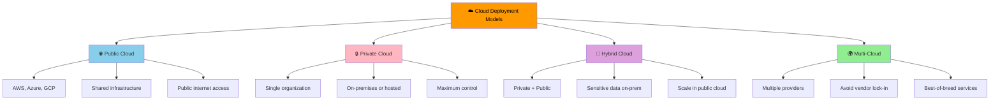
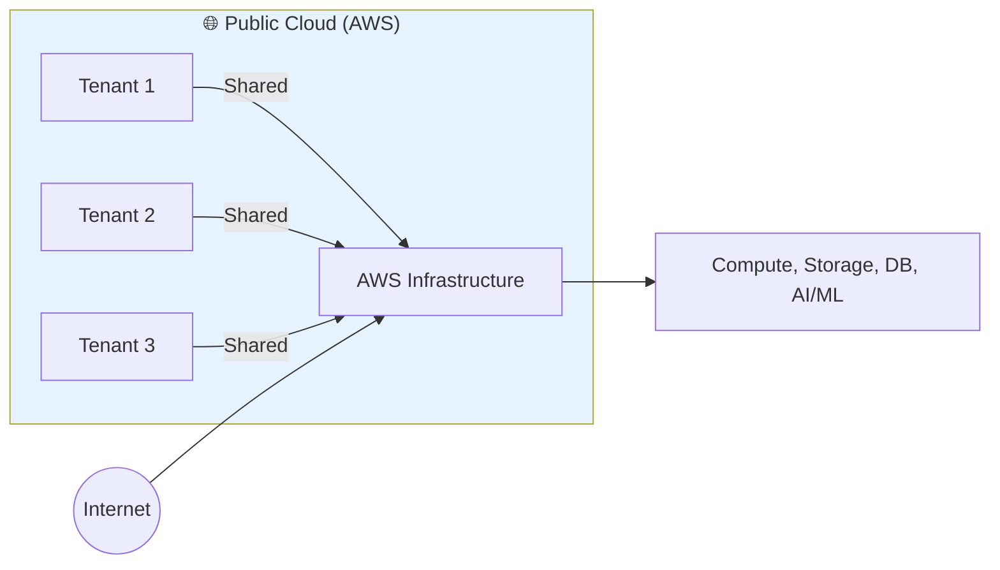
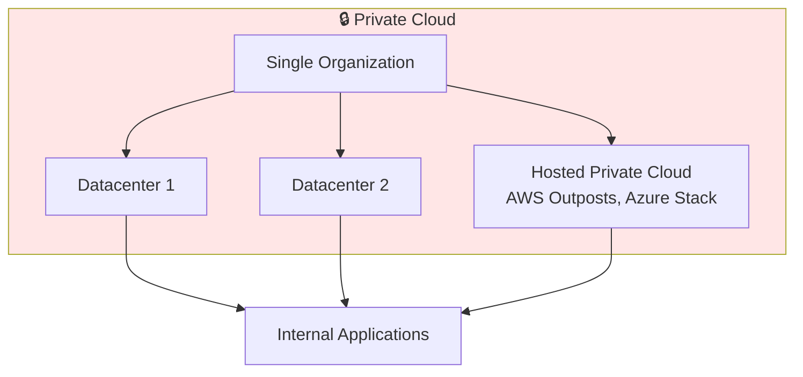
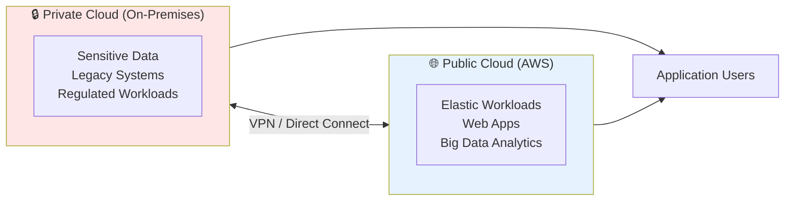
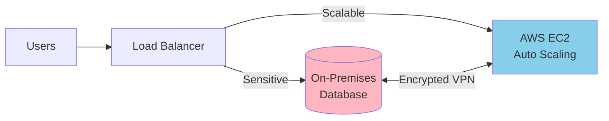
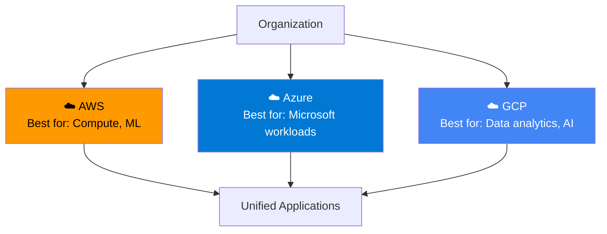
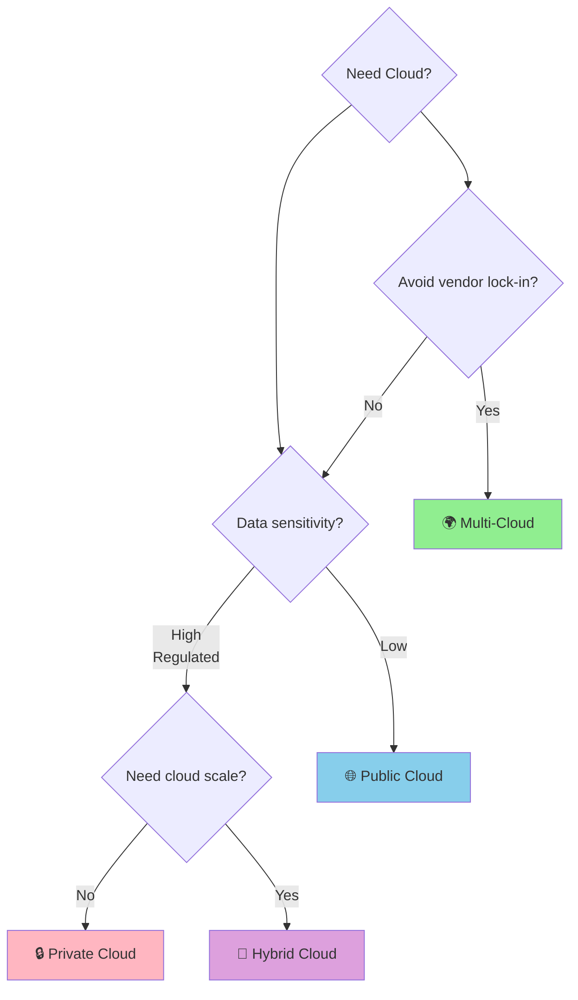

# Cloud Deployment Models

> ⏱️ **Estimated Study Time:** 12 minutes  
> 🎯 **CCP Exam Weight:** ~5% (Domain 1: Cloud Concepts)

---

## The Big Picture

**Deployment models** define **where** your cloud infrastructure lives — who owns it, who accesses it, and how it's connected. The four models (Public, Private, Hybrid, Multi-Cloud) represent different trade-offs between control, cost, and flexibility.

---

## Overview of Deployment Models

---

## 1. Public Cloud

**Definition:** Infrastructure owned and operated by a third-party provider (AWS, Azure, GCP) and shared across multiple organizations over the public internet.

### Characteristics

| Attribute | Description |
|-----------|-------------|
| **Owner** | Third-party provider (AWS, Azure, GCP) |
| **Access** | Public internet |
| **Tenants** | Multiple organizations share infrastructure |
| **Cost Model** | Pay-as-you-go (OpEx) |
| **Scalability** | Virtually unlimited |
| **Maintenance** | Provider manages everything |
| **Examples** | AWS, Microsoft Azure, Google Cloud Platform |

### ✅ Pros & ❌ Cons

| Pros | Cons |
|------|------|
| Low upfront cost | Less control over infrastructure |
| Massive scalability | Data may be in shared environment |
| No maintenance burden | Potential compliance concerns |
| Global reach | Vendor lock-in risk |
| Latest technology access | Network latency for some workloads |

> 🎯 **Exam Tip:** AWS is a **public cloud**. When the exam mentions "cloud provider" without specifying, it usually means public cloud.

---

## 2. Private Cloud

**Definition:** Cloud infrastructure used **exclusively by a single organization**. Can be hosted on-premises or by a third-party, but the resources are not shared.

### Characteristics

| Attribute | Description |
|-----------|-------------|
| **Owner** | Single organization |
| **Location** | On-premises or third-party hosted |
| **Access** | Private network only |
| **Tenants** | One organization only |
| **Cost Model** | CapEx + OpEx |
| **Control** | Maximum (full customization) |
| **Examples** | VMware on-premises, AWS Outposts, OpenStack |

### ✅ Pros & ❌ Cons

| Pros | Cons |
|------|------|
| Complete control | High upfront costs |
| Enhanced security | Limited scalability |
| Regulatory compliance | Requires in-house expertise |
| Customization | Maintenance burden |
| Data sovereignty | Underutilized resources |

---

## 3. Hybrid Cloud

**Definition:** Combines **private cloud (on-premises)** with **public cloud**, connected by secure networking. Sensitive workloads stay on-prem while elastic workloads use public cloud.

### Architecture Example

### Characteristics

| Attribute | Description |
|-----------|-------------|
| **Architecture** | Private + Public connected |
| **Workload Split** | Sensitive → Private · Scalable → Public |
| **Connectivity** | VPN, Direct Connect, API integration |
| **Use Cases** | Gradual cloud migration, compliance + scale |
| **Examples** | AWS + on-premises VMware, Azure Arc |

### ✅ Pros & ❌ Cons

| Pros | Cons |
|------|------|
| Best of both worlds | Complex to manage |
| Gradual migration path | Network security complexity |
| Compliance + scalability | Higher initial costs |
| Burst to public cloud | Requires dual expertise |

> 🎯 **Exam Tip:** Hybrid cloud is the answer when the scenario mentions **"keep sensitive data on-premises but need cloud scalability"**.

---

## 4. Multi-Cloud

**Definition:** Using **multiple public cloud providers** (e.g., AWS + Azure + GCP) to avoid vendor lock-in and leverage best-of-breed services.

### Characteristics

| Attribute | Description |
|-----------|-------------|
| **Providers** | 2+ public cloud providers |
| **Purpose** | Avoid lock-in, best-of-breed, redundancy |
| **Management** | Complex (different APIs, tools) |
| **Use Cases** | Disaster recovery across clouds, regulatory requirements |

### ✅ Pros & ❌ Cons

| Pros | Cons |
|------|------|
| No vendor lock-in | Complex management |
| Best-of-breed services | Higher skill requirements |
| Geographic redundancy | Increased costs |
| Negotiating leverage | Data egress fees between clouds |

---

## Deployment Models Comparison

| Feature | Public | Private | Hybrid | Multi-Cloud |
|---------|--------|---------|--------|-------------|
| **Owner** | Provider | You | You + Provider | Multiple Providers |
| **Cost** | OpEx (low) | CapEx (high) | Both | OpEx (medium) |
| **Control** | Low | Maximum | High | Medium |
| **Scalability** | Unlimited | Limited | High | High |
| **Security** | Provider-managed | Custom | Layered | Provider + Custom |
| **Best For** | Startups, web apps | Regulated industries | Gradual migration | Enterprise, DR |
| **Example** | AWS EC2 | On-prem VMware | AWS + on-prem DB | AWS + Azure + GCP |

---

## Decision Matrix: Which Model?

### Selection Criteria

| If You Need... | Choose |
|----------------|--------|
| Low cost, high scalability, no compliance issues | **Public Cloud** |
| Complete control, strict compliance, data sovereignty | **Private Cloud** |
| Compliance for some data + cloud scalability | **Hybrid Cloud** |
| Avoid vendor lock-in, leverage best services | **Multi-Cloud** |

---

## Quick Reference

| Model | Key Phrase | AWS Service |
|-------|-----------|-------------|
| **Public** | "Shared infrastructure, pay-per-use" | All standard AWS services |
| **Private** | "Exclusive use, single org" | AWS Outposts |
| **Hybrid** | "Best of both worlds" | AWS Direct Connect, VPN |
| **Multi-Cloud** | "Multiple providers" | Cross-cloud APIs |

---

## 📝 Knowledge Check

<strong>Q1: A healthcare company must keep patient data on-premises due to regulations but wants to use cloud analytics. Which deployment model is best?</strong>

**A.** Public Cloud  
**B.** Private Cloud  
**C.** Hybrid Cloud  
**D.** Multi-Cloud  

**Answer: C** — Hybrid Cloud allows sensitive data to stay on-premises while leveraging public cloud for analytics and scalable workloads.

<strong>Q2: Which deployment model provides the LOWEST cost and HIGHEST scalability?</strong>

**A.** Private Cloud  
**B.** Public Cloud  
**C.** Hybrid Cloud  
**D.** Multi-Cloud  

**Answer: B** — Public Cloud offers the lowest upfront costs (pay-as-you-go) and virtually unlimited scalability since the provider manages the infrastructure.

<strong>Q3: What is the primary benefit of a multi-cloud strategy?</strong>

**A.** Lower costs  
**B.** Avoiding vendor lock-in  
**C.** Better security  
**D.** Faster deployment  

**Answer: B** — Multi-cloud strategies are primarily adopted to avoid vendor lock-in and leverage best-of-breed services from different providers.

---

## Navigation

⬅️ Previous: [Introduction to Cloud Computing](./01-introduction-to-cloud.md) | ➡️ Next: [Cloud Service Models](./03-service-models.md)  
🏠 [Back to README](../../README.md)

---

*Part of the [AWS Cloud Practitioner Study Notes](../../README.md).*