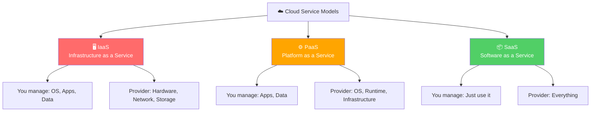
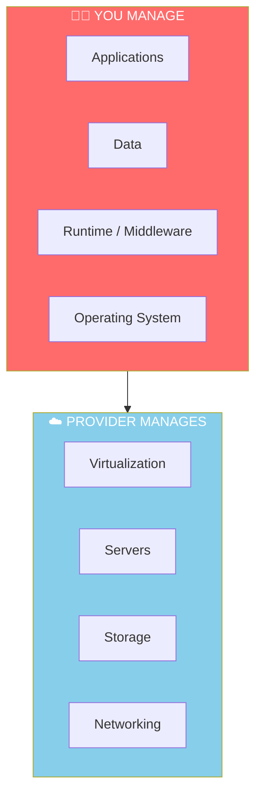
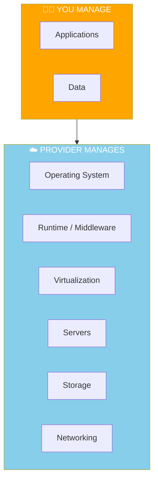
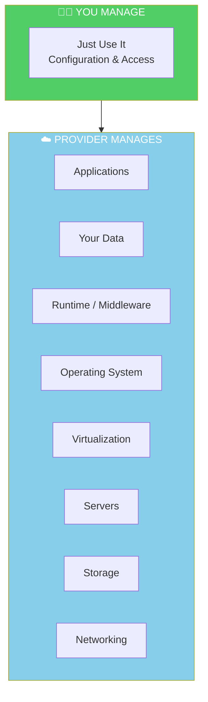
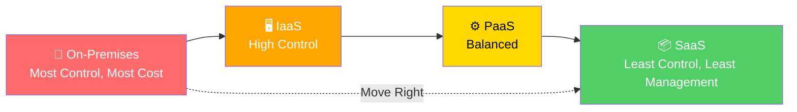
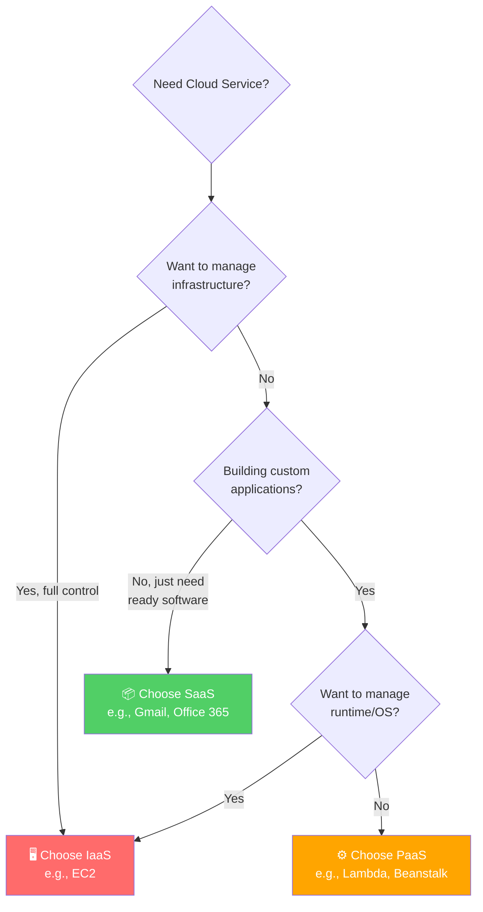

# Cloud Service Models (IaaS, PaaS, SaaS)

> ⏱️ **Estimated Study Time:** 15 minutes  
> 🎯 **CCP Exam Weight:** ~10% (Domain 1: Cloud Concepts)

---

## The Big Picture

**Service models** define **what you manage** versus **what the cloud provider manages**. As you move from IaaS → PaaS → SaaS, you trade control for convenience. The CCP exam tests your understanding of these responsibility boundaries extensively.

---

## The Three Service Models at a Glance

> 🎯 **Exam Tip:** The "as a Service" hierarchy: IaaS (most control) → PaaS (middle) → SaaS (least control, most managed).

---

## 1. Infrastructure as a Service (IaaS)

**Definition:** You rent **raw computing infrastructure** (servers, storage, networking) and manage everything above the hypervisor layer.

### Characteristics

| Attribute | Description |
|-----------|-------------|
| **What You Get** | Virtual machines, storage, networks |
| **What You Manage** | OS, runtime, middleware, apps, data |
| **Control Level** | Maximum flexibility |
| **Technical Skill** | High (sysadmin level) |
| **AWS Examples** | Amazon EC2, EBS, VPC |

### AWS IaaS Services

| Service | Purpose |
|---------|---------|
| **Amazon EC2** | Virtual servers in the cloud |
| **Amazon EBS** | Block storage for EC2 |
| **Amazon VPC** | Isolated network environment |
| **Amazon S3** | Object storage (IaaS for storage) |

### ✅ Pros & ❌ Cons

| Pros | Cons |
|------|------|
| Maximum control | You manage security patches |
| OS flexibility | Requires technical expertise |
| Highly customizable | More responsibility = more risk |
| Lift-and-shift friendly | Time-consuming to manage |

---

## 2. Platform as a Service (PaaS)

**Definition:** Provider delivers a **platform** for developing and deploying applications. You focus on your code and data — the provider handles the infrastructure and platform layers.

### Characteristics

| Attribute | Description |
|-----------|-------------|
| **What You Get** | Pre-configured platform for app development |
| **What You Manage** | Applications and data only |
| **Control Level** | Medium (focus on code) |
| **Technical Skill** | Medium (developer level) |
| **AWS Examples** | AWS Elastic Beanstalk, AWS Lambda, Amazon RDS |

### AWS PaaS Services

| Service | Purpose |
|---------|---------|
| **AWS Elastic Beanstalk** | Deploy web apps without managing infrastructure |
| **AWS Lambda** | Serverless function execution |
| **Amazon RDS** | Managed relational databases |
| **Amazon DynamoDB** | Managed NoSQL database |
| **Amazon SageMaker** | Managed machine learning platform |

### ✅ Pros & ❌ Cons

| Pros | Cons |
|------|------|
| Faster development | Less control over underlying infrastructure |
| Reduced complexity | Vendor lock-in risk |
| Auto-scaling built-in | May be more expensive than IaaS |
| Focus on business logic | Limited customization |

---

## 3. Software as a Service (SaaS)

**Definition:** Provider delivers **fully functional software** over the internet. You just use it — no management, no development, no infrastructure concerns.

### Characteristics

| Attribute | Description |
|-----------|-------------|
| **What You Get** | Ready-to-use software applications |
| **What You Manage** | User access and configuration only |
| **Control Level** | Minimal (just usage) |
| **Technical Skill** | Low (end-user level) |
| **AWS Examples** | Amazon Chime, AWS Console itself |

### Common SaaS Examples

| Service | Category | Provider |
|---------|----------|----------|
| **Gmail** | Email | Google |
| **Microsoft 365** | Productivity | Microsoft |
| **Salesforce** | CRM | Salesforce |
| **Slack** | Communication | Salesforce |
| **Zoom** | Video Conferencing | Zoom |

### ✅ Pros & ❌ Cons

| Pros | Cons |
|------|------|
| Zero infrastructure management | Limited customization |
| Access from anywhere | Data lives with provider |
| Subscription pricing | Vendor lock-in |
| Always up-to-date | Integration challenges |

---

## Comprehensive Comparison

### Responsibility Matrix

| Layer | On-Premises | IaaS | PaaS | SaaS |
|-------|-------------|------|------|------|
| **Applications** | 🧑‍💻 You | 🧑‍💻 You | 🧑‍💻 You | ☁️ Provider |
| **Data** | 🧑‍💻 You | 🧑‍💻 You | 🧑‍💻 You | 🧑‍💻 You |
| **Runtime** | 🧑‍💻 You | 🧑‍💻 You | ☁️ Provider | ☁️ Provider |
| **Middleware** | 🧑‍💻 You | 🧑‍💻 You | ☁️ Provider | ☁️ Provider |
| **OS** | 🧑‍💻 You | 🧑‍💻 You | ☁️ Provider | ☁️ Provider |
| **Virtualization** | 🧑‍💻 You | ☁️ Provider | ☁️ Provider | ☁️ Provider |
| **Servers** | 🧑‍💻 You | ☁️ Provider | ☁️ Provider | ☁️ Provider |
| **Storage** | 🧑‍💻 You | ☁️ Provider | ☁️ Provider | ☁️ Provider |
| **Networking** | 🧑‍💻 You | ☁️ Provider | ☁️ Provider | ☁️ Provider |

### Feature Comparison

| Feature | IaaS | PaaS | SaaS |
|---------|------|------|------|
| **Control** | ⭐⭐⭐⭐⭐ | ⭐⭐⭐ | ⭐ |
| **Convenience** | ⭐⭐ | ⭐⭐⭐⭐ | ⭐⭐⭐⭐⭐ |
| **Flexibility** | ⭐⭐⭐⭐⭐ | ⭐⭐⭐ | ⭐ |
| **Cost Efficiency** | ⭐⭐⭐ | ⭐⭐⭐⭐ | ⭐⭐⭐⭐ |
| **Time to Market** | ⭐⭐ | ⭐⭐⭐⭐ | ⭐⭐⭐⭐⭐ |
| **Technical Skill Needed** | High | Medium | Low |

---

## The Cost vs Control Spectrum

---

## Decision Flowchart

---

## Real-World Scenarios

| Scenario | Recommended Model | Reasoning |
|----------|------------------|-----------|
| Migrating legacy servers to cloud | **IaaS** | Need OS control and lift-and-shift |
| Building a REST API quickly | **PaaS** | Focus on code, not servers |
| Email for your company | **SaaS** | Just use Gmail or Office 365 |
| Custom database with specific config | **IaaS** | Full control over DB engine |
| Deploying a static website | **SaaS/PaaS** | Use S3 + CloudFront (managed) |
| Machine learning model training | **PaaS** | Use SageMaker (managed ML) |

---

## Quick Reference

| Model | You Manage | AWS Examples |
|-------|-----------|--------------|
| **IaaS** | OS, Runtime, Apps, Data | EC2, EBS, VPC |
| **PaaS** | Apps, Data | Lambda, RDS, Beanstalk |
| **SaaS** | Just use it | Amazon Chime, AWS Console |

---

## 📝 Knowledge Check

<strong>Q1: Which service model requires you to manage the operating system?</strong>

**A.** SaaS  
**B.** PaaS  
**C.** IaaS  
**D.** None of the above  

**Answer: C** — In IaaS, you manage the OS, runtime, middleware, applications, and data. The provider only manages the underlying infrastructure (servers, storage, networking, virtualization).

<strong>Q2: A developer wants to deploy a web application without managing servers. Which model is best?</strong>

**A.** IaaS  
**B.** PaaS  
**C.** SaaS  
**D.** On-premises  

**Answer: B** — PaaS provides a platform for deploying applications without managing the underlying infrastructure. AWS Elastic Beanstalk is a perfect example.

<strong>Q3: In the SaaS model, who manages the data?</strong>

**A.** The cloud provider  
**B.** The customer  
**C.** Both share equally  
**D.** A third party  

**Answer: B** — Even in SaaS, the customer owns and manages their data. The provider manages the application, infrastructure, and platform, but data responsibility remains with the customer.

---

## Navigation

⬅️ Previous: [Cloud Deployment Models](./02-deployment-models.md) | ➡️ Next: [Cloud Economics](./04-cloud-economics.md)  
🏠 [Back to README](../../README.md)

---

*Part of the [AWS Cloud Practitioner Study Notes](../../README.md).*