# Cloud Economics & Business Value

> ⏱️ **Estimated Study Time:** 12 minutes  
> 🎯 **CCP Exam Weight:** ~5% (Domain 1: Cloud Concepts + Domain 4: Billing & Pricing)

---

## The Big Picture

Cloud computing fundamentally changes how organizations **finance, plan, and operate** IT resources. This module covers the economic principles that make cloud compelling: CapEx vs OpEx, economies of scale, and the universal trade-off triangle that governs all business decisions.

---

## CapEx vs OpEx: The Financial Shift

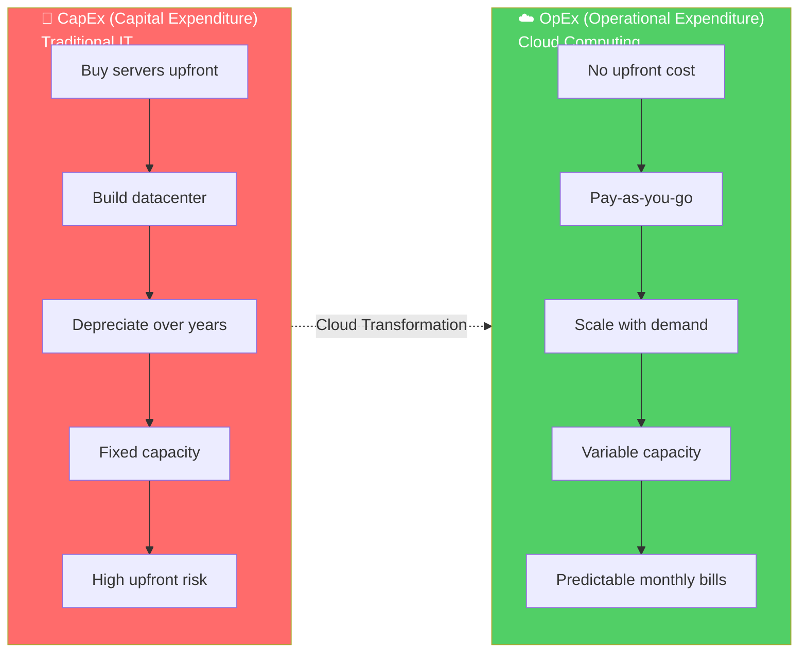

### Detailed Comparison

| Attribute | CapEx (Traditional) | OpEx (Cloud) |
|-----------|---------------------|--------------|
| **Payment Model** | Large upfront investment | Pay-as-you-go |
| **Asset Treatment** | Capitalized, depreciated | Operating expense |
| **Tax Impact** | Depreciation deductions | Full expense deduction |
| **Cash Flow** | Spiky (big purchases) | Smooth (monthly bills) |
| **Risk** | High (over-provisioning) | Low (scale on demand) |
| **Time to Value** | Weeks to months | Minutes |
| **Examples** | Servers, datacenters, licenses | EC2 hours, S3 storage, Lambda invocations |

> 🎯 **Exam Tip:** Cloud computing converts CapEx to OpEx. This is a frequently tested concept.

---

## Why Cloud is More Cost-Effective

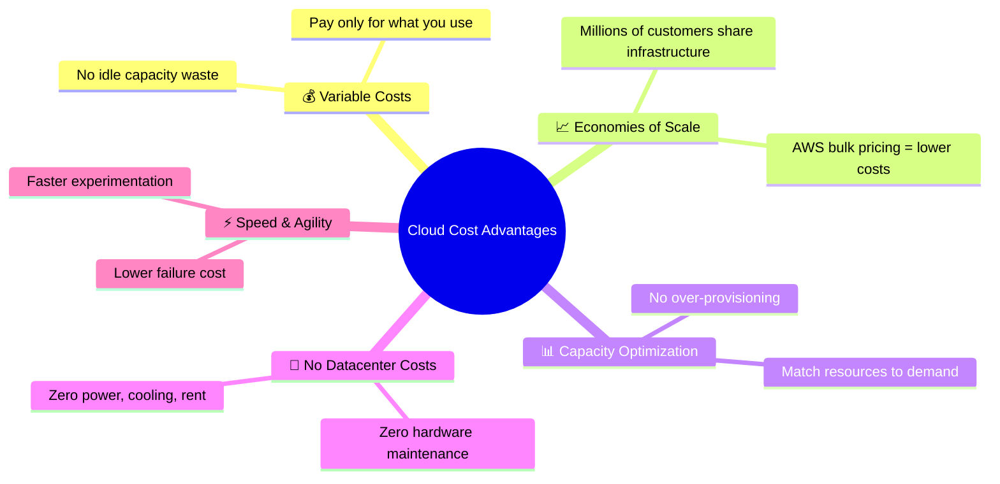

---

## The Trade-Off Triangle: Quality, Cost, Speed

Every business decision involves trade-offs. This principle applies to cloud architecture, project management, and life.

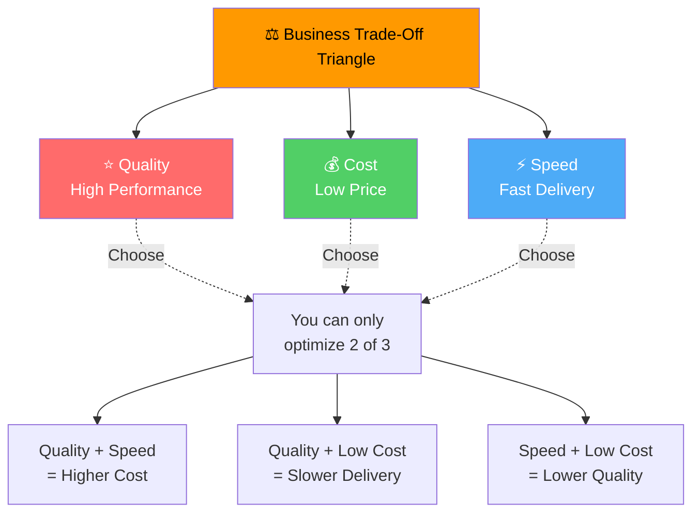

### Trade-Off Examples in Cloud

| Combination | What It Means | Example |
|-------------|---------------|---------|
| **Quality + Speed** | Premium service, fast delivery | Use managed services (RDS, Lambda) — costs more |
| **Quality + Low Cost** | Good quality, slower delivery | Self-host on EC2 with manual optimization |
| **Speed + Low Cost** | Fast and cheap, compromises | Spot Instances — can be interrupted |

---

## The "Fix the Jacket, Break the Pants" Principle

> **Universal Business Wisdom:** *"If you fix the jacket, the pants break."*

This principle captures a fundamental truth: **every decision involves trade-offs**. Perfect solutions don't exist. Optimizing one dimension always impacts another.

### Cloud Trade-Off Examples

| Optimization | What You Gain | What You Sacrifice |
|--------------|---------------|-------------------|
| **Maximize Cost Savings** | Lower bills | Less performance, fewer features |
| **Maximize Performance** | Faster applications | Higher costs |
| **Maximize Availability** | 99.99% uptime | Complex architecture, higher costs |
| **Maximize Security** | Strong protection | Reduced convenience, slower workflows |

---

## The 6 Advantages of Cloud (Economic Focus)

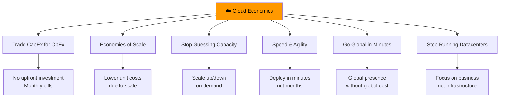

### Economic Impact Table

| Advantage | Traditional Cost | Cloud Cost | Savings |
|-----------|-----------------|------------|---------|
| **Hardware** | $50K-$1M+ per server farm | $0 (included) | 100% |
| **Datacenter** | $10M-$100M+ build | $0 | 100% |
| **Power & Cooling** | $500K-$5M/year | Included | 100% |
| **IT Staff** | 5-50 FTEs | Reduced | 60-80% |
| **Time to Deploy** | 6-14 weeks | Minutes | 99% faster |
| **Capacity Utilization** | 15-25% (wasted) | 70-85% (optimized) | 3-4x better |

---

## Capacity Planning: Traditional vs Cloud

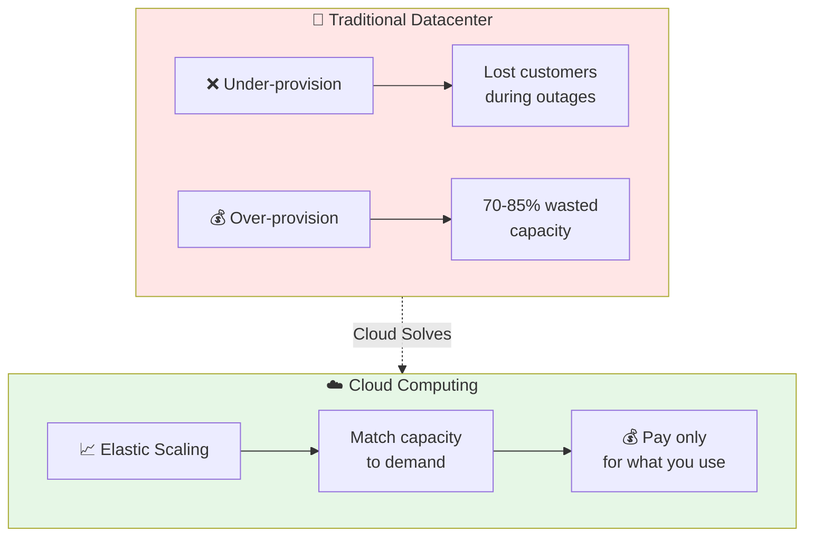

### The Capacity Problem

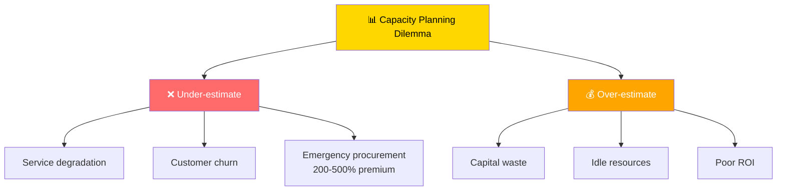

> 🎯 **Exam Tip:** Cloud eliminates the capacity planning dilemma through **elasticity** — you scale resources to match actual demand.

---

## Financial Lifecycle: Traditional vs Cloud

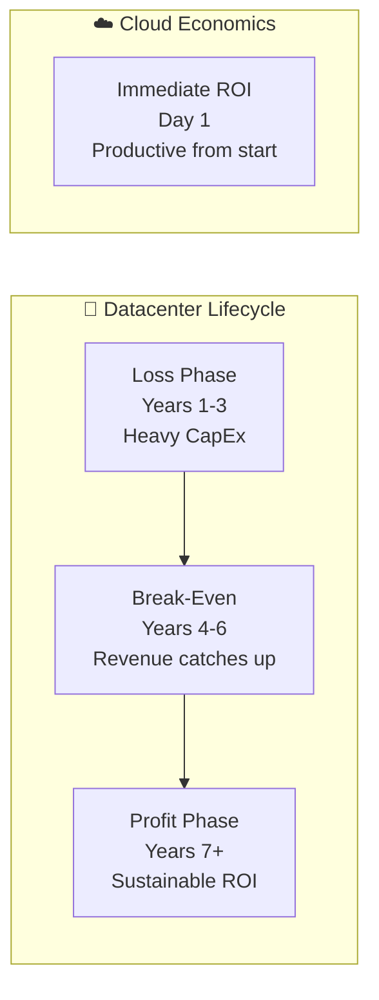

| Phase | Traditional Datacenter | Cloud Computing |
|-------|----------------------|-----------------|
| **Year 1** | Heavy losses (building) | Productive immediately |
| **Years 1-3** | Negative cash flow | Pay-as-you-go, ROI visible |
| **Years 4-6** | Break-even | Continuous optimization |
| **Years 7+** | Profit (if successful) | Ongoing savings & innovation |

---

## Datacenter Business Phases

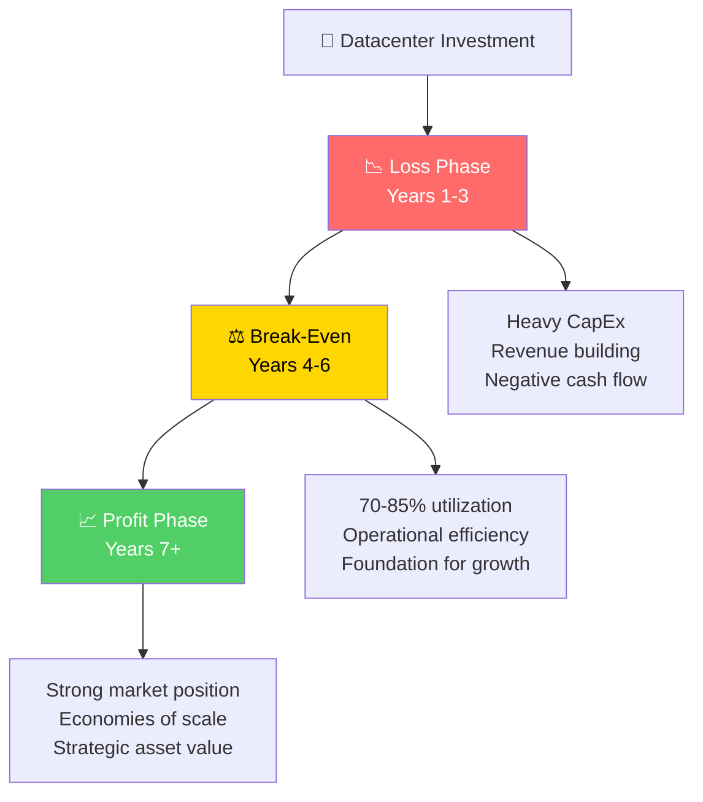

---

## Cloud vs Datacenter: Total Cost Comparison

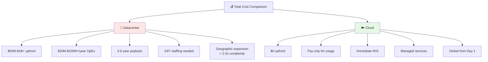

---

## The Break-Even Point

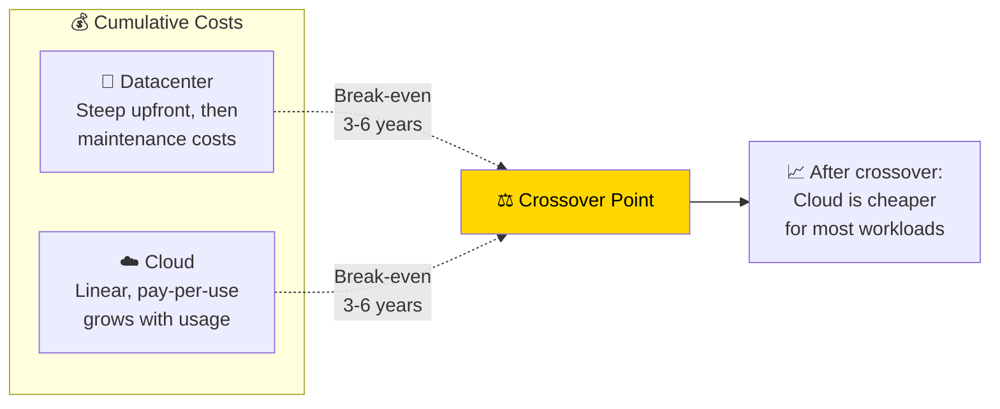

> 🎯 **Exam Tip:** For most workloads, cloud becomes more cost-effective than on-premises after **3-6 years**. But cloud's value is also in **agility**, not just cost.

---

## Universal Business Principles Summary

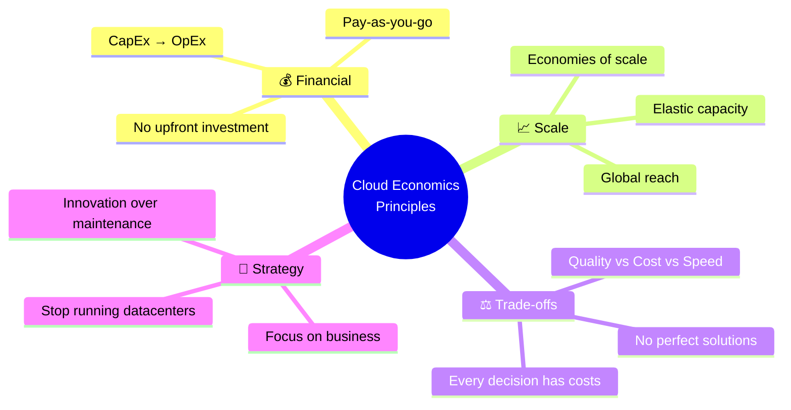

---

## Quick Reference

| Concept | Key Point |
|---------|-----------|
| **CapEx** | Upfront capital investment (servers, datacenters) |
| **OpEx** | Ongoing operational expenses (cloud bills) |
| **Cloud Advantage** | Converts CapEx to OpEx |
| **Economies of Scale** | Bulk purchasing = lower costs |
| **Trade-Off Triangle** | Quality + Cost + Speed (choose 2) |
| **Capacity Planning** | Cloud eliminates over/under-provisioning |
| **Break-Even** | 3-6 years for cloud vs datacenter |

---

## 📝 Knowledge Check

<strong>Q1: What is the main financial advantage of cloud computing?</strong>

**A.** Higher performance  
**B.** Converting CapEx to OpEx  
**C.** Better security  
**D.** More control  

**Answer: B** — Cloud computing converts capital expenditure (CapEx) into operational expenditure (OpEx), eliminating large upfront investments and providing pay-as-you-go pricing.

<strong>Q2: In the trade-off triangle, you can optimize for which combination?</strong>

**A.** All three: Quality, Cost, and Speed  
**B.** Any two of three  
**C.** Only Quality  
**D.** Only Cost  

**Answer: B** — In the trade-off triangle, you can optimize for any two of three dimensions (Quality, Cost, Speed), but never all three simultaneously. Perfect solutions don't exist.

<strong>Q3: How does cloud computing solve the capacity planning dilemma?</strong>

**A.** By requiring upfront capacity commitment  
**B.** Through elastic scaling that matches demand  
**C.** By charging for idle resources  
**D.** By limiting scalability  

**Answer: B** — Cloud computing provides elastic scaling, allowing you to match capacity to actual demand. This eliminates both over-provisioning (wasted resources) and under-provisioning (service degradation).

---

## Navigation

⬅️ Previous: [Cloud Service Models](./03-service-models.md) | ➡️ Next: [AWS Global Infrastructure](../02-aws-infrastructure/01-global-infrastructure.md)  
🏠 [Back to README](../../README.md)

---

*Part of the [AWS Cloud Practitioner Study Notes](../../README.md).*