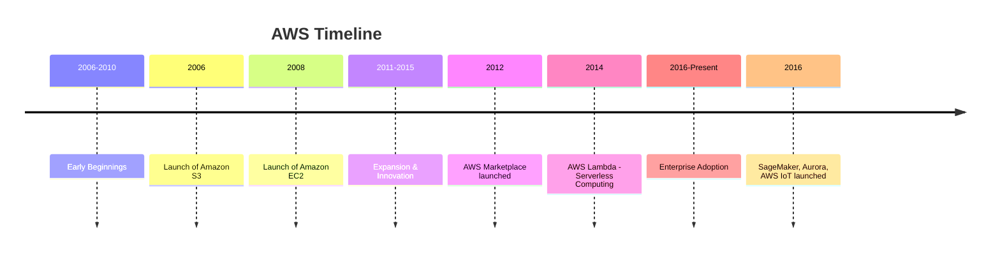
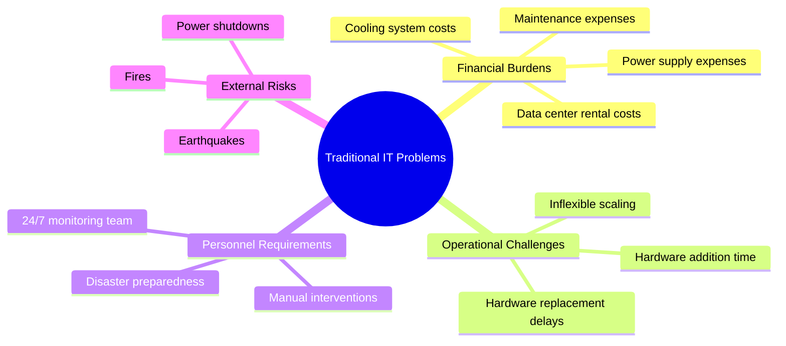
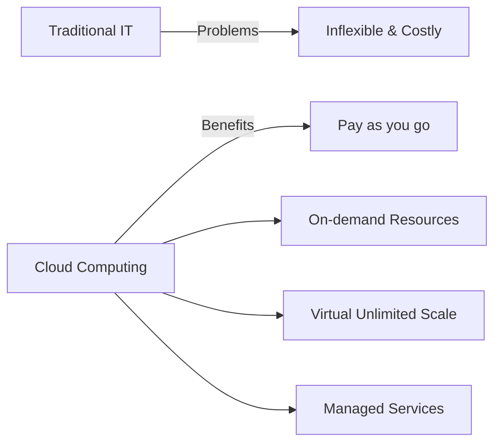
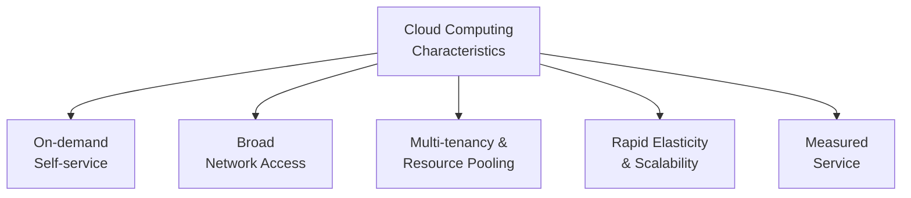
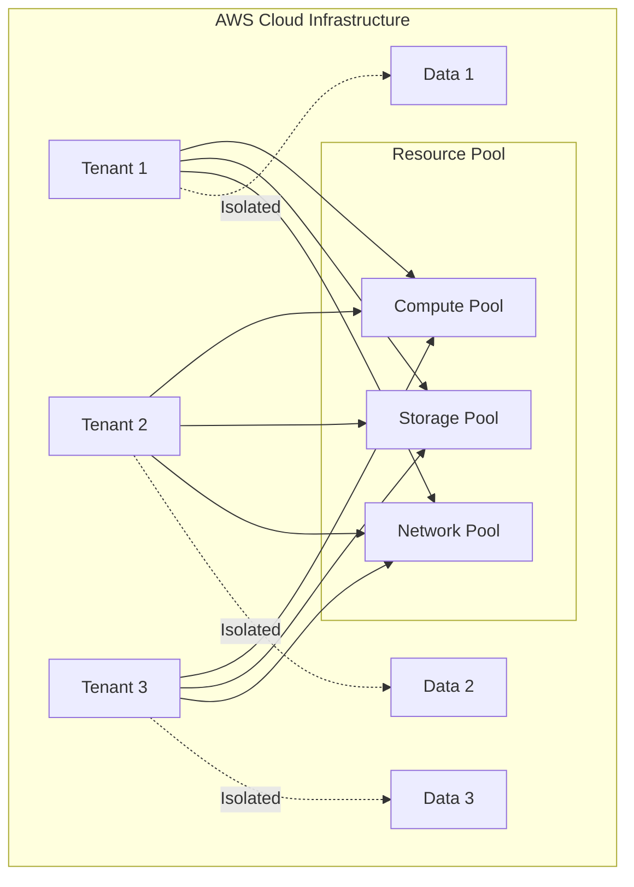
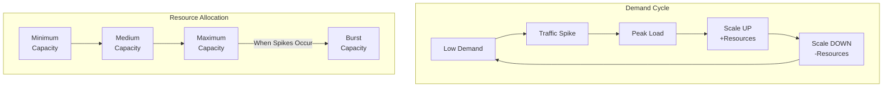
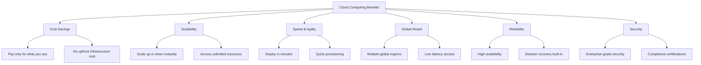

# Introduction to AWS and Cloud Computing

## What is AWS?

**Amazon Web Services (AWS)** is a leading provider of cloud computing services, offering a broad set of infrastructure and application services that enable organizations to build and deploy applications in the cloud.

---

## AWS History & Evolution

### Early Beginnings (2006-2010)

| Year | Milestone |
|------|----------|
| 2006 | Introduction of **Amazon S3** (Simple Storage Service) - marking the beginning of AWS |
| 2008 | Launch of **Amazon EC2** (Elastic Compute Cloud) - providing scalable virtual servers |
| Focus | Providing infrastructure-as-a-service (IaaS) offerings to developers and businesses |

### Expansion and Innovation (2011-2015)

- **Databases**: Amazon RDS, Amazon DynamoDB
- **Networking**: Amazon VPC
- **Developer Tools**: AWS Elastic Beanstalk
- **2012**: AWS Marketplace launched - third-party software vendors can sell solutions on AWS
- **2014**: AWS Lambda introduced - pioneering **serverless computing**

### Enterprise Adoption and Global Expansion (2016-Present)

- Accelerated enterprise adoption for cloud migration and digital transformation
- Expansion of global infrastructure with new **AWS Regions** and **Availability Zones**
- New services launched:
  - **Amazon SageMaker** - Machine Learning
  - **Amazon Aurora** - Enterprise database
  - **AWS IoT** - Internet of Things solutions

---

## Why Cloud Computing?

### Problems with Traditional IT Approach

### Cloud Computing Solution

### Cloud Computing Definition

> **Cloud Computing** = On-demand delivery of compute power, database storage, applications, and other IT resources through a cloud services platform.

---

## 5 Characteristics of Cloud Computing

Cloud computing is defined by **5 essential characteristics** that distinguish it from traditional computing models.

### 1. On-Demand Self-Service

| Aspect | Description |
|--------|-------------|
| **Definition** | Users can provision resources autonomously without requiring interaction with the service provider |
| **Benefit** | Instant access to compute, storage, and services when needed |
| **Example** | Launching an EC2 instance from the AWS Console without contacting support |

### 2. Broad Network Access

| Aspect | Description |
|--------|-------------|
| **Definition** | Resources are accessible over the network, allowing diverse client platforms to utilize them |
| **Benefit** | Access from anywhere using any device (laptop, tablet, mobile, desktop) |
| **Requirement** | Network connectivity and standard protocols |

### 3. Multi-Tenancy and Resource Pooling

| Aspect | Description |
|--------|-------------|
| **Definition** | Multiple customers share the same infrastructure and applications securely |
| **Benefit** | Optimizes resource utilization and reduces costs through economies of scale |
| **Security** | Logical isolation ensures tenant data remains separate and secure |

### 4. Rapid Elasticity and Scalability

| Aspect | Description |
|--------|-------------|
| **Definition** | Resources can be swiftly acquired or released based on demand |
| **Benefit** | Quick scaling up or down as needed to match workload requirements |
| **Advantage** | Handle traffic spikes without over-provisioning |

### 5. Measured Service

| Aspect | Description |
|--------|-------------|
| **Definition** | Usage of resources is measured, and users are charged based on consumption |
| **Benefit** | Pay only for what you use - no waste from over-provisioning |
| **Transparency** | Accurate billing with detailed usage reports |

---

## Cloud Computing Benefits

---

## Key Takeaways

1. **AWS** is the leading cloud provider since 2006
2. Started with **S3** (storage) and **EC2** (compute)
3. Pioneered **serverless computing** with AWS Lambda in 2014
4. **Cloud computing** solves traditional IT problems of cost, flexibility, and scalability
5. Pay-as-you-go model provides cost-effective, on-demand access to resources
6. **5 Characteristics of Cloud Computing**:
   - **On-demand Self-service** - Provision resources without provider interaction
   - **Broad Network Access** - Access from anywhere on any device
   - **Multi-tenancy & Resource Pooling** - Shared infrastructure with secure isolation
   - **Rapid Elasticity & Scalability** - Scale up/down quickly based on demand
   - **Measured Service** - Pay only for what you use

---

## Next Steps

⬅️ Previous: (Start) | ➡️ Next: [Cloud Models & Pricing](./02-cloud-models-and-pricing.md)

---

*Part of the [AWS Cloud Practitioner Study Notes](../README.md).*
