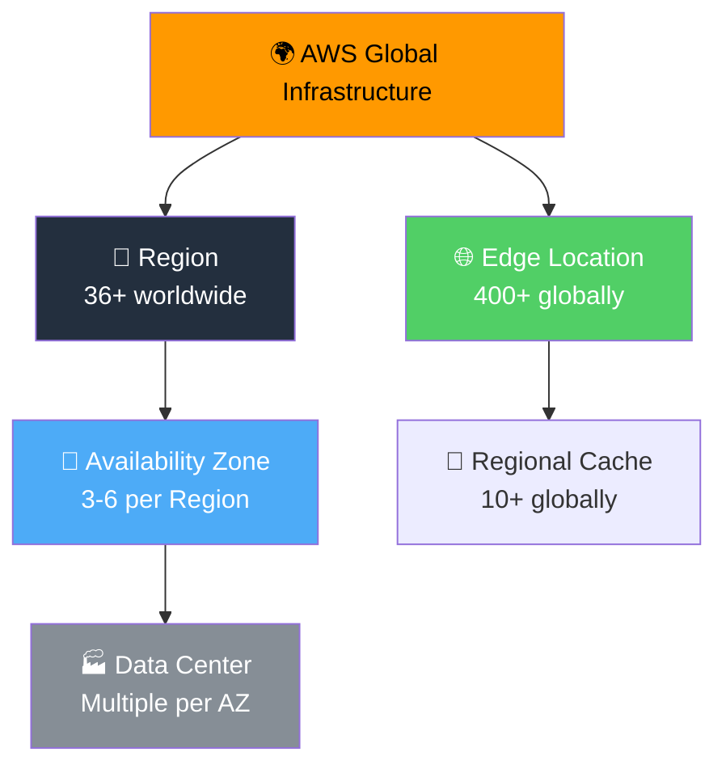
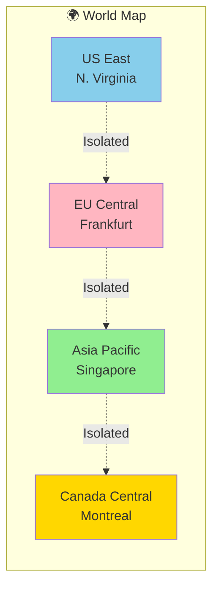
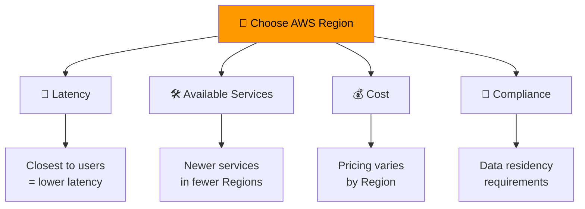
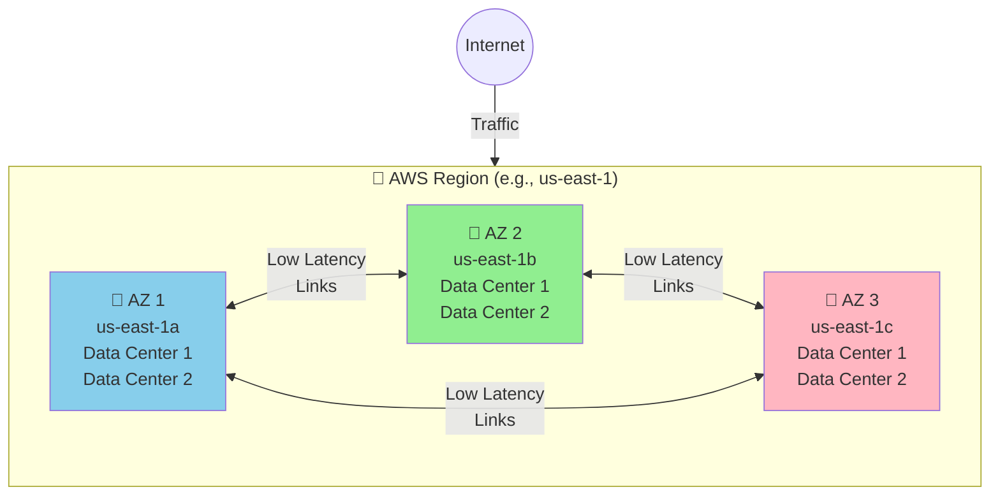
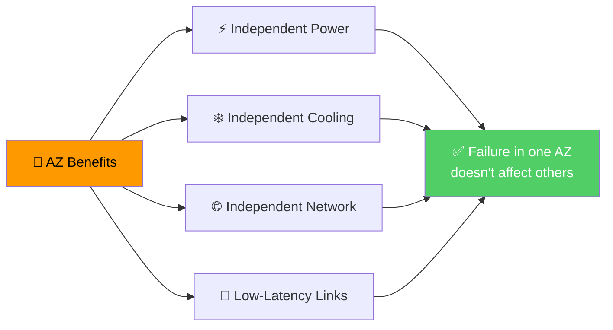
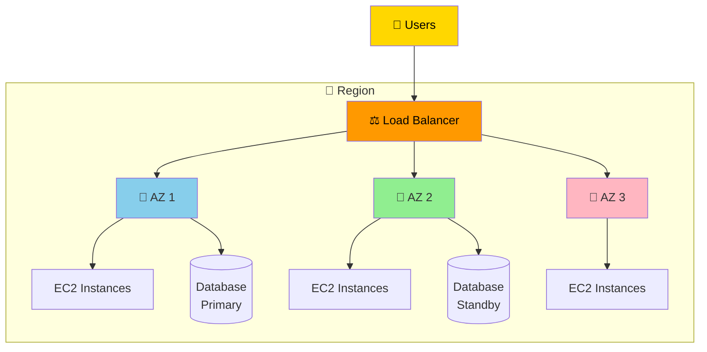
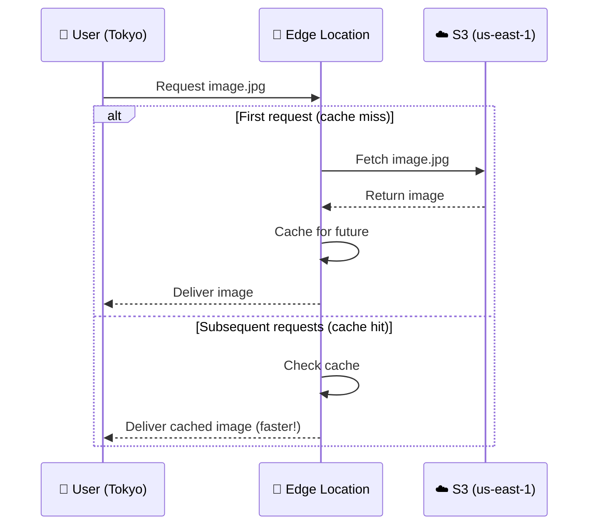
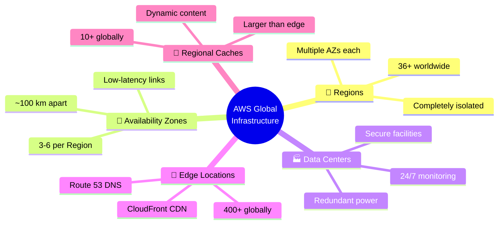

# AWS Global Infrastructure

> ⏱️ **Estimated Study Time:** 15 minutes  
> 🎯 **CCP Exam Weight:** ~10% (Domain 3: Cloud Technology & Services)

---

## The Big Picture

AWS operates the world's largest cloud infrastructure — **36+ Regions**, **100+ Availability Zones**, and **400+ Edge Locations** across the globe. Understanding this hierarchy is essential for designing resilient, high-performance applications and is heavily tested on the CCP exam.

---

## Infrastructure Hierarchy



---

## AWS Regions

**Definition:** A **Region** is a separate geographic area containing multiple Availability Zones. Regions are completely independent and isolated from each other.



### Key Facts

| Attribute | Detail |
|-----------|--------|
| **Total Regions** | 36+ globally (and growing) |
| **Isolation** | Completely independent from other Regions |
| **Data Replication** | NOT automatic across Regions (you control this) |
| **Services** | Not all services available in all Regions |
| **Pricing** | Varies by Region |

### Region Selection Criteria



### Example Regions

| Region Code | Location | Country |
|-------------|----------|---------|
| `us-east-1` | US East (N. Virginia) | USA |
| `us-west-2` | US West (Oregon) | USA |
| `eu-west-1` | Europe (Ireland) | Ireland |
| `eu-central-1` | Europe (Frankfurt) | Germany |
| `ap-southeast-1` | Asia Pacific (Singapore) | Singapore |
| `ap-northeast-1` | Asia Pacific (Tokyo) | Japan |
| `sa-east-1` | South America (São Paulo) | Brazil |

> 🎯 **Exam Tip:** Know the major Region codes and their locations. `us-east-1` (N. Virginia) is the oldest and often has the most services.

---

## Availability Zones (AZs)

**Definition:** An **Availability Zone** is one or more discrete data centers with **redundant power, networking, and connectivity** in a Region.



### AZ Naming Convention

| Format | Example | Meaning |
|--------|---------|---------|
| `<region>-<letter>` | `us-east-1a` | First AZ in us-east-1 |
| `<region>-<letter>` | `eu-west-2b` | Second AZ in eu-west-2 |
| `<region>-<letter>` | `ap-southeast-1c` | Third AZ in ap-southeast-1 |

### AZ Characteristics

| Attribute | Detail |
|-----------|--------|
| **Count per Region** | Minimum 3, maximum 6 |
| **Typical Count** | 3 AZs per Region |
| **Distance** | ~100 km (60 miles) apart |
| **Connection** | Low-latency links between AZs |
| **Power** | Independent power infrastructure |
| **Networking** | Independent networking |

### Why AZs Matter



> 🎯 **Exam Tip:** High Availability = deploy across **at least 2 AZs**. This protects against data center failures within a Region.

---

## High Availability Architecture



---

## Points of Presence (Edge Locations)

**Definition:** Edge Locations are **data centers** that host cached content closer to end users, reducing latency for content delivery.

```mermaid
graph TD
    PoP[🌐 Points of Presence] --> EL[📡 Edge Locations<br/>400+ globally]
    PoP --> RC[💾 Regional Caches<br/>10+ globally]
    
    EL --> E1[CloudFront CDN<br/>Content caching]
    EL --> E2[Route 53 DNS<br/>DNS resolution]
    EL --> E3[Lambda@Edge<br/>Compute at edge]
    
    RC --> R1[Dynamic content<br/>delivery]
    RC --> R2[Larger cache<br/>than edge]
    
    style PoP fill:#51CF66,color:#fff
```

### Edge Location Facts

| Attribute | Detail |
|-----------|--------|
| **Total Edge Locations** | 400+ globally |
| **Regional Caches** | 10+ globally |
| **Geographic Spread** | 90+ cities, 40+ countries |
| **Purpose** | Reduce latency for end users |
| **Services** | CloudFront, Route 53, Lambda@Edge |

### CDN Flow Example



---

## Region vs AZ vs Edge Location

| Component | Count | Purpose | Example |
|-----------|-------|---------|---------|
| **Region** | 36+ | Geographic area, isolated | `us-east-1` (N. Virginia) |
| **Availability Zone** | 3-6 per Region | Data centers with redundant power/network | `us-east-1a`, `us-east-1b` |
| **Edge Location** | 400+ | Cache content close to users | CloudFront CDN endpoints |
| **Regional Cache** | 10+ | Larger cache layer between edge and origin | Tier between edge and S3 |

---

## Global Infrastructure at a Glance



---

## Quick Reference

| Concept | Key Point |
|---------|-----------|
| **Region** | 36+ geographic areas, completely isolated |
| **Availability Zone** | 3-6 data centers per Region with redundant infrastructure |
| **Edge Location** | 400+ CDN endpoints for low-latency content delivery |
| **High Availability** | Deploy across at least 2 AZs |
| **Region Selection** | Consider latency, services, cost, compliance |
| **AZ Naming** | `<region>-<letter>` (e.g., `us-east-1a`) |

---

## 📝 Knowledge Check

<details>
<summary><strong>Q1: What is the relationship between Regions and Availability Zones?</strong></summary>

**A.** Each AZ contains multiple Regions  
**B.** Each Region contains 3-6 AZs  
**C.** Regions and AZs are the same thing  
**D.** AZs are global, Regions are local  

**Answer: B** — Each AWS Region contains 3-6 Availability Zones. AZs are data centers within a Region, connected by low-latency links.
</details>

<details>
<summary><strong>Q2: Which factor should you consider when choosing an AWS Region?</strong></summary>

**A.** Only cost  
**B.** Latency, services, cost, and compliance  
**C.** Only available services  
**D.** Only physical location  

**Answer: B** — Region selection should consider multiple factors: latency to users, available services, pricing, and compliance/data residency requirements.
</details>

<details>
<summary><strong>Q3: What is the purpose of Edge Locations?</strong></summary>

**A.** To replace Regions  
**B.** To cache content closer to end users and reduce latency  
**C.** To store all AWS data  
**D.** To manage IAM users  

**Answer: B** — Edge Locations are CDN endpoints (400+ globally) that cache content closer to end users, reducing latency for content delivery via services like CloudFront.
</details>

---

## Navigation

⬅️ Previous: [Cloud Economics](../01-cloud-fundamentals/04-cloud-economics.md) | ➡️ Next: [Shared Responsibility Model](./02-shared-responsibility.md)  
🏠 [Back to README](../../README.md)

---

*Part of the [AWS Cloud Practitioner Study Notes](../../README.md).*