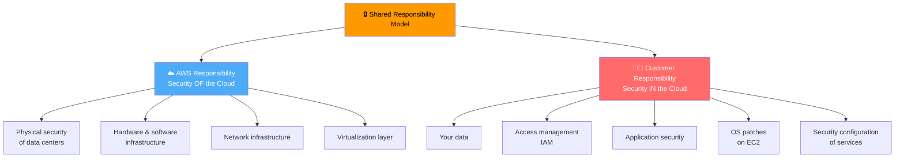
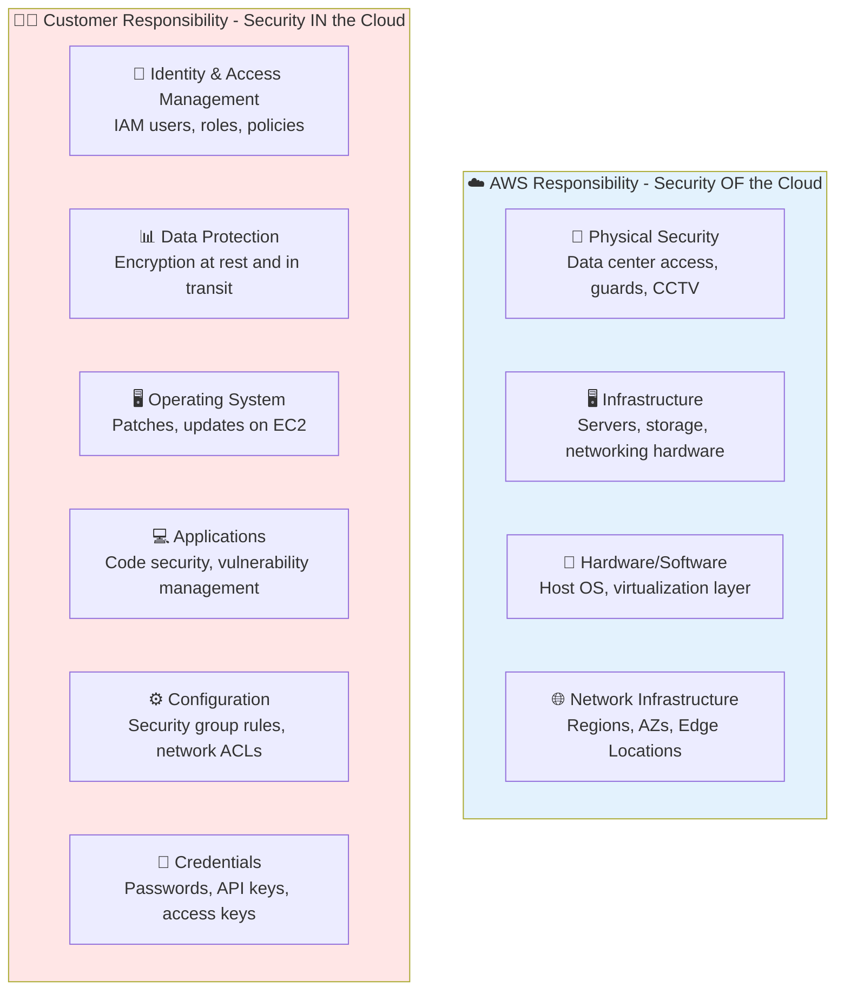
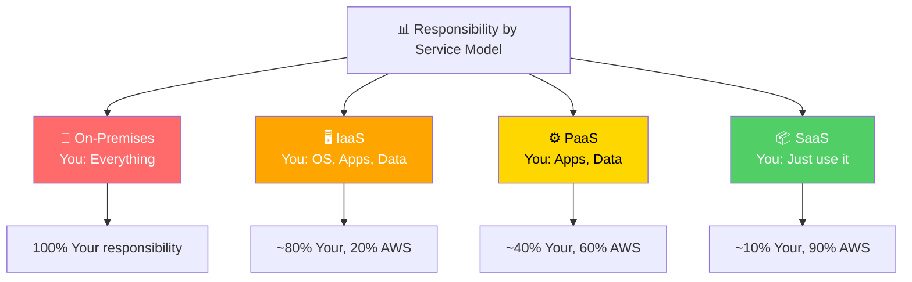
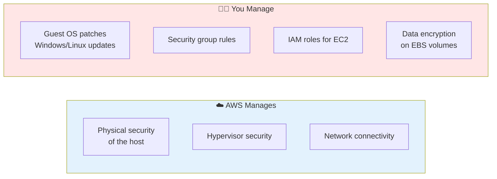
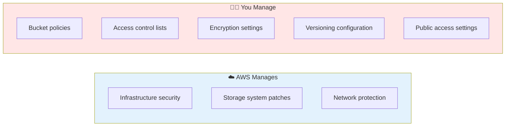
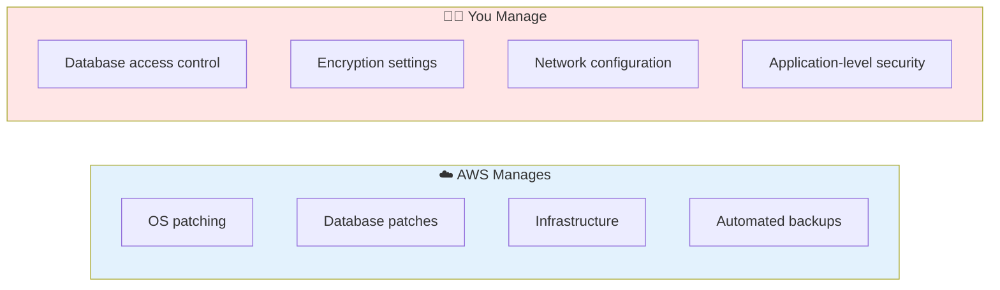
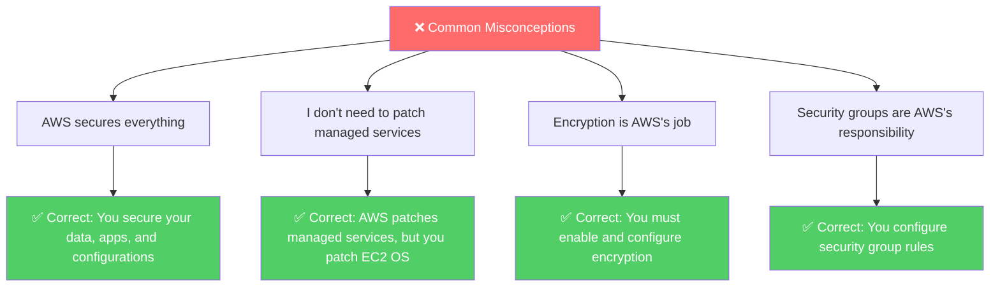
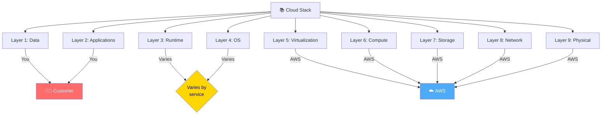

# AWS Shared Responsibility Model

> ⏱️ **Estimated Study Time:** 12 minutes  
> 🎯 **CCP Exam Weight:** ~10-15% (Domain 2: Security & Compliance)

---

## The Big Picture

The **Shared Responsibility Model** is AWS's security framework that defines who is responsible for what. Simply put: **AWS is responsible for security OF the cloud (infrastructure), while you are responsible for security IN the cloud (your data and configurations)**. This model is heavily tested on the CCP exam.

---

## Core Concept



> 🎯 **Exam Tip:** Memorize the phrase: **"AWS is responsible for the cloud itself; you're responsible for what you put in it."**

---

## Visual Responsibility Breakdown



---

## Responsibility by Service Model

As you move from IaaS to SaaS, AWS takes on **more** responsibility, and you take on **less**.



### Detailed Layer Breakdown

| Layer | On-Premises | IaaS (EC2) | PaaS (RDS) | SaaS (Chime) |
|-------|-------------|------------|------------|--------------|
| **Applications** | 🧑‍💻 You | 🧑‍💻 You | 🧑‍💻 You | ☁️ AWS |
| **Data** | 🧑‍💻 You | 🧑‍💻 You | 🧑‍💻 You | 🧑‍💻 You |
| **Runtime** | 🧑‍💻 You | 🧑‍💻 You | ☁️ AWS | ☁️ AWS |
| **Operating System** | 🧑‍💻 You | 🧑‍💻 You | ☁️ AWS | ☁️ AWS |
| **Virtualization** | 🧑‍💻 You | ☁️ AWS | ☁️ AWS | ☁️ AWS |
| **Compute** | 🧑‍💻 You | ☁️ AWS | ☁️ AWS | ☁️ AWS |
| **Storage** | 🧑‍💻 You | ☁️ AWS | ☁️ AWS | ☁️ AWS |
| **Networking** | 🧑‍💻 You | ☁️ AWS | ☁️ AWS | ☁️ AWS |
| **Physical Security** | 🧑‍💻 You | ☁️ AWS | ☁️ AWS | ☁️ AWS |

---

## AWS Responsibilities (Security OF the Cloud)

```mermaid
mindmap
  root((AWS<br/>Responsibilities))
  🏢 Physical Security
    Data center access control
    Security guards
    CCTV monitoring
    Biometric access
  🖥️ Infrastructure
    Hardware maintenance
    Server replacement
    Network equipment
  💾 Software
    Host OS patches
    Hypervisor security
    Service software
  🌐 Network
    Global backbone
    Internet connectivity
    DDoS protection baseline
  ⚡ Power & Cooling
    UPS systems
    Backup generators
    Precision cooling
  🌍 Compliance
    Infrastructure certifications
    SOC, PCI, ISO, HIPAA
```

### Key AWS Responsibilities

| Responsibility | Description |
|----------------|-------------|
| **Physical Security** | Data centers with restricted access, guards, CCTV, biometric authentication |
| **Hardware Maintenance** | Server replacement, hardware lifecycle management |
| **Host OS & Hypervisor** | Patching and securing the virtualization layer |
| **Network Infrastructure** | Global backbone, Regions, AZs, Edge Locations |
| **Service Availability** | Ensuring services run and scale as designed |
| **Compliance Certifications** | SOC, PCI DSS, ISO 27001, HIPAA, GDPR |

---

## Customer Responsibilities (Security IN the Cloud)

```mermaid
mindmap
  root((Customer<br/>Responsibilities))
  🔐 Identity & Access
    IAM users and roles
    Multi-factor authentication
    Password policies
  📊 Data Protection
    Encryption at rest
    Encryption in transit
    Backup strategies
  🖥️ EC2 Operating System
    OS patches and updates
    Antivirus software
    Firewall configuration
  💻 Applications
    Secure coding practices
    Vulnerability scanning
    Dependency management
  ⚙️ Configuration
    Security group rules
    Network ACLs
    S3 bucket policies
  🔑 Credentials
    API key management
    Access key rotation
    Secrets management
```

### Key Customer Responsibilities

| Responsibility | Examples |
|----------------|----------|
| **IAM** | Create users, roles, policies, enable MFA |
| **Data Encryption** | Encrypt S3 buckets, RDS databases, EBS volumes |
| **OS Patching** | Update Windows/Linux on EC2 instances |
| **Security Groups** | Configure inbound/outbound rules |
| **Application Security** | Secure code, vulnerability management |
| **Network Configuration** | VPC setup, subnet design, NACLs |
| **Backup & Recovery** | EBS snapshots, S3 versioning, cross-Region replication |

---

## Real-World Examples

### Example 1: Amazon EC2



### Example 2: Amazon S3



### Example 3: Amazon RDS



> 🎯 **Exam Tip:** For managed services (RDS, Lambda), AWS handles more. For IaaS (EC2), you handle OS patching.

---

## Customer Responsibility Summary by Service Type

| Service Type | Examples | Customer Responsibility |
|--------------|----------|------------------------|
| **Compute (IaaS)** | EC2, EBS | OS patches, security groups, IAM roles, data encryption |
| **Containers** | ECS, EKS | Container images, task definitions, IAM roles |
| **Storage** | S3, EFS | Bucket policies, encryption, access control |
| **Database (PaaS)** | RDS, DynamoDB | Database access, encryption, VPC configuration |
| **Serverless** | Lambda | Function code, IAM roles, environment variables |
| **Networking** | VPC | Subnet design, security groups, NACLs, route tables |

---

## Common Misconceptions



---

## Shared Responsibility Visualization



---

## Quick Reference

| Aspect | AWS Responsibility | Customer Responsibility |
|--------|-------------------|------------------------|
| **Physical Security** | ✅ Data centers, guards, CCTV | ❌ |
| **Hardware/Network** | ✅ Servers, switches, routers | ❌ |
| **Virtualization** | ✅ Hypervisor, host OS | ❌ |
| **Guest OS (EC2)** | ❌ | ✅ Patch and update |
| **Applications** | ❌ | ✅ Secure code |
| **Data** | ❌ | ✅ Encrypt, backup |
| **Access Control** | ❌ | ✅ IAM, MFA, policies |
| **Configuration** | ❌ | ✅ Security groups, NACLs |

---

## 📝 Knowledge Check

<details>
<summary><strong>Q1: According to the Shared Responsibility Model, who is responsible for patching the guest operating system on an EC2 instance?</strong></summary>

**A.** AWS  
**B.** The customer  
**C.** Both share equally  
**D.** A third party  

**Answer: B** — In the Shared Responsibility Model, AWS is responsible for the host OS and hypervisor, but the customer is responsible for patching and securing the guest operating system on EC2 instances.
</details>

<details>
<summary><strong>Q2: Which of the following is AWS responsible for?</strong></summary>

**A.** Configuring IAM policies  
**B.** Encrypting customer data  
**C.** Physical security of data centers  
**D.** Patching the guest OS on EC2  

**Answer: C** — AWS is responsible for the physical security of data centers, including access control, guards, CCTV, and environmental controls. Customers are responsible for IAM, data encryption, and guest OS patching.
</details>

<details>
<summary><strong>Q3: For Amazon RDS, who is responsible for database engine patching?</strong></summary>

**A.** The customer  
**B.** AWS  
**C.** Both share equally  
**D.** The database vendor  

**Answer: B** — Amazon RDS is a managed service, so AWS handles database engine patching, OS patching, and infrastructure. The customer is responsible for database access control, encryption settings, and application-level security.
</details>

---

## Navigation

⬅️ Previous: [AWS Global Infrastructure](./01-global-infrastructure.md) | ➡️ Next: [AWS Data Centers](./03-data-centers.md)  
🏠 [Back to README](../../README.md)

---

*Part of the [AWS Cloud Practitioner Study Notes](../../README.md).*