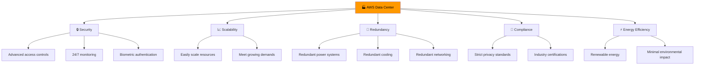
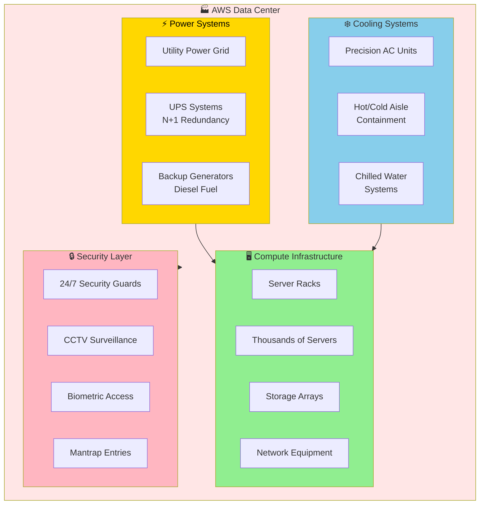
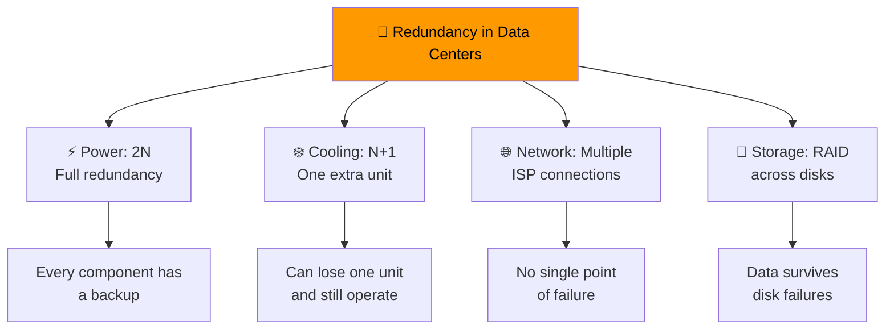
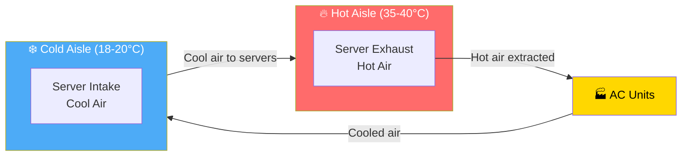
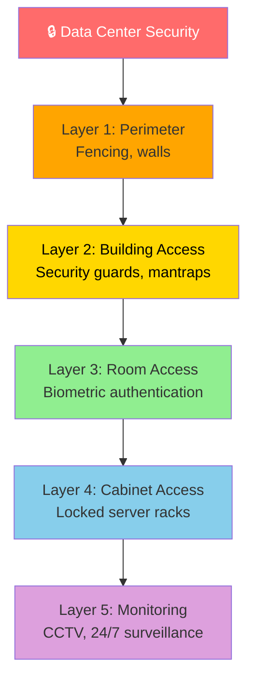
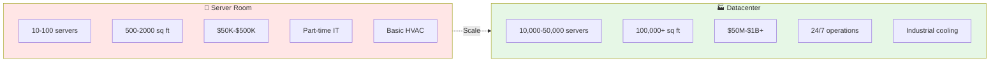
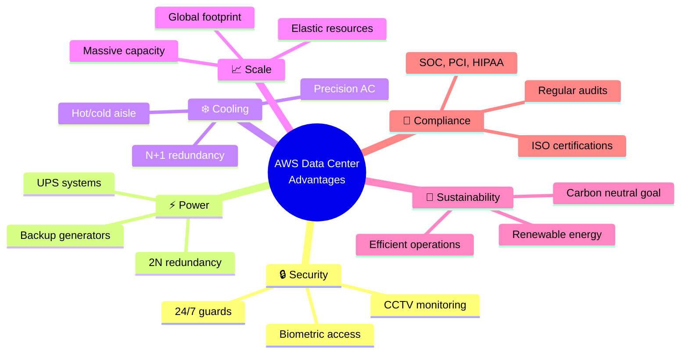
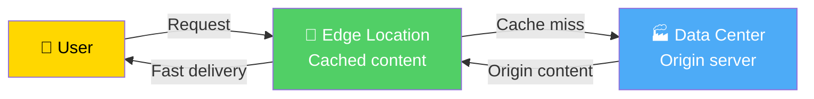
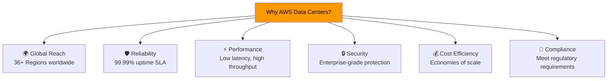

# AWS Data Centers & Edge Infrastructure

> ⏱️ **Estimated Study Time:** 12 minutes  
> 🎯 **CCP Exam Weight:** ~5% (Domain 3: Cloud Technology & Services)

---

## The Big Picture

AWS data centers are the **physical foundation** of cloud computing. They house the servers, storage, and networking equipment that power all AWS services. Understanding their design, security, and efficiency helps you appreciate why AWS can deliver reliable, scalable cloud services.

---

## AWS Data Center Overview

---

## Data Center Architecture

---

## Key Characteristics

| Characteristic | Description |
|----------------|-------------|
| **Security** | Advanced access controls, 24/7 monitoring, biometric authentication |
| **Location** | Worldwide, strategically positioned for low latency |
| **Scalability** | Designed to easily scale resources to meet growing demands |
| **Redundancy** | Built with redundant power, cooling, and networking systems |
| **Compliance** | Adhere to strict compliance standards for data privacy and security |
| **Energy Efficiency** | Utilize renewable energy and green technologies |

---

## Redundancy Levels

### Redundancy by Component

| Component | Redundancy Level | Purpose |
|-----------|-----------------|---------|
| **Power Systems** | 2N (full redundancy) | Survive utility power failure |
| **Cooling Systems** | N+1 minimum | Survive AC unit failure |
| **Network** | Multiple ISPs | Survive ISP outage |
| **Storage** | RAID + replication | Survive disk failure |
| **Servers** | N+1 spare capacity | Handle hardware failures |

---

## Cooling & HVAC Systems

### Why Cooling Matters

| Aspect | Detail |
|--------|--------|
| **Power to Cooling** | Cooling consumes 30-40% of total power |
| **Temperature Range** | 18-27°C (64-80°F) optimal |
| **Hot/Cold Aisle** | Separates hot exhaust from cool intake |
| **Failure Impact** | Thermal shutdown in 2-5 minutes if cooling fails |

---

## Security Layers

### Security Features

| Layer | Security Measure |
|-------|-----------------|
| **Perimeter** | Fencing, barriers, vehicle checkpoints |
| **Building** | Security guards, mantraps, visitor logging |
| **Room** | Biometric authentication (fingerprint, retinal scan) |
| **Cabinet** | Locked server racks, access logs |
| **Monitoring** | 24/7 CCTV, motion sensors, intrusion detection |

---

## Server Room vs Datacenter

### Comparison Table

| Aspect | Server Room | Datacenter |
|--------|-------------|------------|
| **Scale** | 10-100 servers | 10,000-50,000 servers |
| **Space** | 500-2000 sq ft | 100,000+ sq ft |
| **Investment** | $50K-$500K | $50M-$1B+ |
| **Power** | 10-50 kW | 10-25 MW |
| **Staff** | Part-time IT | 24/7 operations teams |
| **Cooling** | Basic HVAC | Industrial precision cooling |
| **Use Case** | SMBs | Enterprise & cloud providers |

---

## AWS Data Center Advantages

---

## Edge Locations vs Data Centers

| Feature | Data Center | Edge Location |
|---------|-------------|---------------|
| **Purpose** | Host AWS services and customer workloads | Cache content close to users |
| **Size** | Massive (100,000+ sq ft) | Smaller facilities |
| **Count** | Hundreds globally | 400+ globally |
| **Services** | All AWS services | CloudFront, Route 53, Lambda@Edge |
| **Content** | Your applications and data | Cached copies of content |

---

## Why AWS Data Centers Matter

---

## Quick Reference

| Concept | Key Point |
|---------|-----------|
| **Data Center** | Physical facility housing AWS infrastructure |
| **Security** | Multi-layered: perimeter, building, room, cabinet, monitoring |
| **Power** | 2N redundancy with UPS and backup generators |
| **Cooling** | Hot/cold aisle containment, N+1 redundancy |
| **Compliance** | SOC, PCI, HIPAA, ISO certifications |
| **Scale** | 10,000-50,000 servers per datacenter |
| **Sustainability** | Renewable energy commitment |

---

## 📝 Knowledge Check

<strong>Q1: What is the redundancy level for power systems in AWS data centers?</strong>

**A.** N+1 (one extra unit)  
**B.** 2N (full redundancy)  
**C.** No redundancy  
**D.** 3N (triple redundancy)  

**Answer: B** — AWS data centers use 2N redundancy for power systems, meaning every component has a full backup. This ensures the data center can survive utility power failures.

<strong>Q2: What is the purpose of hot/cold aisle containment?</strong>

**A.** To organize servers by color  
**B.** To separate hot exhaust air from cool intake air for efficient cooling  
**C.** To improve network performance  
**D.** To enhance security  

**Answer: B** — Hot/cold aisle containment separates hot server exhaust air (35-40°C) from cool intake air (18-20°C), improving cooling efficiency and reducing energy consumption.

<strong>Q3: Which compliance certifications do AWS data centers maintain?</strong>

**A.** Only SOC  
**B.** Only ISO  
**C.** SOC, PCI, ISO, HIPAA, and many more  
**D.** No certifications  

**Answer: C** — AWS data centers maintain numerous compliance certifications including SOC, PCI DSS, ISO 27001, HIPAA, and many others to meet diverse regulatory requirements worldwide.

---

## Navigation

⬅️ Previous: [Shared Responsibility Model](./02-shared-responsibility.md) | ➡️ Next: [Amazon EC2](../03-aws-services/01-compute-ec2.md)  
🏠 [Back to README](../../README.md)

---

*Part of the [AWS Cloud Practitioner Study Notes](../../README.md).*