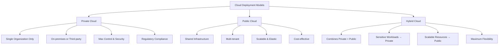
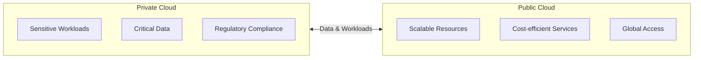
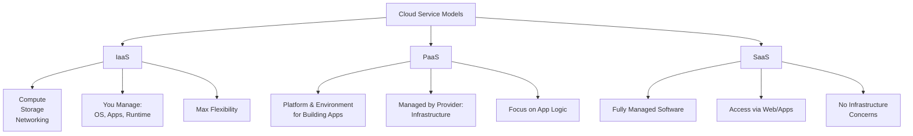
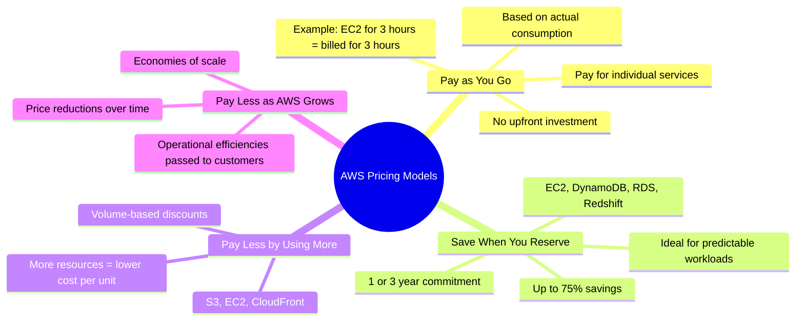

# Cloud Deployment Models, Service Models, and AWS Pricing

## The Big Picture

> *"If I don't own any servers, can I run a global app?"*
>
> That's the power of cloud computing — and it all starts with understanding how cloud models and pricing work.

---

## Cloud Deployment Models

Cloud deployment models determine how cloud services are made available to users. Each model has its own advantages and limitations depending on the use case.

### 1. Private Cloud

| Characteristic | Description |
|----------------|-------------|
| **Usage** | Used exclusively by a single organization |
| **Hosting** | On-premises or by a third-party provider |
| **Advantages** | Greater control, security, and customization |
| **Use Cases** | Organizations with regulatory or data sovereignty requirements |

### 2. Public Cloud

| Characteristic | Description |
|----------------|-------------|
| **Provider** | AWS, Azure, Google Cloud, etc. |
| **Infrastructure** | Shared across multiple customers (tenants) |
| **Benefits** | Scalability, Elasticity, Cost-effectiveness, Reliability, Security, Global reach |

### 3. Hybrid Cloud

Combines private and public cloud infrastructure:
- **Private cloud** for sensitive workloads
- **Public cloud** for scalable and cost-efficient resources
- Enables **flexibility** in managing data and applications

---

## Cloud Service Models

These models define what level of control and responsibility you have over cloud-based resources.

### 1. Infrastructure as a Service (IaaS)

| Aspect | Details |
|--------|---------|
| **Provides** | Virtual machines, storage, networking |
| **User Control** | Maximum flexibility and control |
| **Your Responsibility** | Operating systems, applications, runtime environments |
| **Examples** | Amazon EC2, Azure Virtual Machines, Google Compute Engine |

### 2. Platform as a Service (PaaS)

| Aspect | Details |
|--------|---------|
| **Provides** | Platform and environment to build, test, and deploy applications |
| **Benefit** | Abstracts away infrastructure management |
| **Focus** | Developers can focus on application logic |
| **Examples** | AWS Elastic Beanstalk, Azure App Services, Google App Engine |

### 3. Software as a Service (SaaS)

| Aspect | Details |
|--------|---------|
| **Provides** | Fully managed software delivered over the internet |
| **Access** | Via web browsers or applications |
| **Concerns** | No infrastructure or platform concerns |
| **Examples** | Google Workspace, Microsoft 365, Salesforce |

### Service Models Comparison

| Model | You Manage | Provider Manages |
|-------|------------|------------------|
| **IaaS** | OS, Apps, Runtime | Compute, Storage, Networking |
| **PaaS** | Application Logic | OS, Runtime, Infrastructure |
| **SaaS** | Just Use It | Everything |

---

## AWS Pricing Models

> **Control your cost, scale your success.**

AWS uses a **pay-as-you-go** pricing model that gives customers the flexibility to scale resources and pay for only what they use.

### 1. Pay as You Go

| Feature | Description |
|---------|-------------|
| **Investment** | No upfront cost required |
| **Payment** | Pay only for individual services used |
| **Basis** | Based on actual resource consumption |
| **Example** | Launch an EC2 instance for 3 hours → billed for 3 hours, not a full month |

### 2. Save When You Reserve

| Feature | Description |
|---------|-------------|
| **Commitment** | 1 or 3 years of usage |
| **Savings** | Up to 75% compared to on-demand pricing |
| **Best For** | Predictable workloads |

**Reserved Services Include:**
- EC2 Reserved Instances
- DynamoDB Reserved Capacity
- RDS Reserved Instances
- Redshift Reserved Instances
- ElastiCache Reserved Nodes

> 💡 *Think of it like buying a metro pass instead of individual tickets — cheaper if you're a regular user.*

### 3. Pay Less by Using More

| Feature | Description |
|---------|-------------|
| **Discount Type** | Volume-based discounts |
| **Pricing** | More resources consumed = lower cost per unit |
| **Common With** | S3, EC2, CloudFront |

### 4. Pay Less as AWS Grows

| Feature | Description |
|---------|-------------|
| **Savings Source** | AWS passes operational efficiencies to customers |
| **Reason** | Improved economies of scale and technology innovation |
| **Result** | Price reductions over time |

---

## Key Takeaways

1. **Deployment Models:**
   - **Private Cloud** → Maximum control & security for single organization
   - **Public Cloud** → Shared infrastructure, scalable, cost-effective
   - **Hybrid Cloud** → Best of both worlds

2. **Service Models:**
   - **IaaS** → You manage apps/runtime, provider gives compute/storage/networking
   - **PaaS** → Provider manages infrastructure, you focus on app logic
   - **SaaS** → Fully managed software, just use it

3. **AWS Pricing:**
   - **Pay as You Go** → No commitment, pay for what you use
   - **Reserve** → Commit for 1-3 years, save up to 75%
   - **Volume Discounts** → More usage = lower per-unit cost
   - **AWS Growth Savings** → Prices decrease as AWS innovates

---

## Next Steps

⬅️ Previous: [Introduction to AWS](./01-introduction-to-aws.md) | ➡️ Next: [AWS Global Infrastructure](./03-aws-global-infrastructure.md)

---

*Part of the [AWS Cloud Practitioner Study Notes](../README.md).*
