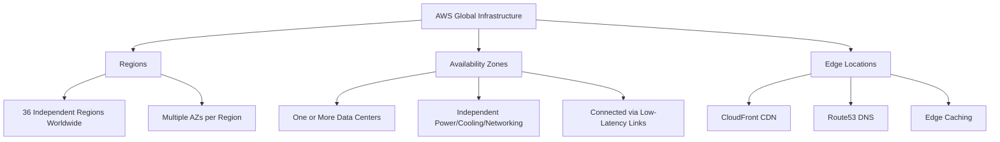
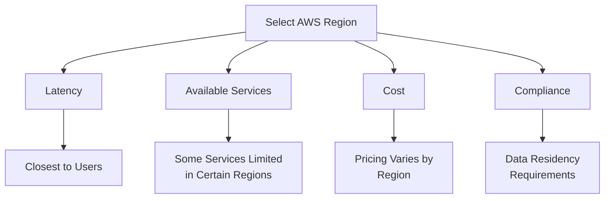
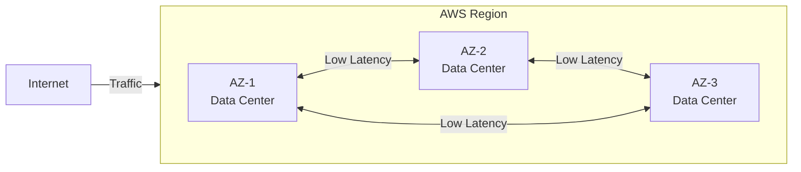
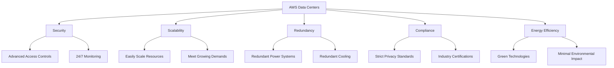
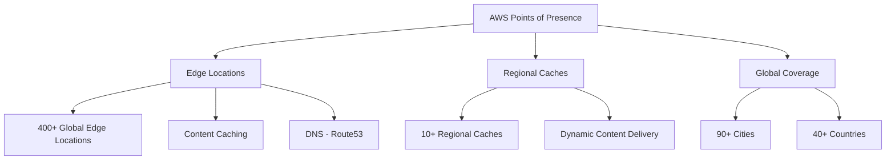
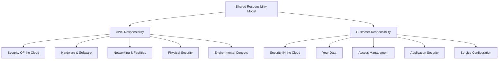
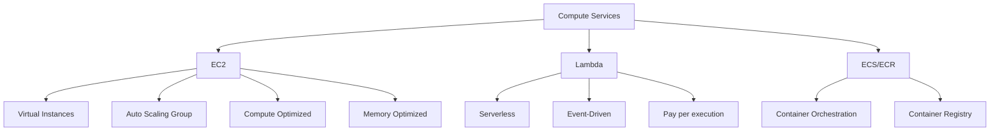
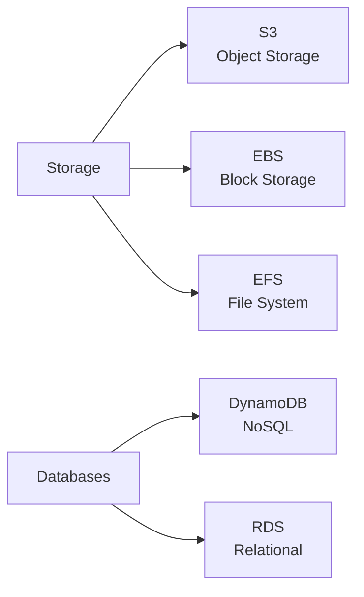
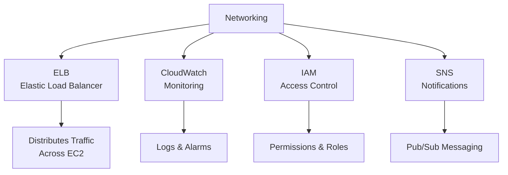
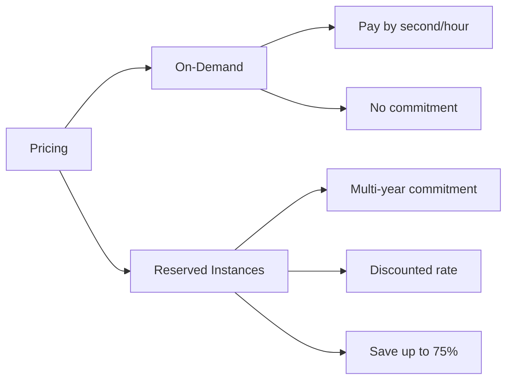

# AWS Global Infrastructure

## The Big Picture

AWS Global Infrastructure is the foundation that enables cloud computing to deliver compute power, storage, and services **anywhere in the world**. Understanding how AWS structures its global network is essential for designing resilient, high-performance applications.

---

## AWS Global Infrastructure Overview

---

## AWS Regions

An **AWS Region** is a geographical area containing multiple Availability Zones.

### Key Facts

| Attribute | Details |
|-----------|---------| 
| **Total Regions** | 36 completely independent regions globally |
| **AZs per Region** | Multiple Availability Zones |
| **Isolation** | Regions are fully isolated from each other |

### Region Selection Criteria

When choosing an AWS Region, consider:

1. **Latency** - Proximity to your users for optimal performance
2. **Available Services** - Some services may not be available in all regions
3. **Cost** - Prices vary between regions
4. **Compliance** - Data residency and regulatory requirements

### Example Regions

| Region Code | Location |
|-------------|----------|
| `us-east-1` | US East (N. Virginia) |
| `eu-west-3` | Europe (Paris) |
| `eu-south-2` | Europe (Spain) |
| `ap-southeast-1` | Asia Pacific (Singapore) |

---

## Availability Zones (AZs)

An **Availability Zone (AZ)** is composed of one or more data centers equipped with **independent power, cooling, and networking** infrastructure to ensure operational resilience.

### AZ Naming Convention

- `eu-south-2a` - First AZ in Spain region
- `eu-south-2b` - Second AZ in Spain region
- `eu-south-2c` - Third AZ in Spain region
- `eu-west-3a` - First AZ in Paris region
- `eu-west-3b` - Second AZ in Paris region
- `eu-west-3c` - Third AZ in Paris region
- `ap-southeast-2a` - First AZ in Sydney region
- `ap-southeast-2b` - Second AZ in Sydney region
- `ap-southeast-2c` - Third AZ in Sydney region

### AZ Count per Region

| Attribute | Details |
|-----------|---------|
| **Typical Count** | 3 AZs per region |
| **Minimum** | 3 AZs |
| **Maximum** | 6 AZs |

### Why AZs Matter

| Feature | Benefit |
|---------|---------|
| **Independent Power** | Failure in one AZ doesn't affect others |
| **Independent Cooling** | Environmental issues contained |
| **Independent Networking** | Network partitions don't cascade |
| **Low-Latency Links** | AZs work together as a unified region |
| **Operational Resilience** | Applications can span multiple AZs |

---

## AWS Data Centers

AWS Data Centers are the physical facilities that house the infrastructure powering AWS services.

### Key Characteristics

| Characteristic | Description |
|----------------|-------------|
| **Security** | Equipped with advanced security measures; access restricted to authorized personnel |
| **Location** | Located worldwide to reduce latency and improve performance |
| **Scalability** | Designed to easily scale resources to meet growing demands |
| **Redundancy** | Built with redundant power and cooling systems to ensure uptime |
| **Compliance** | Adhere to strict compliance standards for data privacy and security |
| **Energy Efficiency** | Utilize green technologies to minimize environmental impact |

---

## AWS Points of Presence

AWS Points of Presence provide low-latency content delivery and edge computing capabilities.

### Key Facts

| Attribute | Details |
|-----------|---------|
| **Total Points of Presence** | 400+ |
| **Edge Locations** | 400+ globally |
| **Regional Caches** | 10+ |
| **Geographic Spread** | 90+ cities in 40+ countries |

### Services Using Points of Presence

| Service | Purpose |
|---------|---------|
| **CloudFront** | Content delivery network (CDN) |
| **Route53** | DNS service |
| **Edge Caching** | Cache frequently accessed content closer to users |

---

## Shared Responsibility Model

The **Shared Responsibility Model** is a security framework where protection of cloud computing resources is shared between **AWS** (security **of** the cloud) and **customers** (security **in** the cloud).

### AWS Responsibility - Security OF the Cloud

| Aspect | Description |
|--------|-------------|
| **Physical Security** | Data centers with restricted access, security guards, CCTV |
| **Environmental Controls** | Power, cooling, fire suppression systems |
| **Infrastructure** | Hardware, software, networking, facilities |
| **Core Services** | EC2, S3, DynamoDB underlying infrastructure |

### Customer Responsibility - Security IN the Cloud

| Aspect | Description |
|--------|-------------|
| **Data** | Encrypting data, managing access to data |
| **Applications** | Application-level security, vulnerability management |
| **Identity Management** | IAM roles, policies, and access controls |
| **Service Configuration** | Security settings for individual services |

### Collaboration

> ⚠️ **Important:** Both AWS and customers must work together to ensure a secure and compliant cloud environment.
>
> There are multiple shared responsibility models that come with each AWS service. Make sure to understand the specific responsibilities for each service you use!

---

## Responsibility by Service Model

### Layer Breakdown

| Layer | On-Premises | Private Cloud | IaaS | PaaS | SaaS |
|-------|-------------|---------------|------|------|------|
| **Data & Access** | You | You | You | You | You |
| **Applications** | You | You | You | You | Provider |
| **Runtime** | You | You | You | Provider | Provider |
| **Operating System** | You | You | You | Provider | Provider |
| **Virtual Machine** | You | Provider | Provider | Provider | Provider |
| **Compute** | You | Provider | Provider | Provider | Provider |
| **Networking** | You | Provider | Provider | Provider | Provider |
| **Storage** | You | Provider | Provider | Provider | Provider |

---

## AWS Services & Architecture Components

### Compute & Containers

| Service | Description | Use Case |
|---------|-------------|----------|
| **EC2** | Elastic Compute Cloud - Virtual servers | General-purpose compute |
| **Lambda** | Serverless compute service | Event-driven functions |
| **ECS** | Elastic Container Service | Container orchestration |
| **ECR** | Elastic Container Registry | Store container images |

### EC2 Instance Types

| Type | Focus | Example Workloads |
|------|-------|-------------------|
| **Compute Optimized** | CPU | ML inference, scientific computing |
| **Memory Optimized** | RAM | In-memory databases, caching |

### Storage & Databases

| Service | Type | Description |
|---------|------|-------------|
| **S3** | Object Storage | Scalable storage with encryption keys |
| **EBS** | Block Storage | Persistent block storage for EC2 (e.g., 50 GB) |
| **EFS** | File System | Managed network file system |
| **DynamoDB** | NoSQL | Managed NoSQL database |
| **RDS** | Relational | Managed relational database service |

### Networking, Management & Security

| Service | Category | Description |
|---------|----------|-------------|
| **ELB** | Networking | Distributes incoming traffic across EC2 instances |
| **IAM** | Security | Manages permissions and identity access |
| **CloudWatch** | Management | Infrastructure monitoring, logs, alarms |
| **SNS** | Messaging | Pub/sub messaging and notifications |

---

## AWS Pricing Options

### On-Demand vs Reserved

| Aspect | On-Demand | Reserved Instances |
|--------|-----------|-------------------|
| **Commitment** | None | 1 or 3 years |
| **Pricing** | Pay per second/hour | Discounted rate |
| **Savings** | Full price | Up to 75% savings |
| **Use Case** | Short-term, variable workloads | Predictable, steady-state workloads |

---

## Key Takeaways

1. **AWS Regions** contain multiple Availability Zones and are completely isolated (36 regions globally)
2. **Availability Zones** provide operational resilience (min 3, max 6 AZs per region)
3. **Points of Presence** - 400+ Edge Locations & 10+ Regional Caches across 90+ cities in 40+ countries
4. **Data Centers** are secured, scalable, redundant, compliant, and energy efficient
5. **Shared Responsibility Model** - AWS handles "Security OF the Cloud", customers handle "Security IN the Cloud"
6. **Service Models** define responsibility layers - as you move to PaaS/SaaS, AWS manages more
7. **EC2** provides virtual servers with various instance types (compute/memory optimized)
8. **Lambda** enables serverless, event-driven computing
9. **Storage Services**: S3 (objects), EBS (block), EFS (file)
10. **Database Services**: DynamoDB (NoSQL), RDS (relational)
11. **Networking**: ELB distributes traffic, IAM manages access
12. **Monitoring**: CloudWatch for logs, alarms, and performance
13. **Pricing**: On-Demand (flexible) vs Reserved (discounted commitment)

---

## Next Steps

⬅️ Previous: [Cloud Models & Pricing](./02-cloud-models-and-pricing.md) | ➡️ Next: [Cloud Adoption Framework](./04-cloud-adoption-framework.md)

---

*Part of the [AWS Cloud Practitioner Study Notes](../README.md).*
