# Amazon EC2 - Elastic Compute Cloud

> ⏱️ **Estimated Study Time:** 25 minutes  
> 🎯 **CCP Exam Weight:** ~15-20% (Domain 3: Cloud Technology & Services)

---

## The Big Picture

**Amazon EC2 (Elastic Compute Cloud)** is AWS's flagship compute service, providing **virtual servers** in the cloud. It's an Infrastructure as a Service (IaaS) offering that allows you to rent virtual machines (instances) to run your applications. EC2 is the foundation of most AWS architectures and is heavily tested on the CCP exam.

---

## EC2 at a Glance

| Attribute | Detail |
|-----------|--------|
| **Full Name** | Elastic Compute Cloud |
| **Category** | Infrastructure as a Service (IaaS) |
| **Launch Year** | 2008 |
| **Use Case** | Virtual servers in the cloud |
| **Pricing** | Pay only for what you use |
| **OS Support** | Linux, Windows, macOS |

---

## EC2 Core Capabilities

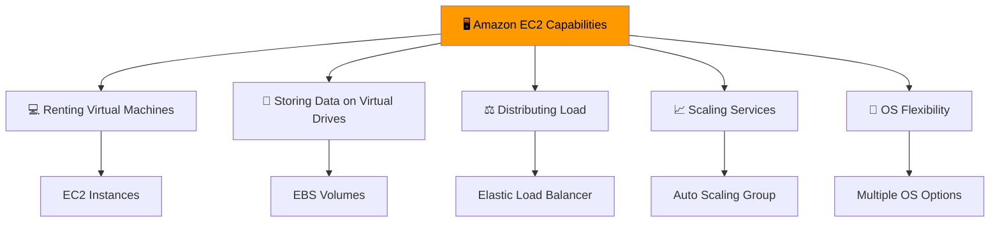

### Detailed Capabilities

| Capability | AWS Service | Description |
|------------|-------------|-------------|
| **Renting Virtual Machines** | EC2 | Run virtual servers in the cloud |
| **Storing Data** | EBS | Persistent block storage for EC2 |
| **Distributing Load** | ELB | Distribute traffic across multiple instances |
| **Scaling Services** | ASG | Automatically adjust capacity based on demand |
| **OS Flexibility** | Multiple AMIs | Choose Linux, Windows, or custom OS |

---

## EC2 Instance Types

### 6 Instance Categories

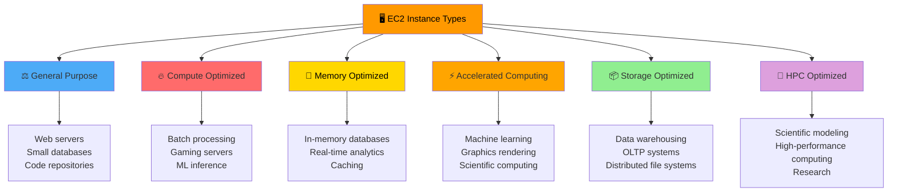

### Instance Type Details

| Type | Best For | Key Characteristic | Example Series |
|------|----------|-------------------|----------------|
| **General Purpose** | Diverse workloads | Balance of compute, memory, networking | T3, T4g, M5, M6i |
| **Compute Optimized** | CPU-intensive tasks | High-performance processors | C5, C6i, C7g |
| **Memory Optimized** | Large datasets in memory | High memory-to-CPU ratio | R5, R6i, X2idn |
| **Accelerated Computing** | GPU workloads | Hardware accelerators (GPU/FPGA) | P4, G5, DL1 |
| **Storage Optimized** | Storage-intensive tasks | High sequential I/O performance | I3, I4i, D2 |
| **HPC Optimized** | Maximum compute power | Highest performance, lowest latency | Hpc6id, Hpc7g |

---

## EC2 Naming Convention

**Format:** `<class><generation>.<size>`

**Example:** `m5.2xlarge`

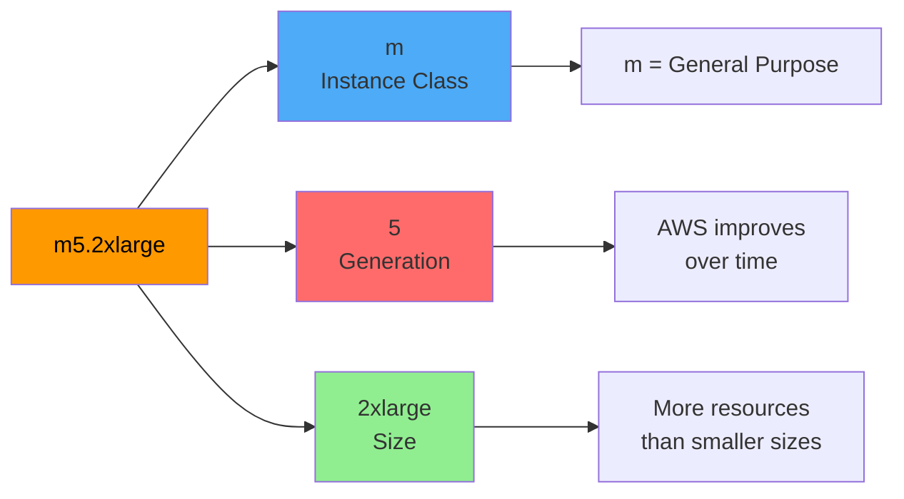

### Naming Breakdown

| Component | Example | Meaning |
|-----------|---------|---------|
| **Instance Class** | `m` | Type (General Purpose, Compute, Memory, etc.) |
| **Generation** | `5` | Version - newer generations are more powerful and cost-effective |
| **Size** | `2xlarge` | Resources within the class (nano, micro, small, medium, large, xlarge, 2xlarge, etc.) |

### Size Scale Example (General Purpose - m5 family)

| Size | vCPUs | RAM (GB) | Use Case |
|------|-------|----------|----------|
| `nano` | 2 | 0.5 | Minimal workloads |
| `micro` | 2 | 1 | Low-traffic sites |
| `small` | 2 | 2 | Small applications |
| `medium` | 2 | 4 | Web servers |
| `large` | 2 | 8 | Medium applications |
| `xlarge` | 4 | 16 | Large applications |
| `2xlarge` | 8 | 32 | High-performance apps |
| `4xlarge` | 16 | 64 | Enterprise workloads |

> 🎯 **Exam Tip:** Know that `m5.2xlarge` = General Purpose, 5th generation, 2xlarge size. The first letter indicates the family, the number is the generation.

---

## Right Sizing Strategy

**Definition:** Matching instance types and sizes to workload requirements for optimal performance and cost.

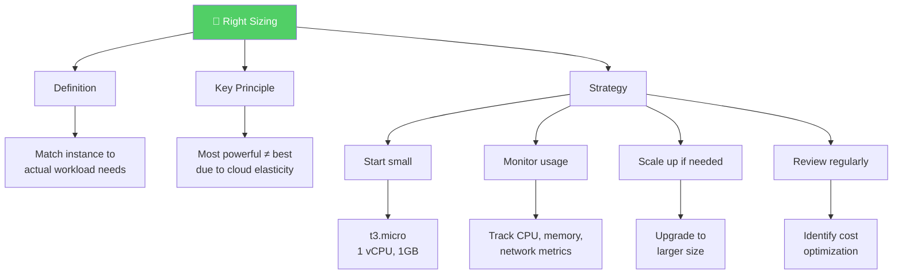

### Right Sizing Process

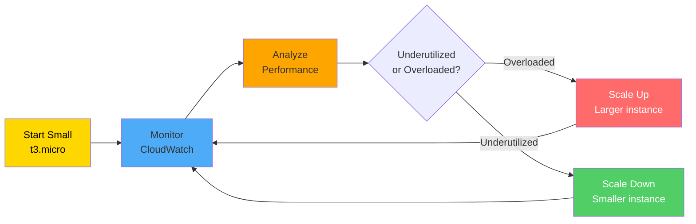

### Right Sizing Tools

| Tool | Purpose |
|------|---------|
| **CloudWatch** | Monitor performance metrics (CPU, memory, network) |
| **Cost Explorer** | Analyze spending patterns and identify savings |
| **Trusted Advisor** | AWS optimization recommendations |
| **AWS Compute Optimizer** | ML-powered right-sizing recommendations |

---

## User Data Scripts

**Definition:** Scripts that run **once** during the first boot of an EC2 instance, used for bootstrapping and automation.

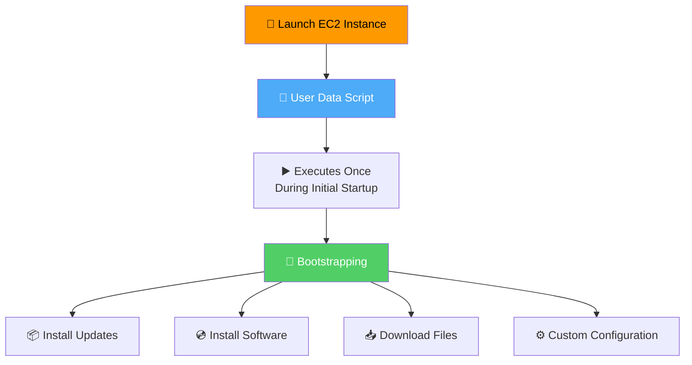

### Common Use Cases

| Task | Example |
|------|---------|
| **Install Updates** | `yum update -y` |
| **Install Web Server** | `yum install -y httpd` |
| **Download Files** | `aws s3 cp s3://bucket/file .` |
| **Start Services** | `systemctl start httpd` |
| **Configure App** | Custom configuration scripts |

### Example: Web Server Setup

```bash
#!/bin/bash
# User Data Script Example
yum update -y
yum install -y httpd
systemctl start httpd
systemctl enable httpd
echo "<h1>Hello from EC2!</h1>" > /var/www/html/index.html
```

> 🎯 **Exam Tip:** User Data scripts run **only once** at first launch. To re-run, you need to create a new instance or update the AMI.

---

## EC2 Purchasing Options (7 Options)

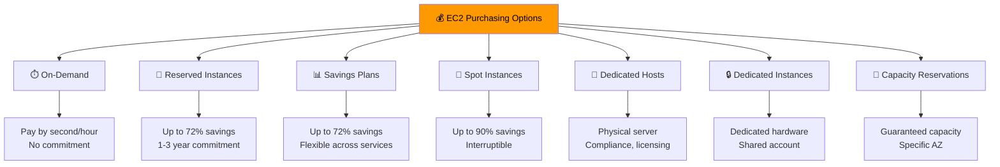

### Detailed Comparison

| Option | Discount | Commitment | Interruptible | Best For |
|--------|----------|------------|----------------|----------|
| **On-Demand** | 0% | None | No | Unpredictable workloads, dev/test |
| **Reserved Instances** | Up to 72% | 1-3 years | No | Steady-state workloads |
| **Savings Plans** | Up to 72% | 1-3 years | No | Flexible usage across EC2, Lambda, Fargate |
| **Spot Instances** | Up to 90% | None | Yes (2-min notice) | Fault-tolerant, flexible workloads |
| **Dedicated Hosts** | None | On-demand/reserved | No | Compliance, BYOL (bring your own license) |
| **Dedicated Instances** | None | Per instance | No | Hardware isolation |
| **Capacity Reservations** | Variable | None/Specific | No | Guaranteed capacity in specific AZ |

### Purchasing Options Decision Tree

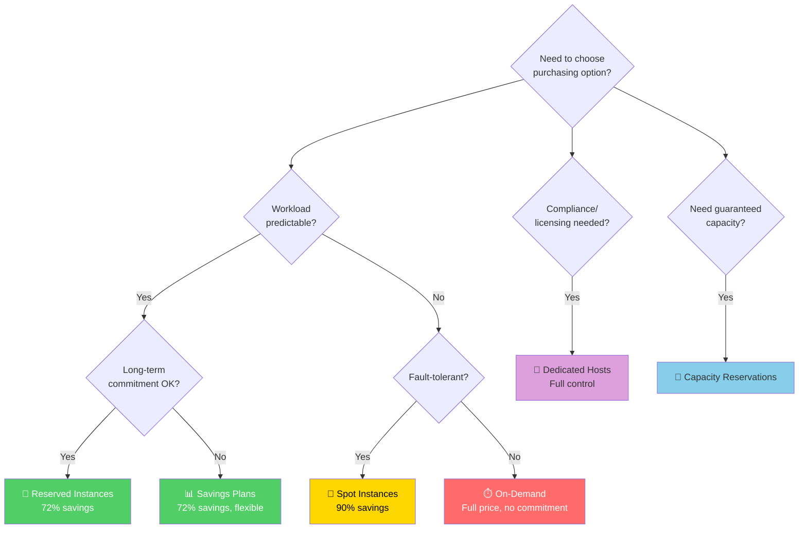

### Reserved Instance Attributes

When you reserve an instance, you specify:
- **Instance Type** (e.g., m5.large)
- **Region** (e.g., us-east-1)
- **Tenancy** (shared or dedicated)
- **OS** (Linux, Windows)

> 🎯 **Exam Tip:** Spot Instances can be interrupted with **2-minute notice**. Use them for fault-tolerant workloads only.

### Combined Approach Example

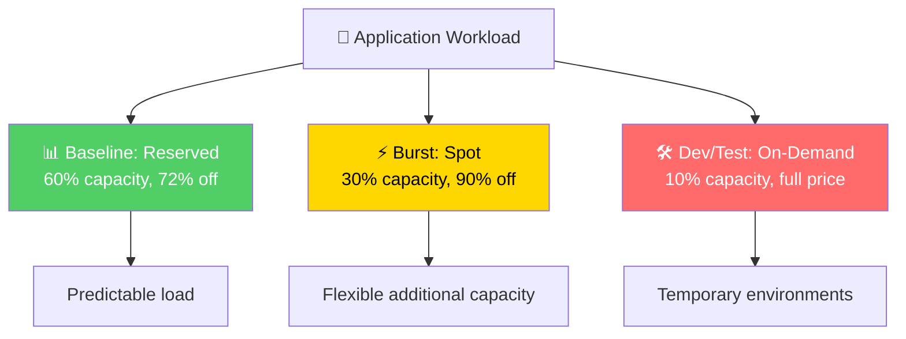

---

## EC2 Instance Lifecycle

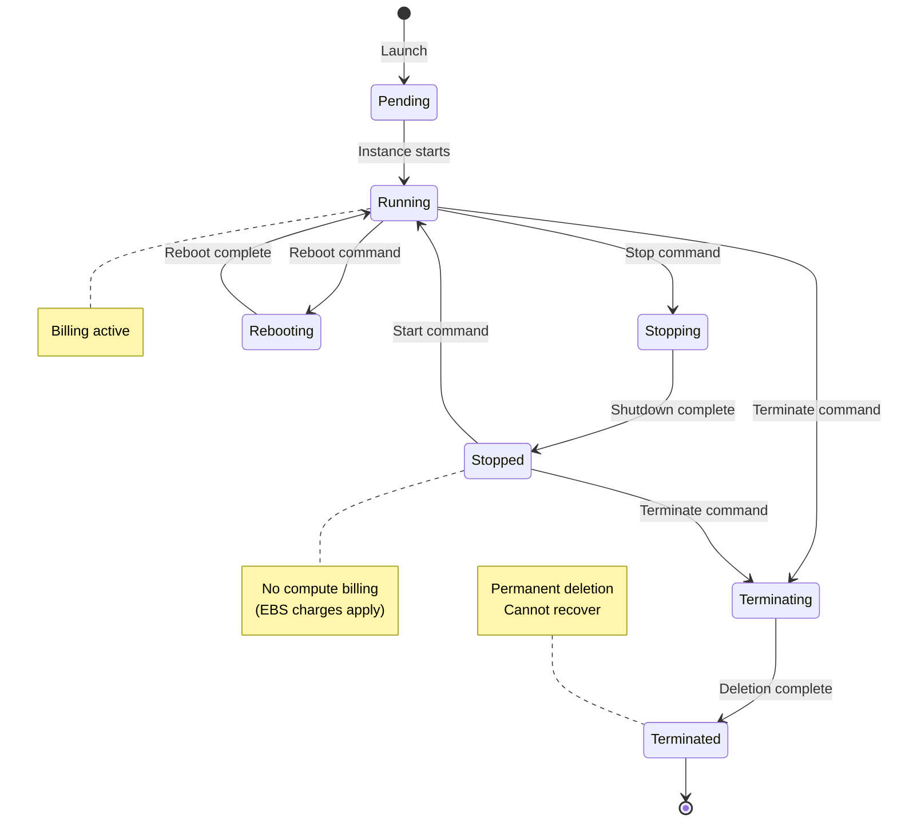

### Lifecycle States

| State | Description | Billing |
|-------|-------------|---------|
| **Pending** | Instance is being launched | No |
| **Running** | Instance is active and operational | Yes |
| **Stopping** | Instance is shutting down | Yes |
| **Stopped** | Instance is shut down | No compute (EBS charges apply) |
| **Rebooting** | Instance is restarting | Yes |
| **Terminating** | Instance is being deleted | Yes |
| **Terminated** | Instance is permanently deleted | No |

---

## EC2 Related Services

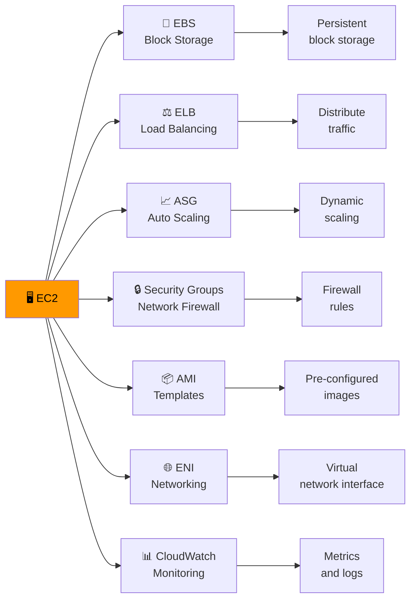

---

## EC2 vs Traditional Servers

```mermaid
graph LR
    subgraph Traditional["🏢 Traditional Servers"]
        T1[Physical Hardware]
        T2[Weeks to procure]
        T3[Fixed capacity]
        T4[Manual scaling]
        T5[High upfront cost]
        T6[Your maintenance]
    end
    
    subgraph EC2["☁️ Amazon EC2"]
        E1[Virtual Hardware]
        E2[Minutes to launch]
        E3[Elastic capacity]
        E4[Auto scaling]
        E5[Pay-as-you-go]
        E6[AWS managed]
    end
    
    Traditional -.->|Cloud Migration| EC2
    
    style Traditional fill:#FFE6E6
    style EC2 fill:#E6F7E6
```

### Comparison Table

| Aspect | Traditional Servers | Amazon EC2 |
|--------|--------------------|-----------|
| **Procurement** | Weeks to months | Minutes |
| **Capacity** | Fixed | Elastic |
| **Scaling** | Manual, time-consuming | Automated, instant |
| **Cost Model** | High upfront (CapEx) | Pay-as-you-go (OpEx) |
| **Maintenance** | Customer managed | AWS managed infrastructure |
| **Geographic Reach** | Limited | Global (36+ Regions) |
| **Availability** | Single location | Multi-AZ, Multi-Region |

---

## Instance Selection Decision Flow

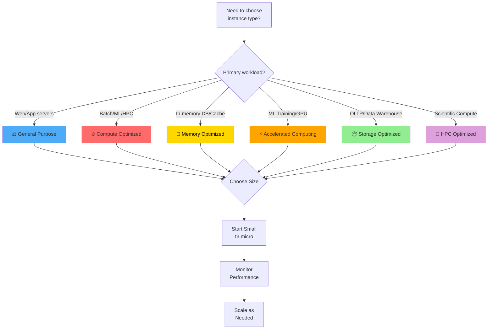

---

## Quick Reference

| Concept | Key Point |
|---------|-----------|
| **EC2** | Elastic Compute Cloud - virtual servers (IaaS) |
| **Instance Types** | 6 categories: General, Compute, Memory, Accelerated, Storage, HPC |
| **Naming** | `<class><generation>.<size>` (e.g., m5.2xlarge) |
| **Right Sizing** | Start small, monitor, scale as needed |
| **User Data** | Scripts run once at first launch |
| **Purchasing** | 7 options: On-Demand, Reserved, Savings Plans, Spot, Dedicated Hosts/Instances, Capacity Reservations |
| **Lifecycle** | Pending → Running → Stopped/Terminated |
| **Related Services** | EBS, ELB, ASG, Security Groups, AMI |

---

## 📝 Knowledge Check

<details>
<summary><strong>Q1: What does the "m" in "m5.2xlarge" indicate?</strong></summary>

**A.** Memory optimized  
**B.** General purpose instance class  
**C.** Multi-threaded processor  
**D.** Medium pricing tier  

**Answer: B** — The "m" indicates the instance class. In AWS naming convention, "m" stands for General Purpose instances. The "5" is the generation, and "2xlarge" is the size.
</details>

<details>
<summary><strong>Q2: Which EC2 purchasing option offers up to 90% savings but can be interrupted with 2-minute notice?</strong></summary>

**A.** On-Demand Instances  
**B.** Reserved Instances  
**C.** Spot Instances  
**D.** Dedicated Hosts  

**Answer: C** — Spot Instances offer up to 90% savings compared to On-Demand pricing, but AWS can interrupt them with a 2-minute notice when it needs the capacity back. Use them for fault-tolerant workloads.
</details>

<details>
<summary><strong>Q3: When does an EC2 User Data script execute?</strong></summary>

**A.** Every time the instance reboots  
**B.** Once during the initial launch  
**C.** Continuously in the background  
**D.** Only when manually triggered  

**Answer: B** — User Data scripts execute once during the initial launch of an EC2 instance. They're used for bootstrapping tasks like installing software, downloading files, or configuring the environment.
</details>

<details>
<summary><strong>Q4: Which instance type should you choose for an in-memory database?</strong></summary>

**A.** General Purpose  
**B.** Compute Optimized  
**C.** Memory Optimized  
**D.** Storage Optimized  

**Answer: C** — Memory Optimized instances have a high memory-to-CPU ratio, making them ideal for in-memory databases, real-time analytics, and caching workloads.
</details>

---

## Navigation

⬅️ Previous: [AWS Data Centers](../02-aws-infrastructure/03-data-centers.md) | ➡️ Next: [Storage Services](./02-storage.md)  
🏠 [Back to README](../../README.md)

---

*Part of the [AWS Cloud Practitioner Study Notes](../../README.md).*