# AWS Storage Services

> ⏱️ **Estimated Study Time:** 20 minutes  
> 🎯 **CCP Exam Weight:** ~10% (Domain 3: Cloud Technology & Services)

---

## The Big Picture

AWS offers **multiple storage services** optimized for different use cases — from object storage to block storage to file systems. Understanding when to use each service is critical for designing efficient, cost-effective applications and is frequently tested on the CCP exam.

---

## Storage Service Categories

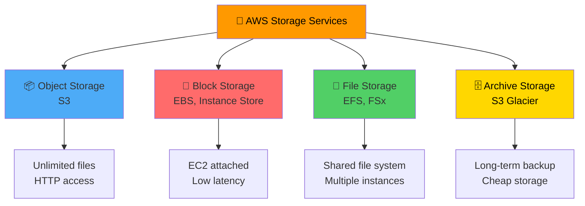

---

## Storage Service Overview

| Service | Type | Use Case | Access Pattern |
|---------|------|----------|----------------|
| **Amazon S3** | Object Storage | Websites, backups, data lakes, static content | HTTP/HTTPS API |
| **Amazon EBS** | Block Storage | EC2 boot volumes, databases | Attached to EC2 |
| **Instance Store** | Block Storage | Temporary, high-performance storage | Attached to EC2 |
| **Amazon EFS** | File Storage | Shared file system for Linux | NFS protocol |
| **Amazon FSx** | File Storage | Windows file servers, HPC | SMB, Lustre |
| **S3 Glacier** | Archive Storage | Long-term backup, compliance | Retrieval API |

---

## 1. Amazon S3 (Simple Storage Service)

**Definition:** Object storage service offering **unlimited capacity**, **11 9s of durability** (99.999999999%), and HTTP-based access.

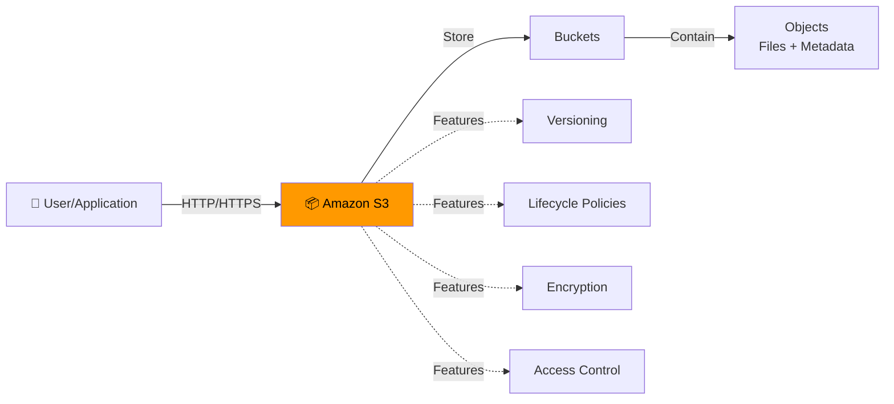

### S3 Key Characteristics

| Attribute | Detail |
|-----------|--------|
| **Type** | Object storage |
| **Max Object Size** | 5 TB per object |
| **Durability** | 99.999999999% (11 9s) |
| **Availability** | 99.99% |
| **Access** | HTTP/HTTPS API |
| **Pricing** | Pay for storage used + requests |
| **Use Cases** | Websites, backups, data lakes, static content, big data analytics |

### S3 Storage Classes

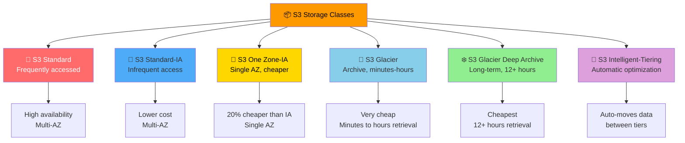

### S3 Use Cases

| Use Case | Storage Class |
|----------|---------------|
| **Website assets** | S3 Standard |
| **Disaster recovery backups** | S3 Standard-IA or Glacier |
| **Data analytics** | S3 Standard |
| **Compliance archives** | S3 Glacier Deep Archive |
| **Unknown access patterns** | S3 Intelligent-Tiering |

> 🎯 **Exam Tip:** S3 provides **11 9s of durability** — your data is safe even if 2 facilities are destroyed simultaneously.

---

## 2. Amazon EBS (Elastic Block Store)

**Definition:** Persistent **block storage** volumes that attach to EC2 instances, providing low-latency storage for operating systems, databases, and applications.

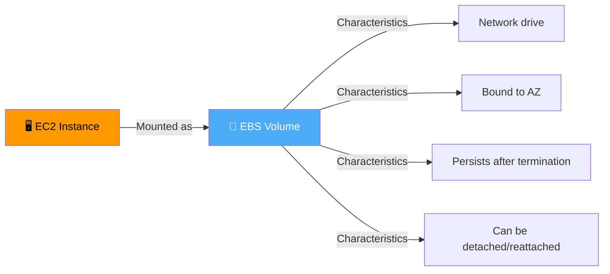

### EBS Key Characteristics

| Attribute | Detail |
|-----------|--------|
| **Type** | Block storage (network drive) |
| **Attachment** | One EC2 instance at a time (CCP level) |
| **AZ Binding** | Locked to specific Availability Zone |
| **Latency** | Low (microseconds) |
| **Persistence** | Data survives instance termination |
| **Billing** | Provisioned capacity (GB and IOPS) |

### EBS Volume Types

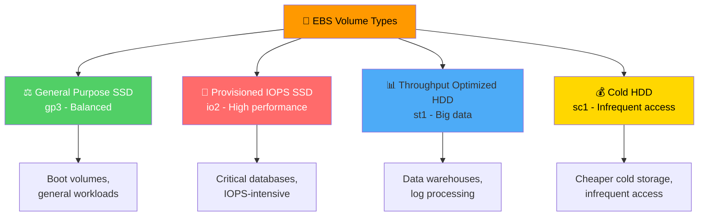

### AZ Binding Constraint

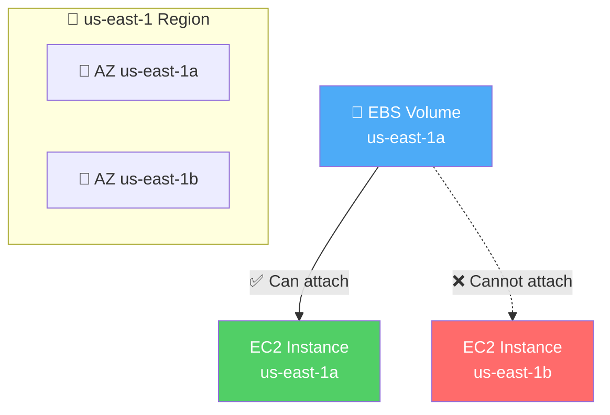

> 🎯 **Exam Tip:** EBS volumes are **locked to one AZ**. To move across AZs, you must create a snapshot and restore it in the target AZ.

### Moving EBS Volumes Across AZs

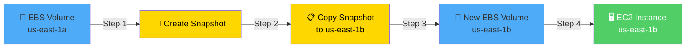

### EBS Snapshots

**Definition:** Point-in-time backup of an EBS volume stored in S3.

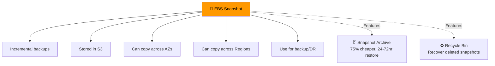

### Snapshot Archive & Recycle Bin

| Feature | Purpose | Benefit |
|---------|---------|---------|
| **Snapshot Archive** | Long-term, infrequent access | 75% cheaper storage, 24-72 hour restore time |
| **Recycle Bin** | Recover from accidental deletion | 1 day to 1 year retention |

### Delete on Termination

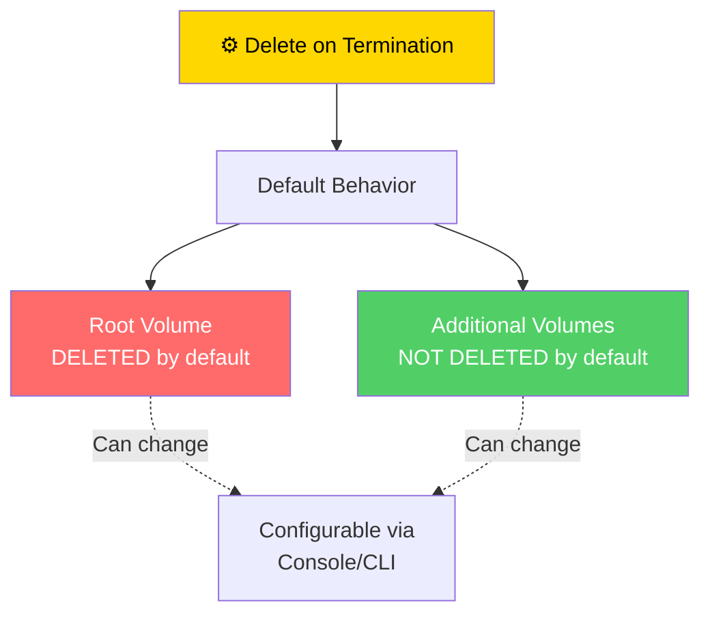

---

## 3. Instance Store

**Definition:** **Temporary block storage** physically attached to the host machine. Provides highest I/O performance but data is lost when instance stops.

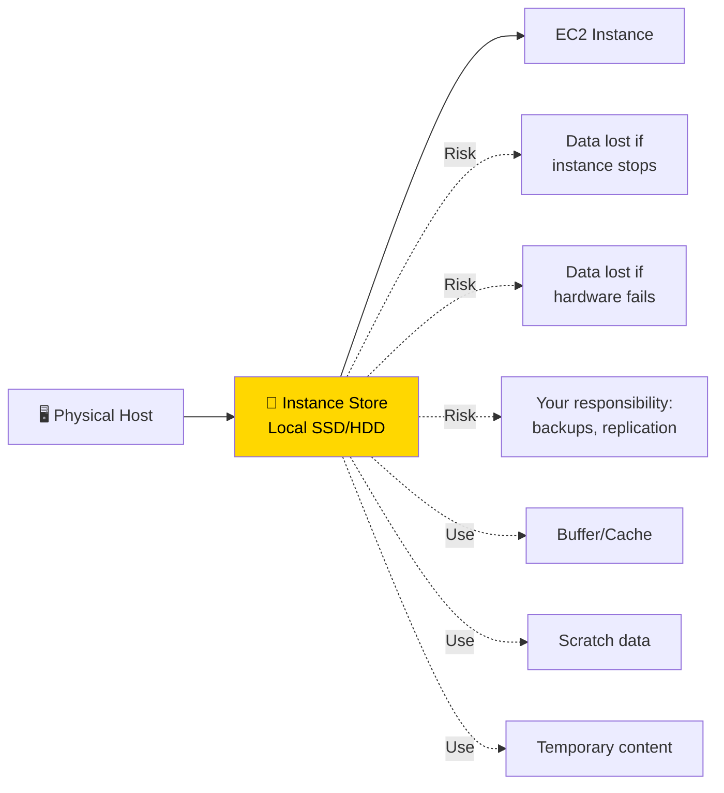

### Instance Store vs EBS

| Feature | Instance Store | EBS |
|---------|---------------|-----|
| **Performance** | Very high I/O | Good (network latency) |
| **Persistence** | Lost on stop/termination | Persists after termination |
| **Type** | Hardware-attached | Network drive |
| **Backups** | Your responsibility | Snapshots |
| **Use Case** | Buffer, cache, scratch | Persistent data, databases |

> 🎯 **Exam Tip:** Instance Store is **ephemeral** — data is lost when the instance stops. Use only for temporary data.

---

## 4. Amazon EFS (Elastic File System)

**Definition:** Managed **Network File System (NFS)** for Linux instances. Provides shared file storage that can be mounted on hundreds of EC2 instances simultaneously.

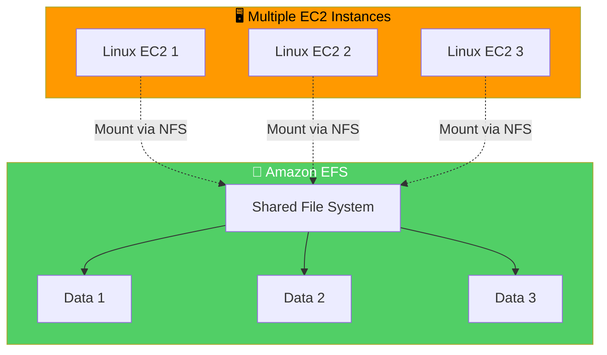

### EFS Key Characteristics

| Attribute | Detail |
|-----------|--------|
| **Type** | Managed NFS (Network File System) |
| **OS Support** | Linux only |
| **Mounting** | Hundreds of EC2 instances |
| **Availability** | Multi-AZ by default |
| **Scaling** | Automatic, no capacity planning |
| **Pricing** | Pay per use (more expensive than EBS) |
| **Cost** | ~3x gp2 EBS price |

### EFS Infrequent Access (EFS-IA)

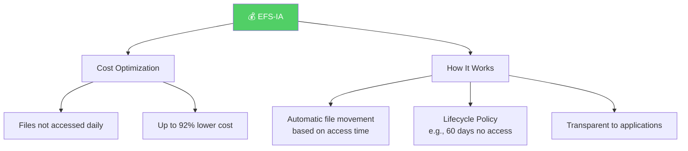

---

## 5. Amazon FSx

**Definition:** Managed file storage for **Windows** and **HPC workloads**. Provides fully managed Windows file servers and high-performance Lustre file systems.

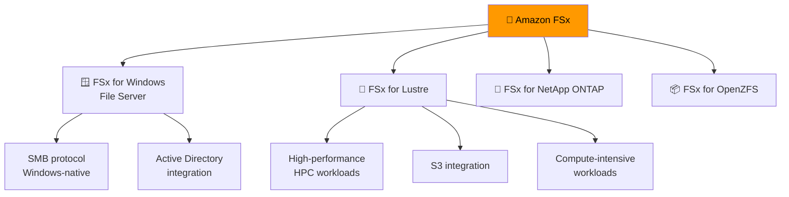

### FSx Options Comparison

| Option | Protocol | Use Case | Performance |
|--------|----------|----------|-------------|
| **FSx for Windows** | SMB | Windows-native file systems, Active Directory | High |
| **FSx for Lustre** | Lustre | HPC, ML, compute-intensive workloads | Very high |
| **FSx for ONTAP** | NFS/SMB | NetApp features, snapshots, replication | High |
| **FSx for OpenZFS** | NFS | ZFS features, snapshots, compression | High |

---

## Storage Decision Matrix

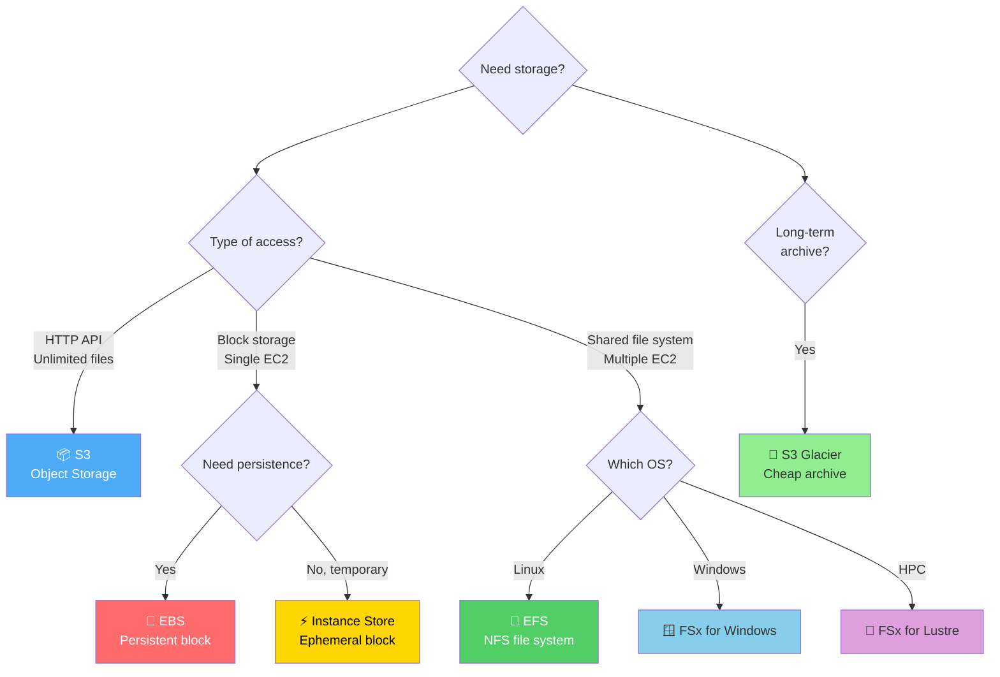

### Storage Selection Guide

| Need | Best Choice | Reason |
|------|-------------|--------|
| **Static website assets** | S3 | Object storage, HTTP access, cheap |
| **EC2 boot volume** | EBS | Persistent block storage |
| **Shared file system (Linux)** | EFS | NFS, multi-AZ, scales automatically |
| **Windows file server** | FSx for Windows | SMB protocol, AD integration |
| **HPC workloads** | FSx for Lustre | High-performance, S3 integration |
| **Temporary high-speed storage** | Instance Store | Fastest I/O, ephemeral |
| **Long-term backup** | S3 Glacier | Cheapest storage, compliance |
| **Database storage** | EBS | Low latency, persistent |

---

## Amazon Machine Image (AMI)

**Definition:** Template containing **OS, application server, and applications** needed to launch an EC2 instance.

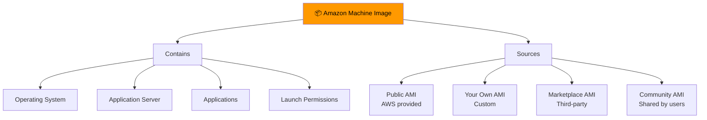

### AMI Sources Comparison

| Source | Description | Verified | Cost |
|--------|-------------|----------|------|
| **Public AMI** | AWS-provided | ✅ Yes | Free |
| **Your Own AMI** | You create and maintain | ✅ You verify | Free |
| **Marketplace AMI** | Third-party, possibly paid | ✅ AWS verifies | Varies |
| **Community AMI** | Shared by AWS users | ❌ Not verified | Free (use caution) |

### Creating a Custom AMI

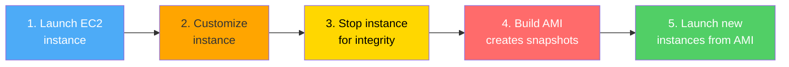

### EC2 Image Builder

**Definition:** Fully managed service that **automates** the creation, patching, and testing of AMIs.

**Benefits:**
- Scheduled execution (weekly or on package updates)
- Automated testing and validation
- Free service (pay only for underlying resources)

---

## Quick Reference

| Service | Type | Best For | Key Feature |
|---------|------|----------|-------------|
| **S3** | Object | Websites, backups, data lakes | 11 9s durability, unlimited capacity |
| **EBS** | Block | EC2 boot volumes, databases | Persistent, low latency, AZ-bound |
| **Instance Store** | Block | Temporary, high-speed | Fastest I/O, ephemeral |
| **EFS** | File | Shared Linux file system | Multi-AZ, NFS, auto-scaling |
| **FSx** | File | Windows, HPC | SMB, Lustre, high performance |
| **Glacier** | Archive | Long-term backup | Cheapest storage |

---

## 📝 Knowledge Check

<strong>Q1: Which storage service provides object storage with HTTP-based access?</strong>

**A.** Amazon EBS  
**B.** Amazon S3  
**C.** Amazon EFS  
**D.** Instance Store  

**Answer: B** — Amazon S3 is object storage accessed via HTTP/HTTPS API. It's ideal for websites, backups, data lakes, and static content.

<strong>Q2: What is the main constraint of EBS volumes?</strong>

**A.** Limited storage capacity  
**B.** Locked to a specific Availability Zone  
**C.** Cannot be backed up  
**D.** Only works with Linux  

**Answer: B** — EBS volumes are locked to the Availability Zone in which they were created. To move an EBS volume to a different AZ, you must create a snapshot and restore it in the target AZ.

<strong>Q3: Which storage service should you use for a shared file system across multiple Linux EC2 instances?</strong>

**A.** Amazon S3  
**B.** Amazon EBS  
**C.** Amazon EFS  
**D.** Instance Store  

**Answer: C** — Amazon EFS provides a managed NFS file system that can be mounted on hundreds of Linux EC2 instances simultaneously. It supports multi-AZ access and scales automatically.

<strong>Q4: What happens to data in an Instance Store when an EC2 instance stops?</strong>

**A.** Data is automatically backed up  
**B.** Data is lost  
**C.** Data is moved to S3  
**D.** Data is encrypted  

**Answer: B** — Instance Store provides temporary, ephemeral storage. Data is lost when the instance stops, terminates, or if the underlying hardware fails. Use it only for temporary data like buffers or caches.

---

## Navigation

⬅️ Previous: [Amazon EC2](./01-compute-ec2.md) | ➡️ Next: [Networking](./03-networking.md)  
🏠 [Back to README](../../README.md)

---

*Part of the [AWS Cloud Practitioner Study Notes](../../README.md).*