# AWS Networking Services

> ⏱️ **Estimated Study Time:** 18 minutes  
> 🎯 **CCP Exam Weight:** ~10% (Domain 3: Cloud Technology & Services)

---

## The Big Picture

AWS provides a comprehensive suite of **networking services** that enable secure, scalable, and high-performance communication between resources and end users. Understanding VPC, Route 53, CloudFront, and Direct Connect is essential for designing cloud architectures.

---

## AWS Networking Services Overview

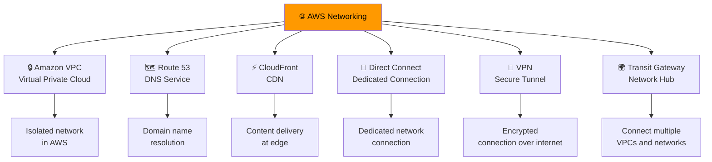

---

## 1. Amazon VPC (Virtual Private Cloud)

**Definition:** Your **logically isolated virtual network** in AWS where you launch AWS resources. You have complete control over the network environment.

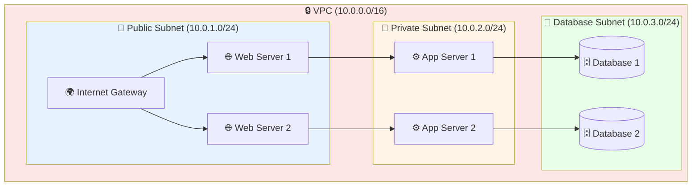

### VPC Components

| Component | Purpose |
|-----------|---------|
| **Subnets** | Logical subdivisions of VPC (public or private) |
| **Route Tables** | Control traffic flow between subnets and gateways |
| **Internet Gateway** | Enables internet access for public subnets |
| **NAT Gateway** | Allows private subnets to access internet (outbound only) |
| **Security Groups** | Instance-level firewall (stateful) |
| **Network ACLs** | Subnet-level firewall (stateless) |
| **VPC Peering** | Connect two VPCs privately |

### Public vs Private Subnets

| Feature | Public Subnet | Private Subnet |
|---------|--------------|----------------|
| **Internet Access** | Direct (via Internet Gateway) | Outbound only (via NAT) |
| **Public IP** | Required for inbound | Not required |
| **Use Case** | Web servers, load balancers | Databases, backend servers |
| **Route to IGW** | Yes | No (except via NAT) |

### Security Groups vs Network ACLs

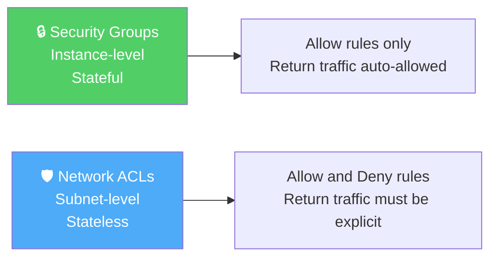

| Feature | Security Groups | Network ACLs |
|---------|----------------|--------------|
| **Level** | Instance | Subnet |
| **State** | Stateful | Stateless |
| **Rules** | Allow only | Allow and Deny |
| **Default** | Deny inbound, allow outbound | Allow all (default NACL) |
| **Association** | Multiple instances | One per subnet |

---

## 2. Route 53 (DNS Service)

**Definition:** AWS's **scalable DNS (Domain Name System)** web service that routes user requests to AWS infrastructure or external endpoints.

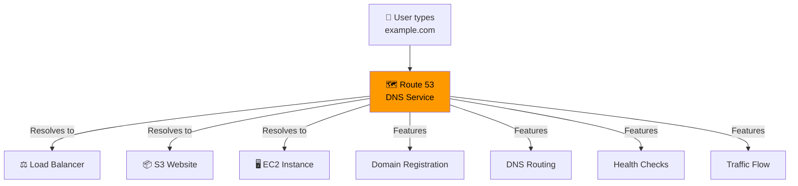

### Route 53 Routing Policies

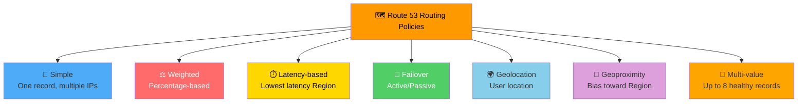

### Routing Policy Use Cases

| Policy | Use Case |
|--------|----------|
| **Simple** | Single resource, no special routing |
| **Weighted** | A/B testing, gradual migration (10% to new, 90% to old) |
| **Latency** | Route users to lowest-latency Region |
| **Failover** | Active-passive disaster recovery |
| **Geolocation** | Localized content based on user location |
| **Multi-Value** | Return up to 8 healthy records for load balancing |

### Health Checks

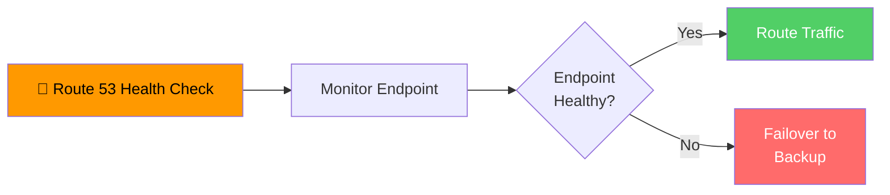

> 🎯 **Exam Tip:** Route 53 is named after **Port 53**, the DNS port. It's AWS's DNS service that also supports domain registration.

---

## 3. CloudFront (CDN)

**Definition:** **Content Delivery Network (CDN)** that delivers content (websites, videos, APIs) from **400+ edge locations** worldwide with low latency.

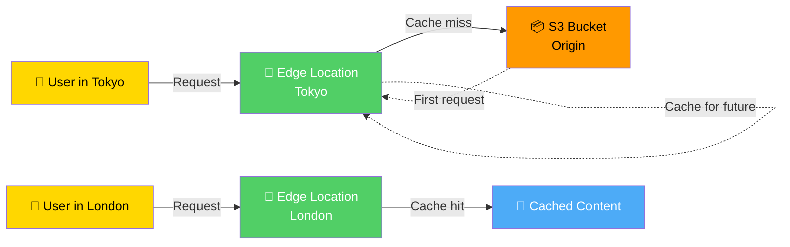

### CloudFront Features

| Feature | Description |
|---------|-------------|
| **Edge Locations** | 400+ globally for low latency |
| **Caching** | Content cached at edge for fast delivery |
| **HTTPS** | Secure content delivery |
| **Geo-restriction** | Restrict content by geographic location |
| **Signed URLs** | Time-limited access to private content |
| **Lambda@Edge** | Run code at edge locations |
| **Origin Shield** | Additional caching layer to reduce origin load |

### CloudFront Origins

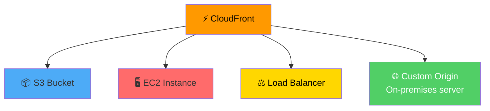

> 🎯 **Exam Tip:** CloudFront integrates seamlessly with S3 for static content delivery. Use **Origin Access Identity (OAI)** to securely serve private S3 content via CloudFront.

---

## 4. Direct Connect

**Definition:** Dedicated **private network connection** between your datacenter and AWS, bypassing the public internet.

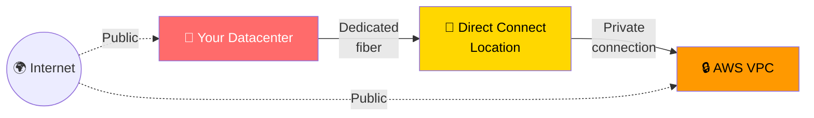

### Direct Connect Benefits

| Benefit | Description |
|---------|-------------|
| **Reduced Bandwidth Costs** | Predictable pricing vs internet egress |
| **Consistent Performance** | Dedicated connection, not shared |
| **Enhanced Security** | Private connection, no internet traversal |
| **Lower Latency** | Direct path to AWS |
| **Higher Throughput** | 1 Gbps, 10 Gbps, or 100 Gbps options |

### Direct Connect vs VPN

| Feature | Direct Connect | Site-to-Site VPN |
|---------|---------------|------------------|
| **Connection** | Dedicated fiber | Encrypted over internet |
| **Setup Time** | Weeks to months | Minutes |
| **Bandwidth** | 1-100 Gbps | Up to 1.25 Gbps per tunnel |
| **Latency** | Consistent | Variable |
| **Cost** | Higher upfront, lower per-GB | Lower upfront, higher per-GB |
| **Best For** | High throughput, consistent performance | Quick setup, low to moderate bandwidth |

---

## 5. Site-to-Site VPN

**Definition:** **Encrypted IPsec tunnel** over the public internet connecting your on-premises network to your VPC.

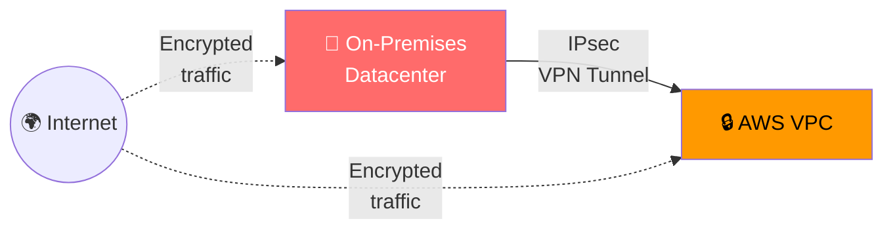

### VPN Use Cases

- **Quick connectivity** without waiting for Direct Connect
- **Backup** for Direct Connect (redundancy)
- **Low to moderate bandwidth** requirements
- **Temporary connections** during migration

---

## 6. Transit Gateway

**Definition:** **Network transit hub** that connects multiple VPCs and on-premises networks through a single gateway.

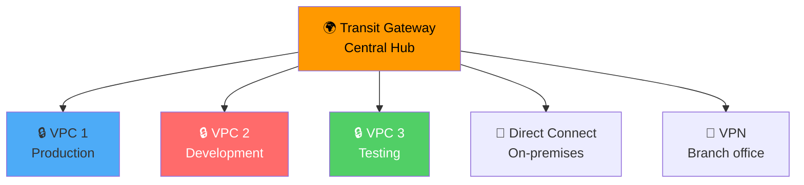

### Transit Gateway Benefits

| Benefit | Description |
|---------|-------------|
| **Simplified Network** | Connect many VPCs through one hub |
| **Scalable** | Supports thousands of VPCs |
| **Centralized Routing** | Single point of routing control |
| **Cross-Region Peering** | Connect VPCs across Regions |
| **Cost-Effective** | Reduces VPC peering complexity |

---

## Load Balancer Overview

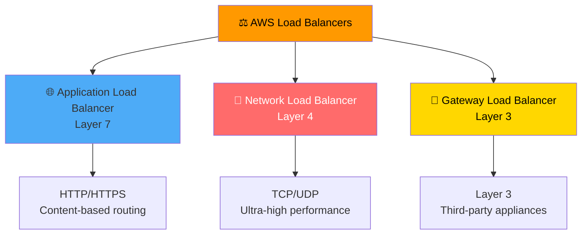

### Load Balancer Comparison

| Feature | ALB | NLB | GWLB |
|---------|-----|-----|------|
| **Layer** | 7 (Application) | 4 (Transport) | 3 (Network) |
| **Protocol** | HTTP/HTTPS | TCP, UDP, TLS | IP |
| **Use Case** | Web apps, microservices | Gaming, IoT, real-time | Network appliances, firewalls |
| **Performance** | High | Very high (millions of req/sec) | High |
| **Static IP** | No | Yes | Yes |
| **Content Routing** | Yes (path, host, headers) | No | No |

> 🎯 **Exam Tip:** Choose **ALB for HTTP/HTTPS web applications**, **NLB for extreme performance/TCP**, and **GWLB for third-party network appliances**.

---

## Networking Decision Flowchart

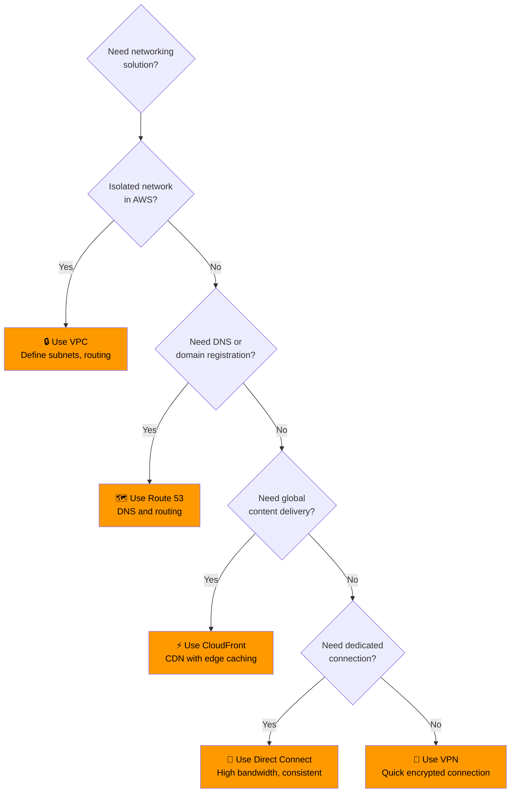

---

## Quick Reference

| Service | Purpose | Best For |
|---------|---------|----------|
| **VPC** | Isolated virtual network | All AWS resources |
| **Route 53** | DNS and domain registration | Domain routing, health checks |
| **CloudFront** | CDN for global content delivery | Static/dynamic content, APIs |
| **Direct Connect** | Dedicated private connection | High bandwidth, consistent performance |
| **VPN** | Encrypted internet tunnel | Quick connectivity, low-moderate bandwidth |
| **Transit Gateway** | Network hub for multiple VPCs | Complex multi-VPC architectures |

---

## 📝 Knowledge Check

<strong>Q1: What is the main purpose of an Amazon VPC?</strong>

**A.** Object storage  
**B.** Logically isolated virtual network in AWS  
**C.** Content delivery network  
**D.** DNS service  

**Answer: B** — An Amazon VPC (Virtual Private Cloud) is your logically isolated virtual network in AWS where you launch resources. You have complete control over the network configuration.

<strong>Q2: Which Route 53 routing policy routes users to the Region with the lowest latency?</strong>

**A.** Weighted  
**B.** Geolocation  
**C.** Latency-based  
**D.** Failover  

**Answer: C** — Latency-based routing routes users to the AWS Region that provides the lowest network latency for their location, improving performance.

<strong>Q3: What is the main benefit of using CloudFront?</strong>

**A.** Reduce latency by caching content at edge locations  
**B.** Store unlimited data  
**C.** Run serverless functions  
**D.** Manage DNS records  

**Answer: A** — CloudFront is a CDN that caches content at 400+ edge locations worldwide, reducing latency by serving content from the location closest to users.

<strong>Q4: When should you use Direct Connect instead of VPN?</strong>

**A.** When you need a quick temporary connection  
**B.** When you need high bandwidth and consistent performance  
**C.** When you have no on-premises infrastructure  
**D.** When you want to use the public internet  

**Answer: B** — Direct Connect provides a dedicated, private fiber connection with consistent high bandwidth (1-100 Gbps) and lower latency. Use it when you need high throughput and consistent performance. VPN is better for quick setup and lower bandwidth needs.

---

## Navigation

⬅️ Previous: [Storage Services](./02-storage.md) | ➡️ Next: [Databases](./04-databases.md)  
🏠 [Back to README](../../README.md)

---

*Part of the [AWS Cloud Practitioner Study Notes](../../README.md).*