# AWS Database Services

> ⏱️ **Estimated Study Time:** 15 minutes  
> 🎯 **CCP Exam Weight:** ~8% (Domain 3: Cloud Technology & Services)

---

## The Big Picture

AWS offers a **wide variety of managed database services** optimized for different use cases — from relational databases to NoSQL, data warehousing, and in-memory caching. Choosing the right database is critical for performance, scalability, and cost optimization.

---

## Database Service Categories

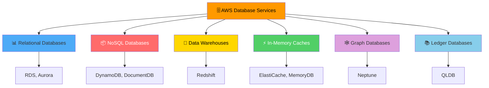

---

## AWS Database Services Overview

| Service | Type | Use Case | Key Feature |
|---------|------|----------|-------------|
| **Amazon RDS** | Relational (SQL) | Traditional applications, OLTP | Managed SQL databases |
| **Amazon Aurora** | Relational (SQL) | High-performance MySQL/PostgreSQL | 5x faster than MySQL |
| **Amazon DynamoDB** | NoSQL (Key-Value) | Serverless, gaming, IoT | Single-digit millisecond latency |
| **Amazon DocumentDB** | NoSQL (Document) | MongoDB-compatible | Managed document database |
| **Amazon Redshift** | Data Warehouse | Analytics, BI, reporting | Petabyte-scale analytics |
| **ElastiCache** | In-Memory Cache | Caching, session storage | Redis or Memcached |
| **Amazon Neptune** | Graph Database | Social networks, recommendations | Highly connected data |
| **Amazon QLDB** | Ledger Database | Financial records, audit trails | Immutable, cryptographically verifiable |

---

## 1. Amazon RDS (Relational Database Service)

**Definition:** Managed relational database service supporting **multiple SQL engines** including MySQL, PostgreSQL, MariaDB, Oracle, and SQL Server.

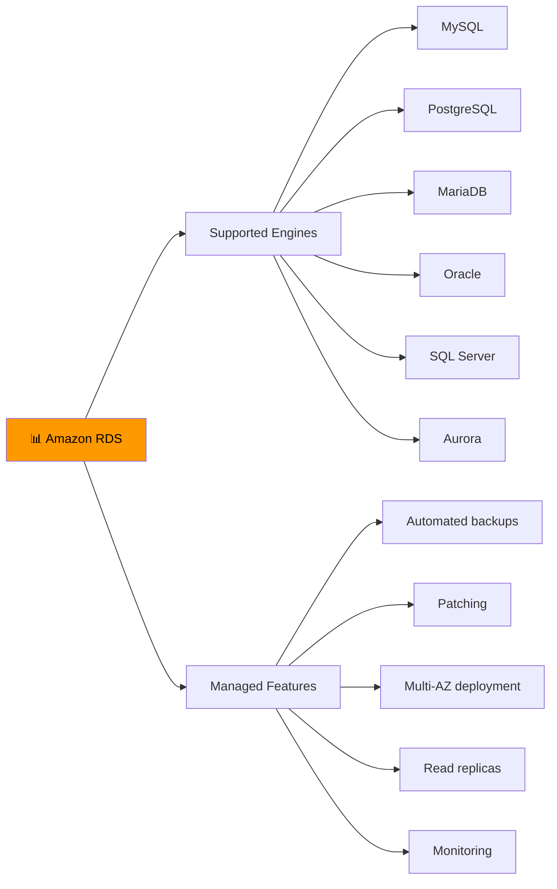

### RDS Key Features

| Feature | Description |
|---------|-------------|
| **Multi-AZ Deployment** | Synchronous replication to standby in another AZ for HA |
| **Read Replicas** | Asynchronous replication for read scaling (up to 5) |
| **Automated Backups** | Point-in-time recovery, automated daily backups |
| **Automated Patching** | OS and database engine patches |
| **Monitoring** | CloudWatch metrics, Performance Insights |
| **Encryption** | At rest and in transit |

### Multi-AZ vs Read Replicas

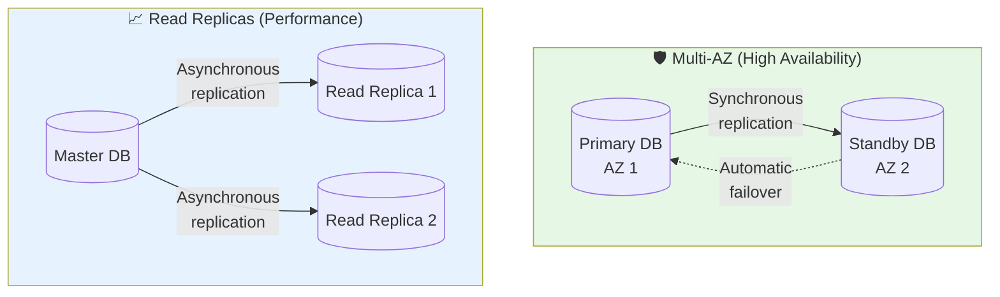

| Feature | Multi-AZ | Read Replicas |
|---------|----------|---------------|
| **Purpose** | High availability | Read performance |
| **Replication** | Synchronous | Asynchronous |
| **Failover** | Automatic | Manual |
| **Access** | One endpoint | Separate endpoints |
| **Count** | 1 standby | Up to 5 replicas |
| **Use Case** | Disaster recovery | Read-heavy workloads |

---

## 2. Amazon Aurora

**Definition:** AWS's **cloud-native relational database** compatible with MySQL and PostgreSQL, offering 5x performance and enterprise-grade features.

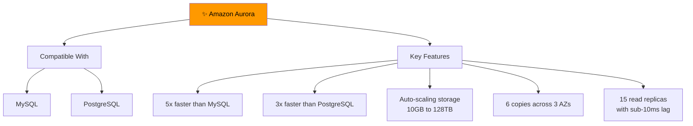

### Aurora Architecture

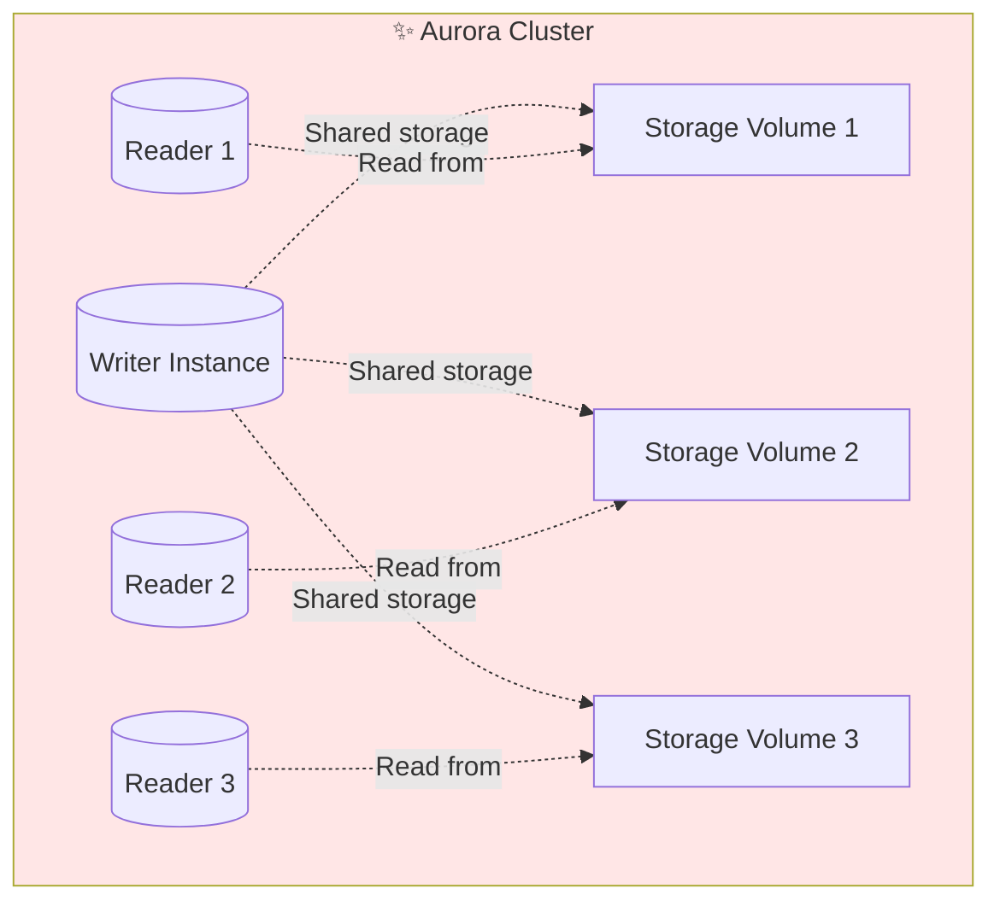

### Aurora vs RDS

| Feature | RDS MySQL | Aurora MySQL |
|---------|-----------|--------------|
| **Performance** | Standard | 5x faster |
| **Storage** | Manually provisioned | Auto-scaling (10GB-128TB) |
| **Read Replicas** | Up to 5 | Up to 15 |
| **Replication Lag** | Seconds | Sub-10ms |
| **Failover** | Minutes | Seconds |
| **Cost** | Lower | Higher |

> 🎯 **Exam Tip:** Choose Aurora for **high-performance, mission-critical** relational workloads. Choose RDS for **traditional, cost-effective** relational databases.

---

## 3. Amazon DynamoDB

**Definition:** Fully managed **NoSQL key-value and document database** that delivers single-digit millisecond performance at any scale.

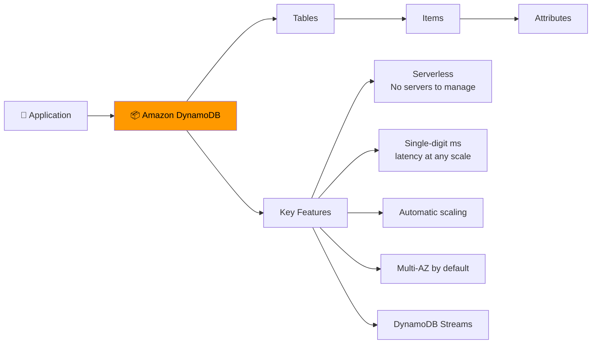

### DynamoDB Characteristics

| Feature | Description |
|---------|-------------|
| **Type** | NoSQL key-value and document |
| **Performance** | Single-digit millisecond latency |
| **Scaling** | Automatic, seamless |
| **Availability** | Multi-AZ by default (99.99% SLA) |
| **Consistency** | Eventually consistent (default) or strongly consistent |
| **Pricing** | Pay per request or provisioned capacity |

### DynamoDB Use Cases

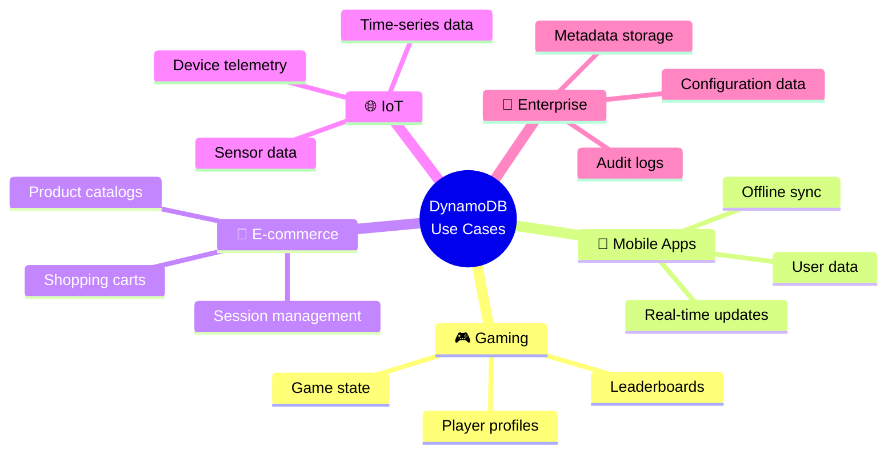

### DynamoDB vs RDS

| Aspect | DynamoDB | RDS |
|--------|----------|-----|
| **Type** | NoSQL | Relational (SQL) |
| **Schema** | Flexible | Fixed schema |
| **Scaling** | Automatic, unlimited | Vertical + read replicas |
| **Performance** | Single-digit ms | Varies by engine |
| **Use Case** | Unstructured, variable data | Structured, relational data |
| **Queries** | Key-value, simple queries | Complex SQL queries |

---

## 4. Amazon Redshift

**Definition:** Fully managed **data warehouse** service for analytics and business intelligence, capable of querying petabytes of data.

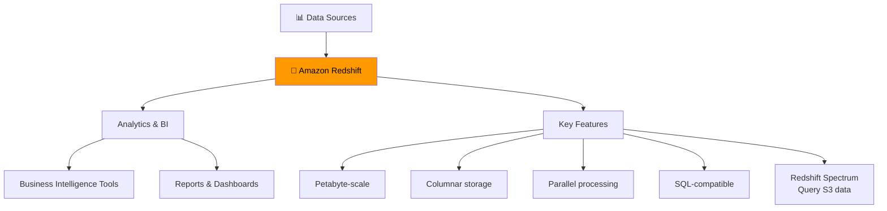

### Redshift Use Cases

- **Business Intelligence** (BI) and reporting
- **Data analytics** across large datasets
- **Log analysis** and trend identification
- **OLAP** (Online Analytical Processing) workloads

### Redshift vs RDS

| Feature | Redshift | RDS |
|---------|----------|-----|
| **Purpose** | Analytics (OLAP) | Transactions (OLTP) |
| **Workload** | Read-heavy, complex queries | Write/read, simple queries |
| **Storage** | Columnar | Row-based |
| **Scaling** | Petabyte-scale | GB to TB |
| **Use Case** | Reporting, data warehousing | Application database |

---

## 5. Amazon ElastiCache

**Definition:** Managed **in-memory caching service** using Redis or Memcached to improve application performance.

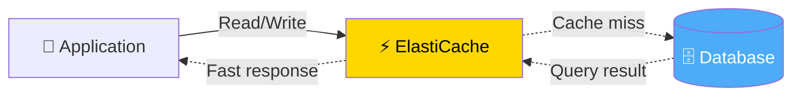

### Redis vs Memcached

| Feature | Redis | Memcached |
|---------|-------|-----------|
| **Data Types** | Rich (strings, lists, sets, hashes) | Simple key-value |
| **Persistence** | Yes (snapshots, AOF) | No |
| **Replication** | Yes (Multi-AZ) | No |
| **Use Case** | Sessions, leaderboards, pub/sub | Simple caching |
| **Max Size** | 500GB+ | 100GB |

---

## 6. Amazon Neptune

**Definition:** Fully managed **graph database** service for highly connected data like social networks, recommendations, and fraud detection.

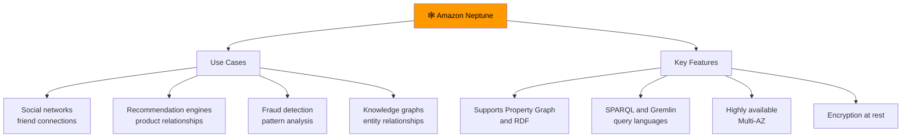

---

## Database Selection Guide

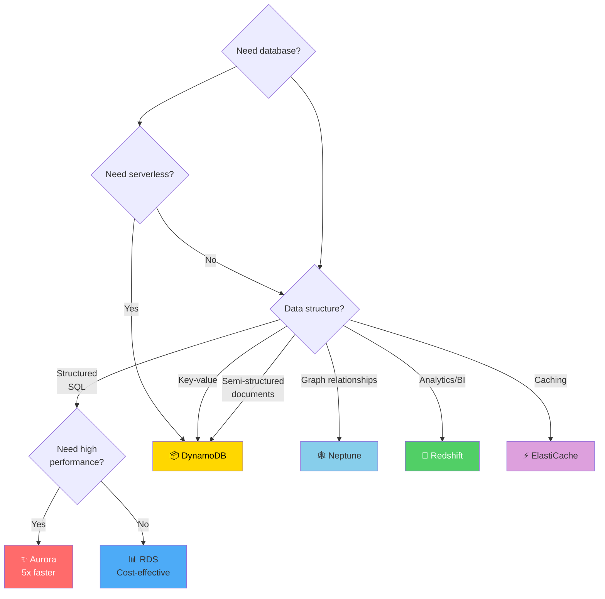

### Database Selection Matrix

| Need | Best Choice | Reason |
|------|-------------|--------|
| Traditional web app with SQL | **RDS** | Managed, cost-effective |
| High-performance SQL | **Aurora** | 5x faster, auto-scaling |
| Mobile/gaming app | **DynamoDB** | NoSQL, single-digit ms latency |
| Analytics & reporting | **Redshift** | Petabyte-scale analytics |
| Session/cache storage | **ElastiCache** | In-memory, ultra-fast |
| Social network/recommendations | **Neptune** | Graph database |
| Financial ledger | **QLDB** | Immutable, cryptographically verifiable |

---

## Relational vs NoSQL

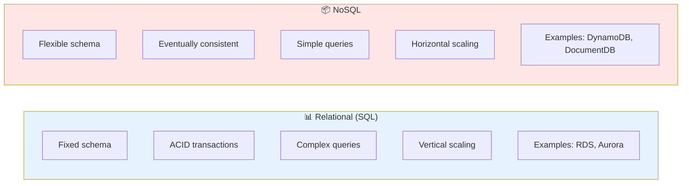

---

## Quick Reference

| Service | Type | Best For | Performance |
|---------|------|----------|-------------|
| **RDS** | Relational (SQL) | Traditional apps, OLTP | Good |
| **Aurora** | Relational (SQL) | High-performance, mission-critical | 5x faster |
| **DynamoDB** | NoSQL | Serverless, IoT, gaming | Single-digit ms |
| **Redshift** | Data Warehouse | Analytics, BI, reporting | Petabyte-scale |
| **ElastiCache** | In-Memory | Caching, sessions | Ultra-fast |
| **Neptune** | Graph | Social networks, recommendations | High |
| **DocumentDB** | Document (NoSQL) | MongoDB-compatible workloads | Good |

---

## 📝 Knowledge Check

<strong>Q1: Which AWS database service is a cloud-native relational database compatible with MySQL and PostgreSQL that offers 5x better performance?</strong>

**A.** Amazon RDS  
**B.** Amazon Aurora  
**C.** Amazon DynamoDB  
**D.** Amazon Redshift  

**Answer: B** — Amazon Aurora is AWS's cloud-native relational database that is compatible with MySQL and PostgreSQL, offering 5x better performance than standard MySQL and 3x better than PostgreSQL.

<strong>Q2: Which database service should you choose for a mobile application that needs single-digit millisecond latency at any scale?</strong>

**A.** Amazon RDS  
**B.** Amazon Aurora  
**C.** Amazon DynamoDB  
**D.** Amazon Redshift  

**Answer: C** — Amazon DynamoDB is a NoSQL database that delivers single-digit millisecond performance at any scale, making it ideal for mobile apps, gaming, IoT, and serverless applications.

<strong>Q3: What is the difference between Multi-AZ deployment and Read Replicas in RDS?</strong>

**A.** Multi-AZ is for performance, Read Replicas are for disaster recovery  
**B.** Multi-AZ is for high availability, Read Replicas are for read performance  
**C.** They are the same thing  
**D.** Multi-AZ requires manual failover, Read Replicas have automatic failover  

**Answer: B** — Multi-AZ provides high availability through synchronous replication with automatic failover to a standby in another AZ. Read Replicas provide read performance through asynchronous replication, allowing you to scale read-heavy workloads.

<strong>Q4: Which AWS database service is designed for analytics and business intelligence workloads on petabyte-scale data?</strong>

**A.** Amazon RDS  
**B.** Amazon Aurora  
**C.** Amazon DynamoDB  
**D.** Amazon Redshift  

**Answer: D** — Amazon Redshift is a fully managed data warehouse service designed for analytics, business intelligence, and OLAP workloads, capable of querying petabytes of data.

---

## Navigation

⬅️ Previous: [Networking](./03-networking.md) | ➡️ Next: [Scalability & High Availability](./05-scalability-ha.md)  
🏠 [Back to README](../../README.md)

---

*Part of the [AWS Cloud Practitioner Study Notes](../../README.md).*