# Scalability & High Availability

> ⏱️ **Estimated Study Time:** 20 minutes  
> 🎯 **CCP Exam Weight:** ~12-15% (Domain 3: Cloud Technology & Services)

---

## The Big Picture

**Scalability** and **High Availability (HA)** are two fundamental architectural concepts that ensure your application can handle increasing load and remain operational despite failures. AWS provides Auto Scaling Groups and Load Balancers to achieve both. These concepts are heavily tested on the CCP exam.

---

## Core Concepts

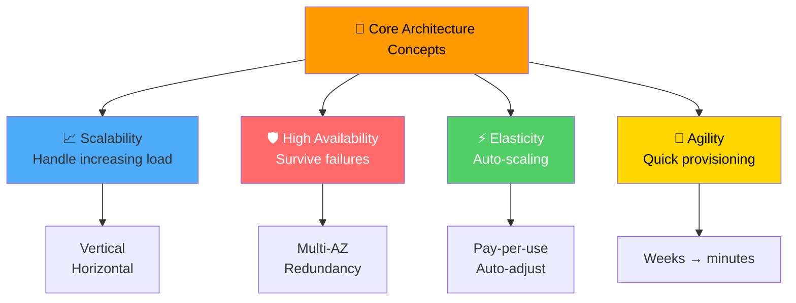

### Key Definitions

| Concept | Definition |
|---------|------------|
| **Scalability** | Ability to handle **increasing loads** by adapting (scale up or out) |
| **High Availability** | Ability to **remain operational** despite failures (run in multiple AZs) |
| **Elasticity** | **Automatic scaling** based on demand in a scalable system |
| **Agility** | Ability to **quickly provision** new IT resources (weeks → minutes) |

> 🎯 **Exam Tip:** Scalability is about **handling more load**. High Availability is about **surviving failures**. They are related but distinct concepts.

---

## Two Types of Scalability

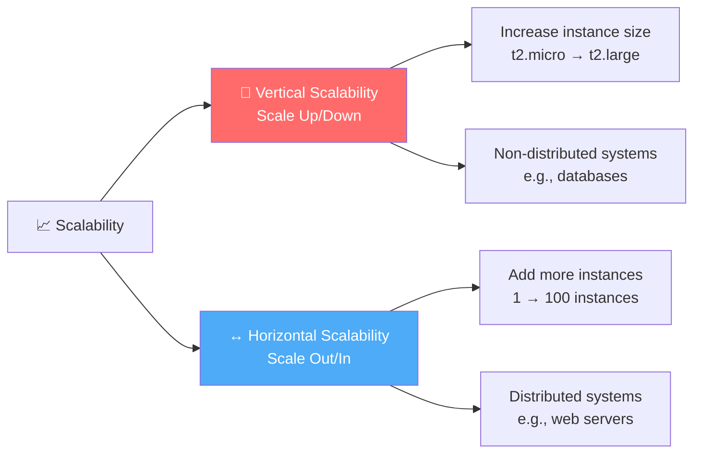

### Vertical vs Horizontal Comparison

| Aspect | Vertical Scalability | Horizontal Scalability |
|--------|---------------------|------------------------|
| **Action** | Increase size of instance | Increase number of instances |
| **Also Known As** | Scale Up / Scale Down | Scale Out / Scale In |
| **Example** | t2.nano → u-12tb1.metal | 1 instance → 10 instances |
| **Use Case** | Non-distributed systems (databases) | Distributed systems (web servers, microservices) |
| **Limit** | Hardware maximum | Practically unlimited |
| **Downtime** | May require restart | No downtime |

### Vertical Scaling Example

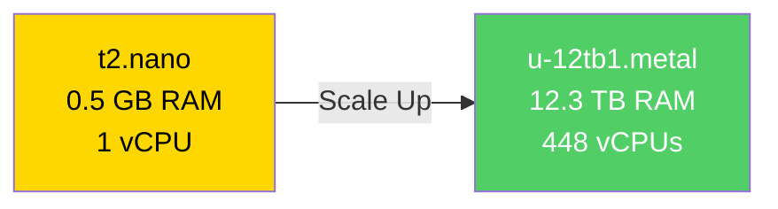

### Horizontal Scaling Example

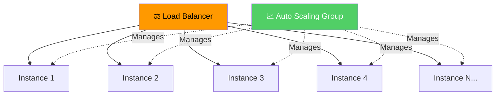

---

## Scalability vs High Availability

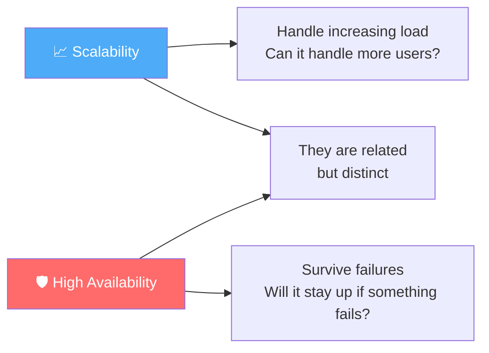

### Key Differences

| Aspect | Scalability | High Availability |
|--------|-------------|-------------------|
| **Goal** | Handle increased load | Survive failures |
| **Question** | "Can it handle more users?" | "Will it stay up if AZ fails?" |
| **Implementation** | Scale up/out | Multi-AZ deployment |
| **Focus** | Capacity | Reliability |

---

## High Availability (HA)

**Definition:** Systems remain **operational** despite failures by running across **multiple Availability Zones**.

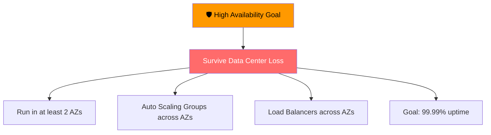

### HA Architecture Example

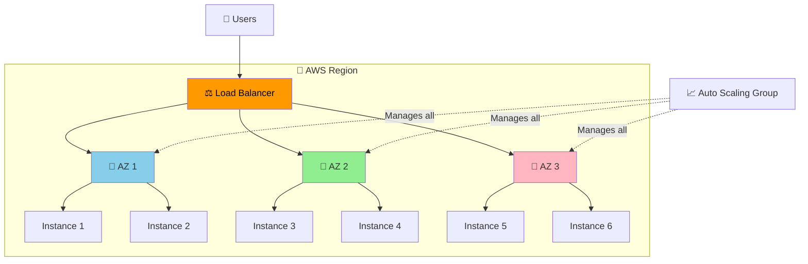

### AZ Failure Scenario

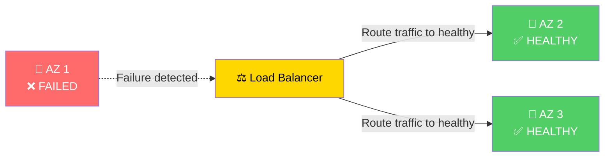

> 🎯 **Exam Tip:** High Availability requires deploying across **at least 2 Availability Zones**. Single AZ = single point of failure.

---

## Load Balancers

**Definition:** Servers that **distribute incoming traffic** across multiple downstream EC2 instances to ensure availability and scalability.

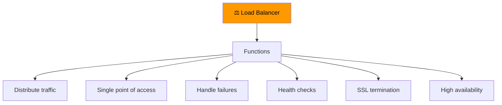

### Three Types of AWS Load Balancers

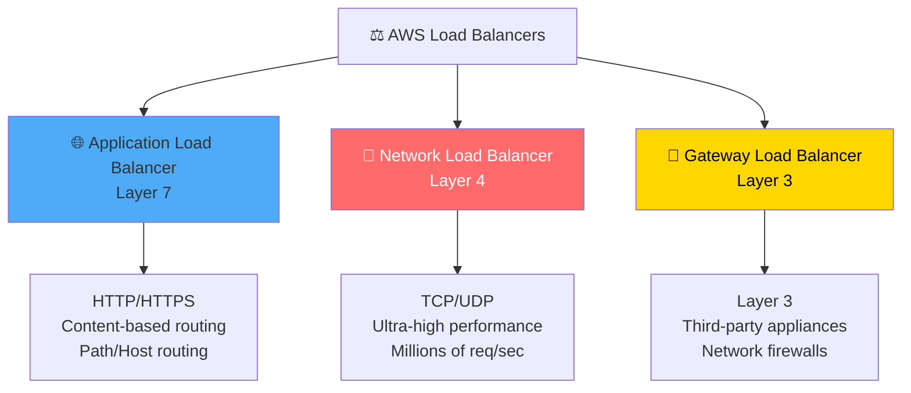

### Load Balancer Comparison

| Feature | ALB | NLB | GWLB |
|---------|-----|-----|------|
| **Layer** | 7 (Application) | 4 (Transport) | 3 (Network) |
| **Protocol** | HTTP/HTTPS | TCP, UDP, TLS | IP |
| **Use Case** | Web apps, microservices, containers | Gaming, IoT, real-time | Network appliances, firewalls |
| **Performance** | High | Very high (millions of req/sec) | High |
| **Static IP** | No | Yes | Yes |
| **Content Routing** | Yes (path, host, headers) | No | No |
| **Pricing** | Per hour + LCU | Per hour + NLCU | Per hour + GLCU |

### Load Balancer Selection Guide

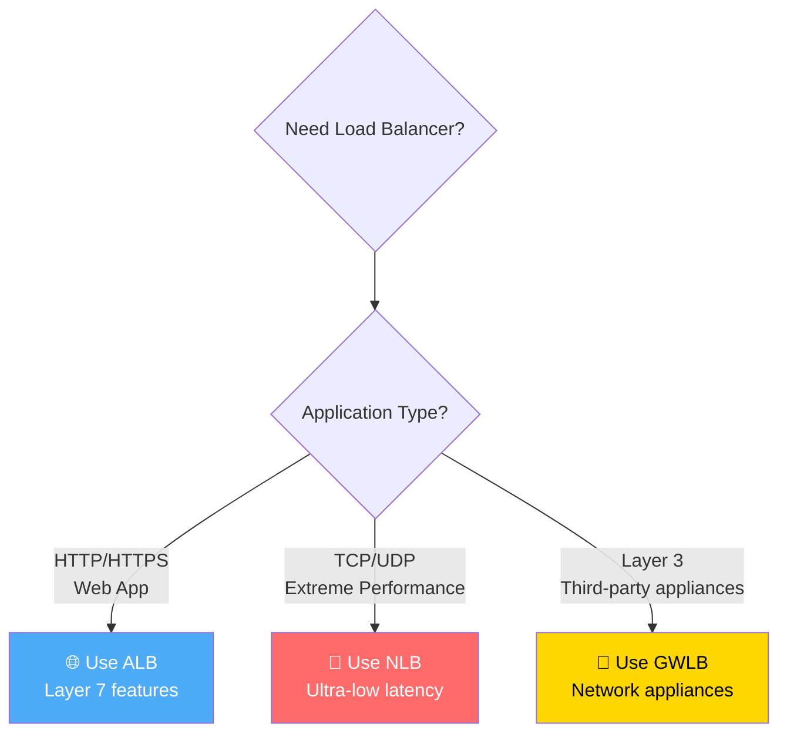

> 🎯 **Exam Tip:** Choose **ALB for web applications** (HTTP/HTTPS). Choose **NLB for extreme performance** (gaming, IoT). Choose **GWLB for third-party network appliances**.

---

## Auto Scaling Groups (ASG)

**Definition:** Group of EC2 instances managed together to **automatically adjust capacity** based on demand, maintaining performance and optimizing costs.

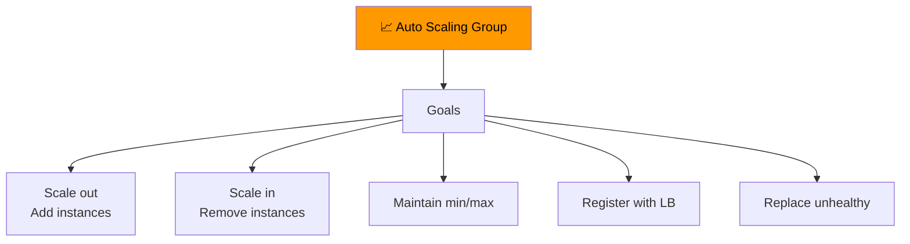

### ASG Key Capabilities

| Capability | Description |
|------------|-------------|
| **Scale Out** | Add EC2 instances to handle increased load |
| **Scale In** | Remove EC2 instances to reduce costs |
| **Maintain Capacity** | Keep instances between min and max |
| **Auto Register** | Register new instances with Load Balancer |
| **Health Replacement** | Automatically replace unhealthy instances |

### ASG Configuration

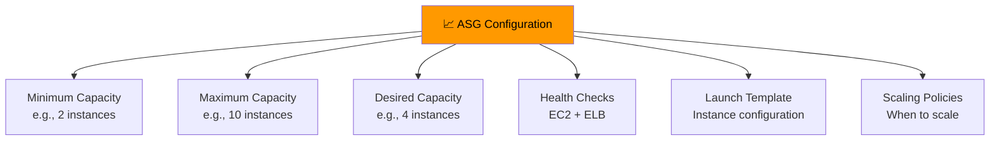

### ASG Capacity Settings

| Setting | Description | Example |
|---------|-------------|---------|
| **Minimum** | Lowest number of instances always running | 2 |
| **Maximum** | Highest number of instances allowed | 10 |
| **Desired** | Target number at any time | 4 |

---

## Auto Scaling Strategies

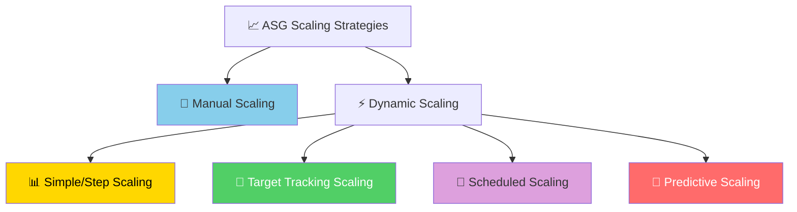

### Strategy Comparison

| Strategy | How It Works | Trigger | Best For |
|----------|-------------|---------|----------|
| **Manual** | Adjust ASG size manually | Human action | One-time events, predictable changes |
| **Simple/Step** | CloudWatch alarm triggers action | CPU > 70% → Add 2 instances | Simple thresholds |
| **Target Tracking** | Maintain target metric value | Keep CPU at 40% | Most common use case |
| **Scheduled** | Plan scaling based on time | Increase at 5 PM Friday | Known traffic patterns |
| **Predictive** | ML-based forecasting | Forecasted demand | Complex patterns |

### Target Tracking Scaling Example

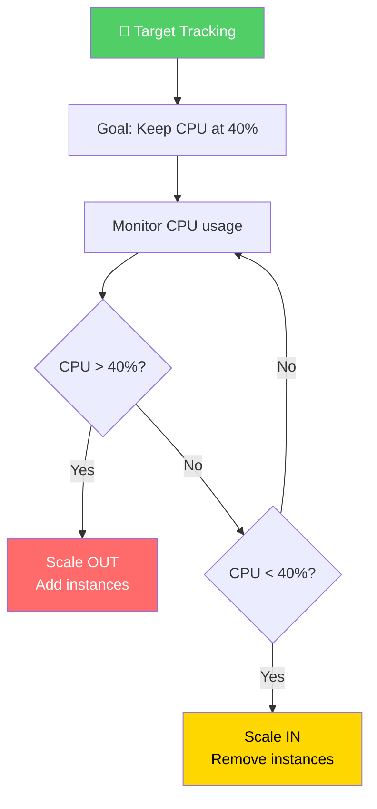

> 🎯 **Exam Tip:** Target Tracking is the **most common** scaling strategy. It maintains a target metric (like 40% CPU) by automatically scaling.

---

## Complete HA + Scalable Architecture

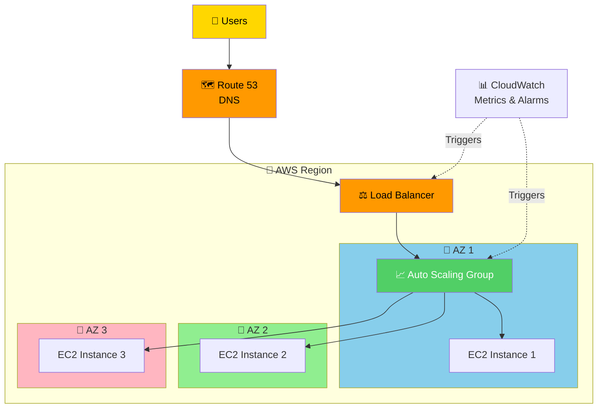

### Health Check & Replacement Flow

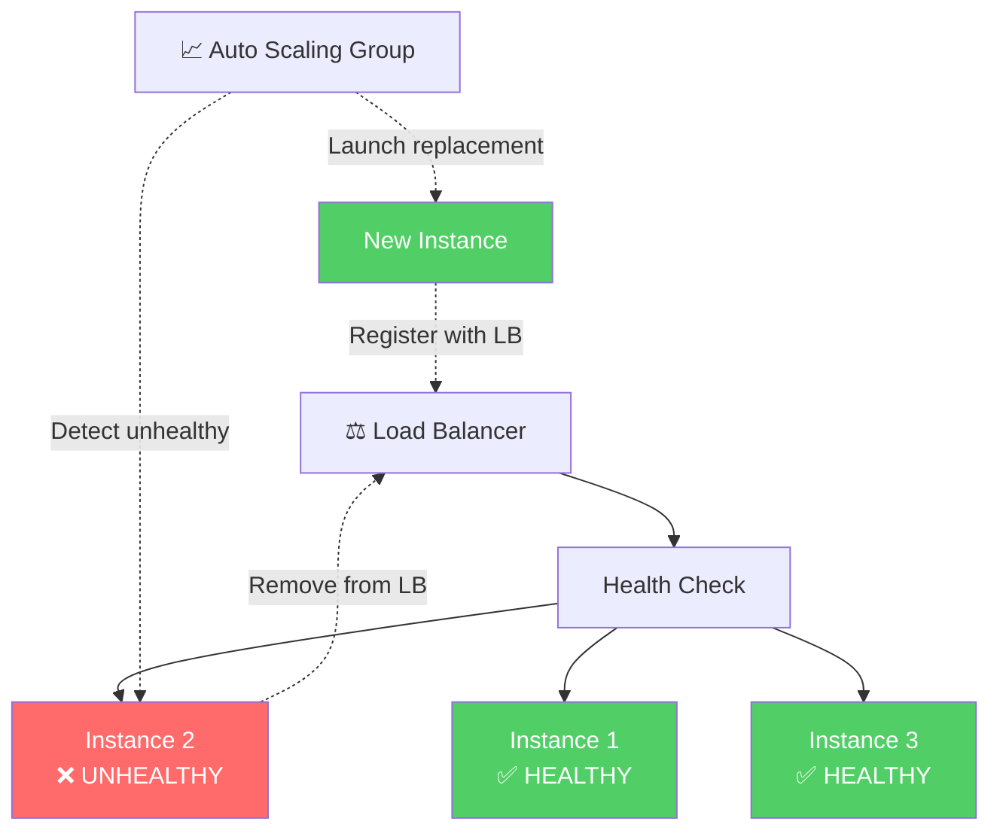

---

## Scalability vs Elasticity vs Agility

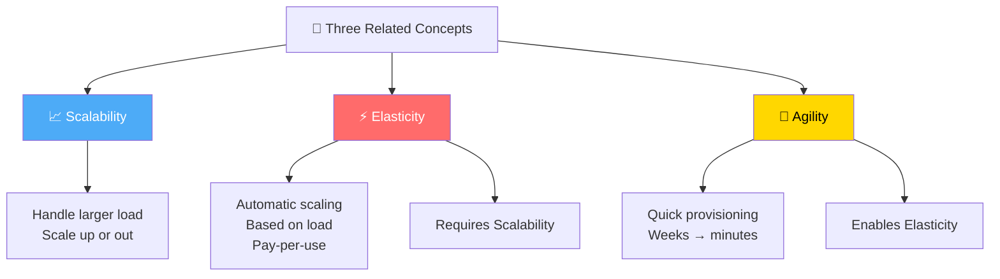

### When to Use Each Scaling Type

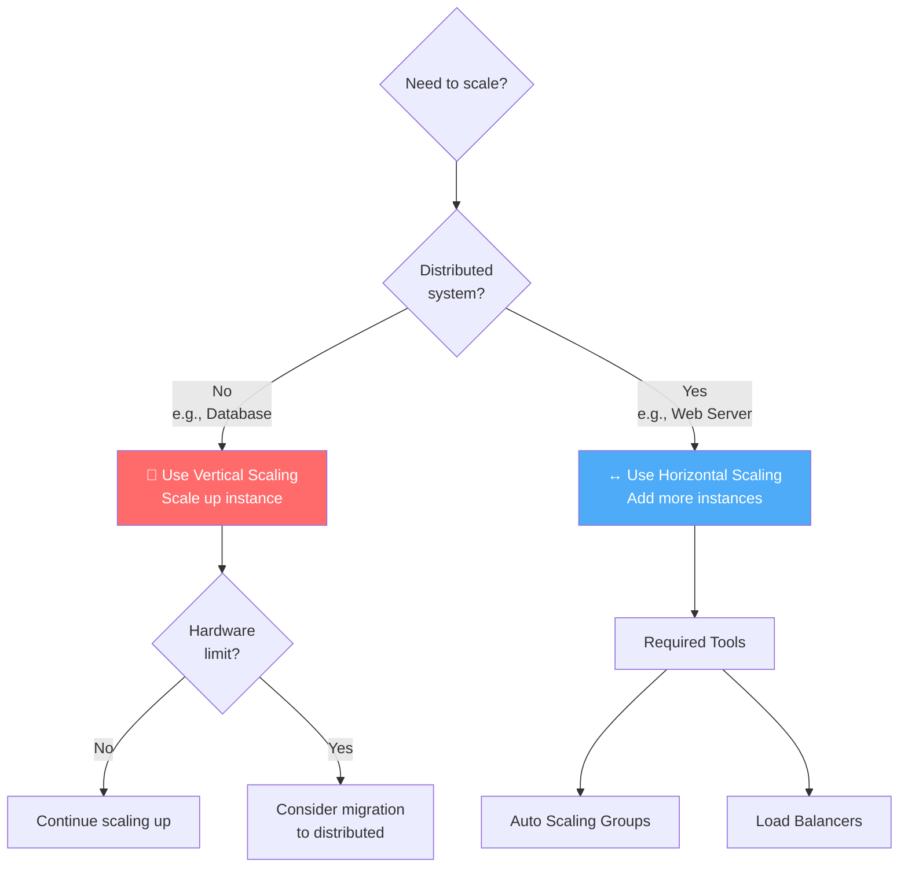

---

## Quick Reference

| Concept | Key Point |
|---------|-----------|
| **Scalability** | Handle increasing load (vertical or horizontal) |
| **High Availability** | Survive failures (deploy across multiple AZs) |
| **Elasticity** | Automatic scaling based on demand |
| **Vertical Scaling** | Increase instance size (scale up/down) |
| **Horizontal Scaling** | Add more instances (scale out/in) |
| **Load Balancers** | Distribute traffic (ALB, NLB, GWLB) |
| **Auto Scaling Groups** | Automatically adjust capacity |
| **Target Tracking** | Most common scaling strategy |
| **Multi-AZ** | Required for high availability |

---

## 📝 Knowledge Check

<strong>Q1: What is the difference between scalability and high availability?</strong>

**A.** They are the same thing  
**B.** Scalability handles increasing load; HA survives failures  
**C.** Scalability is for databases; HA is for web servers  
**D.** Scalability is cheaper than HA  

**Answer: B** — Scalability is the ability to handle increasing loads by adapting (scaling up or out). High Availability is the ability to remain operational despite failures (running in multiple AZs). They are related but distinct concepts.

<strong>Q2: Which load balancer should you use for an HTTP/HTTPS web application with content-based routing?</strong>

**A.** Network Load Balancer  
**B.** Gateway Load Balancer  
**C.** Application Load Balancer  
**D.** Classic Load Balancer  

**Answer: C** — Application Load Balancer (ALB) is a Layer 7 load balancer that supports HTTP/HTTPS and provides content-based routing (path, host, headers). Use it for web applications and microservices.

<strong>Q3: What is the most common Auto Scaling strategy that maintains a target metric value?</strong>

**A.** Manual Scaling  
**B.** Simple/Step Scaling  
**C.** Target Tracking Scaling  
**D.** Predictive Scaling  

**Answer: C** — Target Tracking Scaling is the most common strategy. It maintains a target metric value (like 40% CPU) by automatically scaling out or in based on the metric. For example, if CPU exceeds 40%, ASG adds instances; if below 40%, it removes them.

<strong>Q4: How many Availability Zones should you deploy across to achieve high availability?</strong>

**A.** 1 AZ  
**B.** At least 2 AZs  
**C.** At least 3 AZs  
**D.** All AZs in the Region  

**Answer: B** — High Availability requires deploying across **at least 2 Availability Zones**. This protects against data center failures within a Region. Best practice is to use 3 AZs for maximum resilience.

---

## Navigation

⬅️ Previous: [Databases](./04-databases.md) | ➡️ Next: [Virtualization Fundamentals](./06-virtualization-fundamentals.md)  
🏠 [Back to README](../../README.md)

---

*Part of the [AWS Cloud Practitioner Study Notes](../../README.md).*