# Virtualization Fundamentals

> ⏱️ **Estimated Study Time:** 20 minutes  
> 🎯 **CCP Exam Weight:** ~5-8% (Domain 3: Cloud Technology & Services)

---

## The Big Picture

**Virtualization** is the foundational technology that makes cloud computing possible. It allows a single physical resource to be divided into multiple isolated logical resources. Understanding virtualization concepts helps you understand how AWS services like EC2 work under the hood.

---

## What is Virtualization?

**Definition:** The ability to take a **single physical resource** and divide it into **multiple isolated logical resources** of the same type.

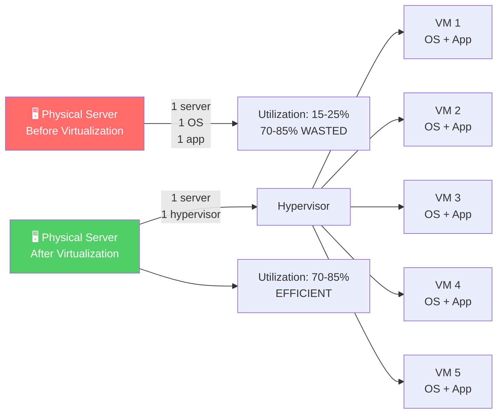

### Virtualization Benefits

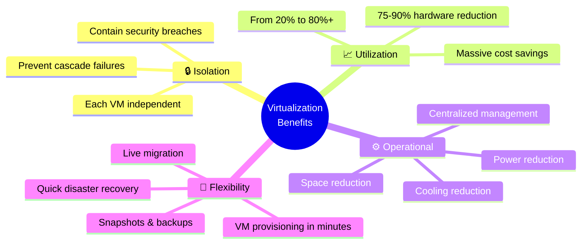

---

## Types of Virtualization

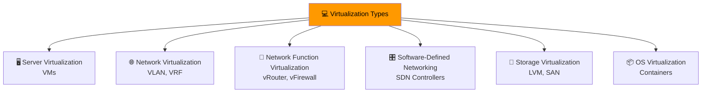

| Type | What It Virtualizes | Example |
|------|--------------------|---------| 
| **Server** | Physical servers | VMware ESXi, Hyper-V, KVM |
| **Network (NV)** | Network devices | VLAN, VRF, vSwitches |
| **Network Function (NFV)** | Network functions | vRouter, vFirewall as software |
| **Storage** | Physical storage | LVM, LUN, Storage Spaces |
| **OS** | Operating system | Containers (Docker, LXC) |

---

## Server Virtualization & Hypervisors

**Hypervisor:** Software that creates and runs **virtual machines (VMs)** by abstracting physical hardware.

### CPU Privilege Rings (x86 Architecture)

Understanding Type 1 vs Type 2 requires understanding CPU privilege rings:

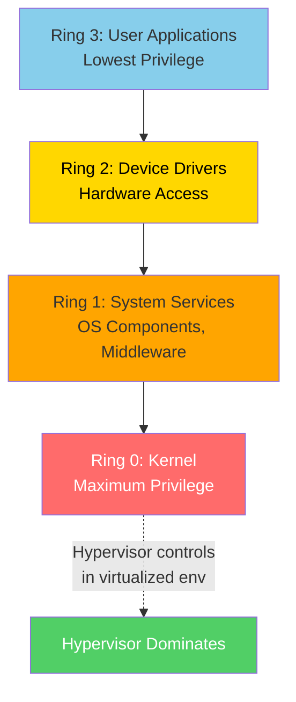

**Pre-Virtualization vs With Type 1:**
- **Pre-Virtualization**: OS occupied Ring 0, apps in Ring 3
- **With Type 1**: Hypervisor takes Ring 0, Guest OS moves to Ring 1

### Ring 0 Control Classification

| Hypervisor Controls Ring 0? | Classification |
|------------------------------|----------------|
| **Yes** | Type 1 (Bare-Metal Virtualization) |
| **No** | Type 2 (Hosted Virtualization) |

### Historical Example: Windows Server 2008 R2 & Hyper-V

1. Admin installs Windows Server 2008 R2 (occupies Ring 0)
2. Admin enables Hyper-V role (installed as software)
3. Server reboots automatically
4. **After reboot**: Hyper-V now controls Ring 0!
5. Windows Server becomes the "parent partition" running under Hyper-V

> 🎯 **Exam Tip:** Whoever controls **Ring 0** is the hypervisor, regardless of installation method.

---

### Type 1 vs Type 2 Hypervisors

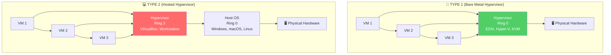

### Type 1 vs Type 2 Comparison

| Feature | Type 1 (Bare Metal) | Type 2 (Hosted) |
|---------|---------------------|-----------------|
| **Ring Control** | Controls Ring 0 | Runs in Ring 3 |
| **Hardware Access** | Direct control | Through host OS |
| **Performance** | Better (less overhead) | Additional overhead |
| **Use Case** | Production environments | Development, testing |
| **Examples** | VMware ESXi, Hyper-V, KVM, Xen | VirtualBox, VMware Workstation |
| **Installation** | Installs directly on hardware | Installs on host OS |

### Detailed Type 1 vs Type 2 vs Physical Comparison

| Feature | Type 1 (Bare-Metal) | Type 2 (Hosted) | Physical Server |
|---------|---------------------|-----------------|-----------------|
| **Performance** | ⭐⭐⭐⭐⭐ Excellent | ⭐⭐⭐ Good | ⭐⭐⭐⭐⭐ Excellent |
| **Security** | ⭐⭐⭐⭐⭐ Full Isolation | ⭐⭐⭐⭐ Very Good | ⭐⭐⭐ Limited |
| **Resource Efficiency** | ⭐⭐⭐⭐⭐ Optimal | ⭐⭐⭐ Moderate | ⭐⭐ Poor |
| **Setup Complexity** | ⭐⭐⭐ Moderate | ⭐⭐⭐⭐⭐ Easy | ⭐⭐ Complex |
| **Management** | ⭐⭐⭐⭐ Advanced Tools | ⭐⭐⭐ Good Tools | ⭐⭐ Basic |

### Major Hypervisor Vendors (2024-2025)

| Vendor | Type 1 | Type 2 | Notes |
|--------|--------|--------|-------|
| **VMware (Broadcom)** | vSphere ESXi | Workstation, Fusion | Enterprise leader |
| **Microsoft** | Hyper-V | - | Integrated with Windows Server |
| **Oracle** | Oracle VM Server (Xen) | VirtualBox | Cross-platform |
| **Red Hat** | OpenShift Virtualization (KVM) | - | RHV in maintenance mode |
| **Nutanix** | AHV (KVM) | - | Free with Nutanix HCI |
| **Proxmox** | Proxmox VE (KVM + LXC) | - | Open-source |
| **AWS** | Nitro System (KVM) | - | Powers EC2 |
| **Open Source** | KVM, Xen Project | QEMU | KVM merged into Linux kernel |

---

## Network Virtualization vs NFV

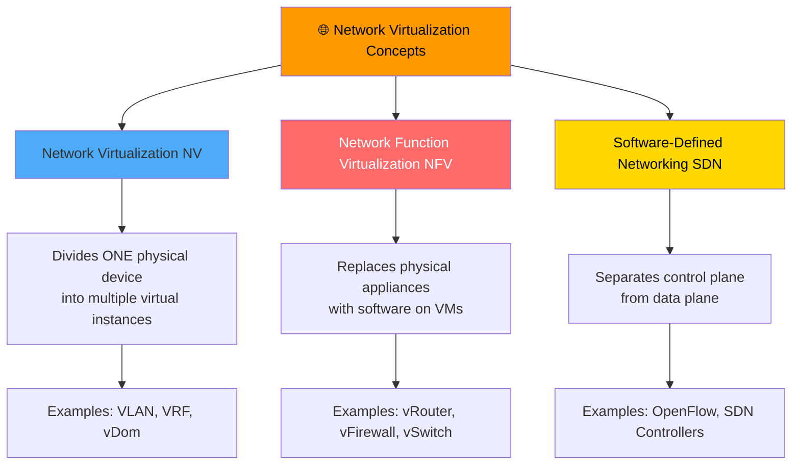

### NV vs NFV Comparison

| Aspect | Network Virtualization (NV) | Network Function Virtualization (NFV) |
|--------|---------------------------|--------------------------------------|
| **Approach** | Divides one physical device into multiple virtual instances | Replaces physical appliances with software on VMs |
| **Physical Device** | Still exists and is partitioned | Replaced with general-purpose servers |
| **Example** | One FortiGate → 4 vDoms | Virtual router software on VM |
| **Technologies** | VLAN, VRF, vDom | vRouter, vFirewall, vSwitch |

### Network Virtualization Technologies by OSI Layer

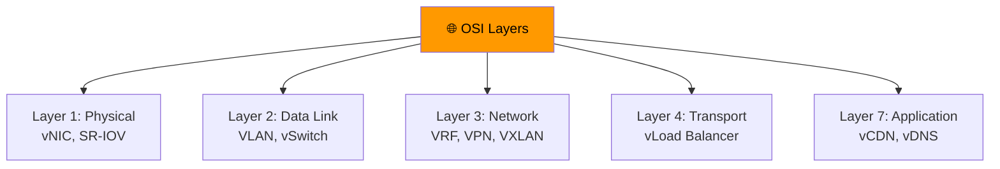

### Software-Defined Networking (SDN)

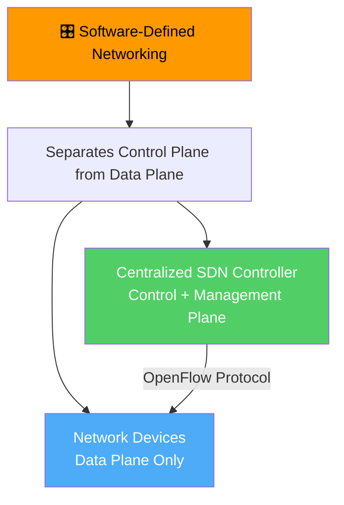

---

## Storage Virtualization

**Definition:** Aggregating multiple physical storage devices into a **unified logical pool**, from which virtual volumes can be created.

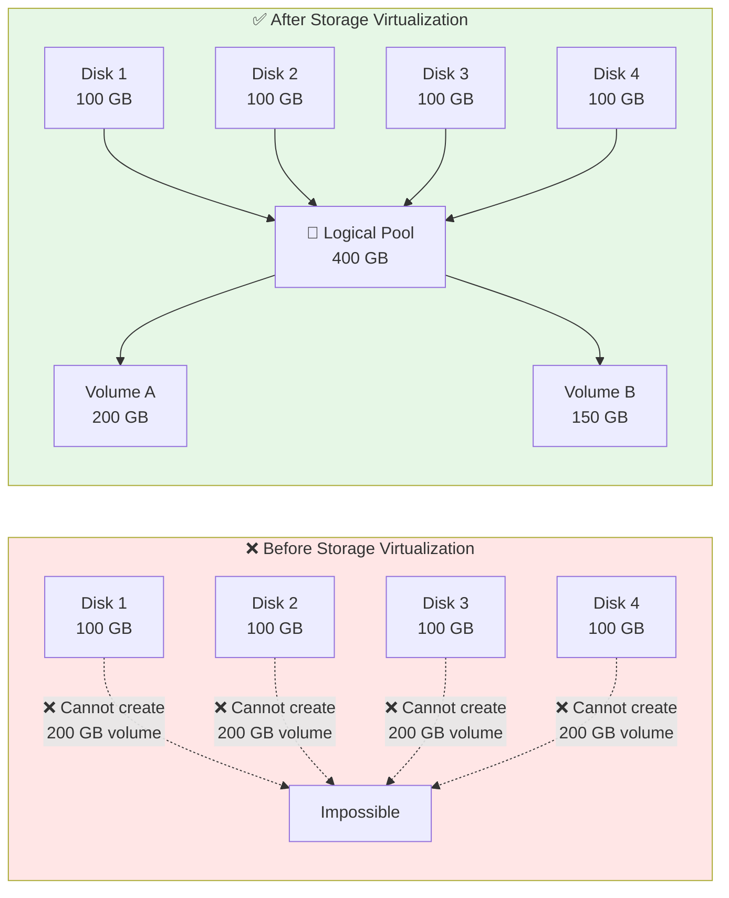

### Storage Virtualization Technologies

| Technology | Implementation | Use Case |
|------------|----------------|----------|
| **LVM (Linux)** | Logical Volume Manager | Linux systems (PV → VG → LV) |
| **LUN** | Logical Unit Number | Enterprise SAN storage |
| **Storage Spaces** | Windows feature | Modern Windows systems |
| **ZFS / Btrfs** | Modern filesystems | Built-in virtualization with snapshots |

### LVM Example

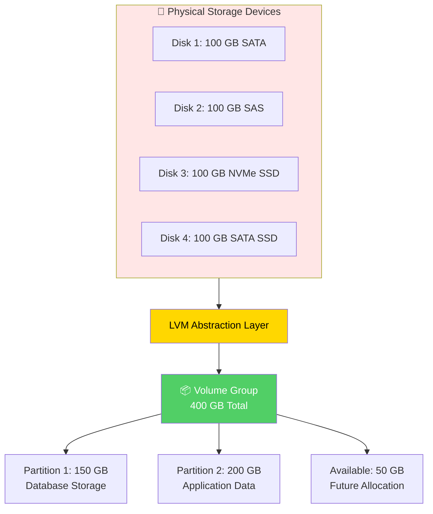

### Storage Virtualization Spectrum

```mermaid
graph TD
    Spectrum[💾 Storage Virtualization Spectrum] --> Device[📱 Device-Level<br/>Individual storage devices]
    Spectrum --> Host[🖥️ Host-Level<br/>Server/host management]
    Spectrum --> Network[🌐 Network-Level<br/>Across networks]
    Spectrum --> Comprehensive[🏢 Comprehensive<br/>Full-scope virtualization]
    
    Device --> D1[RAID]
    Device --> D2[LVM]
    Device --> D3[Windows Dynamic Disks]
    Device --> D4[ZFS/Btrfs]
    
    Host --> H1[Storage Spaces]
    Host --> H2[VMware vSphere Storage]
    Host --> H3[Linux MD Software RAID]
    Host --> H4[Thin Provisioning]
    
    Network --> N1[SAN Virtualization]
    Network --> N2[NAS Clustering]
    Network --> N3[Distributed Storage: Ceph, GlusterFS]
    Network --> N4[Storage Gateways]
    
    Comprehensive --> C1[IBM SAN Volume Controller]
    Comprehensive --> C2[VMware vSAN]
    Comprehensive --> C3[DataCore SANsymphony]
    Comprehensive --> C4[Nutanix HCI]
    
    style Spectrum fill:#FF9900,color:#000
    style Device fill:#51CF66,color:#fff
    style Host fill:#4DABF7
    style Network fill:#FFA500
    style Comprehensive fill:#DDA0DD
```

### Storage Virtualization Implementation Matrix

| Technology | Pooling | Abstraction | Automation | Mobility | Multi-tenancy |
|------------|---------|-------------|------------|----------|---------------|
| **RAID** | ✅ | ✅ | ❌ | ❌ | Partial |
| **LVM** | ✅ | ✅ | Partial | Partial | Partial |
| **Storage Spaces** | ✅ | ✅ | Partial | Partial | Partial |
| **VMware vSAN** | ✅ | ✅ | ✅ | ✅ | ✅ |
| **Nutanix HCI** | ✅ | ✅ | ✅ | ✅ | ✅ |

> 📌 **Key Insight:** Storage virtualization exists on a **spectrum**. Technologies don't need to implement all characteristics to be considered legitimate virtualization.

> ⚠️ **Important:** LVM alone does **NOT** provide fault tolerance. You must combine it with **RAID** or **Erasure Code** for redundancy.

---

## Virtualization Cost Savings

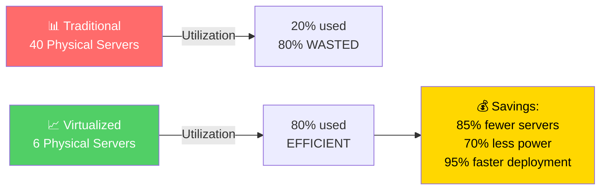

### ROI Analysis

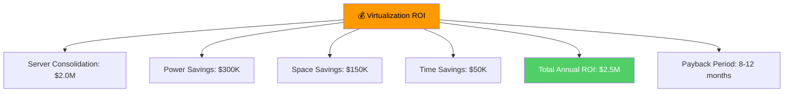

---

## Why Virtualization Matters for AWS

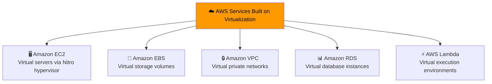

> 🎯 **Exam Tip:** AWS EC2 is powered by the **Nitro System**, a custom hypervisor based on KVM. Understanding virtualization helps you understand how AWS services work.

---

## Quick Reference

| Concept | Key Point |
|---------|-----------|
| **Virtualization** | Divides one physical resource into multiple isolated logical resources |
| **Hypervisor** | Software that creates and runs VMs |
| **Type 1** | Bare-metal, controls Ring 0 (ESXi, Hyper-V, KVM) |
| **Type 2** | Hosted, runs in Ring 3 (VirtualBox, Workstation) |
| **Network Virtualization** | Divides one device into multiple (VLAN, VRF) |
| **NFV** | Replaces physical appliances with software |
| **SDN** | Separates control plane from data plane |
| **Storage Virtualization** | Aggregates physical storage into logical pool |
| **Utilization** | Improves from 20% to 80% |
| **Cost Savings** | 85% fewer servers, 70% less power |

---

## 📝 Knowledge Check

<strong>Q1: What is the difference between Type 1 and Type 2 hypervisors?</strong>

**A.** Type 1 runs on host OS, Type 2 runs on bare metal  
**B.** Type 1 controls Ring 0, Type 2 runs in Ring 3  
**C.** Type 1 is for development, Type 2 is for production  
**D.** There is no difference  

**Answer: B** — Type 1 (bare-metal) hypervisors control Ring 0 and have direct hardware access, providing better performance. Type 2 (hosted) hypervisors run in Ring 3 on top of a host OS, adding overhead but easier to set up.

<strong>Q2: What is the difference between Network Virtualization (NV) and Network Function Virtualization (NFV)?</strong>

**A.** NV replaces physical devices, NFV partitions them  
**B.** NV partitions one physical device, NFV replaces physical appliances with software  
**C.** NV and NFV are the same thing  
**D.** NV is for routers, NFV is for switches  

**Answer: B** — Network Virtualization (NV) divides one physical device into multiple virtual instances (e.g., VLAN, VRF). Network Function Virtualization (NFV) replaces physical network appliances with software running on VMs (e.g., virtual router, virtual firewall).

<strong>Q3: What is the main benefit of storage virtualization?</strong>

**A.** Faster disk speed  
**B.** Aggregating multiple physical disks into a unified logical pool  
**C.** Encrypting data at rest  
**D.** Backing up data automatically  

**Answer: B** — Storage virtualization aggregates multiple physical storage devices into a unified logical pool, allowing you to create virtual volumes that can span multiple physical disks and be resized dynamically.

---

## Navigation

⬅️ Previous: [Scalability & High Availability](./05-scalability-ha.md) | ➡️ Next: [Containers & Orchestration](./07-containers-orchestration.md)  
🏠 [Back to README](../../README.md)

---

*Part of the [AWS Cloud Practitioner Study Notes](../../README.md).*