# Containers & Orchestration

> ⏱️ **Estimated Study Time:** 22 minutes  
> 🎯 **CCP Exam Weight:** ~5-8% (Domain 3: Cloud Technology & Services)

---

## The Big Picture

**Containers** revolutionized how applications are developed, deployed, and scaled. They provide lightweight, portable, and efficient isolation compared to traditional virtual machines. Understanding containers, Docker, and Kubernetes is increasingly important for modern cloud architectures.

---

## VMs vs Containers - Core Difference

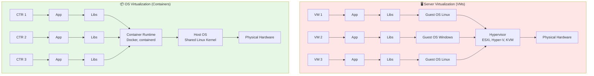

### Critical Distinction

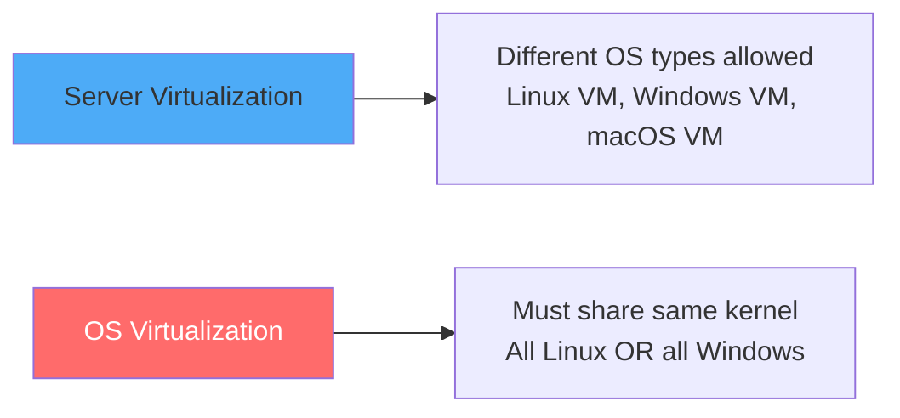

### VMs vs Containers Comparison

| Aspect | Virtual Machines | Containers |
|--------|------------------|------------|
| **Isolation Level** | Hardware-level (100%) | OS-level process (~80%) |
| **OS Flexibility** | Different OS per VM | Must share same kernel |
| **Resource Overhead** | Heavy (GBs per VM) | Light (MBs per container) |
| **Startup Time** | Minutes (OS boot) | Seconds (process start) |
| **Density** | 10-50 VMs per host | 100s-1000s per host |
| **Security Isolation** | Stronger | Weaker (improving) |
| **Best Use Cases** | Different OS, strong isolation, legacy | Microservices, cloud-native, CI/CD |

### Resource Efficiency Example

```
VM:        App (100MB) + OS (2GB) + Overhead = ~2.5 GB
Container: App (100MB) + Shared Libs (~50MB) = ~150 MB
                          ↑
                10-15x MORE EFFICIENT!
```

---

## Container Architecture

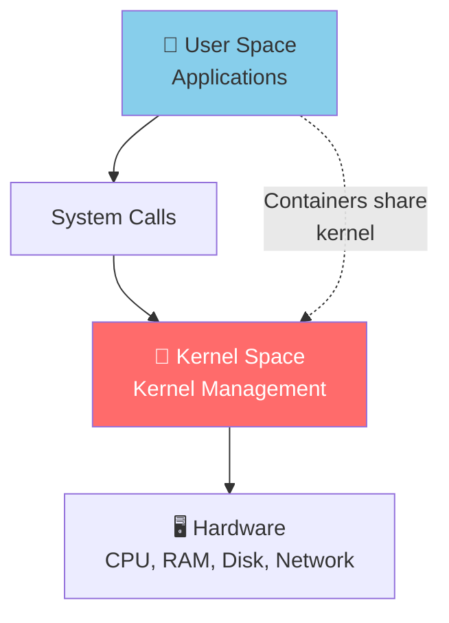

### Container Isolation Mechanisms

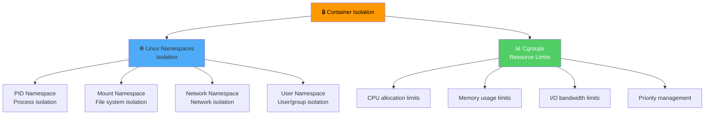

---

## Container Technology Evolution

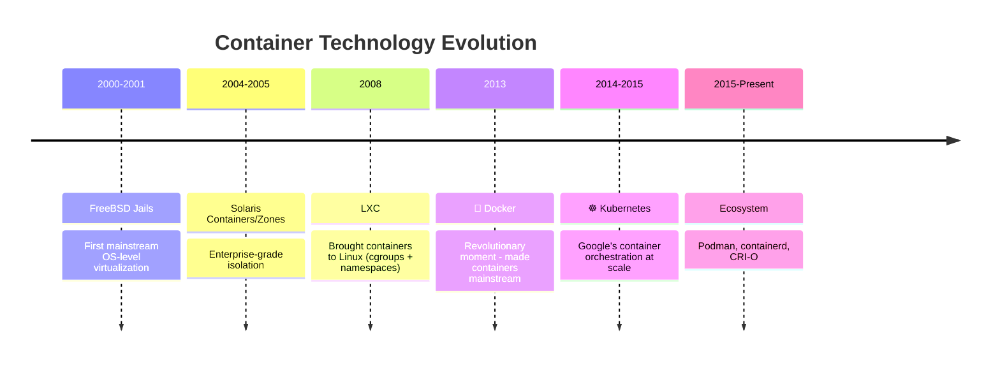

### Why Docker Succeeded

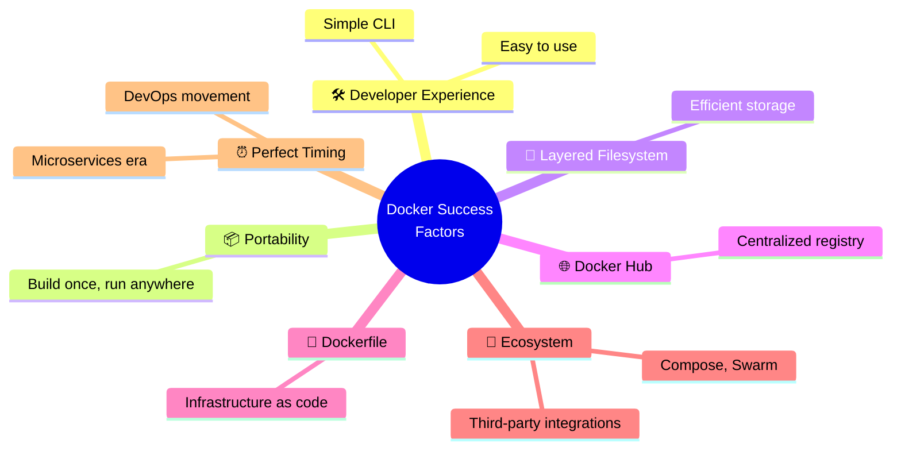

---

## Container Isolation Levels

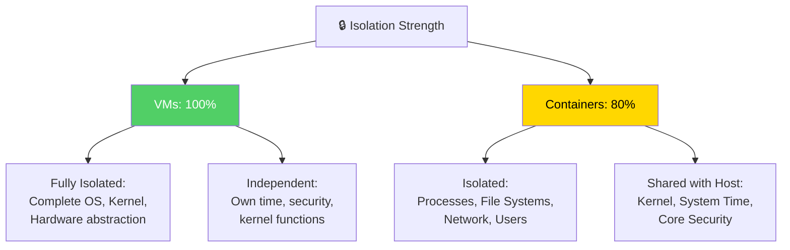

### Security Implication

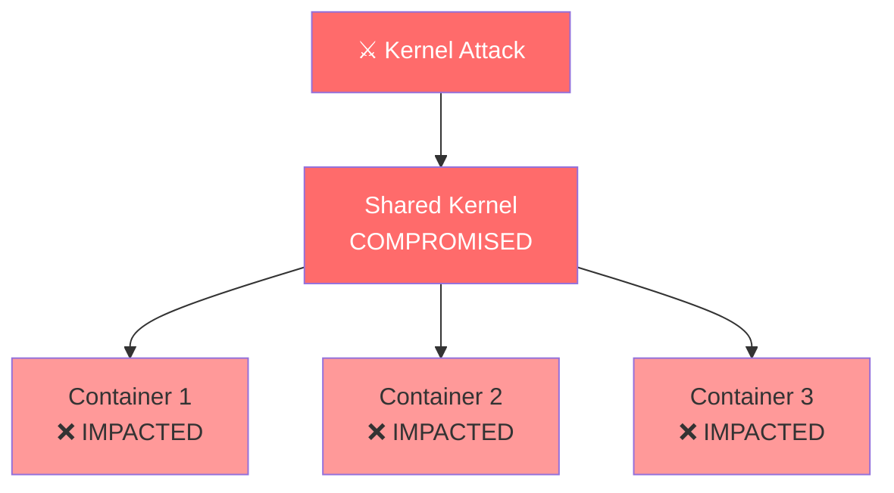

> 🎯 **Exam Tip:** If the shared kernel is compromised, **ALL containers** on that host are impacted. VMs provide superior isolation because each has its own kernel.

---

## VM vs Micro VM vs Container

| Factor | Virtual Machine (VM) | Micro VM | Containers |
|--------|---------------------|----------|------------|
| **Creation Time** | 60-120 seconds | 15-30 seconds | 2-5 seconds |
| **Isolation** | 100% (Full) | 100% (Same as VM) | 80% (Medium) |
| **Memory Footprint** | ~2GB OS | ~300MB OS | ~50MB |
| **Use Cases** | Critical/Legacy Apps | Secure Microservices | Rapid Scaling |

### Use Case Selection

| Workload Type | Best Choice | Reason |
|---------------|-------------|--------|
| **Critical/Legacy Apps** (CRM, ERP, DB) | VM | Full isolation, security |
| **Secure Microservices** | Micro VM | VM isolation + container speed |
| **Rapid Scaling Microservices** | Container | Speed and scaling capability |

### VM vs Container Security Architecture

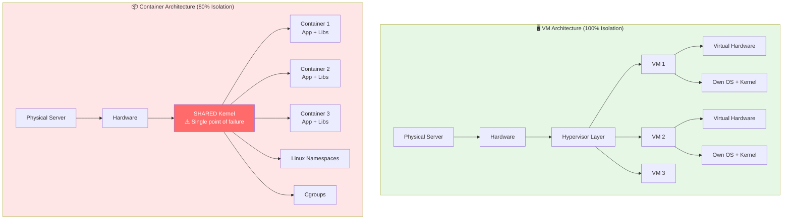

### Attack Vector Comparison

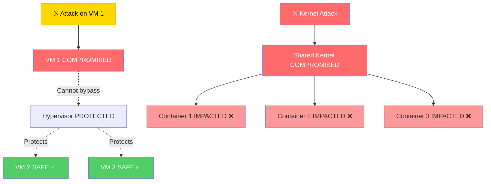

> ⚠️ **Security Warning:** If a vulnerability allows an attack on the shared Linux Kernel, **ALL containers** running on that OS are compromised. In VMs, each has its own kernel, containing the attack.

---

## Monolithic vs Microservices Architecture

### Monolithic Application (Example: Facebook)

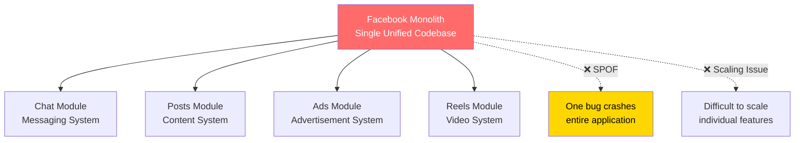

### Microservices Architecture (Example: Facebook Rebuilt)

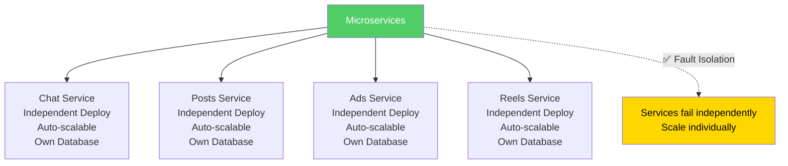

### Microservices Scaling Example

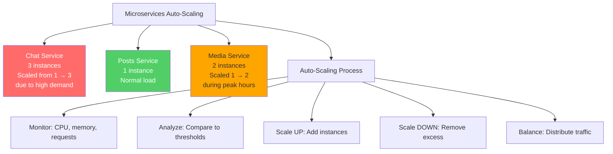

### Failure Impact Comparison

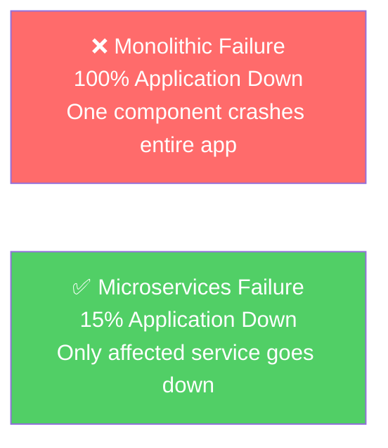

### Microservices Benefits

| Benefit | Description |
|---------|-------------|
| **Fault Isolation** | If one service fails, others remain operational |
| **Independent Scaling** | Scale specific services based on demand |
| **Technology Choice** | Different services can use different tech stacks |
| **Rapid Scaling** | Containers fit perfectly for microservices needs |

---

## Container Orchestration with Kubernetes

**Definition:** **Kubernetes (K8s)** is an open-source container orchestration platform that automates deployment, scaling, and management of containerized applications.

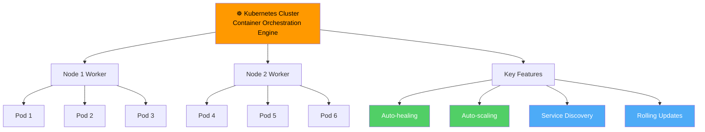

### Kubernetes Key Features

| Feature | Description |
|---------|-------------|
| **Auto-healing** | Automatically restart failed containers |
| **Auto-scaling** | Scale pods based on demand |
| **Service Discovery** | Containers find each other automatically |
| **Rolling Updates** | Update without downtime |
| **Load Balancing** | Distribute traffic across pods |
| **Self-healing** | Replace unhealthy containers |

### Kubernetes Operations Flow

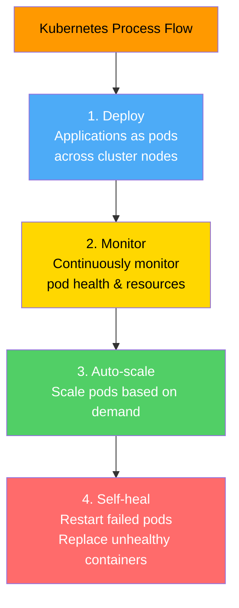

### Orchestration Tools Comparison

| Tool | Type | Scale |
|------|------|-------|
| **VMware vCenter** | VM Orchestration | Enterprise VM Management |
| **Docker Swarm** | Container Orchestration | Smaller scale |
| **Kubernetes (K8s)** | Container Orchestration | Most famous, large scale |

### VMware vCenter (Server Virtualization Management)

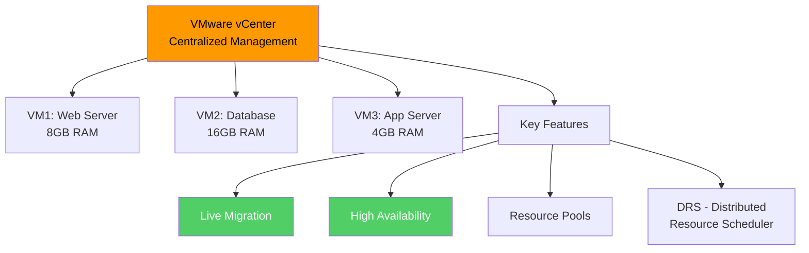

> 📌 **Key Insight:** Management & Orchestration is the **third vital layer** beyond just hypervisors. Hypervisors alone cannot provide advanced features like live migration, failover, and HA.

---

## AWS Container Services

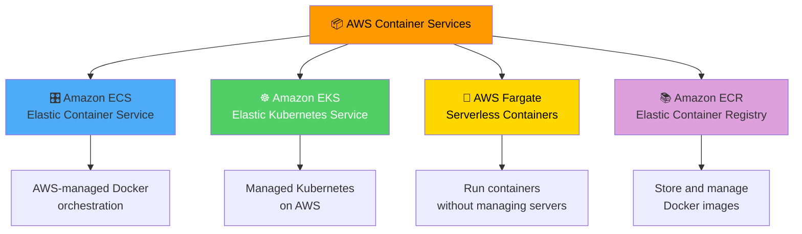

### AWS Container Services Comparison

| Service | Purpose | Best For |
|---------|---------|----------|
| **Amazon ECS** | AWS-managed Docker orchestration | AWS-native container workloads |
| **Amazon EKS** | Managed Kubernetes service | Kubernetes workloads on AWS |
| **AWS Fargate** | Serverless compute for containers | Run containers without managing servers |
| **Amazon ECR** | Managed Docker container registry | Store, manage, and deploy container images |

---

## Container Security: Root vs Rootless

### The Root Privilege Problem

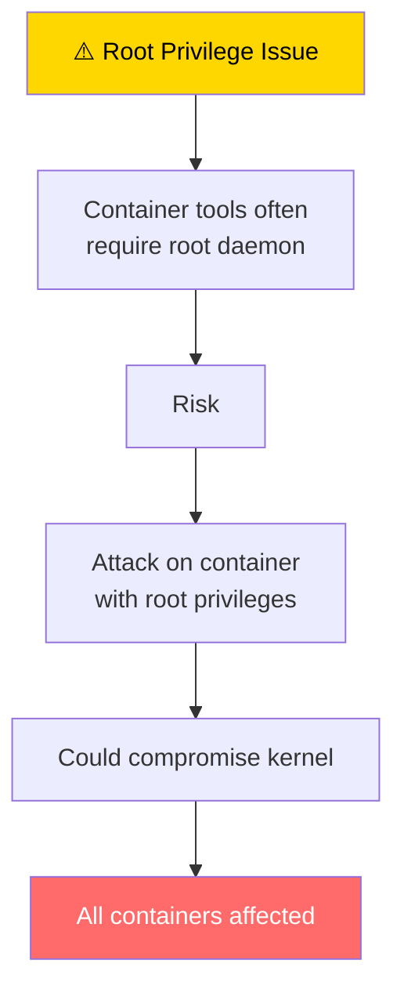

### Docker vs Podman

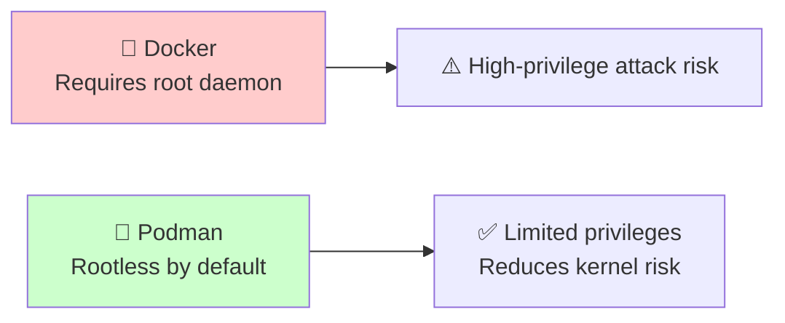

| Container Technology | Default Privilege | Security Implication |
|---------------------|-------------------|---------------------|
| **Docker** | Requires root daemon | High-privilege attack risk |
| **Podman (Red Hat)** | Rootless by default | Limited privileges, safer |

---

## Live Migration (Virtualization Feature)

**Live Migration** is the ability to transfer a running VM from one physical server to another **with minimal downtime** (2-5 seconds). This was impossible before virtualization.

```mermaid
graph TD
    Before[Pre-Virtualization<br/>Physically transport server<br/>via vehicle and airplane] -->|Old Way| Slow[Slow, downtime required]
    
    VM[Virtual Machine = Folder<br/>Collection of files<br/>virtual hardware, disk binaries] --> LM[Live Migration<br/>Transfer folder/files<br/>across network]
    
    LM --> Amazing[✨ Unprecedented Feature<br/>Video continues playing<br/>during transfer<br/>No interruption]
    
    style Before fill:#FF6B6B,color:#fff
    style VM fill:#4DABF7
    style LM fill:#51CF66,color:#fff
    style Amazing fill:#FFD700,color:#000
```

### Live Migration Sequence

```mermaid
graph LR
    Src[Source Server<br/>Cairo, Egypt<br/>Running VM<br/>High CPU Load<br/>Memory: 4GB Active]
    Dst[Target Server<br/>Frankfurt, Germany<br/>Ready to Receive<br/>Available Resources]
    
    Src -->|Step 1| PCopy[Pre-copy<br/>Memory Pages]
    PCopy -->|Step 2| Dirty[Dirty Pages<br/>Sync Changes]
    Dirty -->|Step 3| Stop[Stop & Copy<br/>Brief Pause<br/>2-5 seconds]
    Stop -->|Step 4| Resume[Resume<br/>Start Target VM<br/>Video continues<br/>Active processes]
    Resume --> Dst
    
    Src <-.->|10 Gbps Network| Dst
    
    style Src fill:#FFA500
    style Dst fill:#51CF66,color:#fff
    style Stop fill:#FF6B6B,color:#fff
```

### Live Migration Benefits

| Benefit | Description |
|---------|-------------|
| **Zero Downtime Maintenance** | Move VMs during hardware updates |
| **Load Balancing** | Distribute load across hosts |
| **Hardware Failure Recovery** | Move VM before host fails |
| **Geographic Optimization** | Move closer to users |
| **Seamless Experience** | No service interruption |

---

## House vs Apartment Analogy

```mermaid
graph TD
    Analogy[🏘️ Architecture Analogy] --> VM[VMs = Separate Houses]
    Analogy --> Container[Containers = Apartment Building]
    
    VM --> V1[Plot of land = Physical Server]
    VM --> V2[Plot Manager = Hypervisor]
    VM --> V3[Houses = Virtual Machines]
    VM --> V4[Fire in one house<br/>stays contained]
    
    Container --> C1[Building = Physical Server]
    Container --> C2[Foundation/Plumbing = Shared Kernel]
    Container --> C3[Apartments = Containers]
    Container --> C4[Structural failure<br/>affects all residents]
    
    style VM fill:#51CF66,color:#fff
    style Container fill:#FFD700,color:#000
```

---

## Container Security Best Practices

```mermaid
graph TD
    Best[🔒 Container Security Best Practices] --> B1[Avoid root privileges]
    Best --> B2[Use rootless containers]
    Best --> B3[Don't expose hosts to internet]
    Best --> B4[Regular kernel updates]
    Best --> B5[Use minimal base images]
    Best --> B6[Scan for vulnerabilities]
    Best --> B7[Network segmentation]
    
    style Best fill:#FF9900,color:#000
    style B1 fill:#51CF66,color:#fff
    style B2 fill:#51CF66,color:#fff
```

| Practice | Reason |
|----------|--------|
| **Avoid root privileges** | Prevents kernel-level attacks |
| **Use rootless containers** | Reduces attack surface (e.g., Podman) |
| **Don't expose hosts to internet** | Container hosts should only egress |
| **Regular kernel updates** | Patch kernel vulnerabilities |
| **Use minimal base images** | Reduce attack surface |
| **Scan for vulnerabilities** | Detect known issues |

---

## When to Use VMs vs Containers

```mermaid
flowchart TD
    Start{Choose VM or Container?} --> F1{Need different OS?}
    F1 -->|Yes| VM[🖥️ Use VMs]
    F1 -->|No| F2{Need strong isolation?}
    
    F2 -->|Yes, Critical| VM
    F2 -->|No| F3{Need rapid scaling?}
    
    F3 -->|Yes| Container[📦 Use Containers]
    F3 -->|No| F4{Need legacy support?}
    
    F4 -->|Yes| VM
    F4 -->|No| Either[Either works]
    
    style VM fill:#51CF66,color:#fff
    style Container fill:#FFD700,color:#000
```

### Decision Matrix

| Use Case | Recommendation | Reason |
|----------|---------------|--------|
| **Different OS requirements** | VMs | OS-level isolation |
| **Critical applications** (CRM, ERP) | VMs | Strong isolation, security |
| **Microservices** | Containers | Rapid scaling, efficiency |
| **CI/CD pipelines** | Containers | Fast startup, ephemeral |
| **Legacy applications** | VMs | OS flexibility, compatibility |
| **Development environments** | Containers | Quick provisioning |

---

## Hybrid Approaches (The Future)

| Technology | Description |
|------------|-------------|
| **Kubernetes on VMs** | Container orchestration on VM infrastructure |
| **OpenShift Virtualization** | Manage both VMs and containers in single platform |
| **Kata Containers** | Containers inside lightweight VMs for VM-level security |
| **Firecracker (AWS)** | Micro-VMs starting in milliseconds |

---

## Quick Reference

| Concept | Key Point |
|---------|-----------|
| **Containers** | Lightweight, OS-level virtualization, share kernel |
| **VMs** | Hardware-level virtualization, isolated kernels |
| **Isolation** | VMs = 100%, Containers = 80% |
| **Startup** | Containers = seconds, VMs = minutes |
| **Density** | 100s-1000s containers vs 10-50 VMs per host |
| **Docker** | Made containers mainstream (2013) |
| **Kubernetes** | Container orchestration at scale |
| **AWS ECS** | Managed Docker orchestration |
| **AWS EKS** | Managed Kubernetes |
| **AWS Fargate** | Serverless containers |

---

## 📝 Knowledge Check

<details>
<summary><strong>Q1: What is the main difference between containers and virtual machines?</strong></summary>

**A.** Containers are more expensive  
**B.** Containers share the host kernel; VMs have their own kernels  
**C.** Containers require more memory  
**D.** Containers are slower to start  

**Answer: B** — Containers share the host operating system kernel and use OS-level virtualization (~80% isolation), while VMs have their own guest OS and kernels (100% isolation). This makes containers more lightweight but less isolated.
</details>

<details>
<summary><strong>Q2: What is Kubernetes?</strong></summary>

**A.** A container runtime  
**B.** A container orchestration platform that automates deployment, scaling, and management  
**C.** A virtual machine hypervisor  
**D.** A storage service  

**Answer: B** — Kubernetes (K8s) is an open-source container orchestration platform that automates the deployment, scaling, and management of containerized applications across clusters of hosts.
</details>

<details>
<summary><strong>Q3: Which AWS service provides serverless container execution without managing servers?</strong></summary>

**A.** Amazon EC2  
**B.** Amazon ECS  
**C.** AWS Fargate  
**D.** Amazon EKS  

**Answer: C** — AWS Fargate is a serverless compute engine for containers that works with both ECS and EKS. It allows you to run containers without provisioning or managing servers.
</details>

<details>
<summary><strong>Q4: What is the main security risk of containers compared to VMs?</strong></summary>

**A.** Containers are more expensive  
**B.** Containers share the host kernel, so a kernel vulnerability affects all containers  
**C.** Containers cannot be encrypted  
**D.** Containers require more network bandwidth  

**Answer: B** — Containers share the host OS kernel, so if the kernel is compromised (via a kernel vulnerability or privilege escalation), ALL containers on that host are affected. VMs have separate kernels, providing better isolation.
</details>

---

## Navigation

⬅️ Previous: [Virtualization Fundamentals](./06-virtualization-fundamentals.md) | ➡️ Next: [Security Fundamentals](../04-security-architecture/01-security-fundamentals.md)  
🏠 [Back to README](../../README.md)

---

*Part of the [AWS Cloud Practitioner Study Notes](../../README.md).*