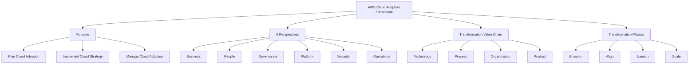
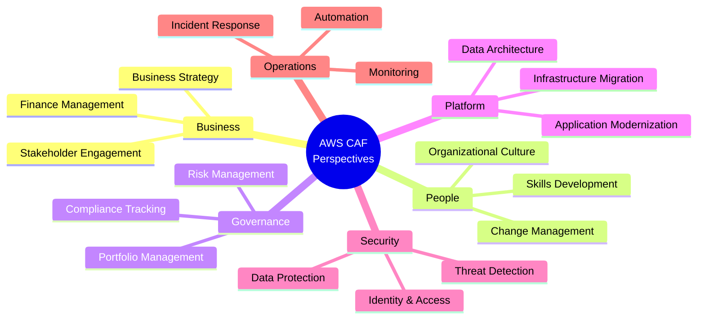
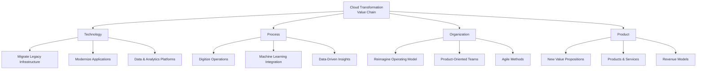
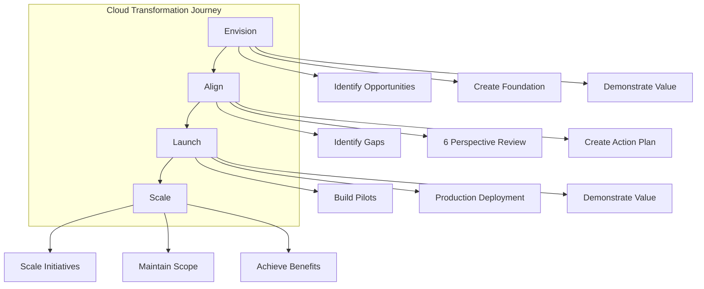

# AWS Cloud Adoption Framework (CAF)

## The Big Picture

> The AWS Cloud Adoption Framework (AWS CAF) assists in creating and executing a comprehensive plan for **digital transformation** using AWS.

AWS CAF was developed by AWS professionals, incorporating **AWS best practices** and insights from thousands of customers. It identifies key organizational capabilities essential for successful cloud transformations.

---

## AWS CAF Overview

---

## The Six Perspectives

AWS CAF organizes essential cloud transformation capabilities into **six perspectives**, each addressing a distinct aspect of the organization.

### Perspective Details

| Perspective | Focus | Key Capabilities |
|-------------|-------|------------------|
| **Business** | Business strategy and outcomes | Finance, business strategy, stakeholder management |
| **People** | Workforce transformation | Skills development, change management, culture |
| **Governance** | Risk and compliance management | Portfolio management, risk management, compliance |
| **Platform** | Infrastructure migration & modernization | Compute, storage, databases, networking, analytics |
| **Security** | Safeguarding cloud resources | Identity, data protection, threat detection |
| **Operations** | Running cloud workloads | Monitoring, incident response, automation |

---

## Cloud Transformation Value Chain

The **Cloud Transformation Value Chain** describes the four key areas of transformation that organizations must address.

### Value Chain Details

#### 1. Technology

| Aspect | Description |
|--------|-------------|
| **Focus** | Utilizing the cloud to migrate and modernize legacy infrastructure, applications, data, and analytics platforms |
| **Activities** | Infrastructure migration, application modernization, data platform development |

#### 2. Process

| Aspect | Description |
|--------|-------------|
| **Focus** | Digitizing, automating, and optimizing business operations |
| **Activities** | Leveraging new data and analytics platforms for actionable insights, using ML to enhance customer service |

#### 3. Organization

| Aspect | Description |
|--------|-------------|
| **Focus** | Reimagining the operating model |
| **Activities** | Organizing teams around products and value streams, leveraging agile methods for rapid iteration |

#### 4. Product

| Aspect | Description |
|--------|-------------|
| **Focus** | Reimagining the business model |
| **Activities** | Creating new value propositions (products and services) and revenue models |

---

## Transformation Phases

The cloud transformation journey follows **four phases** that guide organizations from initial planning to full-scale implementation.

### Phase 1: Envision

| Aspect | Description |
|--------|-------------|
| **Purpose** | Demonstrate how the cloud will accelerate business outcomes |
| **Activities** | Identify transformation opportunities and create a foundation for digital transformation |

### Phase 2: Align

| Aspect | Description |
|--------|-------------|
| **Purpose** | Identify capability gaps across the 6 AWS CAF Perspectives |
| **Activities** | Assess current state, identify gaps, create an Action Plan |

### Phase 3: Launch

| Aspect | Description |
|--------|-------------|
| **Purpose** | Build and deliver pilot initiatives in production |
| **Activities** | Develop pilot solutions, deploy to production, demonstrate incremental business value |

### Phase 4: Scale

| Aspect | Description |
|--------|-------------|
| **Purpose** | Scale up pilot initiatives to achieve desired business benefits |
| **Activities** | Expand successful pilots while maintaining intended scope and impact |

---

## Key Takeaways

1. **AWS CAF** provides comprehensive guidelines for cloud adoption, developed from AWS best practices and thousands of customer insights
2. **Six Perspectives** organize transformation capabilities:
   - Business, People, Governance (business-focused)
   - Platform, Security, Operations (technical-focused)
3. **Transformation Value Chain** covers Technology, Process, Organization, and Product
4. **Four Phases** guide the journey: Envision → Align → Launch → Scale
5. **Envision** - Identify opportunities and create transformation foundation
6. **Align** - Identify gaps across 6 perspectives and create action plan
7. **Launch** - Build and deploy pilot initiatives in production
8. **Scale** - Expand pilots to achieve desired business benefits

---

## Next Steps

⬅️ Previous: [AWS Global Infrastructure](./03-aws-global-infrastructure.md) | ➡️ Next: [Well-Architected Framework](./05-well-architected-framework.md)

---

*Part of the [AWS Cloud Practitioner Study Notes](../README.md).*
