# AWS Security Fundamentals & Compliance

> ⏱️ **Estimated Study Time:** 20 minutes  
> 🎯 **CCP Exam Weight:** ~20-25% (Domain 2: Security & Compliance)

---

## The Big Picture

AWS provides a **comprehensive suite of security services** to protect your infrastructure, data, and applications. Understanding IAM, Security Groups, encryption, and compliance programs is essential for the CCP exam and real-world AWS usage.

---

## AWS Security Services Overview

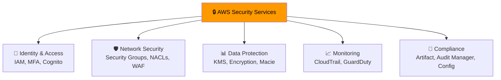

---

## 1. AWS IAM (Identity and Access Management)

**Definition:** Service that **manages access** to AWS resources by controlling who is authenticated and authorized to use them.

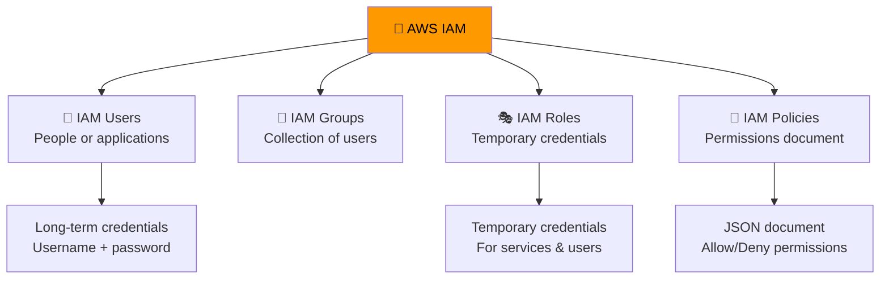

### IAM Core Concepts

| Component | Purpose | Use Case |
|-----------|---------|----------|
| **IAM User** | Identity for a person or application | Individual team members |
| **IAM Group** | Collection of users with shared permissions | All developers, all admins |
| **IAM Role** | Temporary identity with specific permissions | EC2 accessing S3, cross-account access |
| **IAM Policy** | JSON document defining permissions | Allow/deny specific actions |

### IAM Policy Structure

```json
{
  "Version": "2012-10-17",
  "Statement": [
    {
      "Effect": "Allow",
      "Action": "s3:GetObject",
      "Resource": "arn:aws:s3:::my-bucket/*"
    }
  ]
}
```

### IAM Best Practices

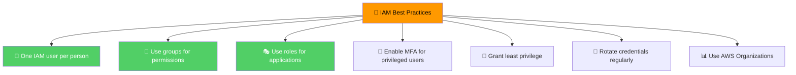

> 🎯 **Exam Tip:** Follow the **principle of least privilege** — grant only the permissions needed to perform a task. Never use the root account for daily tasks.

### Root Account Best Practices

| Practice | Reason |
|----------|--------|
| **Don't use root for daily tasks** | Create IAM users instead |
| **Enable MFA on root** | Extra security layer |
| **Lock away root credentials** | Use only for account management |
| **Create admin IAM user** | For administrative tasks |

---

## 2. Security Groups

**Definition:** **Virtual firewall** for EC2 instances that controls inbound and outbound traffic at the instance level.

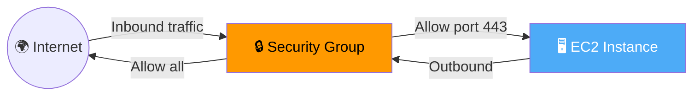

### Security Group Characteristics

| Feature | Description |
|---------|-------------|
| **Level** | Instance-level (attached to ENI) |
| **State** | Stateful (return traffic auto-allowed) |
| **Rules** | Allow rules only (no explicit deny) |
| **Default** | Deny all inbound, allow all outbound |
| **Scope** | Specific region and VPC |
| **Attachment** | Can be attached to multiple instances |

### Security Group Rules

| Direction | Default | Common Rules |
|-----------|---------|--------------|
| **Inbound** | Deny all | Allow SSH (22) from specific IP |
| | | Allow HTTP (80) from anywhere |
| | | Allow HTTPS (443) from anywhere |
| **Outbound** | Allow all | Allow all (default) |

### Troubleshooting Connection Issues

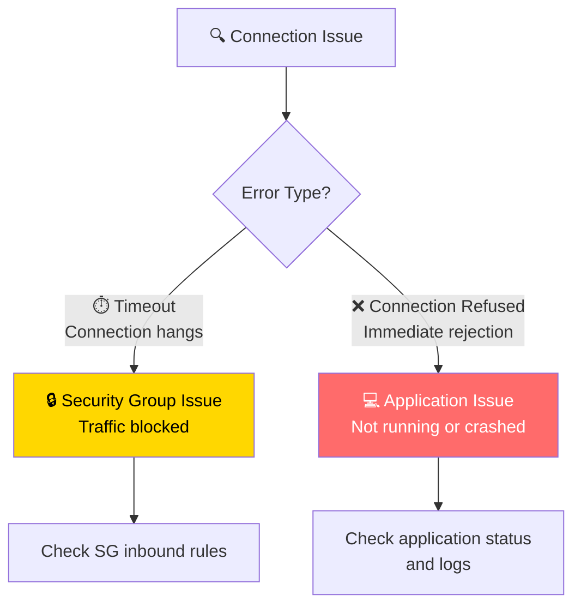

> 🎯 **Exam Tip:** **Timeout** = Security Group issue (traffic blocked). **Connection Refused** = Application issue (not running).

### Common Ports Reference

| Port | Protocol | Use Case |
|------|----------|----------|
| **22** | SSH | Logging into Linux instances |
| **21** | FTP | Uploading files to file share |
| **80** | HTTP | Accessing unsecured websites |
| **443** | HTTPS | Accessing secured websites |
| **3389** | RDP | Logging into Windows instances |
| **3306** | MySQL | MySQL database connections |
| **5432** | PostgreSQL | PostgreSQL database connections |

---

## 3. Data Protection & Encryption

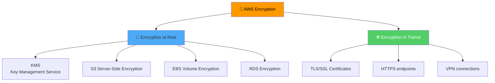

### AWS KMS (Key Management Service)

**Definition:** Managed service that makes it easy to create and control **encryption keys** used to encrypt your data.

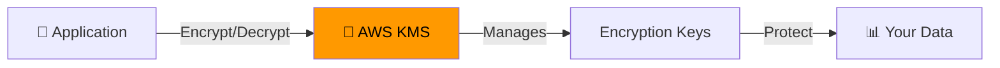

### KMS Key Types

| Type | Description | Use Case |
|------|-------------|----------|
| **AWS Managed Keys** | Created and managed by AWS | Free, automatic rotation |
| **Customer Managed Keys** | You create and manage | Full control, audit trail |
| **Custom Key Store** | Using CloudHSM | Regulatory compliance |

---

## 4. AWS WAF (Web Application Firewall)

**Definition:** Firewall that protects web applications from **common web exploits** (SQL injection, XSS, etc.).

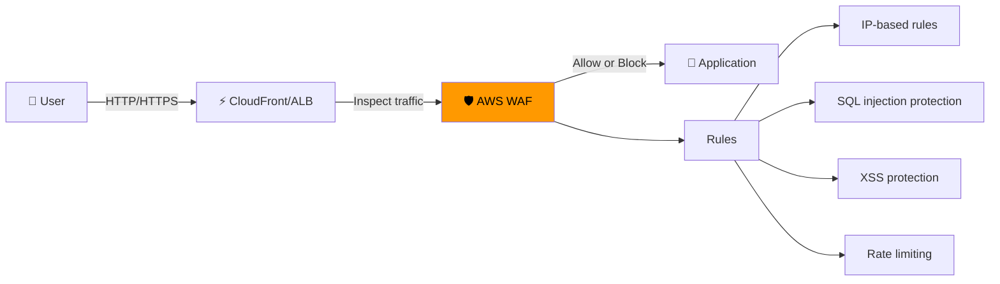

### WAF Protection Features

| Feature | Description |
|---------|-------------|
| **SQL Injection Protection** | Blocks malicious SQL queries |
| **Cross-Site Scripting (XSS)** | Prevents script injection attacks |
| **IP Allow/Block Lists** | Geographic or IP-based restrictions |
| **Rate Limiting** | Prevents DDoS and brute force attacks |
| **Bot Protection** | Identifies and blocks malicious bots |

---

## 5. AWS Shield

**Definition:** **DDoS protection** service that safeguards applications from Distributed Denial of Service attacks.

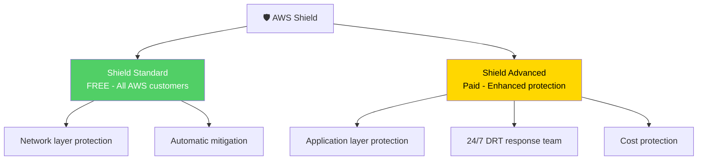

---

## 6. Monitoring & Logging

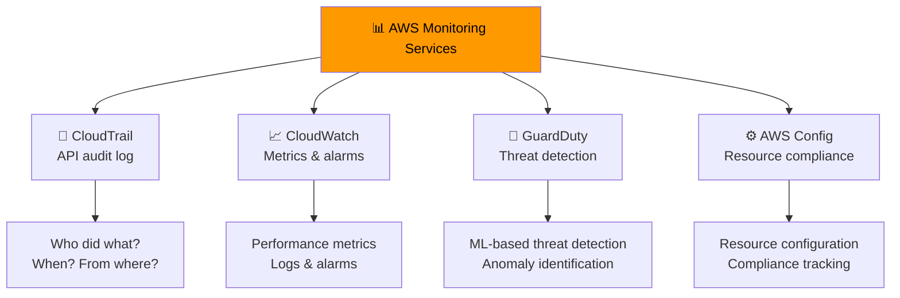

### Monitoring Services Comparison

| Service | Purpose | Key Feature |
|---------|---------|-------------|
| **CloudTrail** | Audit API calls | Who, what, when, where |
| **CloudWatch** | Monitor resources | Metrics, logs, alarms |
| **GuardDuty** | Threat detection | ML-based anomaly detection |
| **AWS Config** | Track configurations | Compliance and change history |
| **VPC Flow Logs** | Network traffic | IP traffic information |
| **Trusted Advisor** | Optimization | Cost, security, performance checks |

---

## 7. Compliance Programs

**Definition:** AWS maintains **compliance certifications** and provides tools to help you meet regulatory requirements.

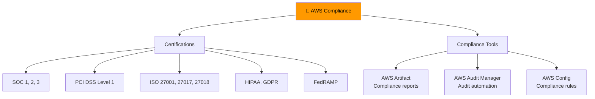

### AWS Artifact

**Definition:** Self-service portal to **access AWS compliance reports** and agreements.

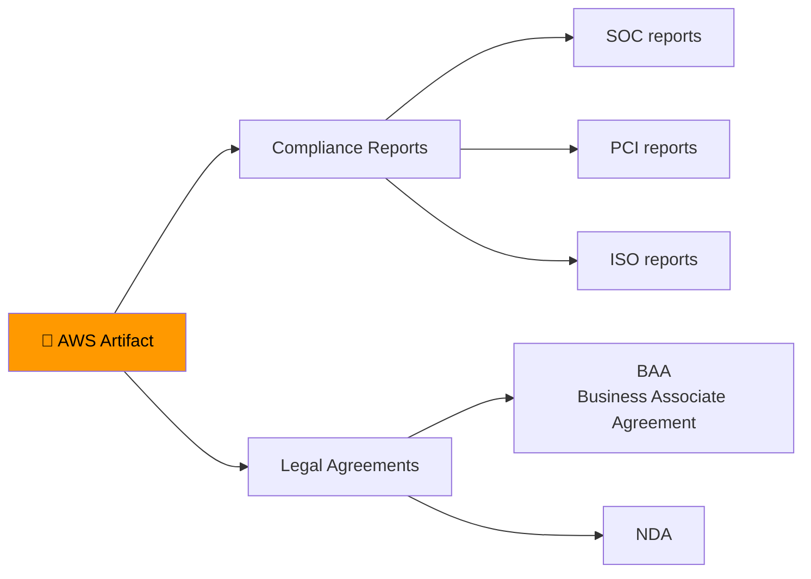

---

## 8. Data Protection Best Practices

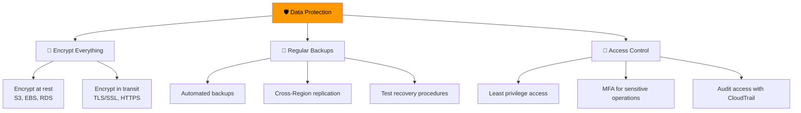

### Encryption Decision Tree

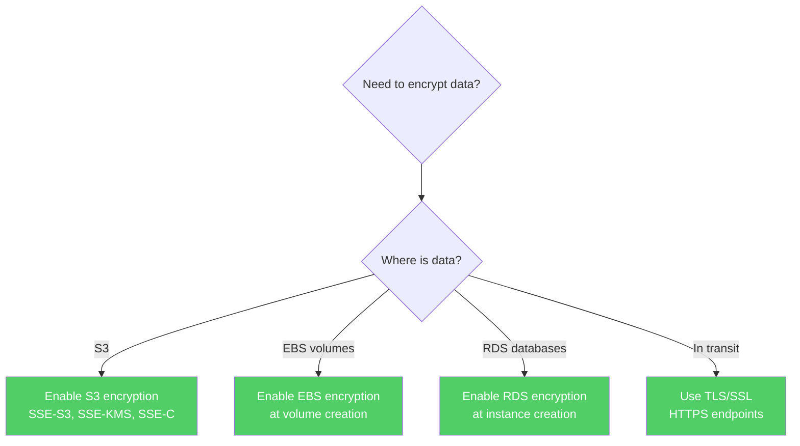

> 🎯 **Exam Tip:** Encryption should be enabled **at creation time** for resources like EBS volumes and RDS instances. Enabling later is more complex.

---

## Security Services Summary

| Service | Purpose | Key Use Case |
|---------|---------|--------------|
| **IAM** | Identity & access management | User/role management |
| **Security Groups** | Instance firewall | Network access control |
| **KMS** | Encryption key management | Encrypt data |
| **WAF** | Web application firewall | Protect web apps |
| **Shield** | DDoS protection | Prevent DDoS attacks |
| **CloudTrail** | API audit logging | Track API calls |
| **CloudWatch** | Monitoring & alarms | Performance monitoring |
| **GuardDuty** | Threat detection | Identify security threats |
| **AWS Config** | Configuration compliance | Track resource changes |
| **AWS Artifact** | Compliance reports | Access compliance docs |

---

## Quick Reference

| Concept | Key Point |
|---------|-----------|
| **IAM** | Manage users, groups, roles, policies |
| **Least Privilege** | Grant only necessary permissions |
| **Security Groups** | Stateful instance-level firewall |
| **Network ACLs** | Stateless subnet-level firewall |
| **KMS** | Managed encryption keys |
| **Encryption** | At rest and in transit |
| **WAF** | Web application firewall |
| **Shield** | DDoS protection |
| **CloudTrail** | API audit log |
| **Root Account** | Lock away, use IAM users instead |

---

## 📝 Knowledge Check

<details>
<summary><strong>Q1: According to the AWS Shared Responsibility Model, who is responsible for patching the guest OS on an EC2 instance?</strong></summary>

**A.** AWS  
**B.** The customer  
**C.** Both share equally  
**D.** AWS Support  

**Answer: B** — In the Shared Responsibility Model, AWS manages the host OS and hypervisor, but the customer is responsible for patching and securing the guest operating system on EC2 instances.
</details>

<details>
<summary><strong>Q2: What is the difference between a Security Group and a Network ACL?</strong></summary>

**A.** Security Groups are stateless, NACLs are stateful  
**B.** Security Groups operate at instance level (stateful), NACLs at subnet level (stateless)  
**C.** They are the same thing  
**D.** Security Groups are for Linux, NACLs are for Windows  

**Answer: B** — Security Groups operate at the instance level and are stateful (return traffic is automatically allowed). Network ACLs operate at the subnet level and are stateless (return traffic must be explicitly allowed).
</details>

<details>
<summary><strong>Q3: Which service provides managed encryption keys for protecting your data?</strong></summary>

**A.** AWS WAF  
**B.** AWS Shield  
**C.** AWS KMS  
**D.** AWS GuardDuty  

**Answer: C** — AWS Key Management Service (KMS) makes it easy to create and manage encryption keys used to encrypt your data across AWS services.
</details>

<details>
<summary><strong>Q4: What should you do with the AWS root account?</strong></summary>

**A.** Use it for daily tasks  
**B.** Share it with team members  
**C.** Lock it away, enable MFA, use IAM users instead  
**D.** Delete it  

**Answer: C** — The root account should be locked away, have MFA enabled, and only be used for account management tasks. Create IAM users with appropriate permissions for daily tasks following the principle of least privilege.
</details>

---

## Navigation

⬅️ Previous: [Containers & Orchestration](../03-aws-services/07-containers-orchestration.md) | ➡️ Next: [Cloud Adoption Framework](./02-cloud-adoption-framework.md)  
🏠 [Back to README](../../README.md)

---

*Part of the [AWS Cloud Practitioner Study Notes](../../README.md).*