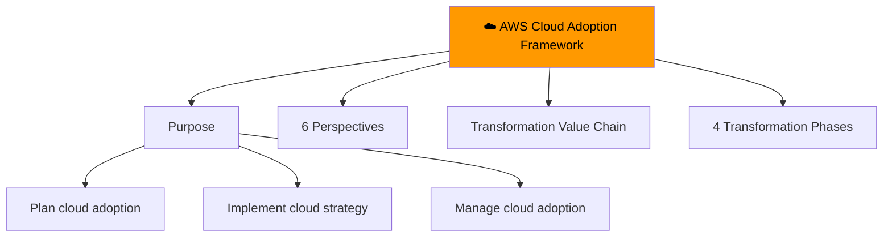
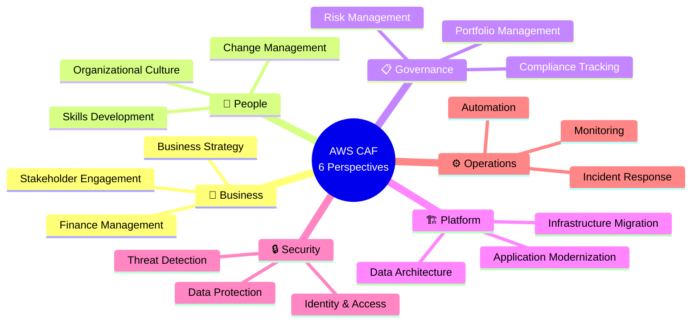
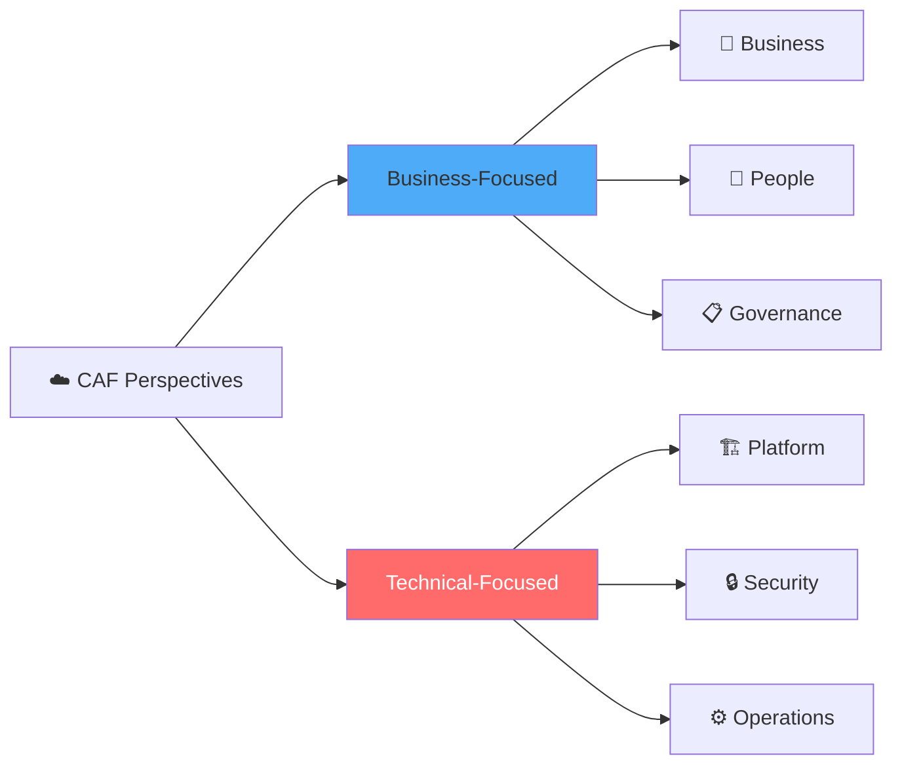
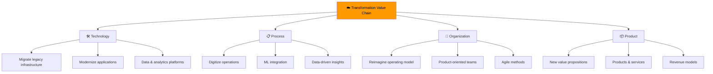
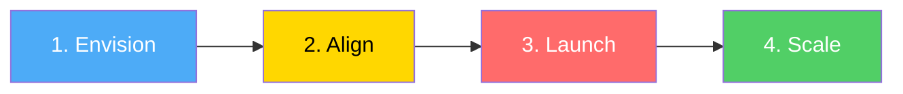
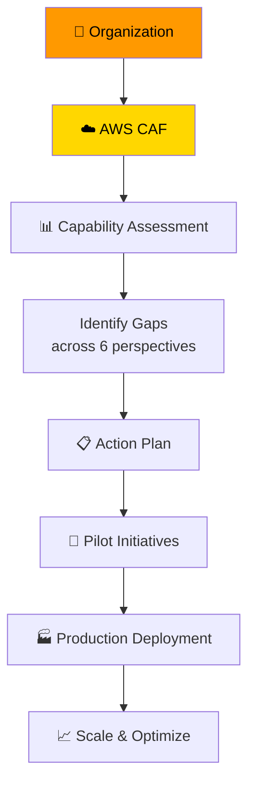

# AWS Cloud Adoption Framework (CAF)

> ⏱️ **Estimated Study Time:** 12 minutes  
> 🎯 **CCP Exam Weight:** ~5-8% (Domain 5: Cloud Transformation)

---

## The Big Picture

The **AWS Cloud Adoption Framework (CAF)** provides guidance and best practices to help organizations **plan and execute** successful cloud transformation journeys. It identifies organizational capabilities needed for cloud adoption across six perspectives.

---

## CAF Overview

---

## The 6 Perspectives

### Perspective Groups

### Perspective Details

| Perspective | Focus | Key Capabilities |
|-------------|-------|------------------|
| **💼 Business** | Business strategy and outcomes | Finance, business strategy, stakeholder management |
| **👥 People** | Workforce transformation | Skills development, change management, culture |
| **📋 Governance** | Risk and compliance management | Portfolio management, risk management, compliance |
| **🏗️ Platform** | Infrastructure migration & modernization | Compute, storage, databases, networking |
| **🔒 Security** | Safeguarding cloud resources | Identity, data protection, threat detection |
| **⚙️ Operations** | Running cloud workloads | Monitoring, incident response, automation |

---

## Cloud Transformation Value Chain

### Value Chain Details

#### 🛠️ Technology
- Migrate legacy infrastructure
- Modernize applications
- Build data and analytics platforms

#### 📋 Process
- Digitize and automate business operations
- Leverage ML for customer service
- Data-driven decision making

#### 👥 Organization
- Reimagine operating model
- Organize teams around products
- Adopt agile methods

#### 📦 Product
- Create new value propositions
- Develop new products and services
- Explore new revenue models

---

## 4 Transformation Phases

### Phase Details

```mermaid
graph TD
    Env[1. Envision<br/>Identify Opportunities] --> Env1[Identify transformation opportunities]
    Env --> Env2[Create foundation]
    Env --> Env3[Demonstrate value]
    
    Aln[2. Align<br/>Identify Gaps] --> Aln1[Assess current state]
    Aln --> Aln2[Identify gaps across<br/>6 perspectives]
    Aln --> Aln3[Create Action Plan]
    
    Lch[3. Launch<br/>Build Pilots] --> Lch1[Build pilot initiatives]
    Lch --> Lch2[Deploy to production]
    Lch --> Lch3[Demonstrate incremental value]
    
    Scl[4. Scale<br/>Expand Success] --> Scl1[Scale pilot initiatives]
    Scl --> Scl2[Maintain scope and impact]
    Scl --> Scl3[Achieve desired benefits]
    
    style Env fill:#4DABF7,color:#fff
    style Aln fill:#FFD700,color:#000
    style Lch fill:#FF6B6B,color:#fff
    style Scl fill:#51CF66,color:#fff
```

### Phase Comparison

| Phase | Purpose | Key Activities |
|-------|---------|----------------|
| **1. Envision** | Demonstrate how cloud accelerates business | Identify opportunities, create foundation |
| **2. Align** | Identify capability gaps | Assess current state, create Action Plan |
| **3. Launch** | Build and deliver pilots | Deploy to production, demonstrate value |
| **4. Scale** | Scale up successful pilots | Expand while maintaining scope |

> 🎯 **Exam Tip:** Remember the transformation journey: **Envision → Align → Launch → Scale**.

---

## CAF in Action

---

## Quick Reference

| Concept | Key Point |
|---------|-----------|
| **CAF** | Framework for cloud adoption guidance |
| **6 Perspectives** | Business, People, Governance, Platform, Security, Operations |
| **Business-Focused** | Business, People, Governance |
| **Technical-Focused** | Platform, Security, Operations |
| **Value Chain** | Technology, Process, Organization, Product |
| **4 Phases** | Envision → Align → Launch → Scale |

---

## 📝 Knowledge Check

<strong>Q1: How many perspectives does the AWS Cloud Adoption Framework have?</strong>

**A.** 4  
**B.** 5  
**C.** 6  
**D.** 8  

**Answer: C** — The AWS CAF has 6 perspectives: Business, People, Governance, Platform, Security, and Operations.

<strong>Q2: What are the 4 transformation phases in order?</strong>

**A.** Plan, Build, Run, Optimize  
**B.** Envision, Align, Launch, Scale  
**C.** Design, Develop, Deploy, Maintain  
**D.** Assess, Migrate, Optimize, Scale  

**Answer: B** — The 4 transformation phases are: Envision → Align → Launch → Scale. Envision identifies opportunities, Align identifies gaps, Launch builds pilots, Scale expands successful pilots.

<strong>Q3: Which CAF perspective focuses on workforce transformation and skills development?</strong>

**A.** Business  
**B.** People  
**C.** Governance  
**D.** Platform  

**Answer: B** — The People perspective focuses on workforce transformation, including skills development, change management, and organizational culture.

---

## Navigation

⬅️ Previous: [Security Fundamentals](./01-security-fundamentals.md) | ➡️ Next: [Well-Architected Framework](./03-well-architected-framework.md)  
🏠 [Back to README](../../README.md)

---

*Part of the [AWS Cloud Practitioner Study Notes](../../README.md).*