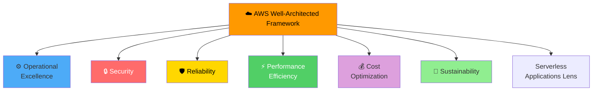
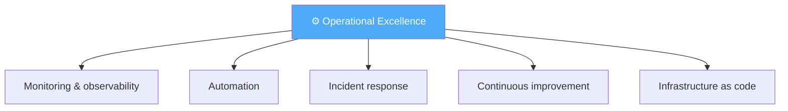
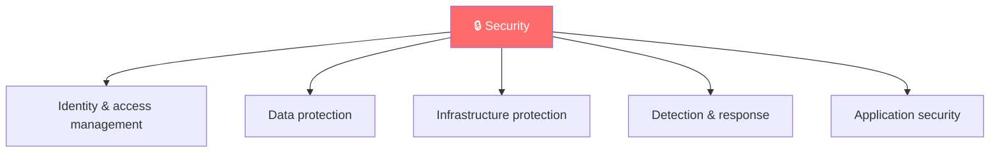
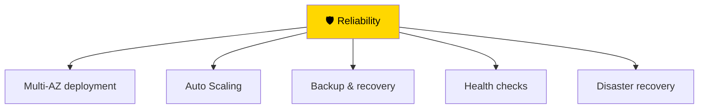
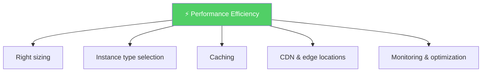
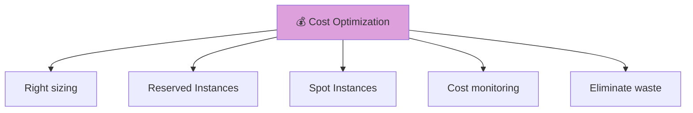
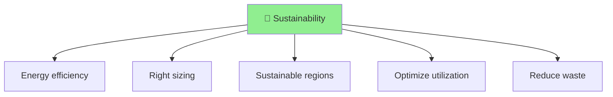
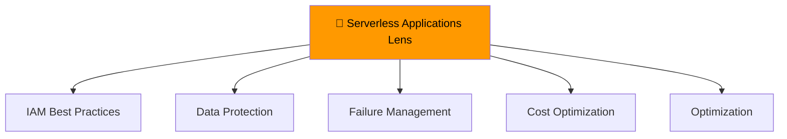
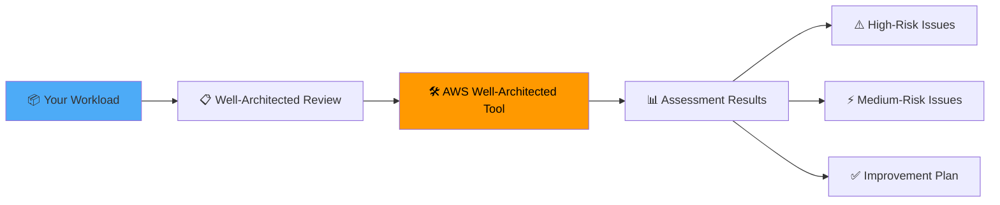
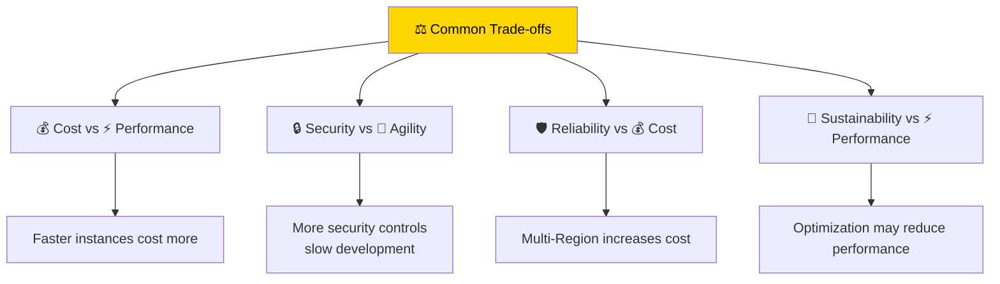

# AWS Well-Architected Framework

> ⏱️ **Estimated Study Time:** 15 minutes  
> 🎯 **CCP Exam Weight:** ~5-8% (Domain 4: Cloud Technology & Services)

---

## The Big Picture

The **AWS Well-Architected Framework** describes **best practices** and principles for building secure, high-performing, resilient, and efficient cloud workloads. It consists of **six pillars** that serve as a foundation for architecture decisions.

---

## The 6 Pillars Overview



> 🎯 **Exam Tip:** Remember the 6 pillars: **Operational Excellence, Security, Reliability, Performance Efficiency, Cost Optimization, Sustainability**.

---

## The 6 Pillars Explained

### 1. Operational Excellence ⚙️

**Focus:** Run and monitor systems to deliver business value and continuously improve processes.



| Practice | Description |
|----------|-------------|
| **Monitoring** | Track metrics, logs, and traces |
| **Automation** | Use CloudFormation, Terraform |
| **Incident Response** | Document and test procedures |
| **Continuous Improvement** | Learn from incidents and feedback |

---

### 2. Security 🔒

**Focus:** Protect information, systems, and assets while delivering business value.



| Practice | Description |
|----------|-------------|
| **IAM** | Least privilege, MFA, role-based access |
| **Encryption** | At rest and in transit |
| **Network Security** | Security groups, NACLs, WAF |
| **Detection** | GuardDuty, CloudTrail, Config |

---

### 3. Reliability 🛡️

**Focus:** Ensure workloads perform their intended function correctly and consistently.



| Practice | Description |
|----------|-------------|
| **Multi-AZ** | Deploy across multiple Availability Zones |
| **Auto Scaling** | Handle load changes automatically |
| **Backups** | Regular automated backups, cross-Region |
| **Health Checks** | Monitor and replace unhealthy instances |

---

### 4. Performance Efficiency ⚡

**Focus:** Use IT and computing resources efficiently to meet system requirements.



| Practice | Description |
|----------|-------------|
| **Right Sizing** | Match instance size to workload |
| **Caching** | ElastiCache, CloudFront |
| **CDN** | CloudFront for global content delivery |
| **Monitoring** | Identify performance bottlenecks |

---

### 5. Cost Optimization 💰

**Focus:** Run systems to deliver business value at the lowest price point.



| Practice | Description |
|----------|-------------|
| **Right Sizing** | Match capacity to actual needs |
| **Reserved Instances** | Commit for 1-3 years for discounts |
| **Spot Instances** | Use spare capacity at up to 90% off |
| **Cost Monitoring** | Cost Explorer, Budgets |

---

### 6. Sustainability 🌱

**Focus:** Minimize the environmental impact of cloud workloads.



| Practice | Description |
|----------|-------------|
| **Right Sizing** | Avoid over-provisioning |
| **Efficient Regions** | Choose Regions with lower carbon impact |
| **Utilization** | Maximize resource utilization |
| **Reduce Waste** | Delete unused resources |

---

## Pillar Comparison

| Pillar | Key Question | Focus Area |
|--------|-------------|------------|
| **Operational Excellence** | Are we running and monitoring well? | Processes, automation |
| **Security** | Is our data and system protected? | Confidentiality, integrity |
| **Reliability** | Will it work consistently? | Recovery, resilience |
| **Performance Efficiency** | Are we using resources efficiently? | Speed, optimization |
| **Cost Optimization** | Are we minimizing costs? | Spending efficiency |
| **Sustainability** | What's our environmental impact? | Energy, carbon footprint |

---

## Serverless Applications Lens

**Definition:** Specialized lens of the Well-Architected Framework addressing **serverless application** best practices.



### Serverless Best Practices

```mermaid
mindmap
  root((Serverless Best<br/>Practices))
  🛡️ Failure Management
    Dead-Letter Queue
    Investigate & Retry
    Roll Back Transactions
  🔐 Access Control
    Cognito User Pools
    Lambda Authorizers
    Resource Policies
    Least Privilege
  🔒 Data Protection
    Encrypt in Transit
    Encrypt at Rest
    Validate Input
  💰 Cost Optimization
    Optimize Memory
    Reduce Cold Starts
    Direct Integrations
  ⚡ Performance
    Fast Initialization
    Well-scoped Functions
```

### Quick Reference Table

| Pillar | Best Practice |
|--------|---------------|
| **Identity & Access** | Cognito, Lambda authorizers, resource policies, least privilege |
| **Data Protection** | Encrypt data in transit and at rest, validate inputs |
| **Failure Management** | Implement DLQ, use Step Functions for rollback |
| **Cost-Effective** | Optimize memory, reduce cold starts, direct integrations |
| **Optimization** | Replace unnecessary Lambda functions with direct service integrations |

---

## Well-Architected Tool

**Definition:** Free AWS tool that helps you **review your workloads** against the 6 pillars and identify improvements.



---

## Trade-offs Between Pillars



> 🎯 **Exam Tip:** The pillars are not independent — optimizing for one may impact another. Balance trade-offs based on business requirements.

---

## Quick Reference

| Pillar | Key Focus |
|--------|-----------|
| **Operational Excellence** | Run and monitor systems effectively |
| **Security** | Protect data and systems |
| **Reliability** | Ensure consistent, correct operation |
| **Performance Efficiency** | Use resources efficiently |
| **Cost Optimization** | Minimize costs |
| **Sustainability** | Minimize environmental impact |

---

## 📝 Knowledge Check

<details>
<summary><strong>Q1: How many pillars are in the AWS Well-Architected Framework?</strong></summary>

**A.** 4  
**B.** 5  
**C.** 6  
**D.** 7  

**Answer: C** — The AWS Well-Architected Framework has 6 pillars: Operational Excellence, Security, Reliability, Performance Efficiency, Cost Optimization, and Sustainability.
</details>

<details>
<summary><strong>Q2: Which pillar focuses on protecting information, systems, and assets?</strong></summary>

**A.** Operational Excellence  
**B.** Security  
**C.** Reliability  
**D.** Cost Optimization  

**Answer: B** — The Security pillar focuses on protecting information, systems, and assets while delivering business value through risk assessment and mitigation strategies.
</details>

<details>
<summary><strong>Q3: Which pillar focuses on using IT resources efficiently to meet system requirements?</strong></summary>

**A.** Operational Excellence  
**B.** Security  
**C.** Reliability  
**D.** Performance Efficiency  

**Answer: D** — The Performance Efficiency pillar focuses on using IT and computing resources efficiently to meet system requirements, including right-sizing, caching, and using appropriate instance types.
</details>

---

## Navigation

⬅️ Previous: [Cloud Adoption Framework](./02-cloud-adoption-framework.md) | ➡️ Next: [Pricing Models](../05-pricing-ecosystem/01-pricing-models.md)  
🏠 [Back to README](../../README.md)

---

*Part of the [AWS Cloud Practitioner Study Notes](../../README.md).*