# AWS Pricing Models

> ⏱️ **Estimated Study Time:** 18 minutes  
> 🎯 **CCP Exam Weight:** ~12-15% (Domain 4: Billing & Pricing)

---

## The Big Picture

AWS uses a **pay-as-you-go pricing model** that provides flexibility and cost optimization. Understanding the 4 core pricing principles and EC2 purchasing options is essential for cost management and heavily tested on the CCP exam.

---

## 4 Core AWS Pricing Principles

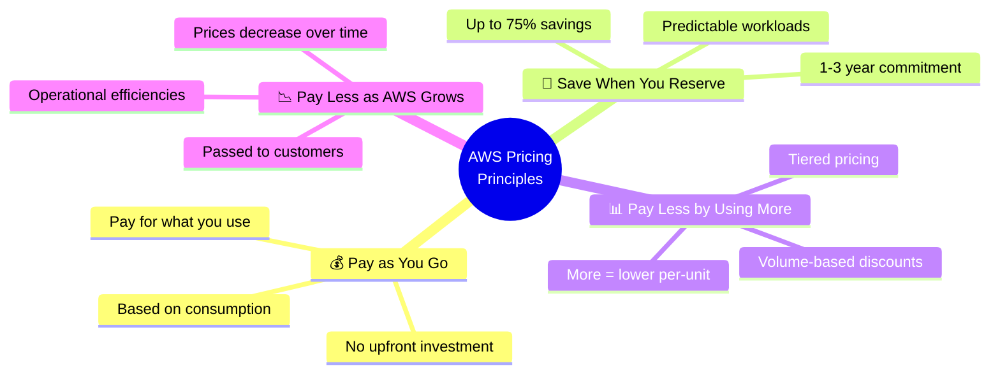

> 🎯 **Exam Tip:** Memorize the 4 pricing principles: **Pay as you go · Reserve · Volume discounts · AWS growth savings**.

---

## Principle 1: Pay as You Go

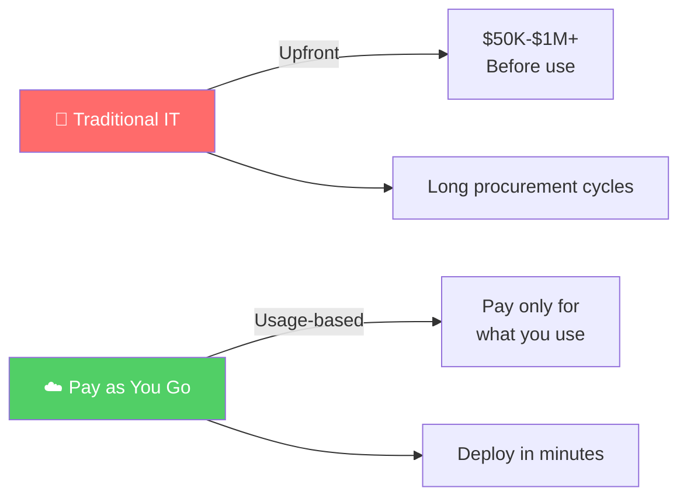

### Pay as You Go Details

| Feature | Description |
|---------|-------------|
| **Investment** | No upfront cost |
| **Payment** | Pay only for individual services used |
| **Basis** | Actual resource consumption |
| **Example** | EC2 for 3 hours = billed for 3 hours |

---

## Principle 2: Save When You Reserve

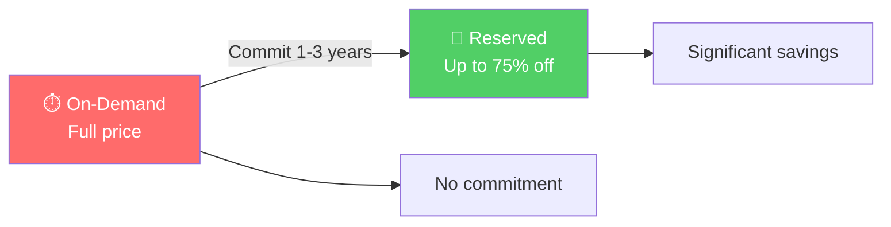

### Reserved Services

| Service | Reservation Type |
|---------|------------------|
| **EC2 Reserved Instances** | Instance type, Region, tenancy, OS |
| **DynamoDB Reserved Capacity** | Read/write capacity |
| **RDS Reserved Instances** | DB instance type, engine |
| **Redshift Reserved Instances** | Node type |
| **ElastiCache Reserved Nodes** | Cache node type |

---

## Principle 3: Pay Less by Using More

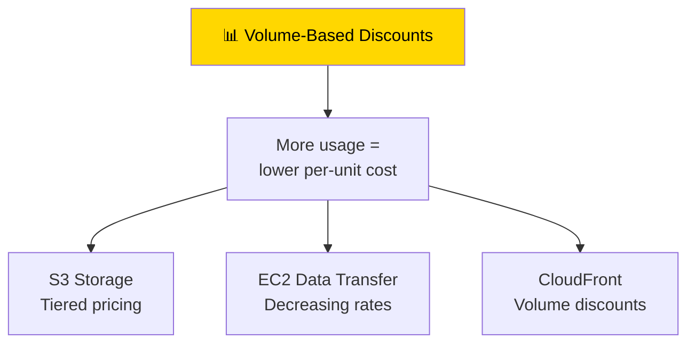

### Volume Discount Examples

| Service | Discount Structure |
|---------|-------------------|
| **S3 Storage** | First 50 TB at $0.023/GB, next 450 TB at $0.022, etc. |
| **Data Transfer** | First 10 TB free, then decreasing rates |
| **CloudFront** | Tiered pricing based on data transfer |

---

## Principle 4: Pay Less as AWS Grows

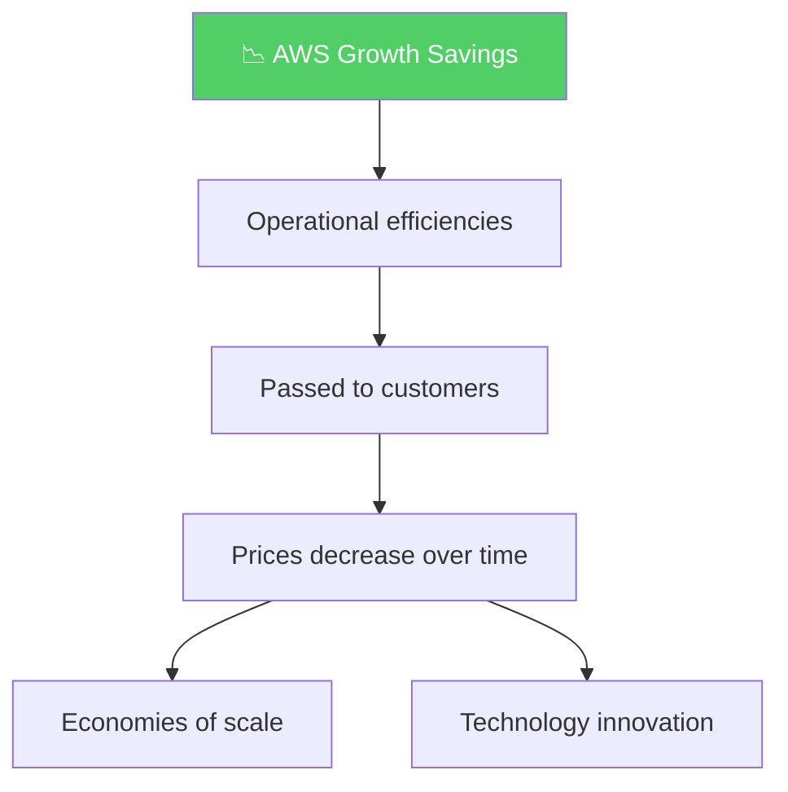

---

## EC2 Purchasing Options

AWS offers **7 purchasing options** for EC2 to suit different workload requirements:

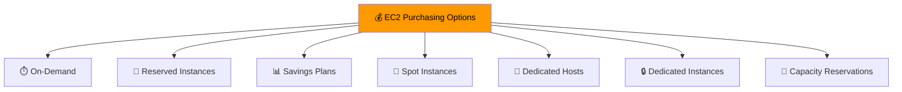

### Quick Comparison Table

| Option | Discount | Commitment | Interruptible | Best For |
|--------|----------|------------|----------------|----------|
| **On-Demand** | 0% | None | No | Unpredictable workloads |
| **Reserved Instances** | Up to 72% | 1-3 years | No | Steady-state workloads |
| **Savings Plans** | Up to 72% | 1-3 years | No | Flexible usage |
| **Spot Instances** | Up to 90% | None | Yes (2-min notice) | Fault-tolerant workloads |
| **Dedicated Hosts** | None | On-demand/reserved | No | Compliance, licensing |
| **Dedicated Instances** | None | Per instance | No | Hardware isolation |
| **Capacity Reservations** | Variable | None/Specific | No | Guaranteed capacity |

---

### 1. On-Demand Instances

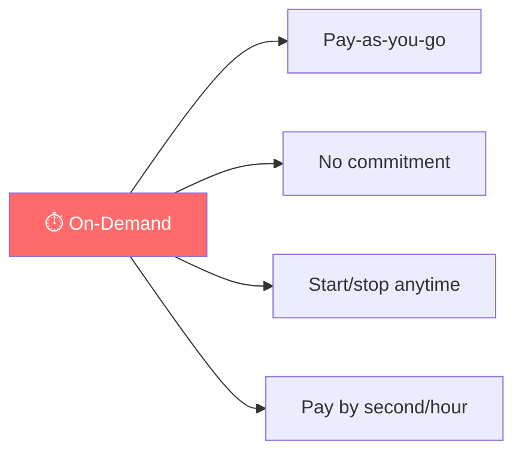

| Aspect | Detail |
|--------|--------|
| **Pricing** | Full price, no discount |
| **Commitment** | None |
| **Flexibility** | Maximum |
| **Best For** | Variable workloads, dev/test, short-term projects |

---

### 2. Reserved Instances

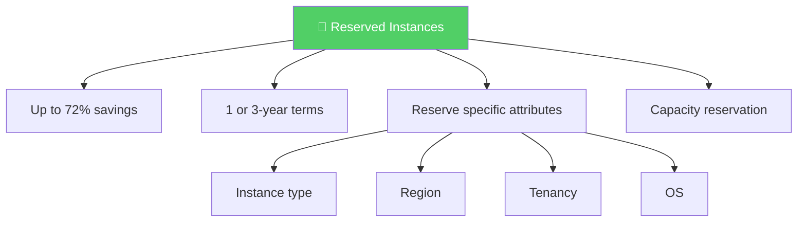

| Aspect | Detail |
|--------|--------|
| **Discount** | Up to 72% vs On-Demand |
| **Commitment** | 1 or 3 years |
| **Attributes** | Instance type, Region, tenancy, OS |
| **Best For** | Steady-state, predictable workloads |

---

### 3. Savings Plans

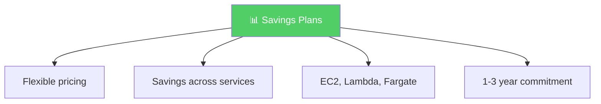

| Aspect | Detail |
|--------|--------|
| **Discount** | Up to 72% |
| **Commitment** | 1-3 years (hourly spend) |
| **Flexibility** | EC2, Lambda, Fargate |
| **Best For** | Flexible compute usage across services |

---

### 4. Spot Instances

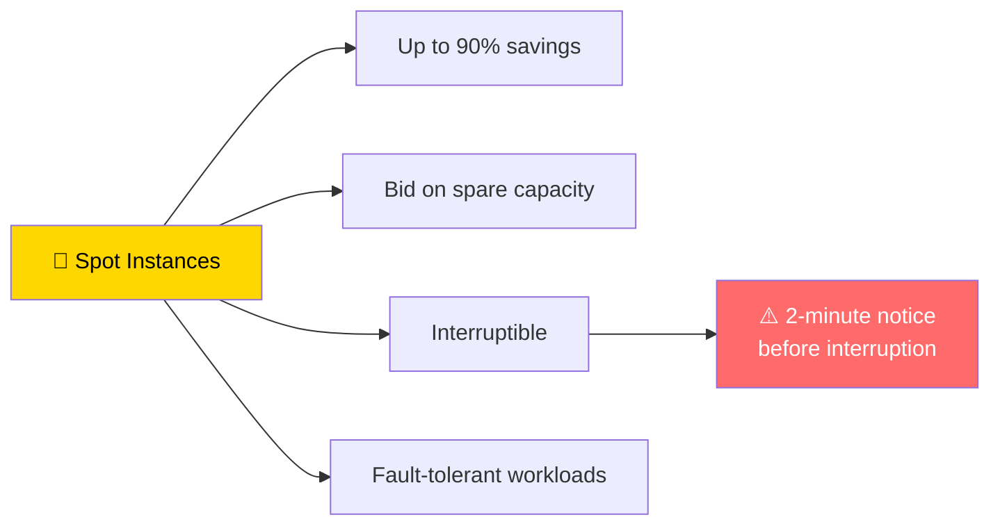

| Aspect | Detail |
|--------|--------|
| **Discount** | Up to 90% |
| **Capacity** | Spare EC2 capacity |
| **Risk** | Can be interrupted with 2-minute notice |
| **Best For** | Fault-tolerant, flexible workloads |

---

### 5. Dedicated Hosts

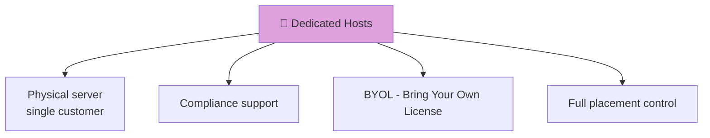

| Aspect | Detail |
|--------|--------|
| **Type** | Physical server dedicated to you |
| **Discount** | None (premium pricing) |
| **Licensing** | Bring your own (Microsoft, Oracle) |
| **Best For** | Compliance, licensing requirements |

---

### 6. Dedicated Instances

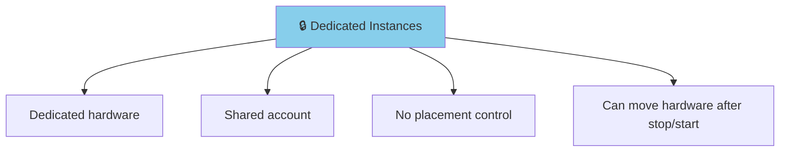

| Aspect | Detail |
|--------|--------|
| **Type** | Hardware dedicated to your account |
| **Placement** | No control |
| **Movement** | Can move after stop/start |
| **Best For** | Hardware isolation |

---

### 7. Capacity Reservations

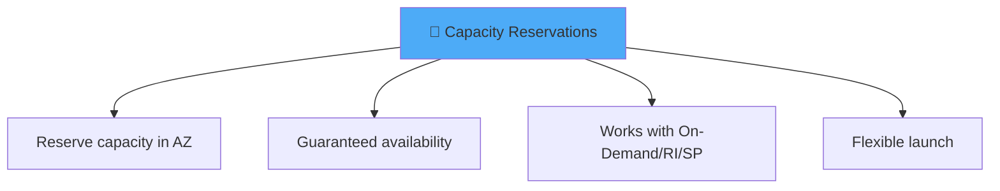

| Aspect | Detail |
|--------|--------|
| **Purpose** | Reserve capacity for specific AZ |
| **Guarantee** | Capacity always available |
| **Compatibility** | Works with On-Demand, RI, Savings Plans |
| **Best For** | Mission-critical applications needing capacity |

---

## Purchasing Decision Flowchart

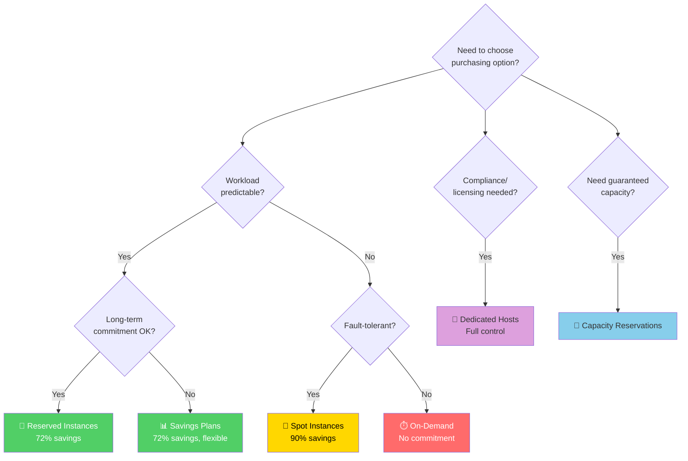

---

## Combined Approach Example

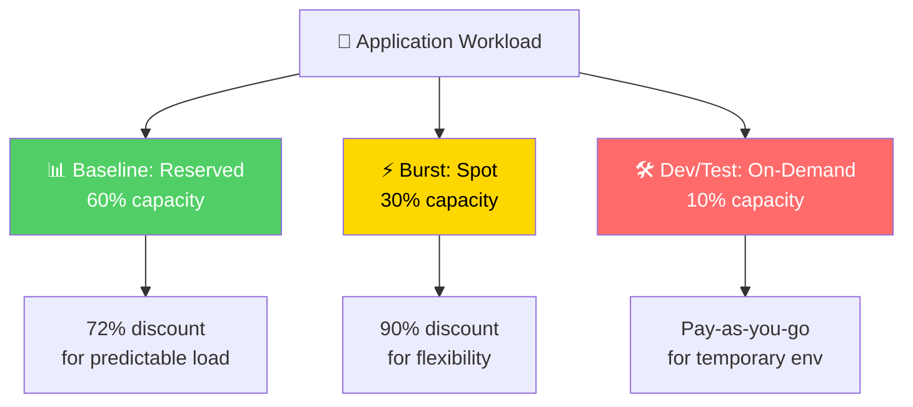

### Cost Optimization Strategy

| Workload Type | Recommended Mix |
|---------------|----------------|
| **Steady-state production** | Reserved Instances (70-80%) |
| **Variable traffic** | On-Demand (10-20%) |
| **Fault-tolerant batch jobs** | Spot Instances (10-20%) |
| **Dev/test environments** | Spot + On-Demand |
| **Compliance workloads** | Dedicated Hosts |

---

## Quick Reference

| Concept | Key Point |
|---------|-----------|
| **Pay as You Go** | No upfront, pay for usage |
| **Reserved** | 1-3 year commit, up to 72% off |
| **Savings Plans** | Flexible across EC2/Lambda/Fargate |
| **Spot** | Up to 90% off, interruptible |
| **Dedicated Hosts** | Physical server, BYOL |
| **Dedicated Instances** | Hardware isolation, shared account |
| **Capacity Reservations** | Guaranteed capacity in specific AZ |

---

## 📝 Knowledge Check

<strong>Q1: Which EC2 purchasing option offers the GREATEST discount but can be interrupted with 2-minute notice?</strong>

**A.** On-Demand Instances  
**B.** Reserved Instances  
**C.** Spot Instances  
**D.** Savings Plans  

**Answer: C** — Spot Instances offer up to 90% savings (the greatest discount), but AWS can interrupt them with a 2-minute notice when it needs the capacity back. Use them only for fault-tolerant workloads.

<strong>Q2: Which purchasing option is best for steady-state, predictable workloads with 1-3 year commitment?</strong>

**A.** On-Demand Instances  
**B.** Reserved Instances  
**C.** Spot Instances  
**D.** Dedicated Hosts  

**Answer: B** — Reserved Instances offer up to 72% savings for 1-3 year commitments and are ideal for steady-state, predictable workloads. They also provide capacity reservation.

<strong>Q3: Which option should you choose for compliance requirements that need a physical server with specific licensing?</strong>

**A.** On-Demand Instances  
**B.** Reserved Instances  
**C.** Spot Instances  
**D.** Dedicated Hosts  

**Answer: D** — Dedicated Hosts provide a physical server dedicated to a single customer, allowing you to use your own licenses (BYOL) for software like Microsoft, Oracle, etc. They also support compliance and regulatory requirements.

---

## Navigation

⬅️ Previous: [Well-Architected Framework](../04-security-architecture/03-well-architected-framework.md) | ➡️ Next: [Billing Management](./02-billing-management.md)  
🏠 [Back to README](../../README.md)

---

*Part of the [AWS Cloud Practitioner Study Notes](../../README.md).*