# AWS Billing & Cost Management

> ⏱️ **Estimated Study Time:** 15 minutes  
> 🎯 **CCP Exam Weight:** ~10-12% (Domain 4: Billing & Pricing)

---

## The Big Picture

AWS provides multiple tools and services to help you **monitor, manage, and optimize** your cloud spending. Understanding these tools is essential for cost control and is frequently tested on the CCP exam.

---

## AWS Billing & Cost Management Tools

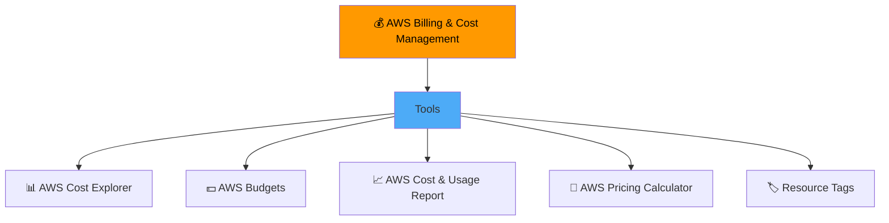

---

## 1. AWS Cost Explorer

**Definition:** Tool that lets you **visualize, understand, and manage** your AWS costs and usage over time.

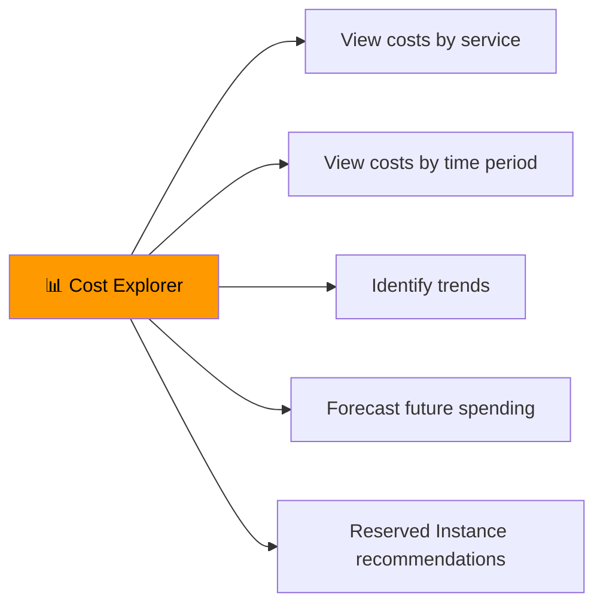

### Cost Explorer Features

| Feature | Description |
|---------|-------------|
| **Visualize Costs** | Charts and graphs of spending |
| **Time Period** | Daily, monthly, or custom ranges |
| **Granularity** | By service, Region, instance type, tag |
| **Forecasting** | Predict future costs based on trends |
| **RI Recommendations** | Identify Reserved Instance opportunities |

### Cost Explorer Visualization Example

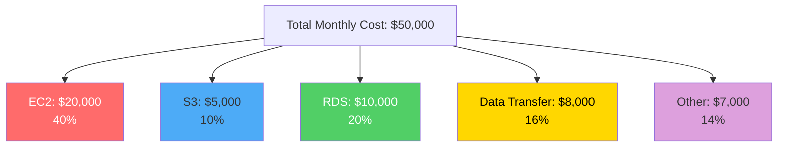

---

## 2. AWS Budgets

**Definition:** Allows you to set **custom cost and usage budgets** that alert you when you exceed thresholds.

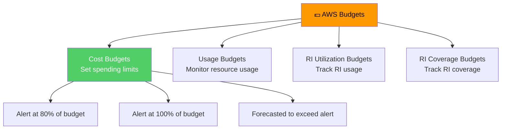

### Budget Types

| Type | Purpose | Example |
|------|---------|---------|
| **Cost Budget** | Set spending limits | $1,000/month for EC2 |
| **Usage Budget** | Monitor resource usage | 1000 instance-hours/month |
| **RI Utilization** | Track Reserved Instance usage | 90% utilization target |
| **RI Coverage** | Track RI coverage | 80% of EC2 covered by RIs |

### Budget Alerts

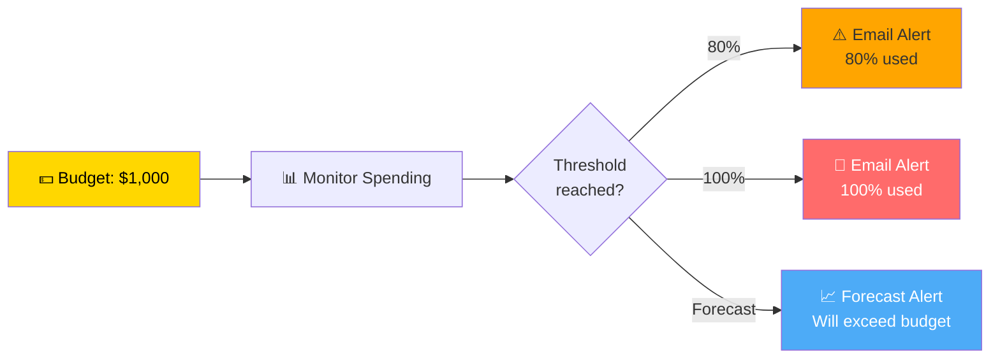

---

## 3. AWS Cost & Usage Report (CUR)

**Definition:** Most **comprehensive** set of cost and usage data available, including detailed information about each service usage.

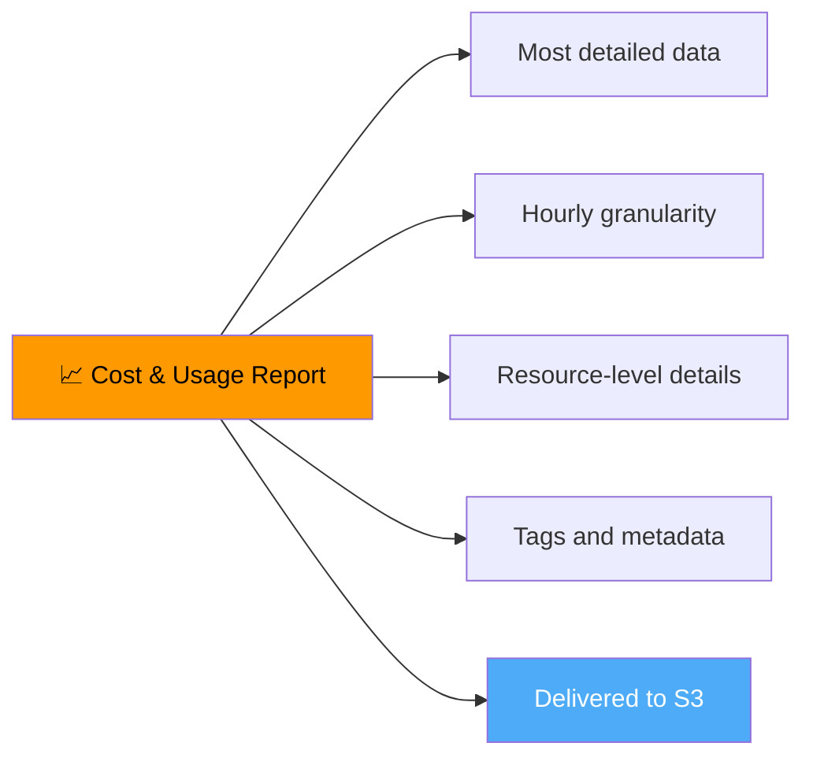

### CUR Features

| Feature | Description |
|---------|-------------|
| **Granularity** | Hourly or daily |
| **Resource-Level** | Individual resource usage |
| **Tags** | Cost allocation by tags |
| **Delivery** | Delivered to S3 bucket |
| **Integration** | Athena, QuickSight, Redshift |

---

## 4. AWS Pricing Calculator

**Definition:** Tool to **estimate AWS costs** before deploying workloads. Helps with budgeting and planning.

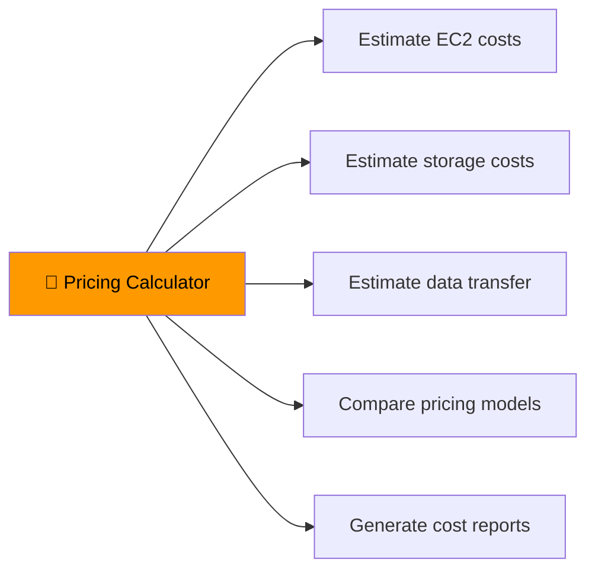

### Calculator Use Cases

| Use Case | Benefit |
|----------|---------|
| **Pre-deployment planning** | Estimate costs before launching |
| **Budget planning** | Create accurate budget forecasts |
| **Architecture comparison** | Compare costs of different architectures |
| **Migration planning** | Estimate on-premises vs cloud costs |
| **Proposal generation** | Create cost estimates for stakeholders |

---

## 5. TCO Calculator (Total Cost of Ownership)

**Definition:** Tool to **compare on-premises vs AWS** costs, showing the financial benefits of cloud migration.

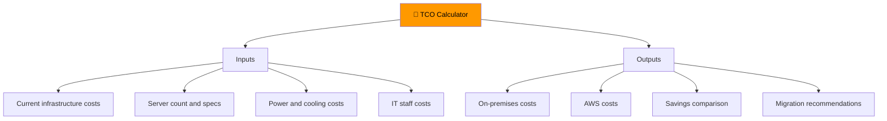

---

## Resource Tags & Cost Allocation

**Definition:** Tags are **key-value pairs** that help organize resources and allocate costs.

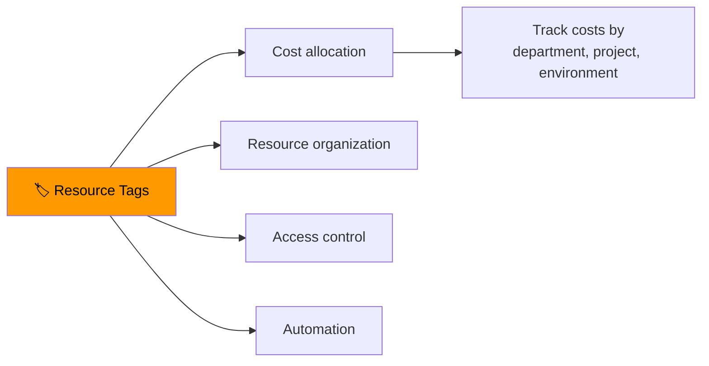

### Common Tag Examples

| Tag Key | Example Value | Purpose |
|---------|--------------|---------|
| **Environment** | Production, Dev, Test | Cost allocation by environment |
| **Department** | Engineering, Marketing | Cost allocation by team |
| **Project** | Project-X, Migration | Cost allocation by project |
| **Owner** | john@company.com | Resource ownership |
| **CostCenter** | CC-1234 | Financial reporting |

---

## Right Sizing Process

**Definition:** Matching instance types and sizes to workload requirements for **optimal performance and cost**.

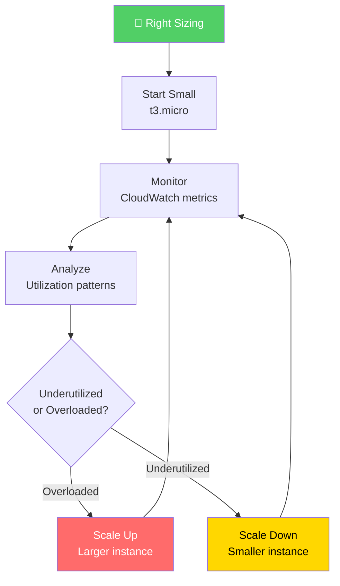

### Right Sizing Tools

| Tool | Purpose |
|------|---------|
| **AWS Cost Explorer** | Identify underutilized resources |
| **AWS Compute Optimizer** | ML-powered right-sizing recommendations |
| **Trusted Advisor** | Cost optimization checks |
| **CloudWatch** | Monitor performance metrics |

---

## Cost Optimization Best Practices

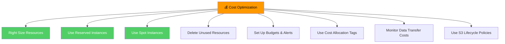

### Best Practices Summary

| Practice | Description |
|----------|-------------|
| **Right Size** | Match instance size to actual workload |
| **Reserved Instances** | Commit for 1-3 years for up to 72% off |
| **Spot Instances** | Use spare capacity for fault-tolerant workloads |
| **Delete Unused** | Remove idle resources, snapshots, volumes |
| **Budgets & Alerts** | Set spending limits and notifications |
| **Tag Everything** | Allocate costs by department/project |
| **Lifecycle Policies** | Move data to cheaper storage classes |

---

## AWS Organizations & Consolidated Billing

**Definition:** Service to manage **multiple AWS accounts** and consolidate billing for volume discounts.

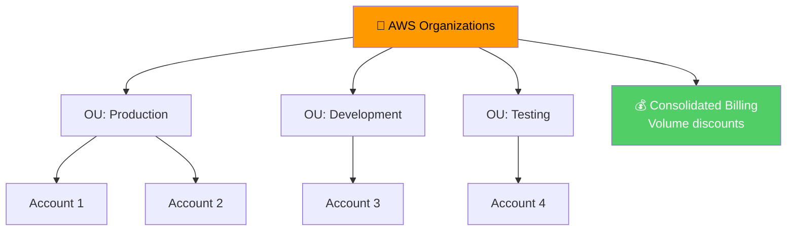

### Consolidated Billing Benefits

| Benefit | Description |
|---------|-------------|
| **Volume Discounts** | Combined usage across all accounts |
| **Single Invoice** | One bill for all accounts |
| **Cost Tracking** | Track costs per account |
| **Service Control Policies** | Centralized governance |

---

## Billing Alerts & Notifications

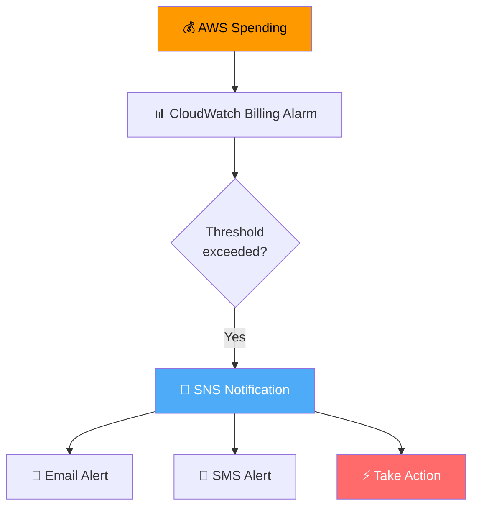

> 🎯 **Exam Tip:** You can create **CloudWatch billing alarms** to monitor estimated charges and send notifications via SNS.

---

## Quick Reference

| Tool | Purpose |
|------|---------|
| **Cost Explorer** | Visualize and analyze costs |
| **Budgets** | Set spending limits and alerts |
| **Cost & Usage Report** | Detailed billing data in S3 |
| **Pricing Calculator** | Estimate costs before deployment |
| **TCO Calculator** | Compare on-premises vs AWS |
| **Resource Tags** | Allocate costs by category |
| **AWS Organizations** | Multi-account management & consolidated billing |

---

## 📝 Knowledge Check

<strong>Q1: Which tool allows you to visualize, understand, and manage AWS costs over time?</strong>

**A.** AWS Budgets  
**B.** AWS Cost Explorer  
**C.** AWS Pricing Calculator  
**D.** AWS Trusted Advisor  

**Answer: B** — AWS Cost Explorer is a tool that lets you visualize, understand, and manage your AWS costs and usage over time with charts, graphs, and forecasting.

<strong>Q2: What is the purpose of AWS Budgets?</strong>

**A.** To visualize costs  
**B.** To set custom cost and usage budgets with alerts  
**C.** To deploy resources  
**D.** To monitor performance  

**Answer: B** — AWS Budgets allows you to set custom cost and usage budgets that alert you when you exceed or are forecasted to exceed your threshold.

<strong>Q3: Which tool should you use to estimate AWS costs before deploying a workload?</strong>

**A.** Cost Explorer  
**B.** AWS Budgets  
**C.** AWS Pricing Calculator  
**D.** Cost & Usage Report  

**Answer: C** — The AWS Pricing Calculator lets you estimate AWS costs before deploying workloads, helping with budgeting and planning.

---

## Navigation

⬅️ Previous: [Pricing Models](./01-pricing-models.md) | ➡️ Next: [AWS Ecosystem](./03-aws-ecosystem.md)  
🏠 [Back to README](../../README.md)

---

*Part of the [AWS Cloud Practitioner Study Notes](../../README.md).*