# AWS Ecosystem & Support

> ⏱️ **Estimated Study Time:** 12 minutes  
> 🎯 **CCP Exam Weight:** ~5-8% (Domain 5: Cloud Transformation)

---

## The Big Picture

The **AWS Ecosystem** provides free tools, support plans, training resources, and partner networks to help you succeed with AWS. Understanding these resources is important for the CCP exam and real-world AWS adoption.

---

## AWS Ecosystem Overview

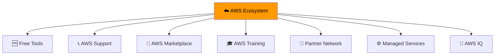

---

## 1. AWS Free Tools & Resources

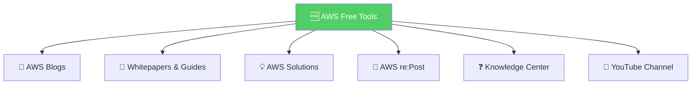

### Free Resources

| Resource | URL | Description |
|----------|-----|-------------|
| **AWS Blogs** | aws.amazon.com/blogs | Latest updates, announcements, best practices |
| **Whitepapers** | aws.amazon.com/whitepapers | Technical whitepapers and architecture guides |
| **AWS Solutions** | aws.amazon.com/solutions | Vetted technology solutions |
| **re:Post** | repost.aws | Community Q&A service |
| **Knowledge Center** | aws.amazon.com/premiumsupport/knowledge-center | Most frequent questions and answers |

> 🎯 **Exam Tip:** AWS re:Post is a **free Q&A service** that replaces the original AWS Forums. It's community-based with expert-reviewed answers.

---

## 2. AWS Support Plans

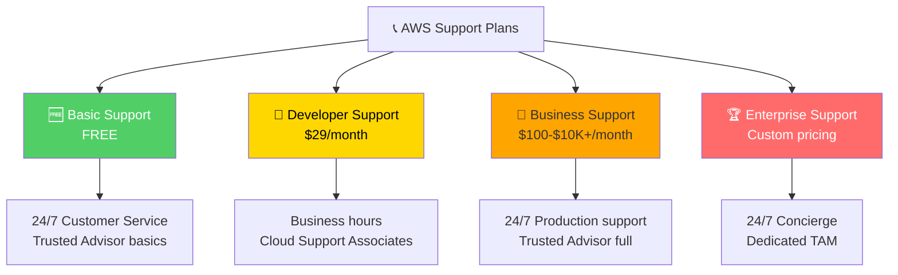

### Support Plan Comparison

| Feature | Basic | Developer | Business | Enterprise |
|---------|-------|-----------|----------|------------|
| **Cost** | Free | $29/month | $100-$10K+/month | Custom ($5K+/month) |
| **Response Time** | No SLA | 12-24 hours | 1-4 hours | 15 min - 4 hours |
| **Support** | Customer service only | Cloud Support Associates | Cloud Support Engineers | Senior Cloud Architects |
| **Trusted Advisor** | Basic checks | Basic checks | Full checks | Full checks |
| **TAM** | No | No | No | Yes (Dedicated) |
| **Best For** | All accounts | Development/testing | Production workloads | Mission-critical |

### Support Plan Decision Tree

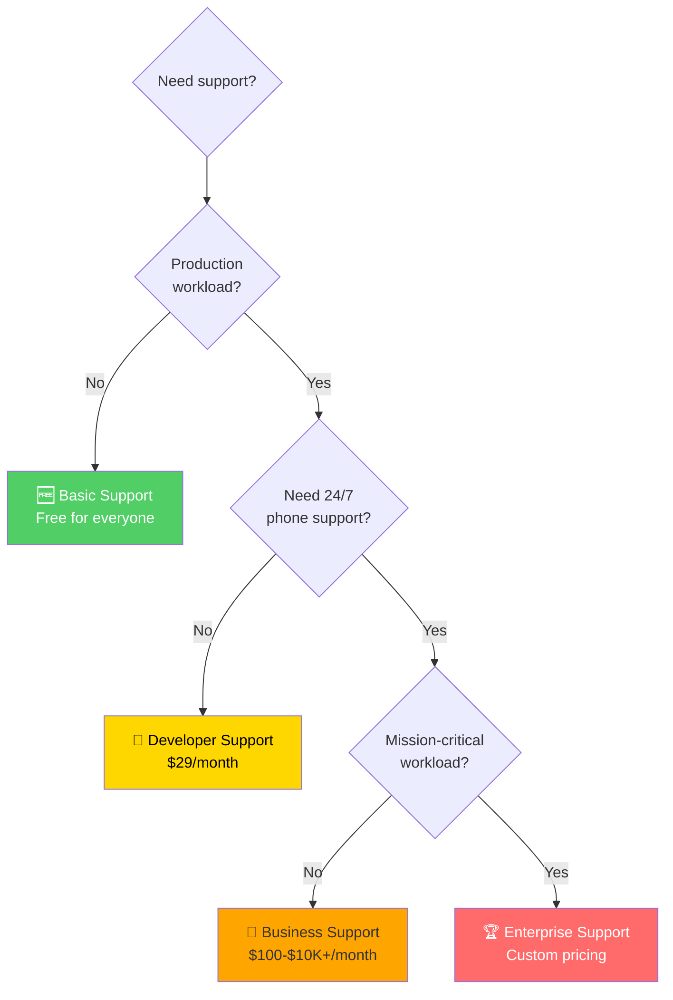

---

## 3. AWS Marketplace

**Definition:** **Digital catalog** with thousands of software listings from independent software vendors (ISVs).

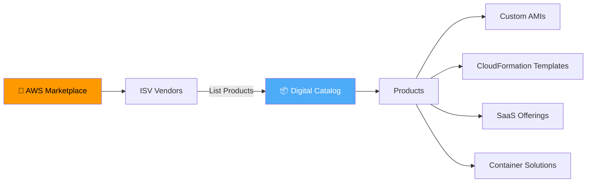

### Marketplace Product Types

| Product Type | Description | Example |
|--------------|-------------|---------|
| **Custom AMIs** | Pre-configured operating systems, firewalls | Security-hardened Linux |
| **CloudFormation Templates** | Infrastructure as code templates | VPC templates |
| **SaaS Offerings** | Software as a Service products | Monitoring tools |
| **Container Solutions** | Container-based software | Containerized databases |

### Marketplace Key Points

- Purchases are **added to your AWS bill**
- You can **sell your own solutions** on AWS Marketplace
- Browse and search **thousands of third-party solutions**

---

## 4. AWS Training & Certification

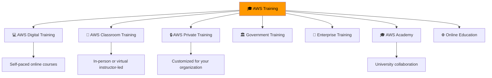

### AWS Certification Path

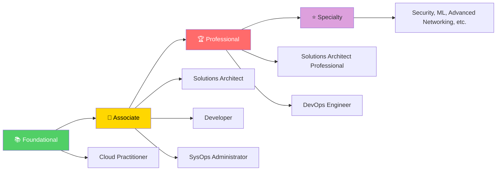

> 🎯 **Exam Tip:** The **Cloud Practitioner** certification is the foundational level. It validates overall AWS knowledge and is a prerequisite for higher-level certifications.

---

## 5. AWS Partner Network (APN)

**Definition:** Global community of partners that uses AWS to build solutions and services for customers.

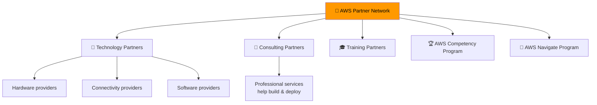

### APN Partner Types

| Partner Type | Description |
|--------------|-------------|
| **Technology Partners** | Hardware, connectivity, software providers |
| **Consulting Partners** | Professional services firms that build and deploy on AWS |
| **Training Partners** | Organizations that offer AWS training |

### APN Programs

| Program | Purpose |
|---------|---------|
| **AWS Competency Program** | Recognizes partners with proven technical proficiency and customer success |
| **AWS Navigate Program** | Helps partners enhance skills and expertise |

---

## 6. AWS IQ

**Definition:** Service that helps you **find AWS-certified third-party experts** for on-demand project work.

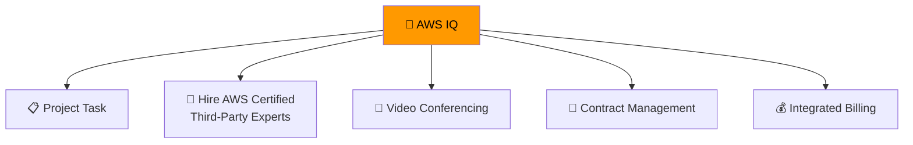

### AWS IQ Features

| Feature | Description |
|---------|-------------|
| **AWS Certified Experts** | Hire third-party experts for projects |
| **Video Conferencing** | Built-in collaboration |
| **Contract Management** | Simplified contract handling |
| **Secure Collaboration** | Secure workspace |
| **Integrated Billing** | Billing through AWS |

---

## 7. AWS Managed Services (AMS)

**Definition:** Provides **infrastructure and application support** on AWS through a team of AWS experts.

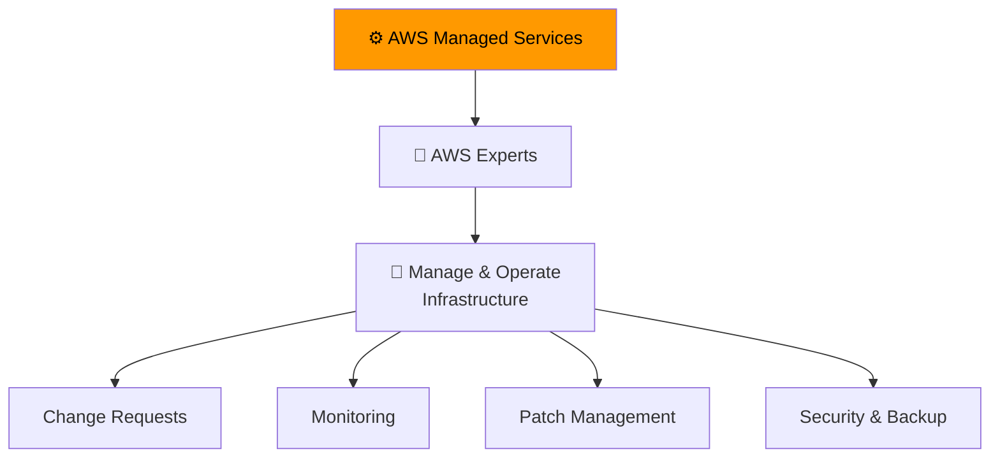

### AMS Benefits

| Benefit | Description |
|---------|-------------|
| **Fully Managed** | AWS handles common activities |
| **24/7/365 Support** | Continuous support |
| **Change Requests** | Managed infrastructure changes |
| **Monitoring** | Continuous infrastructure monitoring |
| **Patch Management** | Regular security patches |
| **Best Practices** | Implements AWS best practices |

---

## AWS Professional Services

**Definition:** Global team of experts who **collaborate with your team** to help you achieve your cloud goals.

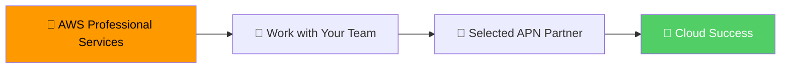

---

## Quick Reference

| Service | Purpose | Cost |
|---------|---------|------|
| **Basic Support** | All AWS accounts | Free |
| **Developer Support** | Dev/test workloads | $29/month |
| **Business Support** | Production workloads | $100-$10K+/month |
| **Enterprise Support** | Mission-critical | $5K+/month |
| **AWS Marketplace** | Third-party software | Varies |
| **AWS Training** | Learning resources | Free + paid options |
| **AWS Partner Network** | Partner ecosystem | N/A |
| **AWS IQ** | Hire experts | Project-based |
| **AWS Managed Services** | Full infrastructure management | Custom |

---

## 📝 Knowledge Check

<strong>Q1: Which AWS Support plan is FREE for all AWS customers?</strong>

**A.** Developer Support  
**B.** Business Support  
**C.** Basic Support  
**D.** Enterprise Support  

**Answer: C** — Basic Support is free for all AWS customers and includes 24/7 access to customer service, AWS documentation, whitepapers, and support forums.

<strong>Q2: Which AWS Support plan provides 24/7 phone, email, and chat support with a 1-hour response time for production system failures?</strong>

**A.** Basic Support  
**B.** Developer Support  
**C.** Business Support  
**D.** Enterprise Support  

**Answer: C** — Business Support provides 24/7 phone, email, and chat support with a 1-hour response time for production system failures. It's designed for production workloads.

<strong>Q3: What is AWS re:Post?</strong>

**A.** A support plan  
**B.** A free Q&A community service that replaces AWS Forums  
**C.** A training program  
**D.** A marketplace for software  

**Answer: B** — AWS re:Post is a free Q&A community service that replaced the original AWS Forums. It provides crowd-sourced, expert-reviewed answers to technical questions.

---

## Navigation

⬅️ Previous: [Billing Management](./02-billing-management.md) | ➡️ Next: [Cloud Transformation](./04-cloud-transformation.md)  
🏠 [Back to README](../../README.md)

---

*Part of the [AWS Cloud Practitioner Study Notes](../../README.md).*