# Cloud Transformation Journey

> ⏱️ **Estimated Study Time:** 15 minutes  
> 🎯 **CCP Exam Weight:** ~5-8% (Domain 5: Cloud Transformation)

---

## The Big Picture

Understanding the **cloud transformation journey** helps organizations migrate from traditional datacenters to AWS. This module covers datacenter realities, capacity planning challenges, geographic expansion risks, and how cloud computing solves these problems.

---

## Server Room vs Datacenter

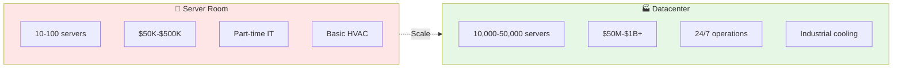

### Scale Comparison

| Aspect | Server Room | Datacenter |
|--------|-------------|------------|
| **Scale** | 10-100 servers | 10,000-50,000 servers |
| **Space** | 500-2000 sq ft | 100,000+ sq ft |
| **Investment** | $50K-$500K | $50M-$1B+ |
| **Power** | 10-50 kW | 10-25 MW |
| **Staff** | Part-time IT | 24/7 operations teams |
| **Cooling** | Basic HVAC | Industrial precision cooling |
| **Use Case** | SMBs | Enterprise & cloud providers |

### Scale Multipliers

| Factor | Multiplier (Datacenter vs Server Room) |
|--------|----------------------------------------|
| **Servers** | 100-500x |
| **Investment** | 100-2000x |
| **Power** | 200-500x |
| **Complexity** | Exponential |

---

## Datacenter Infrastructure Components

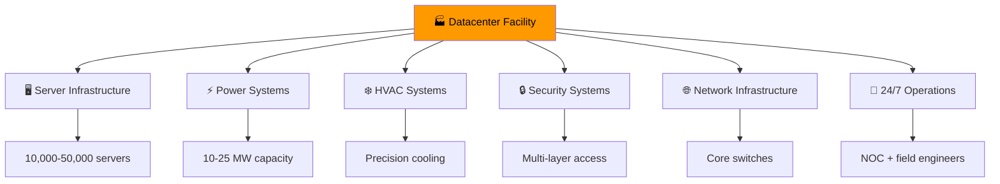

### Power Consumption Breakdown

| Component | Power Consumption |
|-----------|-------------------|
| **Servers** | 50-60% |
| **Cooling** | 30-40% |
| **Power/UPS** | 5-10% |
| **Lighting/Other** | 5% |
| **Total Facility** | 10-25 MW (equivalent to 8,000-20,000 homes) |

> 🎯 **Exam Tip:** **Cooling consumes 30-40%** of total datacenter power. This is why efficient cooling design is critical.

### HVAC & Cooling Systems (Detailed)

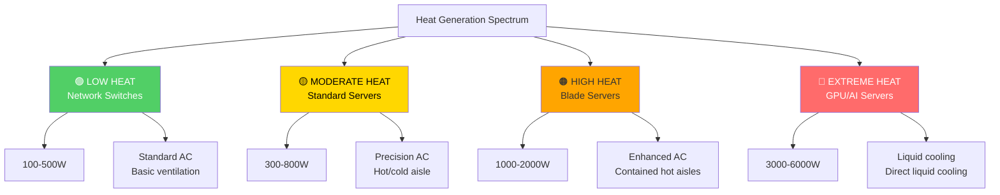

### Hot Aisle / Cold Aisle Containment

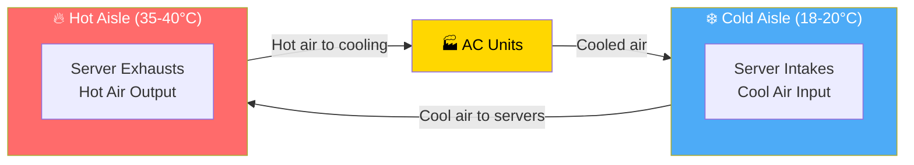

### Cooling Failure Consequences

| Time After Failure | Consequence |
|-------------------|-------------|
| **2-5 minutes** | Server thermal shutdown |
| **Above 85°C** | Hardware damage |
| **Extended** | Data loss risk |
| **Per minute** | $5,600-$100,000+ service downtime cost |

---

## Supply Chain Complexity

### Hardware Procurement Timeline

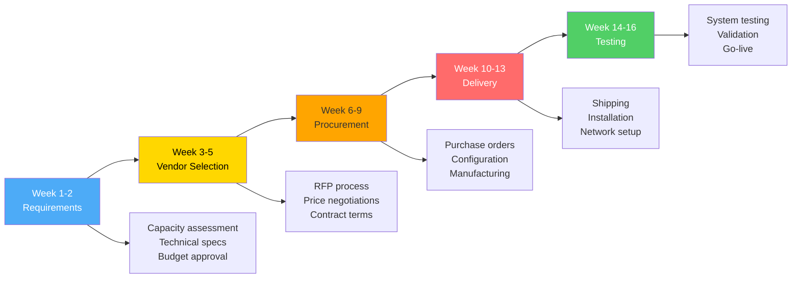

### Crisis Cost Impact

| Impact Type | Cost |
|-------------|------|
| **Emergency Procurement Premium** | 200-500% above standard |
| **Service Degradation** | $5,000-$100,000+ per minute |
| **Customer Churn** | 15-30% during extended issues |
| **Total Resolution Time** | 14-16 weeks minimum |

---

## Disaster Recovery Architecture

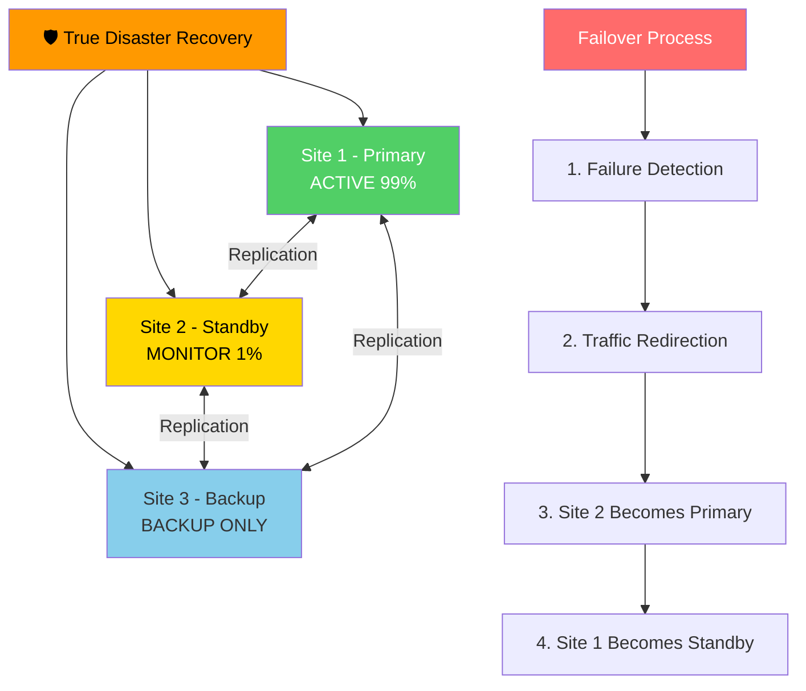

---

## Capacity Planning Dilemma

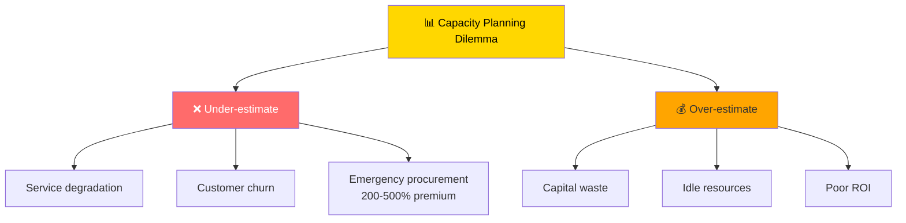

### Utilization Sweet Spot

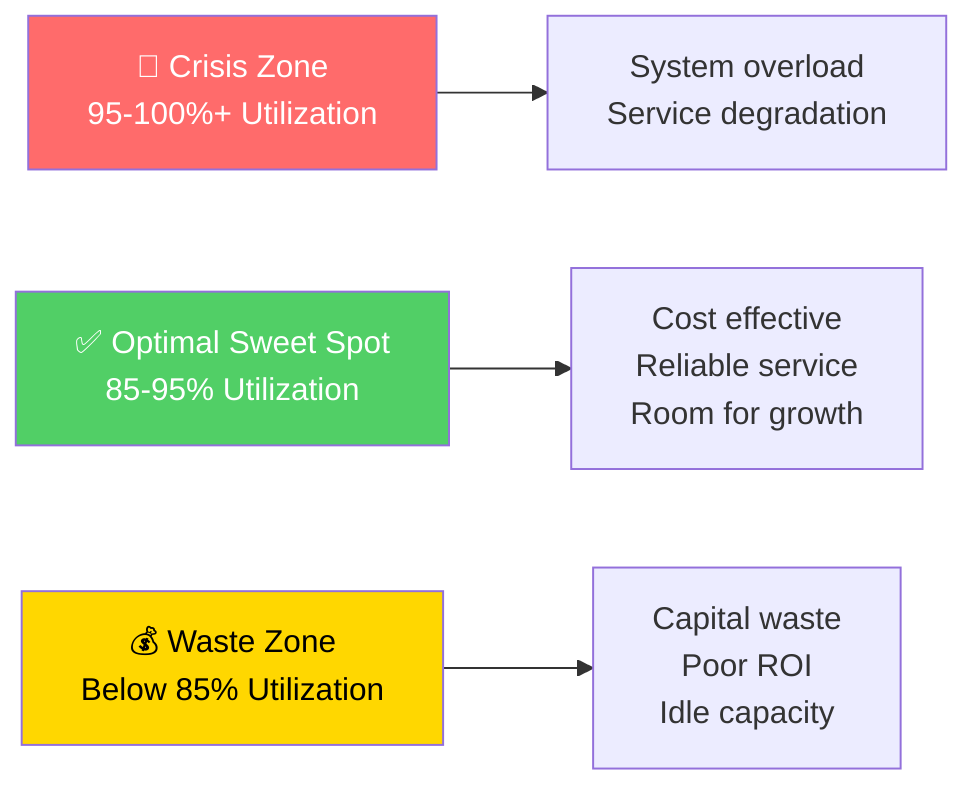

---

## Financial Fundamentals: CapEx vs OpEx

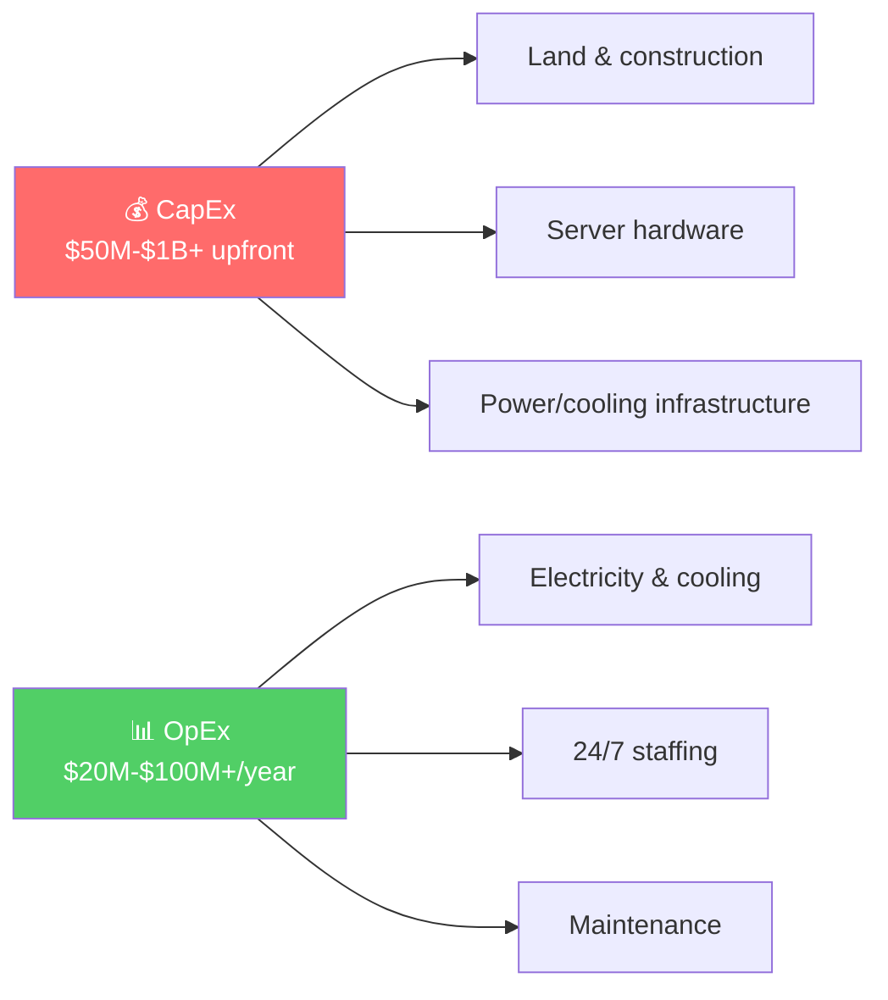

### Datacenter Business Lifecycle

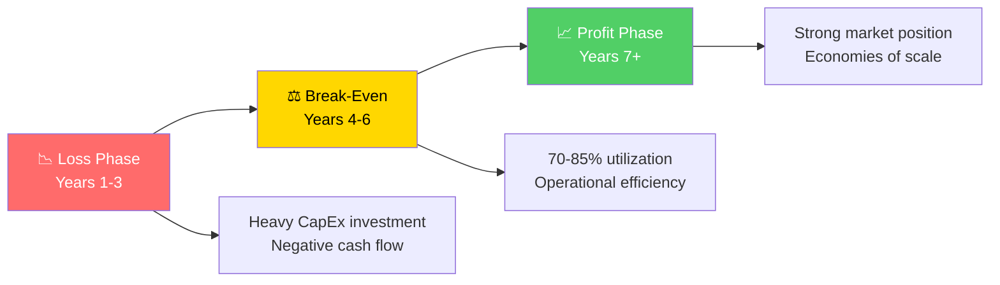

---

## Geographic Expansion Challenges

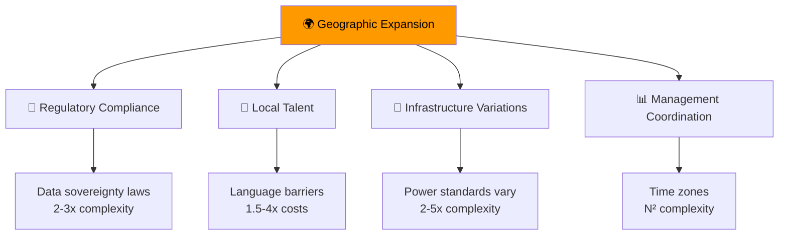

### Expansion Risk Matrix

| Challenge | Complexity Factor | Risk Multiplier |
|-----------|------------------|-----------------|
| **Regulatory Compliance** | Data sovereignty laws | 2-3x per region |
| **Local Talent** | Language, skill availability | 1.5-4x costs |
| **Infrastructure** | Power, network standards | 2-5x complexity |
| **Management** | Time zones, culture | N² complexity |
| **Emergency Response** | Distance, local partnerships | 3-10x resolution time |

---

## Traditional vs Cloud Comparison

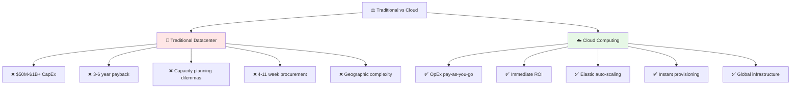

---

## Cloud Migration Strategies (6 Rs)

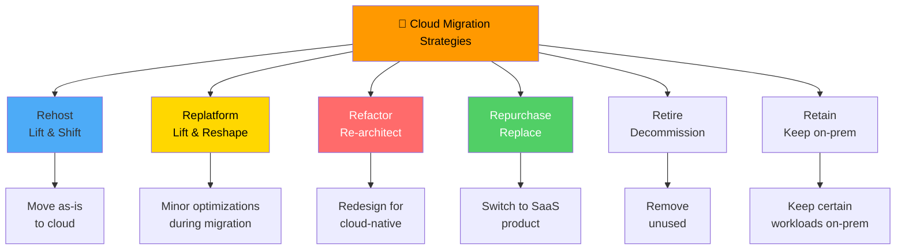

### Detailed Migration Strategy Comparison

| Strategy | Description | Effort | Benefits | Best For |
|----------|-------------|--------|----------|----------|
| **Rehost** | Move applications as-is to cloud | 🟢 Low | Fast migration, minimal risk | Quick wins, legacy apps |
| **Replatform** | Minor optimizations during migration | 🟡 Medium | Some cloud benefits, moderate effort | Apps needing minor tweaks |
| **Refactor** | Redesign for cloud-native | 🔴 High | Full cloud benefits, scalability | Mission-critical apps |
| **Repurchase** | Switch to SaaS product | 🟢 Low | Modern features, less maintenance | Standard software (CRM, ERP) |
| **Retire** | Decommission unused applications | 🟢 Low | Cost savings, reduced complexity | Obsolete applications |
| **Retain** | Keep on-premises | N/A | Compliance, latency requirements | Regulated workloads |

### Migration Decision Framework

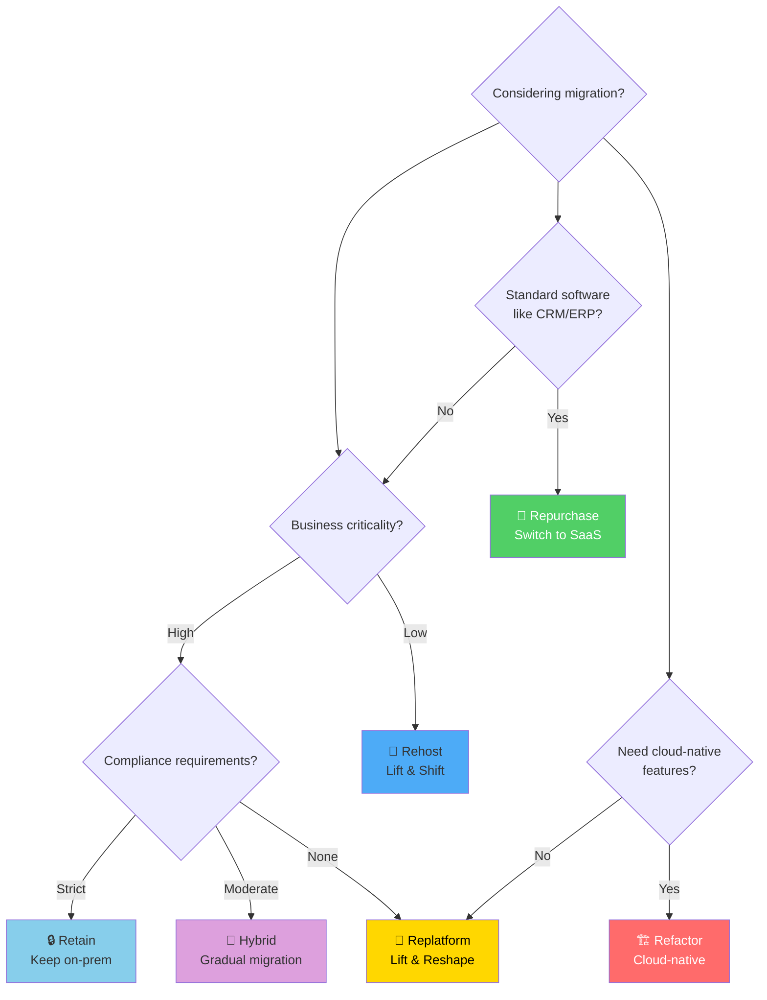

---

## Cloud Transformation Benefits

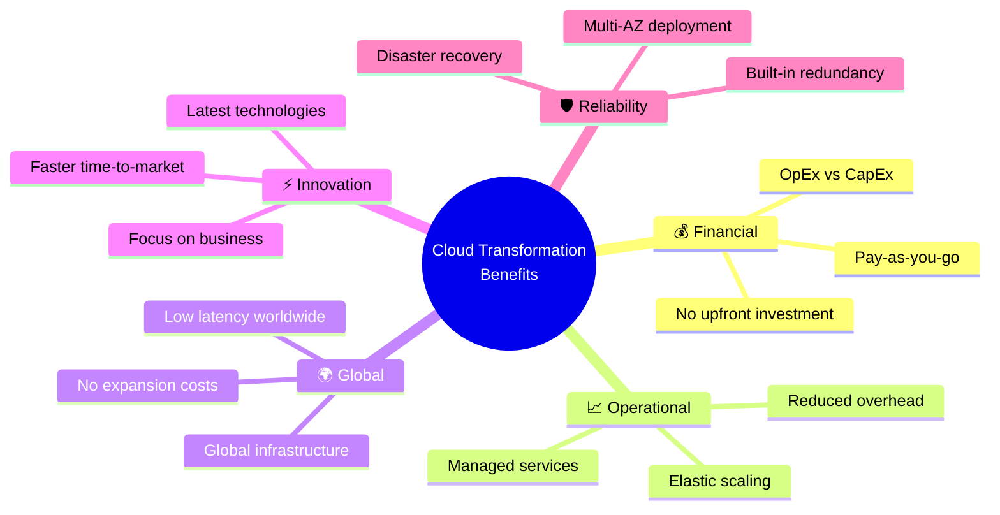

---

## Migration Decision Framework

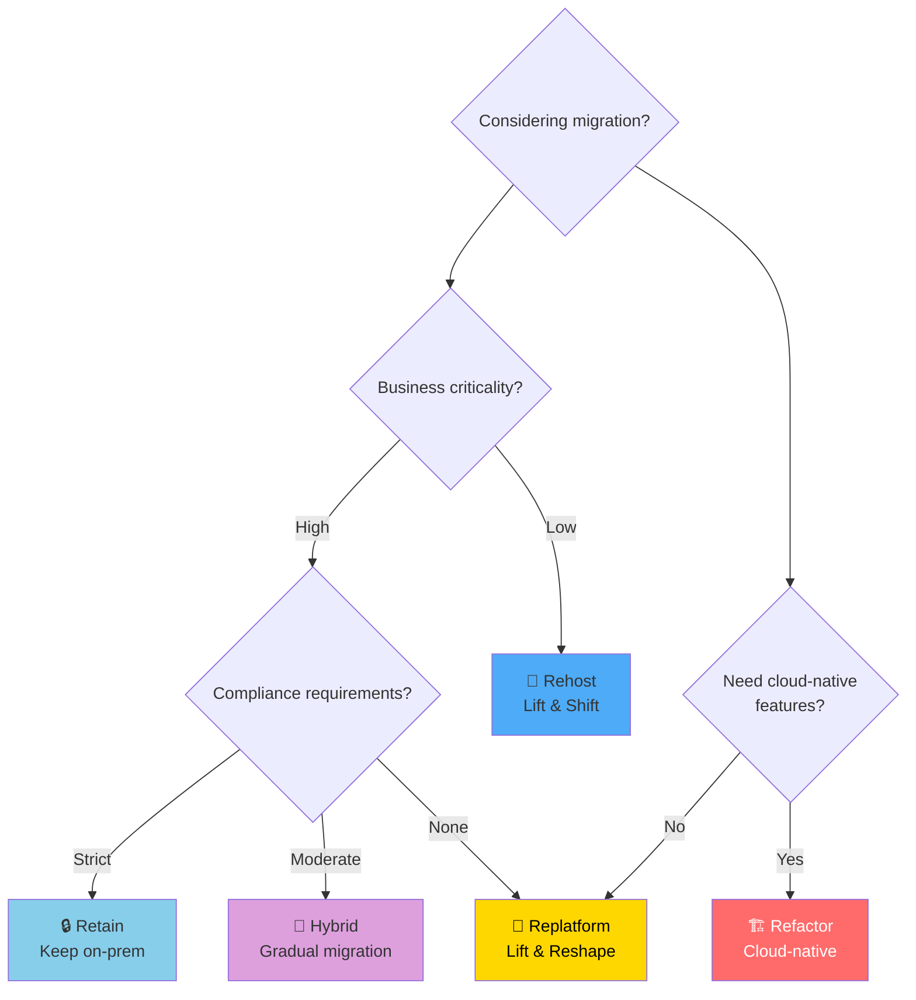

---

## Universal Business Principles: Trade-Off Triangle

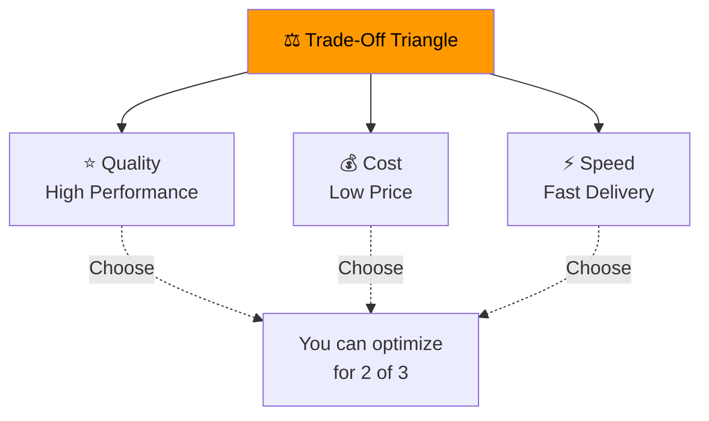

### Trade-Off Examples

| Trade-Off | What You Gain | What You Sacrifice |
|-----------|---------------|-------------------|
| **Cost Optimization** | Lower costs | Reduced features |
| **Speed vs Quality** | Faster delivery | More risks |
| **Scalability vs Control** | Broader reach | Less oversight |

---

## Quick Reference

| Concept | Key Point |
|---------|-----------|
| **Server Room** | 10-100 servers, $50K-$500K |
| **Datacenter** | 10,000-50,000 servers, $50M-$1B+ |
| **Cooling** | Consumes 30-40% of power |
| **CapEx** | Upfront investment |
| **OpEx** | Ongoing expenses |
| **Lifecycle** | Loss (Y1-3) → Break-Even (Y4-6) → Profit (Y7+) |
| **6 Rs** | Rehost, Replatform, Refactor, Repurchase, Retire, Retain |
| **Optimal Utilization** | 85-95% sweet spot |

---

## 📝 Knowledge Check

<strong>Q1: What percentage of datacenter power is typically consumed by cooling systems?</strong>

**A.** 10-20%  
**B.** 30-40%  
**C.** 50-60%  
**D.** 70-80%  

**Answer: B** — Cooling systems consume 30-40% of total datacenter power. This is why efficient cooling design (hot/cold aisle containment) is critical for reducing operational costs.

<strong>Q2: What is the typical datacenter business lifecycle?</strong>

**A.** Profit immediately, then growth  
**B.** Loss (Y1-3), Break-Even (Y4-6), Profit (Y7+)  
**C.** Break-even immediately, then profit  
**D.** Loss forever  

**Answer: B** — Datacenters typically have a 3-6 year payback period with three phases: Loss Phase (Years 1-3) with heavy CapEx, Break-Even (Years 4-6) when revenue covers costs, and Profit Phase (Years 7+) with sustainable ROI.

<strong>Q3: Which cloud migration strategy involves moving applications to the cloud with minimal changes (lift and shift)?</strong>

**A.** Refactor  
**B.** Replatform  
**C.** Rehost  
**D.** Repurchase  

**Answer: C** — Rehost (also known as "lift and shift") involves moving applications to the cloud as-is with minimal or no changes. It's the fastest migration strategy but doesn't take full advantage of cloud-native features.

---

## Navigation

⬅️ Previous: [AWS Ecosystem](./03-aws-ecosystem.md) | ➡️ Next: (Back to README)  
🏠 [Back to README](../../README.md)

---

*Part of the [AWS Cloud Practitioner Study Notes](../../README.md).*