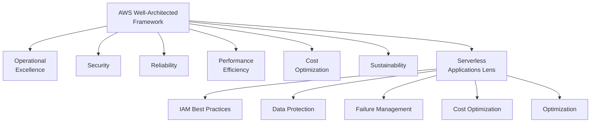
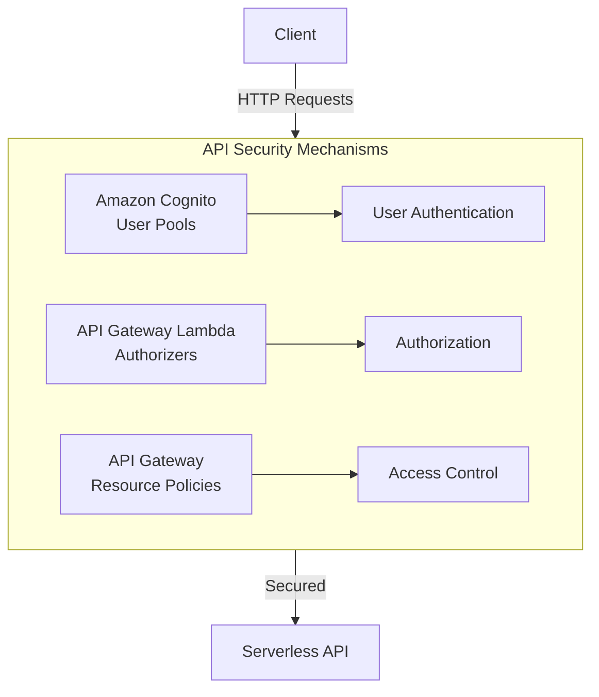
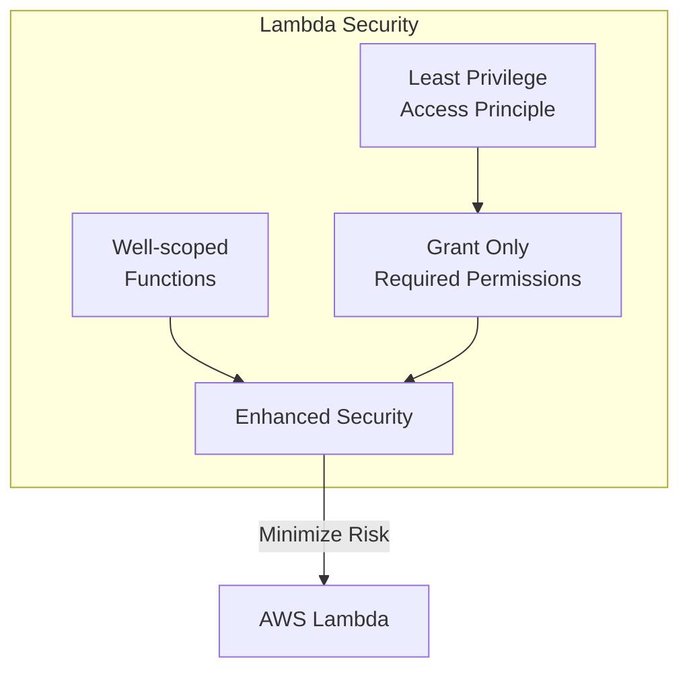
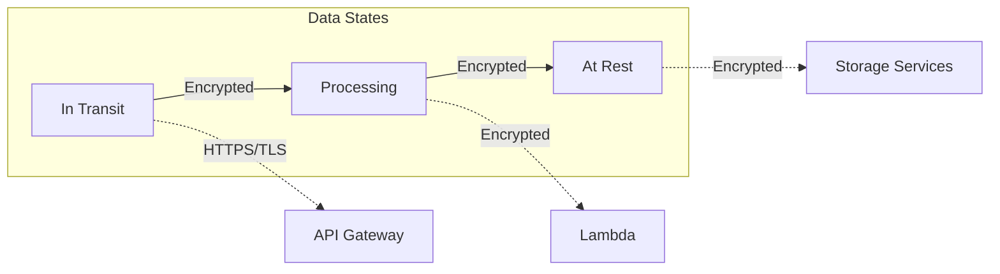
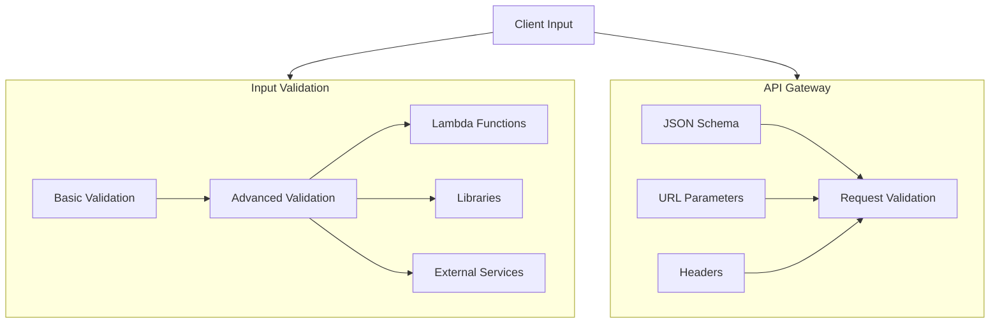
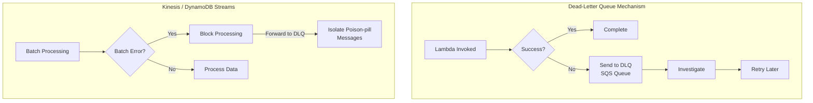
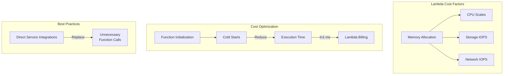
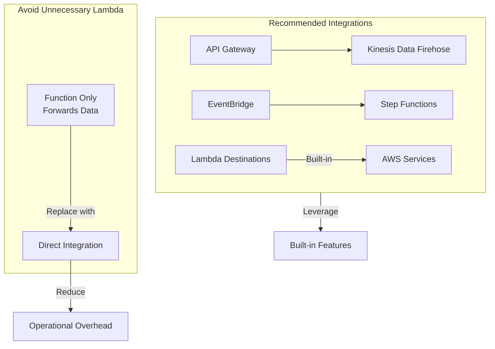
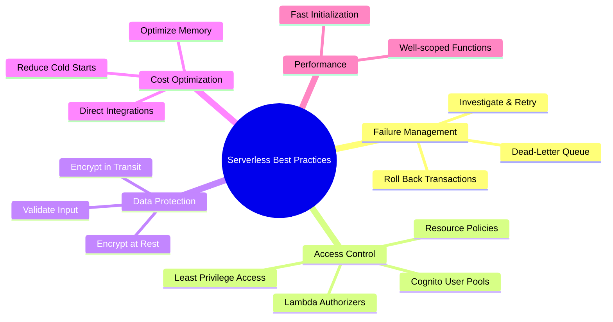

# AWS Well-Architected Framework

## The Big Picture

The **AWS Well-Architected Framework** has **six pillars**, and each pillar includes best practices and a set of questions that you should consider when you architect cloud solutions. AWS also offers a specialized **Serverless Applications Lens** that addresses common serverless application scenarios.

---

## AWS Well-Architected Framework - Six Pillars



---

## Serverless Applications Lens

The **Serverless Applications Lens** is part of the AWS Well-Architected Framework and addresses common serverless application scenarios, highlighting essential elements to ensure workloads follow best practices.

---

## Best Practice: Identity and Access Management

### Control Access to Your Serverless API

APIs are common attack targets due to the valuable operations and data they expose.



| Mechanism | Purpose |
|-----------|---------|
| **Amazon Cognito User Pools** | User authentication |
| **API Gateway Lambda Authorizers** | Control authorization |
| **API Gateway Resource Policies** | Define who can access the API |

### Control Access to Your Serverless Application



When configuring AWS Lambda:
- Follow **least-privileged access principles**
- Grant only the permissions required for each function's operation
- Use **smaller, well-scoped functions** to enhance security

---

## Best Practice: Data Protection

###1. Encrypt Data in Transit and at Rest



| Service | Recommendation |
|---------|----------------|
| **API Gateway** | Encrypt sensitive data client-side before sending HTTP requests |
| **Lambda** | Encrypt data before processing to prevent exposure in CloudWatch Logs |
| **S3, DynamoDB, OpenSearch** | Enable encryption at rest |

### 2. Implement Application Security



| Validation Type | Description |
|-----------------|-------------|
| **API Gateway Validation** | Built-in request validation for JSON schema, URL parameters, headers |
| **Lambda Validation** | Use Lambda functions for deeper security checks |
| **Input Validation** | Validate inbound events to prevent malicious input |

---

## Best Practice: Failure Management

### 1. Use a Dead-Letter Queue (DLQ) Mechanism



| Service | DLQ Behavior |
|---------|-------------|
| **AWS Lambda** | Configure DLQ in Amazon SQS to capture failed transactions |
| **Amazon Kinesis** | Configure Lambda to isolate "poison-pill" messages by forwarding to DLQ |

### 2. Roll Back Failed Transactions

```mermaid
flowchart LR
    subgraph Rollback["Rollback Mechanism"]
        SM[AWS Step Functions<br/>State Machine] -->|Automates| Rollback[Rollback Procedures]
        Rollback -->|Ensures| Consistency[Transaction<br/>Consistency]
    end
    
    Transaction[Transaction] -->|Success| Complete[Complete]
    Transaction -->|Failure| SM
    SM -->|Revert| Revert[Revert Changes]
```

| Mechanism | Purpose |
|-----------|---------|
| **AWS Step Functions** | Automate rollback procedures when failures occur |
| **Transaction Consistency** | Ensure workflows either fully complete or properly revert |

---

## Best Practice: Cost-Effective Resources

### Lambda Cost Optimization



| Optimization | Description |
|--------------|-------------|
| **Memory Settings** | CPU, network, and storage IOPS scale with memory - optimize for balance |
| **Reduce Cold Starts** | Optimize function initialization to lower execution time |
| **Minimize Function Calls** | Use direct integrations with AWS services to cut costs |

---

## Best Practice: Optimization

### Use Direct AWS Service Integrations



| Instead of Lambda | Use Direct Integration |
|------------------|------------------------|
| Simple data forwarding | API Gateway → Kinesis Data Firehose |
| Event routing | EventBridge |
| Error handling | Lambda Destinations |

---

## Summary of Serverless Best Practices



### Quick Reference Table

| Pillar | Best Practice |
|--------|---------------|
| **Identity & Access** | Use Cognito, Lambda authorizers, resource policies; follow least privilege |
| **Data Protection** | Encrypt data in transit and at rest; validate all inputs |
| **Failure Management** | Implement DLQ; use Step Functions for rollback |
| **Cost-Effective** | Optimize memory; reduce cold starts; use direct integrations |
| **Optimization** | Replace unnecessary Lambda functions with direct service integrations |

---

## Key Takeaways

1. **AWS Well-Architected Framework** has six pillars for cloud architecture best practices
2. **Serverless Applications Lens** provides specialized guidance for serverless workloads
3. **Identity & Access Management**:
   - Use Amazon Cognito for user authentication
   - Use API Gateway Lambda authorizers for authorization
   - Apply least-privilege access principles
4. **Data Protection**: Encrypt data in transit and at rest; validate all inputs
5. **Failure Management**:
   - Implement Dead-Letter Queues (DLQ) for failed transactions
   - Use AWS Step Functions for automated rollback
6. **Cost Optimization**: Optimize memory settings, reduce cold starts, use direct integrations
7. **Optimization**: Replace unnecessary Lambda functions with direct AWS service integrations

---

## Next Steps

⬅️ Previous: [Cloud Adoption Framework](./04-cloud-adoption-framework.md) | ➡️ Next: [AWS Ecosystem](./06-aws-ecosystem.md)

---

*Part of the [AWS Cloud Practitioner Study Notes](../README.md).*
