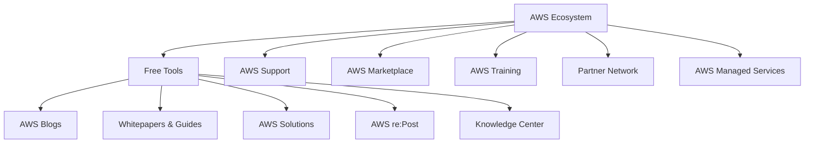
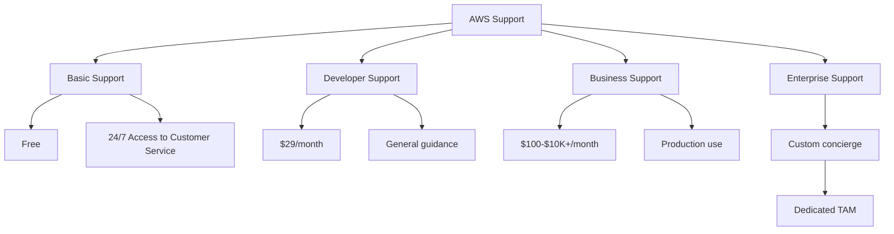
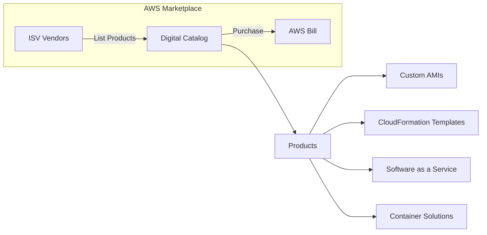
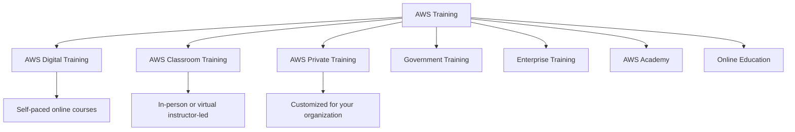
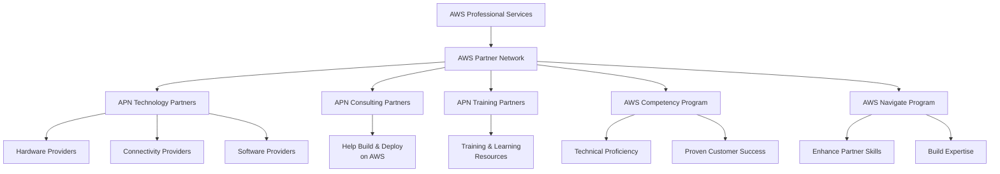
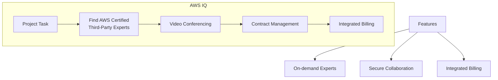
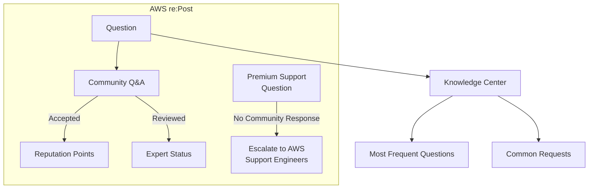
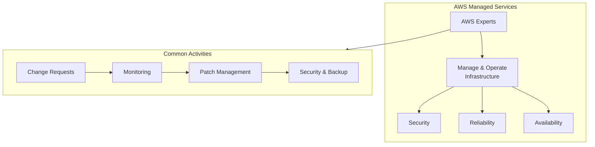

# AWS Ecosystem - Free Tools & Services

## The Big Picture

The AWS Ecosystem provides a comprehensive suite of **free tools, support options, training resources, and professional services** to help you manage, monitor, and optimize your cloud environment effectively.

---

## AWS Ecosystem Overview

---

## AWS Free Tools

### AWS Blogs

| Resource | URL | Description |
|----------|-----|-------------|
| **AWS Blogs** | https://aws.amazon.com/blogs/aws/ | Latest updates, announcements, and best practices from AWS |

### AWS Whitepapers & Guides

| Resource | URL | Description |
|----------|-----|-------------|
| **Whitepapers & Guides** | https://aws.amazon.com/whitepapers | Technical whitepapers, architecture guides, and implementation documents |

### AWS Solutions

| Resource | URL | Description |
|----------|-----|-------------|
| **AWS Solutions** | https://aws.amazon.com/solutions/ | Vetted technology solutions for the AWS Cloud |

#### Example: AWS Landing Zone

| Aspect | Description |
|--------|-------------|
| **Purpose** | Create a secure, multi-account AWS environment |
| **Status** | Replaced by AWS Control Tower |
| **URL** | https://aws.amazon.com/solutions/implementations/aws-landing-zone/ |

---

## AWS Support

> ⚠️ We will cover AWS Support in more detail later - this is just a basic overview!

---

## AWS Marketplace

AWS Marketplace is a **digital catalog** with thousands of software listings from independent software vendors (third-party).

### Product Types

| Product Type | Description |
|--------------|-------------|
| **Custom AMIs** | Customized operating systems, firewalls, technical solutions |
| **CloudFormation Templates** | Infrastructure as code templates |
| **SaaS Offerings** | Software as a Service products |
| **Container Solutions** | Container-based software and services |

### Key Points

| Aspect | Description |
|--------|-------------|
| **Purchases** | Added to your AWS bill |
| **Selling** | You can sell your own solutions on AWS Marketplace |
| **Discovery** | Browse and search thousands of third-party solutions |

---

## AWS Training

### Training Options

| Training Type | Description |
|---------------|-------------|
| **AWS Digital Training** | Online courses and resources for self-paced learning |
| **AWS Classroom Training** | In-person or virtual instructor-led sessions |
| **AWS Private Training** | Customized training solutions tailored for your organization |
| **Training for U.S. Government** | Specialized programs for government employees and contractors |
| **Training for Enterprise** | Programs designed for large organizations |
| **AWS Academy** | Collaborates with universities to offer AWS-based curriculum |
| **Online Education** | Various online educators provide AWS certification courses |

---

## AWS Professional Services & Partner Network

The **AWS Professional Services organization** is a global team of experts who collaborate with your team and a selected member of the **AWS Partner Network (APN)**.

### APN Partner Types

| Partner Type | Description |
|--------------|-------------|
| **APN Technology Partners** | Providers of hardware, connectivity, and software solutions |
| **APN Consulting Partners** | Professional services firms that assist with building and deploying applications on AWS |
| **APN Training Partners** | Organizations that offer training and learning resources for AWS |

### APN Programs

| Program | Description |
|---------|-------------|
| **AWS Competency Program** | Recognizes APN Partners who have demonstrated technical proficiency and proven customer success in specialized solution areas |
| **AWS Navigate Program** | Helps APN Partners enhance their skills and expertise as AWS Partners |

---

## AWS IQ

AWS IQ helps you **quickly locate professional assistance** for your AWS projects.

### Key Features

| Feature | Description |
|---------|-------------|
| **AWS Certified Experts** | Hire third-party experts for on-demand project tasks |
| **Video Conferencing** | Built-in video collaboration |
| **Contract Management** | Simplified contract handling |
| **Secure Collaboration** | Secure workspace for project work |
| **Integrated Billing** | Billing through AWS |

---

## AWS re:Post

**AWS re:Post** is an AWS-managed Q&A service offering crowd-sourced, expert-reviewed answers to technical questions about AWS.

### Key Points

| Aspect | Description |
|--------|-------------|
| **Replaces** | Original AWS Forums |
| **Cost** | Part of AWS Free Tier |
| **Reputation** | Community members earn reputation points for accepted answers |
| **Expert Status** | Build expert status by providing quality answers |
| **Premium Support** | Questions escalated to AWS Support engineers if no community response |
| **Limitations** | Not for time-sensitive or proprietary information questions |

### AWS Knowledge Center

| Aspect | Description |
|--------|-------------|
| **Content** | Most frequent and common questions and requests |
| **Access** | Freely available resource |

---

## AWS Managed Services (AMS)

**AWS Managed Services (AMS)** provides infrastructure and application support on AWS through a team of AWS experts.

### Key Features

| Feature | Description |
|---------|-------------|
| **Fully Managed** | AWS handles common activities |
| **24/7/365 Support** | Continuous support availability |
| **Change Requests** | Managed infrastructure changes |
| **Monitoring** | Continuous infrastructure monitoring |
| **Patch Management** | Regular security patches |
| **Security** | Security best practices implementation |
| **Backup Services** | Automated backup management |
| **Best Practices** | Implements AWS best practices |

### Benefits

| Benefit | Description |
|---------|-------------|
| **Focus on Business** | Offload routine management tasks |
| **Reduced Overhead** | Lower operational complexity |
| **Reduced Risk** | AWS best practices and expertise |
| **Reliability** | Enterprise-grade reliability and support |

---

## Key Takeaways

1. **AWS Free Tools** include Blogs, Whitepapers, Guides, Solutions, AWS re:Post, and Knowledge Center
2. **AWS Support** ranges from Free (Basic) to paid tiers (Developer, Business, Enterprise)
3. **AWS Marketplace** is a digital catalog for third-party software (AMIs, CloudFormation, SaaS, Containers)
4. **AWS Training** options include Digital, Classroom, Private, Government, Enterprise, Academy, and Online Education
5. **AWS Partner Network (APN)** includes Technology, Consulting, and Training Partners
6. **AWS Competency Program** recognizes partners with proven technical proficiency
7. **AWS IQ** lets you hire AWS Certified third-party experts for on-demand project help
8. **AWS re:Post** is a free Q&A service (replaces AWS Forums) with community reputation system
9. **AWS Knowledge Center** contains the most frequent questions and answers
10. **AWS Managed Services (AMS)** provides fully managed infrastructure support 24/7/365

---

## Next Steps

⬅️ Previous: [Well-Architected Framework](./05-well-architected-framework.md) | ➡️ Next: [Back to Index](../README.md)

---

*Part of the [AWS Cloud Practitioner Study Notes](../README.md).*
