# Infrastructure Fundamentals for Cloud Computing

## The Big Picture

Before diving into AWS services, it's essential to understand the **physical infrastructure foundations** that make cloud computing possible. This module covers application environments, fault tolerance, server types, clustering, and virtualization.

---

## Learning Objectives

By the end of this section, you will be able to:

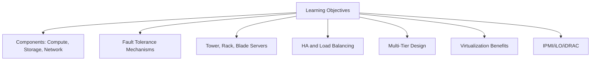

---

## 1. Understanding Digital Services and Applications

At the heart of digital services are **applications** - from web and mobile apps to enterprise systems and cloud services.

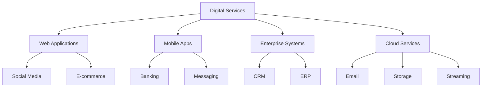

### Functional vs Non-Functional Requirements

| Aspect | Functional Requirements | Non-Functional Requirements |
|--------|------------------------|----------------------------|
| **What** | What the application does | How the application performs |
| **Examples** | UI design, business logic, data processing, features | Low latency, high speed, security, high availability |
| **Owner** | Primarily developer responsibility | Infrastructure & operations responsibility |

> ⚠️ **Critical Point:** Non-functional requirements are essential. Without them, even the best-designed application will fail. Users expect services to be **fast, secure, and always available**.

---

## 2. Essential Components of an Application's Environment

Applications need an environment to function - this requires **three fundamental components**.

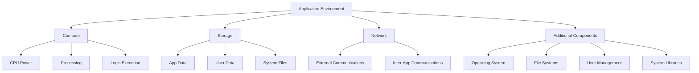

### The Three Pillars Explained

| Component | Purpose |
|-----------|---------|
| **Compute Power** | CPU resources to execute application logic and handle requests |
| **Storage** | Persistent storage for data, files, and configuration |
| **Network** | Connectivity for communication with users and services |

---

## 3. Single Point of Failure (SPOF)

When we rely on a single PC, **any component failure** causes total system failure.

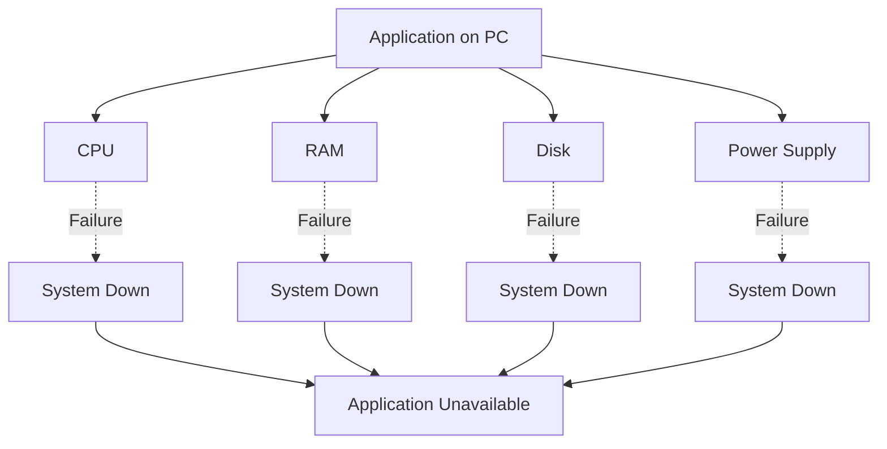

### Common Failure Scenarios

| Component | Failure Impact |
|-----------|---------------|
| **CPU** | Application can't process requests |
| **RAM** | System crashes or data corruption |
| **Storage** | Data loss and unavailability |
| **Power Supply** | Immediate system shutdown |
| **Network Interface** | Application becomes unreachable |

> 📌 **SPOF Definition:** A Single Point of Failure is any component that, if it fails, causes the entire system to become unavailable.

---

## 4. Fault Tolerance

To eliminate SPOFs, we implement **Fault Tolerance** - the system's ability to continue operating during failures.

### Two-Step Fault Tolerance Process

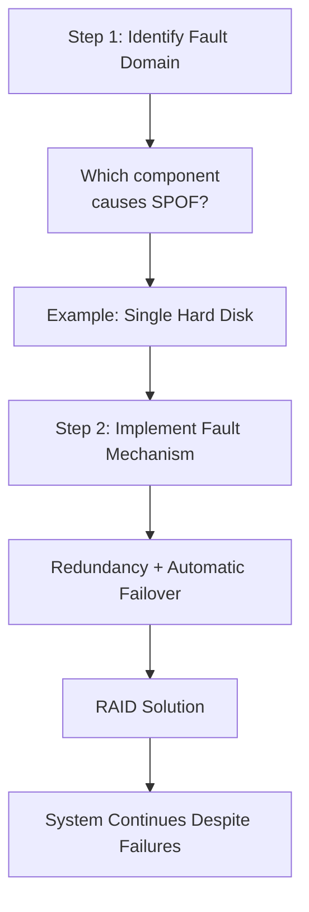

### RAID Solutions

#### RAID 1 (Mirroring)

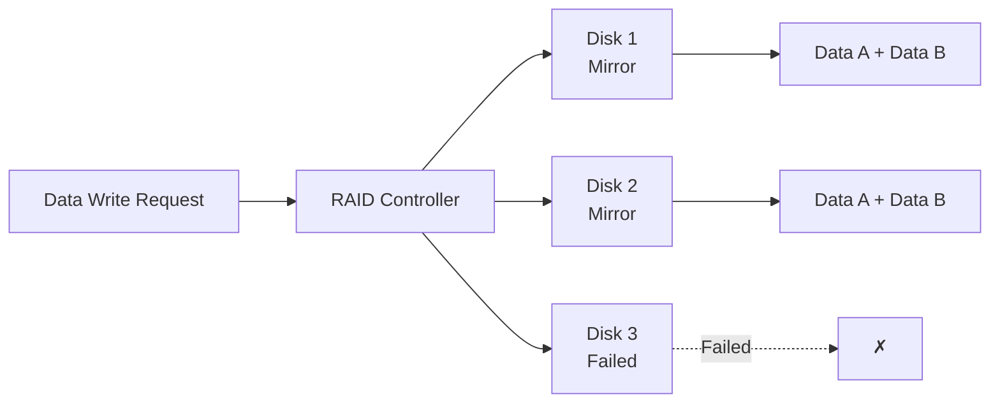

| RAID 1 Properties | Details |
|-------------------|---------|
| **Mechanism** | Data written to multiple disks simultaneously |
| **Fault Tolerance** | System continues if one disk fails |
| **Penalty** | 50% storage capacity lost to redundancy |

#### RAID 5 (Parity)

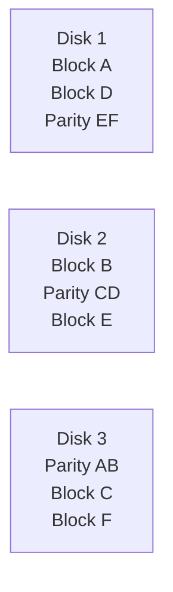

| RAID 5 Properties | Details |
|-------------------|---------|
| **Mechanism** | Data distributed across all disks with parity |
| **Fault Tolerance** | Can survive one disk failure |
| **Penalty** | 1 disk capacity lost to parity |
| **Trade-off** | Performance impact from parity calculations |

---

## 5. Why Normal PCs Are Insufficient

Normal PCs lack the capabilities needed for **comprehensive fault tolerance**.

### PC Limitations

| Limitation | Issue |
|------------|-------|
| Single CPU socket | Limited processing capacity |
| Single power supply | No power redundancy |
| Limited RAID support | No storage fault tolerance |
| Standard RAM | No error detection |
| Consumer-grade components | Lower reliability |

### Memory Corruption Issue

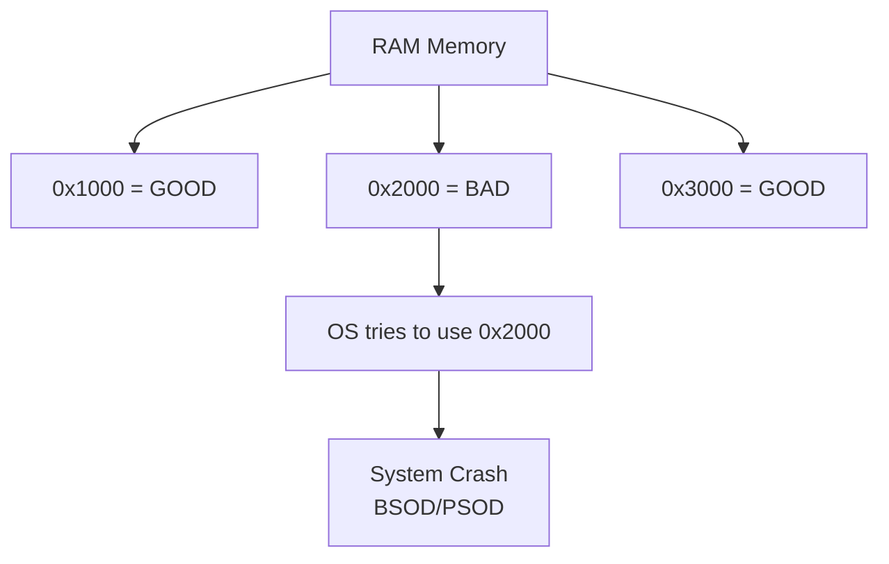

> ⚠️ Normal PCs can't detect "bad addresses" in RAM, causing **Blue Screen of Death** (Windows) or **Purple Screen of Death** (VMware).

---

## 6. Servers: Features & Components

Servers are powerful computers designed for **high reliability** and performance.

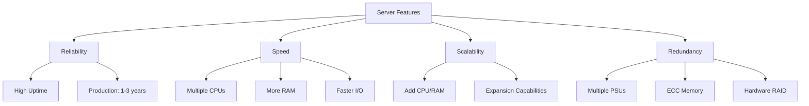

### Critical Server Components

#### ECC Memory

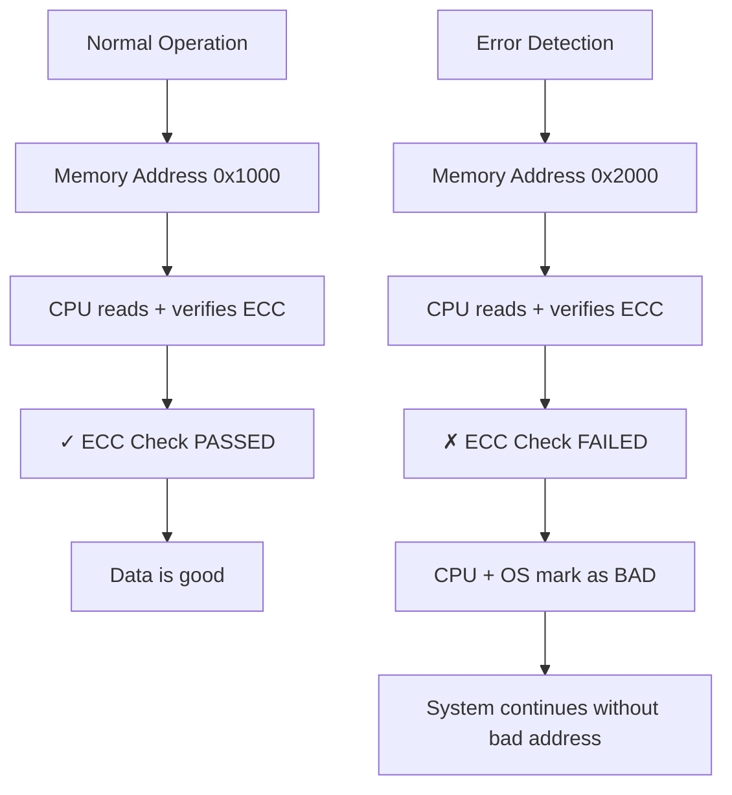

#### Redundant Power Supplies

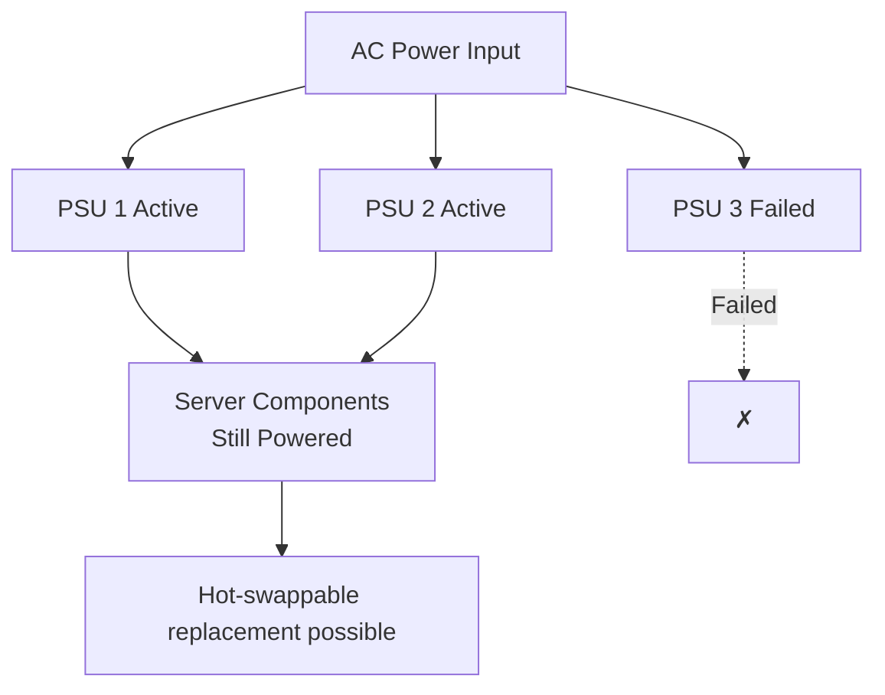

---

## 7. Types of Servers

Servers come in different physical forms optimized for specific environments.

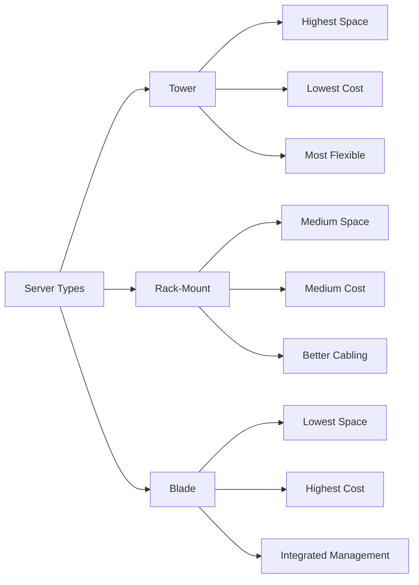

### Comparison Table

| Type | Space Usage | Cost | Cabling | Management | Expansion |
|------|-------------|------|---------|------------|-----------|
| **Tower** | Highest | Lowest | Difficult | Individual KVM | Most flexible |
| **Rack-Mount** | Medium | Medium | Better | KVM Switch | Limited |
| **Blade** | Lowest | Highest | Easiest | Integrated KVM | Most limited |

### Tower Servers

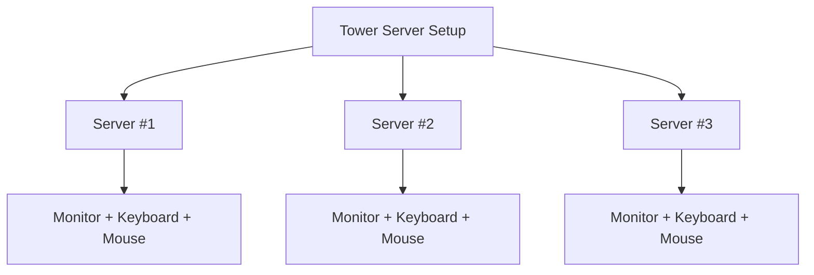

| Tower Pros | Tower Cons |
|-----------|-----------|
| Flexible expansion | Space inefficient |
| Lowest cost | Cable management nightmare |

### Rack-Mount Servers

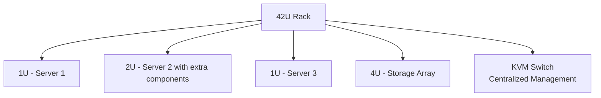

> 📌 **U-Unit:** 1U = 1.75 inches (44.45mm) in height. A typical rack is 42U tall.

### Blade Servers

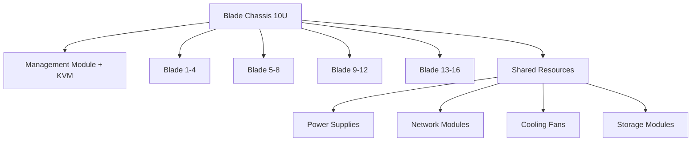

| Blade Pros | Blade Cons |
|-----------|-----------|
| Maximum density | Highest cost |
| Integrated management | Limited by chassis |

---

## 8. Remote Management: IPMI / iLO / iDRAC

Remote management allows administrators to manage servers **anywhere in the world**.

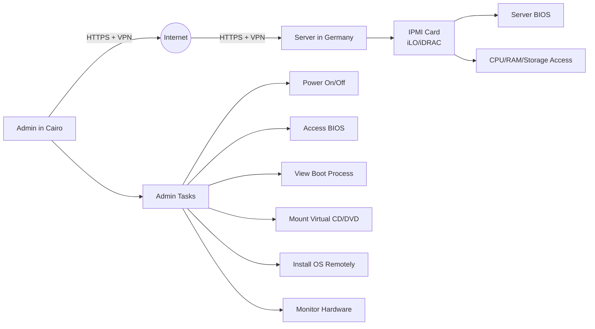

### Key Features

| Feature | Benefit |
|---------|---------|
| **Independent IP Address** | Works without OS loaded |
| **Web Interface** | Browser-based access |
| **Virtual KVM** | Remote console access |
| **Power Control** | On/off from anywhere |
| **OS Installation** | Mount virtual media |

### IPMI Vendor Implementations

| Vendor | Implementation |
|--------|---------------|
| **HP** | iLO (Integrated Lights-Out) |
| **Dell** | iDRAC (Dell Remote Access Controller) |
| **IBM** | IMM (Integrated Management Module) |
| **Cisco** | CIMC (Cisco Integrated Management Controller) |

> ⚠️ **Security Best Practice:** Never expose IPMI interfaces directly to the internet. Always use VPN access or secure internal networks.

---

## 9. Server Clustering Solutions

Even powerful servers with redundant components can fail. **Clustering** connects multiple devices to work together.

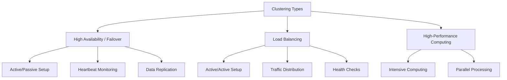

### Clustering Comparison

| Type | Configuration | Purpose | Best For |
|------|--------------|---------|----------|
| **HA/Failover** | Active/Passive | Redundancy | Databases |
| **Load Balancing** | Active/Active | Distribute load | Web servers |
| **HPC** | Parallel | Intensive computation | Scientific apps |

---

## 10. Why Clustering is Essential

Applications can fail not just from hardware, but from **load spikes and attacks**.

### Load Spike Scenarios

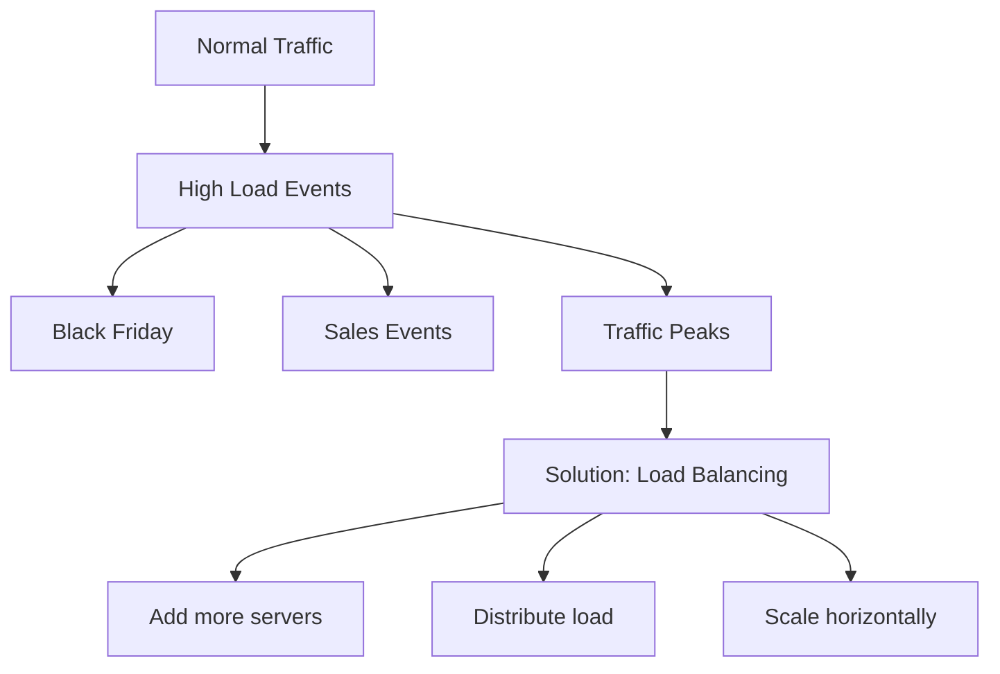

### DoS vs DDoS Attacks

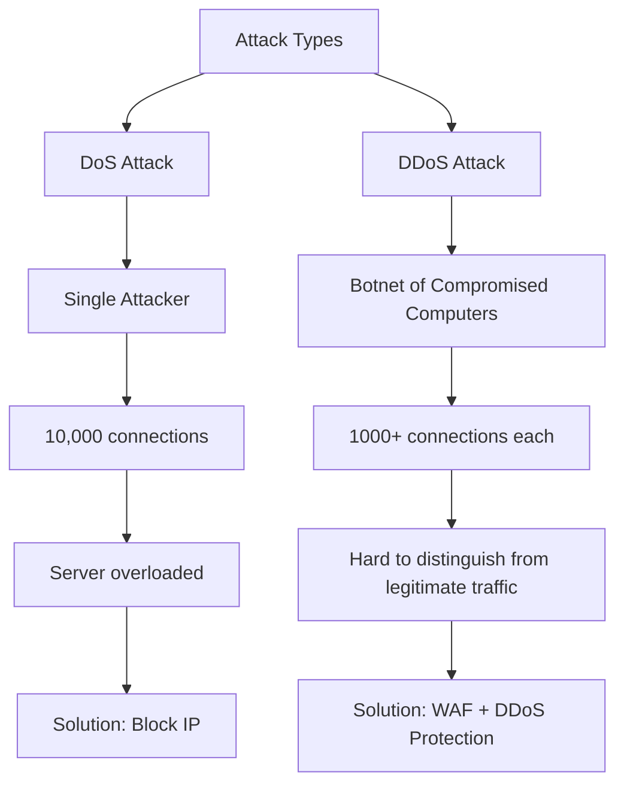

> ⚠️ **Critical Point:** Adding more servers will **NOT solve a DDoS attack** - you need specialized protection like Web Application Firewalls (WAF) or DDoS protection services.

---

## 11. Multi-Tier Architecture

Putting all components on a single server creates an obvious SPOF. The solution is **Multi-Tier Architecture**.

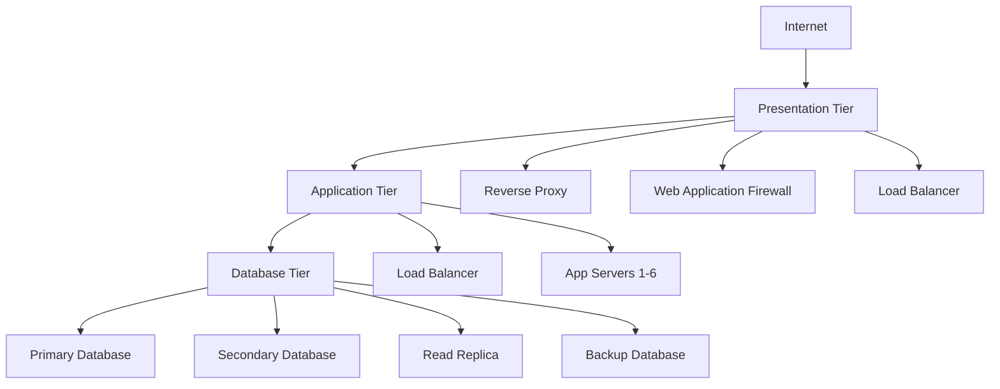

### Tier Functions and Security Zones

| Tier | Network Exposure | Primary Function | Clustering Type |
|------|-----------------|------------------|-----------------|
| **Presentation** | Internet-Exposed | Security, Traffic Management | Load Balancing |
| **Application** | Internal Network | Business Logic Processing | Load Balancing |
| **Database** | Most Secure Network | Data Storage & Management | HA/Replication |

### Multi-Tier Benefits

```mermaid
graph TD
    Benefits[Multi-Tier Benefits] --> B1[Eliminates SPOFs]
    Benefits --> B2[Security through segmentation]
    Benefits --> B3[Independent scaling]
    Benefits --> B4[Specialized optimization]
```

---

## 12. The Cost of High Availability

### High Availability Math

```mermaid
graph TD
    Service[One Digital Service] --> AL[Application Layer: 2 servers]
    Service --> DL[Database Layer: 2 servers]
    
    AL --> Total[Total: 4 servers minimum per service]
    DL --> Total
    
    Total --> Scale[Cost Scale]
    Scale --> S1[1 service = 4 servers]
    Scale --> S2[5 services = 20 servers]
    Scale --> S3[10 services = 40 servers]
    Scale --> S4[50 services = 200 servers]
```

### Cost Components per Server

| Component | Cost Factor |
|-----------|------------|
| Hardware purchase | $5,000 - $50,000+ |
| Rack space rental | Monthly cost |
| Power consumption | 24/7 operation |
| Cooling systems | Continuous |
| Network connectivity | Bandwidth costs |
| Maintenance & support | Ongoing |

### The Utilization Problem

```mermaid
graph TD
    Util[Server Utilization Crisis] --> Wasted[70-85% WASTED]
    Util --> Used[15-25% USED]
    
    Wasted --> P1[Financial waste]
    Wasted --> P2[Oversized infrastructure]
    Wasted --> P3[High operational costs]
    Wasted --> P4[Environmental impact]
```

---

## 13. Why Not Consolidate? (The Risks)

```mermaid
graph TD
    Consolidate[Multiple Apps on Single Server] --> Risk[Risks]
    
    Risk --> R1[Service Failure Cascade]
    R1 --> R1a[ALL apps go down]
    
    Risk --> R2[Security Attack Spread]
    R2 --> R2a[Attacker accesses all apps]
    R2 --> R2b[Lateral movement within server]
```

> 📌 **Isolation Requirement:** We need technology that provides **strong isolation** between applications while **maximizing resource utilization**.

---

## 14. The Solution: Virtualization

Virtualization solves both the **utilization problem** and the **isolation requirement**.

### Virtualization Definition

> **Server Virtualization:** The ability to divide a single physical resource into multiple **isolated** logical resources.

```mermaid
graph TD
    Before[BEFORE: One Physical = One App] --> B1[Physical Server]
    B1 --> B2[OS]
    B2 --> B3[Application]
    B3 --> B4[Utilization: 15-25% WASTEFUL]
    
    After[AFTER: One Physical = Multiple VMs] --> A1[Physical Server]
    A1 --> Hyper[Hypervisor]
    Hyper --> VM1[VM 1: OS-A + App-A]
    Hyper --> VM2[VM 2: OS-B + App-B]
    Hyper --> VM3[VM 3: OS-C + App-C]
    Hyper --> VM4[VM 4: OS-D + DB-X]
    Hyper --> VM5[VM 5: OS-E + DB-Y]
    
    After --> A_Efficient[Utilization: 70-85% EFFICIENT]
```

### Virtualization Benefits

#### 1. Perfect Isolation

```mermaid
graph TD
    Iso[Isolation] --> Failure[VM-1 Failure Scenario]
    Iso --> Security[VM-1 Security Breach]
    
    Failure --> F1[VM-1: CRASH ✗✗✗]
    Failure --> F2[VM-2-5: STILL WORKING ✓✓✓]
    
    Security --> S1[VM-1: HACKED 🔴🔴🔴]
    Security --> S2[VM-2-5: STILL SECURE 🛡️🛡️🛡️]
```

#### 2. Dramatic Resource Utilization

```mermaid
graph LR
    Traditional[Traditional: 40 services] --> T160[160 Physical Servers]
    T160 --> TUtil[Utilization: 20%]
    
    Virtualized[Virtualized] --> V160[160 Virtual Servers]
    V160 --> V20[20 Physical Servers]
    V20 --> VUtil[Utilization: 80%]
    
    VUtil --> Savings[Space, Power, Cooling Savings: 87.5%]
```

### Cost Savings Summary

```mermaid
mindmap
  root((Virtualization Benefits))
    Isolation
      Prevents cascade failures
      Contains security breaches
      Each VM independent
    Utilization
      From 20% to 80%+
      75-90% hardware reduction
      Massive cost savings
    Operational
      Space reduction
      Power reduction
      Cooling reduction
      Centralized management
```

---

## Key Takeaways

1. **Application Environment** requires three pillars: Compute, Storage, Network
2. **Single Point of Failure (SPOF)** - any component failure brings down entire system
3. **Fault Tolerance** requires identifying fault domains and implementing redundancy
4. **RAID** provides storage fault tolerance (RAID 1 mirroring, RAID 5 parity)
5. **Servers** offer ECC memory, redundant PSUs, and hardware RAID
6. **Server Types:** Tower (flexible), Rack (efficient), Blade (dense)
7. **Remote Management** via IPMI/iLO/iDRAC allows off-site administration
8. **Clustering** solves failures beyond hardware: HA/Failover, Load Balancing, HPC
9. **Multi-Tier Architecture:** Presentation → Application → Database
10. **High Availability** requires 4 servers minimum per service
11. **Server Utilization** issue: 70-85% wasted capacity
12. **Virtualization** solves both utilization and isolation problems
13. **Virtualization efficiency:** 20% → 80% utilization, 87.5% space/power savings

---

## Next Steps

⬅️ Previous: [AWS Ecosystem](./06-aws-ecosystem.md) | ➡️ Next: [Compute Services](./08-compute-services.md)

---

*This documentation is part of the AWS Cloud Practitioner certification study materials.*