# Virtualization Crash Course

## The Big Picture

Virtualization is the technology foundation that makes **cloud computing possible**. This module provides an in-depth exploration of virtualization concepts, hypervisors, network/storage/OS virtualization, and container technology.

---

## Learning Objectives

By the end of this section, you will be able to:

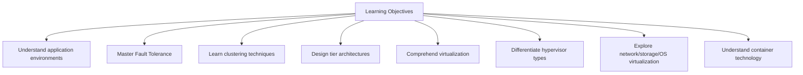

---

## I. Application Environment and Requirements

Before diving into virtualization, we must understand the **fundamental environment** in which applications operate.

### Application Environment Components

Every application requires a complete ecosystem to function - **six essential layers**:

```mermaid
graph TD
    AppEnv[Application Environment] --> App[Application Layer<br/>Your Code/Software]
    AppEnv --> Libs[Libraries & Dependencies]
    AppEnv --> Bin[Binaries & Supporting Software]
    AppEnv --> OS[Operating System Layer]
    AppEnv --> HW[Hardware Layer<br/>CPU | RAM | Disk]
    AppEnv --> Net[Networking]
    
    OS --> OS1[Linux]
    OS --> OS2[Windows]
    OS --> OS3[macOS]
    
    HW --> H1[CPU Processing]
    HW --> H2[Memory]
    HW --> H3[Storage]
```

### Key Components Explained

| Component | Purpose |
|-----------|---------|
| **Libraries** | Pre-written code collections for common functionality |
| **Dependencies** | Software packages required for the application to run |
| **Binaries** | Compiled executable programs and supporting software |
| **Operating System** | Software managing hardware and providing services |
| **Hardware** | Physical resources: CPU, RAM, Disk |
| **Networking** | Connectivity for external communication |

### Software Industry Workflow


### Functional vs Non-Functional Requirements

| Requirement Type | Description | Examples |
|------------------|-------------|----------|
| **Functional** | Define **what** the application does | User authentication, data processing, payment processing |
| **Non-Functional** | Define **how well** it performs (quality attributes) | Security, performance, availability, scalability |

### High Availability and Performance

> ⚠️ **Critical Issues That Impact Business:**
> - **Availability Issue**: Application exists but is inaccessible
> - **Performance Issue**: Application responds too slowly under load
> - **Hardware Limitations**: Insufficient CPU, RAM, or disk resources
> - **Single Point of Failure (SPOF)**: Any component whose failure brings down the entire system

---

## II. Fault Tolerance Implementation

**Fault Tolerance (FT)** enables systems to continue operating even when components fail through redundancy and intelligent failover mechanisms.

### Three Steps to Implement Fault Tolerance

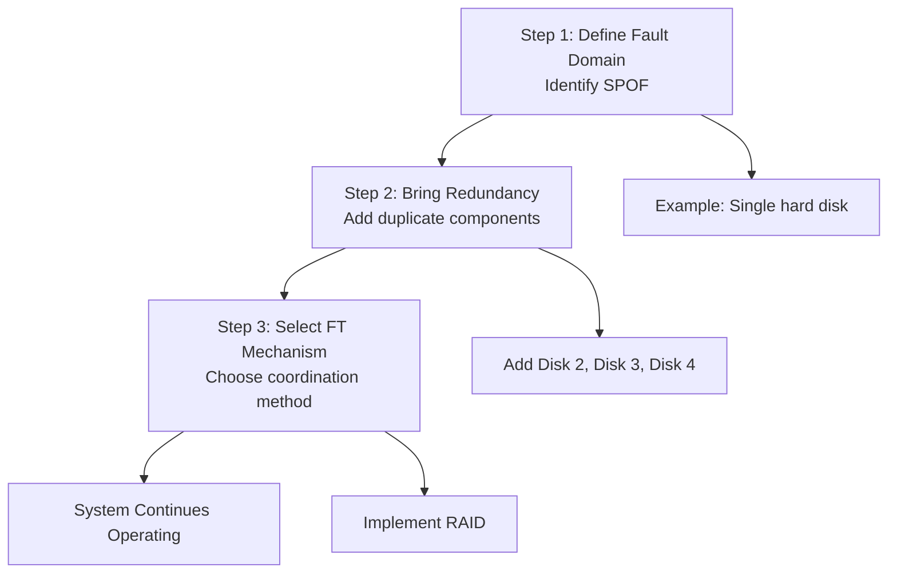

### RAID for Disk Fault Tolerance

**RAID** = Redundant Array of Independent Disks - combines multiple physical disks into logical units for redundancy and performance.

#### Common RAID Levels

| RAID Level | Description | Use Case |
|------------|-------------|----------|
| **RAID 0** | Striping for performance | No redundancy, fast |
| **RAID 1** | Mirroring for redundancy | High availability |
| **RAID 5** | Striping with parity | Balance of performance & redundancy |
| **RAID 6** | Striping with double parity | Higher fault tolerance |
| **RAID 10** | Combination of mirroring and striping | Best performance + redundancy |

#### RAID Implementation Example

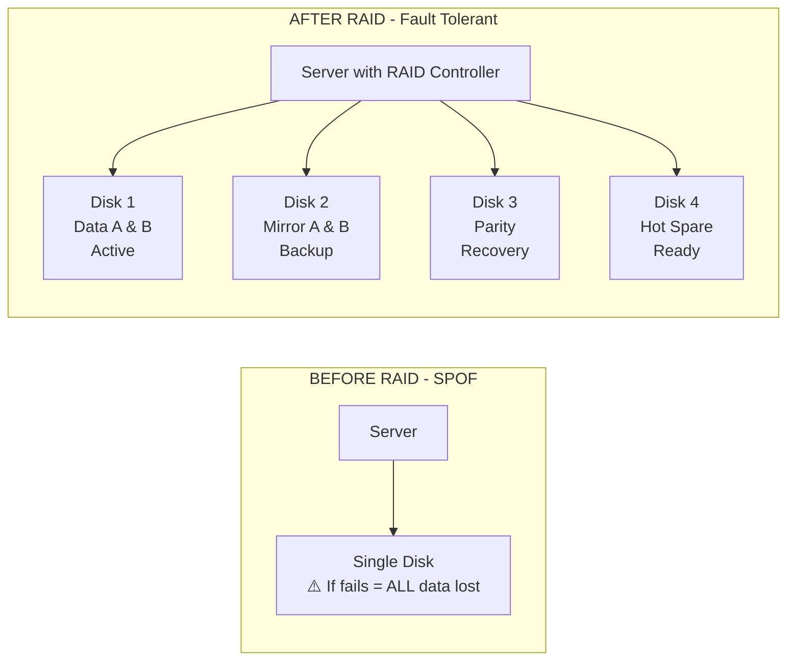

### Clustering for Server Fault Tolerance

**Clustering**: Multiple nodes working together as a single system for redundancy and fault tolerance.

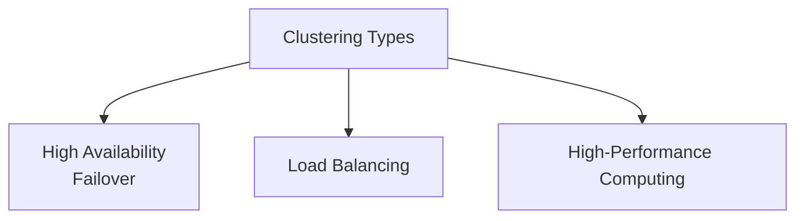

#### A. Failover (High Availability)

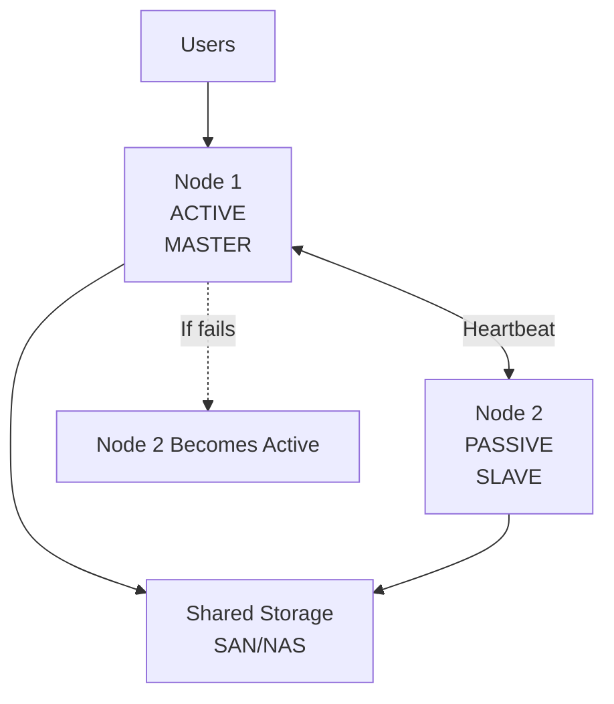

**Key Concepts:**

| Concept | Description |
|---------|-------------|
| **Heartbeat** | Nodes constantly check if other is alive |
| **Failover** | If Active fails, Passive becomes Active |
| **Storage** | Either Shared or Local with Replication |

**Data Replication Strategies:**

| Strategy | Pros | Cons |
|----------|------|------|
| **Synchronous** | Zero data loss, instant availability | High network overhead, performance impact |
| **Asynchronous** | Lower network load, better performance | Potential data loss during replication window |

#### B. Load Balancing

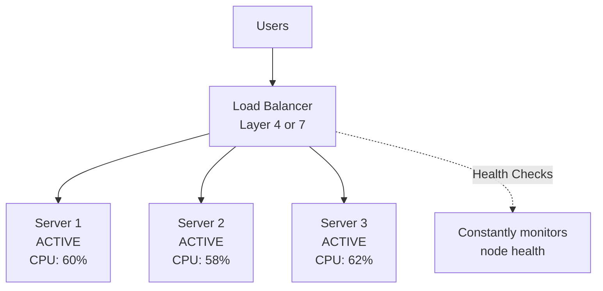

**Load Balancer Components:**

| Component | Description |
|-----------|-------------|
| **Listener** | Monitors node health using TCP/HTTP checks |
| **Algorithm** | Determines request distribution |
| **Layer 4** | Transport layer - faster, IP/Port based |
| **Layer 7** | Application layer - intelligent, content based |

**Distribution Algorithms:**

| Algorithm | Use Case |
|-----------|----------|
| **Round Robin** | Equal distribution in rotation |
| **Least Connections** | Route to node with fewest connections |
| **Weighted** | Distribute based on server capacity |
| **IP Hash** | Same client always routes to same server |

#### C. High-Performance Computing (HPC)

```mermaid
flowflowchart TD
    Master[Master Node<br/>Task Division & Aggregation] --> Task[Large Divisible Task]
    Task --> Divide[Divide into Parts A, B, C...N]
    Divide --> W1[Worker 1<br/>Process Part A]
    Divide --> W2[Worker 2<br/>Process Part B]
    Divide --> W3[Worker 3<br/>Process Part C]
    Divide --> WN[Worker N<br/>Process Part N]
    W1 --> Aggregate[Master<br/>Aggregates Results]
    W2 --> Aggregate
    W3 --> Aggregate
    WN --> Aggregate
```

**HPC Requirements:**

1. **Task MUST be divisible** into independent parts
2. **Specialized CODE** for: Division, Distribution, Aggregation
3. **Computing Farm** of multiple nodes

---

## III. System Architecture and Cost Optimization

### Tier Architecture Design

> **Fundamental Principle:** "Do not put everything in one basket."

#### Monolithic Anti-Pattern

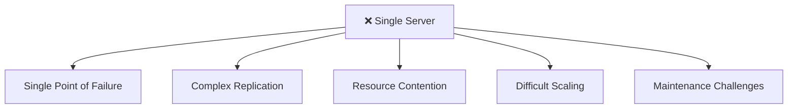

#### Tier Architecture with Fault Tolerance

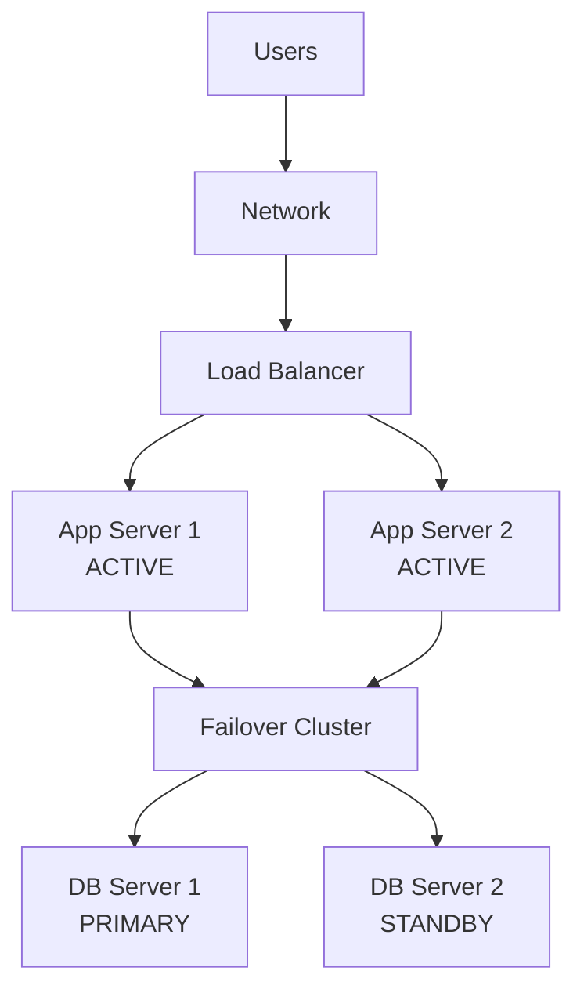

**Recommended FT Mechanisms by Component:**

| Component | Recommended FT | Reasoning |
|-----------|---------------|-----------|
| **Application Servers** | Load Balancing or Failover | Stateless apps benefit from LB; stateful may need failover |
| **Database Servers** | Failover (HA) Cluster with Replication | Primary-standby with read replicas |

### The Cost Problem

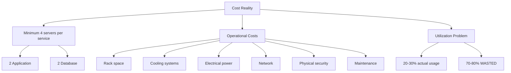

**Server Utilization Visualization:**

```
Server Capacity:    [████████████████████████████████] 100%
Actual Usage:       [██████░░░░░░░░░░░░░░░░░░░░░░░░░░]  30%
                     ↑↑↑↑↑↑                          
                     USED   ↑↑↑↑↑↑↑↑↑↑↑↑↑↑↑↑↑↑↑↑↑↑↑↑
                            WASTED CAPACITY (70%)
```

### Why Virtualization is the Solution

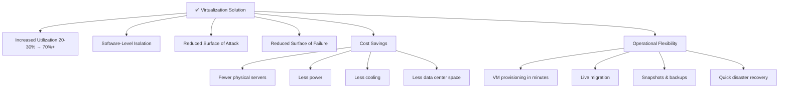

---

## IV. Virtualization: Concepts and Types

**Virtualization Definition**: The ability to take a single physical resource and divide it into multiple logical resources of the same type, each operating independently and in complete isolation.

### Types of Virtualization

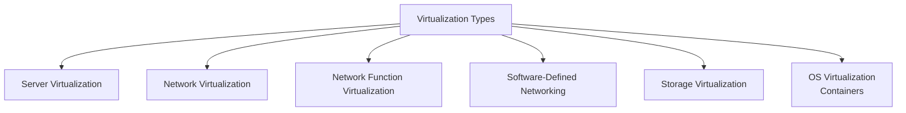

### 4.1 Server Virtualization

Server virtualization divides **one physical server into multiple virtual machines (VMs)**, each with its own OS and applications.

#### CPU Privilege Rings (x86 Architecture)

Understanding Type 1 vs Type 2 requires understanding CPU privilege rings:

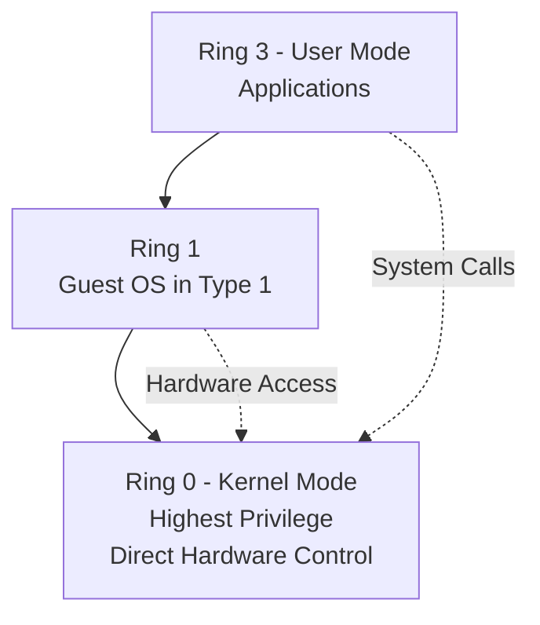

**Pre-Virtualization vs With Type 1:**
- **Pre-Virtualization**: OS occupied Ring 0, apps in Ring 3
- **With Type 1**: Hypervisor takes Ring 0, Guest OS moves to Ring 1

#### Type 1 vs Type 2 Hypervisors

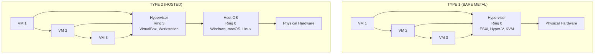

**Type 1 vs Type 2 Comparison:**

| Aspect | Type 1 (Bare Metal) | Type 2 (Hosted) |
|--------|---------------------|-----------------|
| **Ring Control** | Controls Ring 0 | Runs in Ring 3 |
| **Hardware Access** | Direct control | Through host OS |
| **Performance** | Better | Additional overhead |
| **Use Case** | Production | Development/Testing |
| **Examples** | ESXi, Hyper-V, KVM | VirtualBox, VMware Workstation |

**Historical Example - Windows Server 2008 R2 & Hyper-V:**
1. Admin installs Windows Server 2008 R2 (occupies Ring 0)
2. Admin enables Hyper-V role (installed as software)
3. Server reboots automatically
4. **After reboot**: Hyper-V now controls Ring 0!
5. Windows Server becomes the "parent partition" running under Hyper-V

> **Key Insight:** Whoever controls Ring 0 is the Type 1 hypervisor, regardless of installation method.

#### Major Hypervisor Vendors (2024-2025)

| Vendor | Type 1 | Type 2 | Notes |
|--------|--------|--------|-------|
| **VMware (Broadcom)** | vSphere ESXi | Workstation, Fusion | Enterprise leader, acquired by Broadcom 2023 |
| **Microsoft** | Hyper-V | - | Integrated with Windows Server |
| **Oracle** | Oracle VM Server (Xen) | VirtualBox | Cross-platform |
| **Citrix/XenServer** | XenServer 8 (Xen) | - | Rebranded back to XenServer 2024 |
| **Red Hat** | OpenShift Virtualization (KVM) | - | RHV in maintenance mode |
| **Nutanix** | AHV (KVM) | - | Free with Nutanix HCI |
| **Proxmox** | Proxmox VE (KVM + LXC) | - | Open-source, SMB/homelab |
| **AWS** | Nitro System (KVM) | - | Custom, powers EC2 |
| **Open Source** | KVM, Xen Project | QEMU | KVM merged into Linux kernel |

### 4.2 Network Virtualization

Network virtualization encompasses **three distinct concepts** that are often confused.

#### A. Network Virtualization (NV)

Divides **one physical network device** into multiple virtual instances.

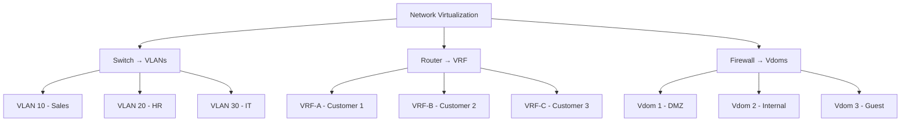

**NV Examples:**

| Device | Technology | Description |
|--------|-----------|-------------|
| **Switch** | VLANs | Multiple isolated virtual switches |
| **Router** | VRF | Multiple independent routing tables |
| **Firewall** | Vdoms | Multiple independent virtual firewalls |

#### B. Network Function Virtualization (NFV)

Replaces **physical network appliances with software** running on VMs.

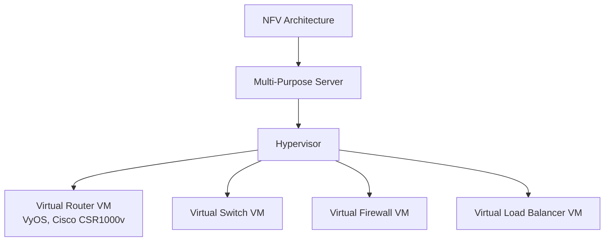

**Critical Difference - NV vs NFV:**

| Aspect | Network Virtualization (NV) | Network Function Virtualization (NFV) |
|--------|---------------------------|--------------------------------------|
| **Approach** | Divides one physical device into multiple virtual instances | Replaces physical appliances with software on VMs |
| **Physical Device** | Still exists and is partitioned | Replaced with general-purpose servers |
| **Example** | One FortiGate → 4 Vdoms | Virtual router software on VM |

#### C. Software-Defined Networking (SDN)

SDN **separates the control plane (decision-making)** from the **data plane (packet forwarding)**.

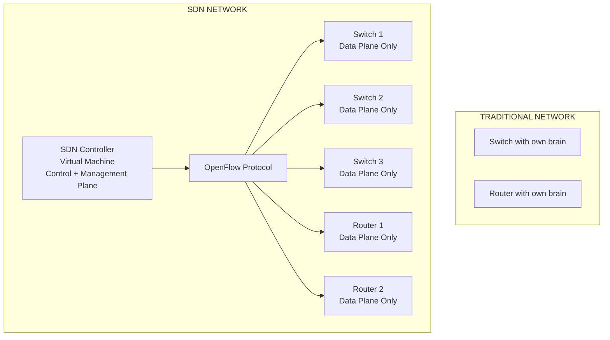

**SDN Architecture:**

| Component | Role |
|-----------|------|
| **Centralized Controller** | Hosts control and management planes |
| **Network Devices** | Become simple forwarding devices (data plane only) |
| **OpenFlow Protocol** | Standardized communication between controller and devices |

### 4.3 Storage Virtualization

**Storage Virtualization**: Aggregating multiple physical storage devices into a unified logical pool, from which virtual volumes can be created.

#### The Problem Without Virtualization

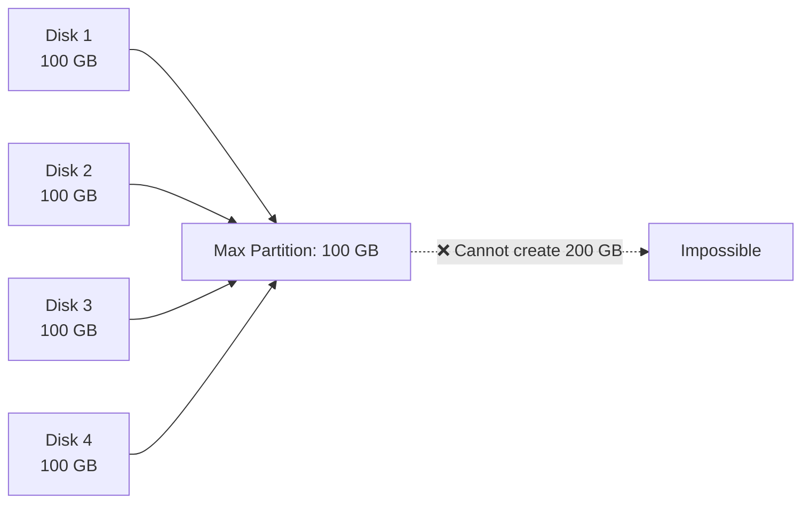

#### The Solution With Virtualization

```mermaid
graph LR
    D1[Disk 1<br/>100 GB] --> Pool[Logical Pool<br/>400 GB Total]
    D2[Disk 2<br/>100 GB] --> Pool
    D3[Disk 3<br/>100 GB] --> Pool
    D4[Disk 4<br/>100 GB] --> Pool
    Pool --> V1[Volume A<br/>200 GB]
    Pool --> V2[Volume B<br/>150 GB]
```

#### Storage Virtualization Technologies

| Technology | Implementation | Description |
|------------|----------------|-------------|
| **LVM (Linux)** | Logical Volume Manager | PV → VG → LV hierarchy |
| **LUN** | Logical Unit Number | Enterprise storage arrays |
| **Storage Spaces** | Windows feature | Modern Windows virtualization |
| **ZFS / Btrfs** | Modern filesystems | Built-in virtualization with snapshots |

#### Benefits

| Benefit | Description |
|---------|-------------|
| **Abstraction** | Users see logical volumes, not physical structure |
| **Flexibility** | Create, resize, delete volumes without changing hardware |
| **Dynamic Expansion** | Add disks to pool, immediately expand volumes |
| **Simplified Management** | Unified resource pools vs individual disks |
| **Better Utilization** | Avoid wasted space from undersized partitions |

### 4.4 Operating System Virtualization (Containers)

**OS Virtualization (Containers)**: Partitioning a single OS kernel into multiple isolated user-space instances.

#### Critical Distinction

```mermaid
graph LR
    SV[Server Virtualization] --> SVNote[Different OS types allowed<br/>Linux VM, Windows VM, macOS VM]
    OSV[OS Virtualization] --> OSVNote[Must share same kernel<br/>All Linux OR all Windows]
```

#### OS Architecture

```mermaid
graph TD
    User[USER SPACE<br/>User Address Space] --> UI[User Interface]
    UI --> GUI[GUI]
    UI --> CLI[CLI Terminal]
    User --> SysCall[System Calls]
    SysCall --> Kernel[KERNEL SPACE<br/>Kernel Address Space]
    Kernel --> KM[Kernel Management<br/>Process, Memory, Files, Drivers]
    KM --> HW[Hardware<br/>CPU | RAM | Disk | Network]
```

#### Container Technology Evolution

| Year | Technology | Significance |
|------|-----------|--------------|
| **2000-2001** | FreeBSD Jails | First mainstream OS-level virtualization |
| **2004-2005** | Solaris Containers/Zones | Enterprise-grade isolation |
| **2008** | LXC | Brought containers to Linux (cgroups + namespaces) |
| **2013** | **Docker** | **Revolutionary moment** - made containers mainstream |
| **2014-2015** | Kubernetes | Google's container orchestration at scale |
| **2015-Present** | Ecosystem | Podman, containerd, CRI-O, Windows Containers |

#### Why Docker Succeeded

```mermaid
graph TD
    Docker[Docker Success Factors] --> DevX[Developer Experience<br/>Simple CLI]
    Docker --> Port[Portability<br/>Build once, run anywhere]
    Docker --> Layer[Layered Filesystem<br/>Efficient storage]
    Docker --> Hub[Docker Hub<br/>Centralized registry]
    Docker --> File[Dockerfile<br/>Infrastructure as code]
    Docker --> Eco[Ecosystem<br/>Compose, Swarm, integrations]
    Docker --> Time[Perfect Timing<br/>Microservices + DevOps era]
```

#### Server Virtualization vs OS Virtualization

```mermaid
graph TB
    subgraph VM["SERVER VIRTUALIZATION (VMs)"]
        VM1[VM 1] --> VM1A[App] --> VM1L[Libs] --> VM1OS[Guest OS Linux]
        VM2[VM 2] --> VM2A[App] --> VM2L[Libs] --> VM2OS[Guest OS Windows]
        VM3[VM 3] --> VM3A[App] --> VM3L[Libs] --> VM3OS[Guest OS Mac]
        VM1OS & VM2OS & VM3OS --> Hyper[Hypervisor<br/>ESXi, Hyper-V, KVM] --> VMHW[Physical Hardware]
    end
    
    subgraph Container["OS VIRTUALIZATION (Containers)"]
        C1[CTR 1] --> C1A[App] --> C1L[Libs]
        C2[CTR 2] --> C2A[App] --> C2L[Libs]
        C3[CTR 3] --> C3A[App] --> C3L[Libs]
        C1L & C2L & C3L --> CR[Container Runtime<br/>Docker, containerd]
        CR --> HostOS[Host OS<br/>Shared Linux Kernel] --> CHW[Physical Hardware]
    end
```

#### VMs vs Containers Comparison

| Aspect | Virtual Machines | Containers |
|--------|------------------|------------|
| **Isolation Level** | Hardware-level | OS-level process |
| **OS Flexibility** | Different OS per VM | Must share same kernel |
| **Resource Overhead** | Heavy (GBs per VM) | Light (MBs per container) |
| **Startup Time** | Minutes (OS boot) | Seconds (process start) |
| **Density** | 10-50 VMs per host | 100s-1000s per host |
| **Security Isolation** | Stronger | Weaker (improving with gVisor, Kata) |
| **Best Use Cases** | Different OS, strong isolation, legacy apps | Microservices, cloud-native, CI/CD |

**Resource Example:**
```
VM:        App (100MB) + OS (2GB) + Overhead = ~2.5 GB
Container: App (100MB) + Shared Libs (~50MB) = ~150 MB
                        ↑
              10-15x MORE EFFICIENT!
```

#### When to Use Each

```mermaid
graph LR
    UseVMs[Use VMs When:] --> U1[Different OS requirements]
    UseVMs --> U2[Strong isolation needed]
    UseVMs --> U3[Monolithic applications]
    UseVMs --> U4[Legacy applications]
    UseVMs --> U5[Running full desktop OS]
    
    UseContainers[Use Containers When:] --> C1[Microservices architectures]
    UseContainers --> C2[Cloud-native apps]
    UseContainers --> C3[CI/CD pipelines]
    UseContainers --> C4[Rapid scaling needed]
    UseContainers --> C5[Development environments]
```

#### Hybrid Approaches (The Future)

| Technology | Description |
|------------|-------------|
| **Kubernetes on VMs** | Container orchestration on VM infrastructure |
| **OpenShift Virtualization** | Manage both VMs and containers in single platform |
| **Kata Containers** | Containers inside lightweight VMs for VM-level security |
| **Firecracker (AWS)** | Micro-VMs starting in milliseconds |

> **Conclusion:** Rather than "VMs vs Containers," the question is "Which workloads for VMs, which for containers?" Most organizations will use both.

---

## Key Takeaways

1. **Application Environment** requires six layers: Application, Libraries, Binaries, OS, Hardware, Networking
2. **Functional vs Non-Functional Requirements** - both critical for application success
3. **Fault Tolerance** follows three steps: Define fault domain, bring redundancy, select mechanism
4. **RAID** provides disk fault tolerance through mirroring, parity, or striping
5. **Clustering** types: HA/Failover (Active/Passive), Load Balancing (Active/Active), HPC (parallel)
6. **Tier Architecture** eliminates SPOFs through isolation and independent scaling
7. **Virtualization** solves utilization (20% → 80%) and isolation problems
8. **Hypervisor Types**: Type 1 (Bare Metal, Ring 0) vs Type 2 (Hosted, Ring 3)
9. **Network Virtualization** includes NV (VLAN/VRF/Vdom), NFV (software functions), and SDN (control plane separation)
10. **Storage Virtualization** aggregates physical disks into logical pools (LVM, LUN)
11. **Containers** share OS kernel - lightweight (10-15x more efficient than VMs)
12. **Docker revolutionized** containers in 2013 through developer experience and Docker Hub
13. **Modern infrastructure** uses hybrid VMs + Containers approach

---

## Next Steps

⬅️ Previous: [Infrastructure Fundamentals](./07-infrastructure-fundamentals.md) | ➡️ Next: [Compute Services](./09-compute-services.md)

---

*This documentation is part of the AWS Cloud Practitioner certification study materials.*