# Virtualization Advanced Concepts

## The Big Picture

Building on the **Virtualization Crash Course**, this module dives deeper into advanced concepts: anti-patterns, Linux namespaces, container internals, microservices architecture, orchestration, and live migration.

---

## Learning Objectives

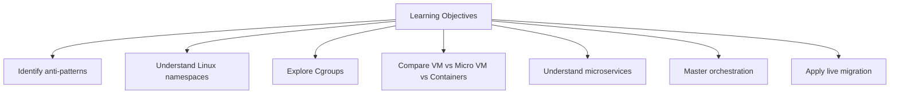

---

## I. The Core Problem: Multi-Application Single Server

### Initial Problem Setup

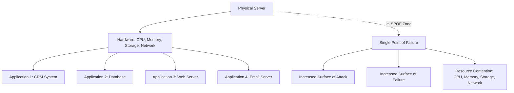

### Problems Introduced

| Problem | Impact |
|---------|--------|
| **Surface of Attack** | One breach affects all applications |
| **Surface of Failure** | Hardware failure stops everything |
| **Resource Contention** | Applications compete for same resources |

---

## II. Anti-Patterns vs Best Practices

### Definitions

| Concept | Description |
|---------|-------------|
| **Anti-Pattern** | Solution that resolves one problem but introduces new ones |
| **Best Practice** | Solution that solves the problem from all angles |

### The Crack in the Wall Analogy

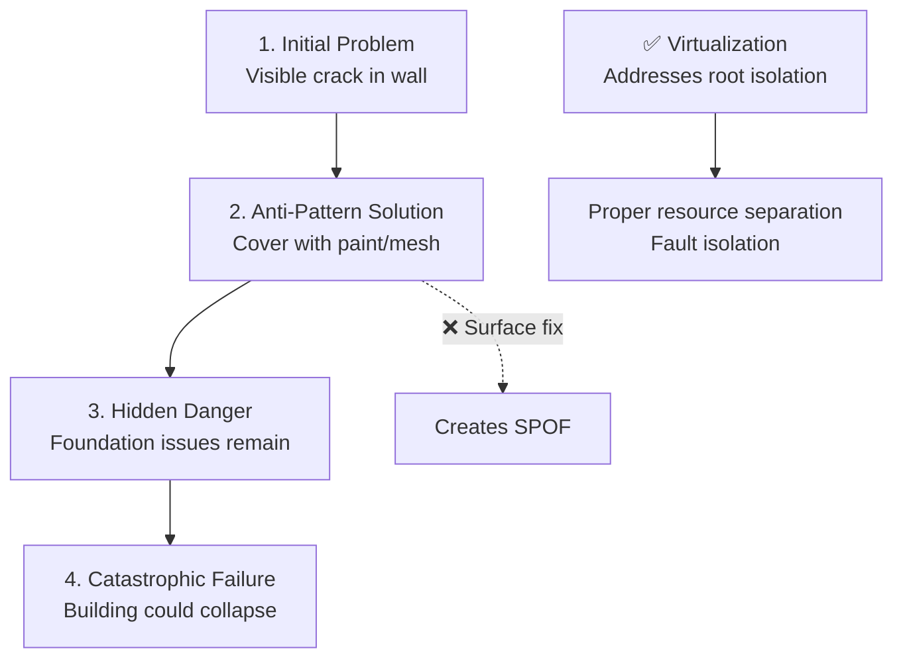

### Risk Comparison

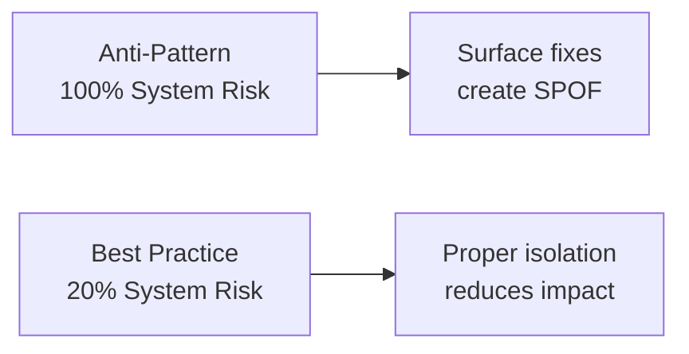

---

## III. Virtualization as a Solution

### Definition

> **Virtualization:** If you have a Resource X, you perform virtualization on it by **dividing that resource into multiple resources of the same type**.

### Impact Analysis

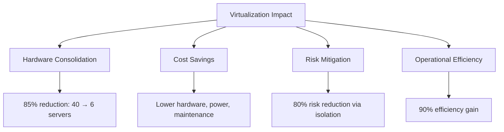

### Server Consolidation Example

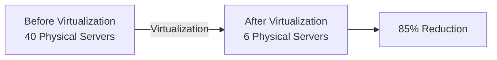

---

## IV. Server Virtualization Deep Dive

### CPU Ring Architecture

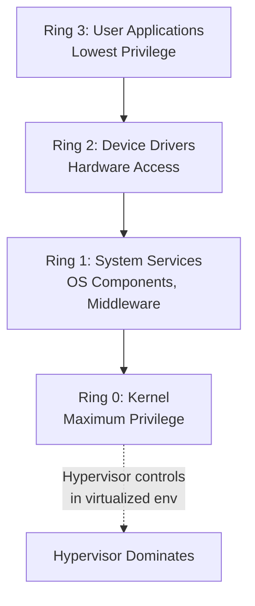

### Ring 0 Control Classification

| Hypervisor Controls Ring 0? | Classification |
|------------------------------|----------------|
| **Yes** | Type 1 (Bare-Metal Virtualization) |
| **No** | Type 2 (Hosted Virtualization) |

### Type 1 vs Type 2 vs Physical Comparison

| Feature | Type 1 (Bare-Metal) | Type 2 (Hosted) | Physical Server |
|---------|---------------------|-----------------|-----------------|
| **Performance** | ⭐⭐⭐⭐⭐ Excellent | ⭐⭐⭐ Good | ⭐⭐⭐⭐⭐ Excellent |
| **Security** | ⭐⭐⭐⭐⭐ Full Isolation | ⭐⭐⭐⭐ Very Good | ⭐⭐⭐ Limited |
| **Resource Efficiency** | ⭐⭐⭐⭐⭐ Optimal | ⭐⭐⭐ Moderate | ⭐⭐ Poor |
| **Setup Complexity** | ⭐⭐⭐ Moderate | ⭐⭐⭐⭐⭐ Easy | ⭐⭐ Complex |
| **Management** | ⭐⭐⭐⭐ Advanced Tools | ⭐⭐⭐ Good Tools | ⭐⭐ Basic |

### Architecture Comparison

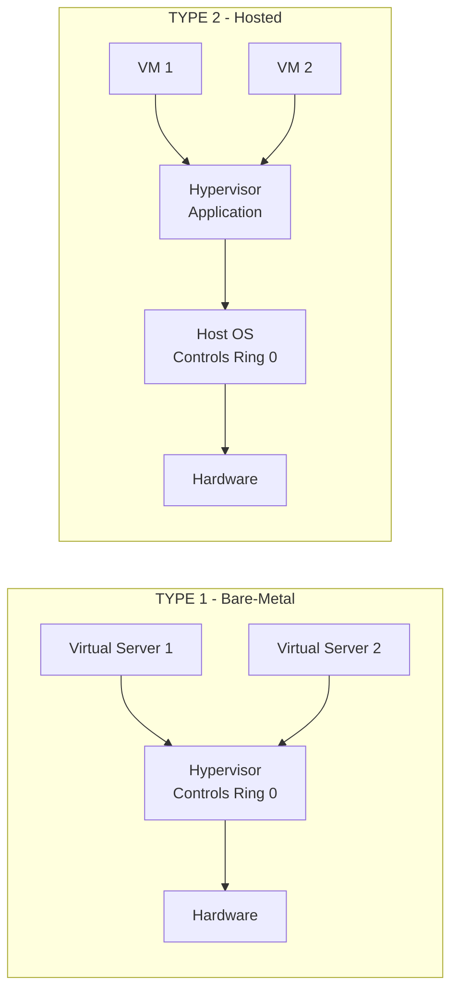

---

## V. Network Virtualization

### Network Virtualization (NV)

Dividing **one physical network device into multiple virtual devices of the same type**.

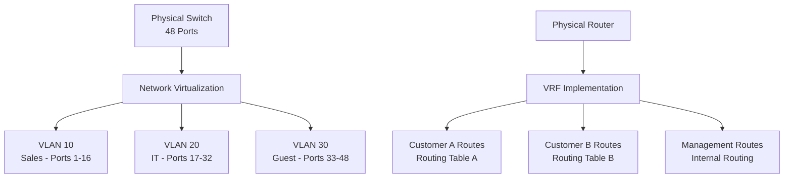

### Benefits

| Benefit | Description |
|---------|-------------|
| **Logical segmentation** | Without physical separation |
| **Cost efficiency** | Flexible management |
| **Isolated routing** | Domains for multi-tenancy |

### Network Function Virtualization (NFV)

**Virtualization of a network function** (Firewall, Router, Switch) as software on a VM.

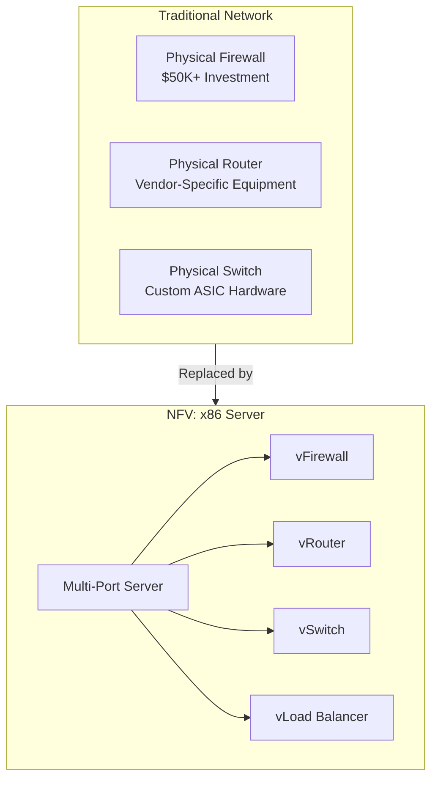

### NFV Advantages

| Traditional | NFV |
|-------------|-----|
| Expensive | Cost Effective |
| Inflexible | Rapid Deployment |
| Slow Updates | Easy Scaling |
| Vendor Dependencies | Vendor Independence |
| Complex Management | Flexible Configuration |

> **Hardware Note:** Since the central element of a physical network device is its ports, a server running NFV must have many ports to enable internal communication.

---

## VI. Storage Virtualization

### LVM Example

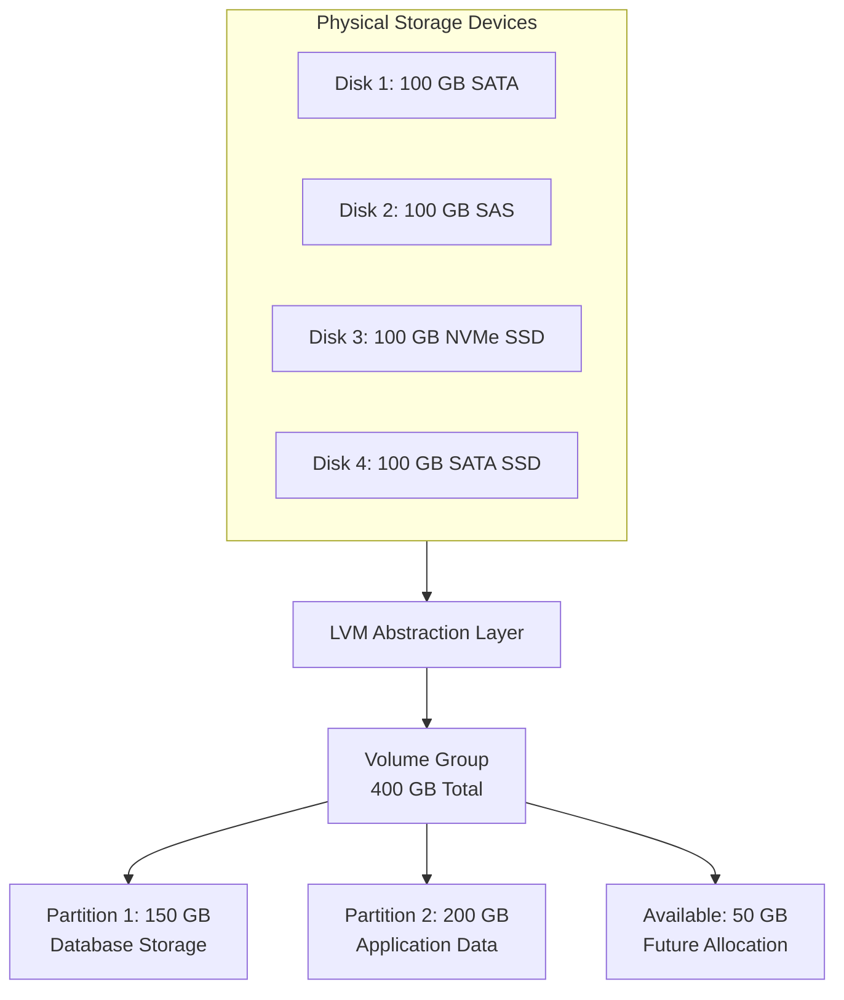

### Storage Terminology

| Technology | Term |
|------------|------|
| **SAN Storage** | Logical Unit Number (LUN) |
| **LVM** | Partitions (Logical Volumes) |

### Critical Note: Fault Tolerance

```mermaid
graph TD
    LVM[LVM Alone] -->|Does NOT provide| Risk[No Fault Tolerance]
    Risk -->|Disk fails = Problem| Fail[Data Loss]
    
    LVM -->|Combine with| RAID[RAID]
    LVM -->|Or use| EC[Erasure Code<br/>Cloud storage enhancement]
    LVM -->|Or use| PG[Protection Groups<br/>e.g., AWS]
    
    LVM + RAID --> FT[Fault Tolerance Achieved]
    LVM + EC --> FT
```

> **Key Point:** LVM's combination function is **separate** from protection. You must integrate RAID or Erasure Code with LVM for fault tolerance.

### Erasure Code

| Aspect | Description |
|--------|-------------|
| **Definition** | Enhancement to RAID |
| **Used in** | Cloud storage, specifically object storage |
| **Advantage** | Better redundancy with less overhead |

---

## VII. OS Virtualization: Container Internals

### Kernel Space vs User Space

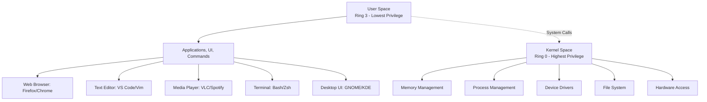

### Linux Container Mechanisms

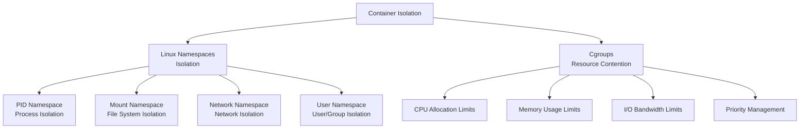

### Before vs After Namespaces

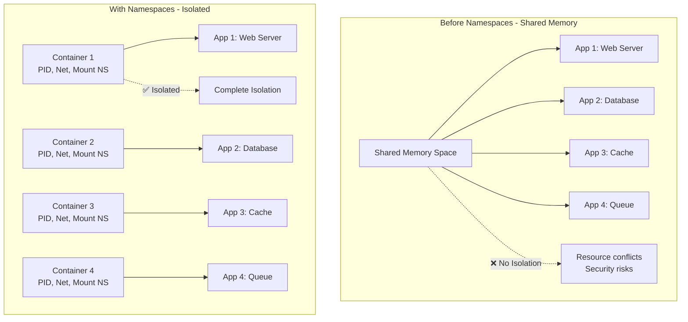

### Cgroups Resource Management

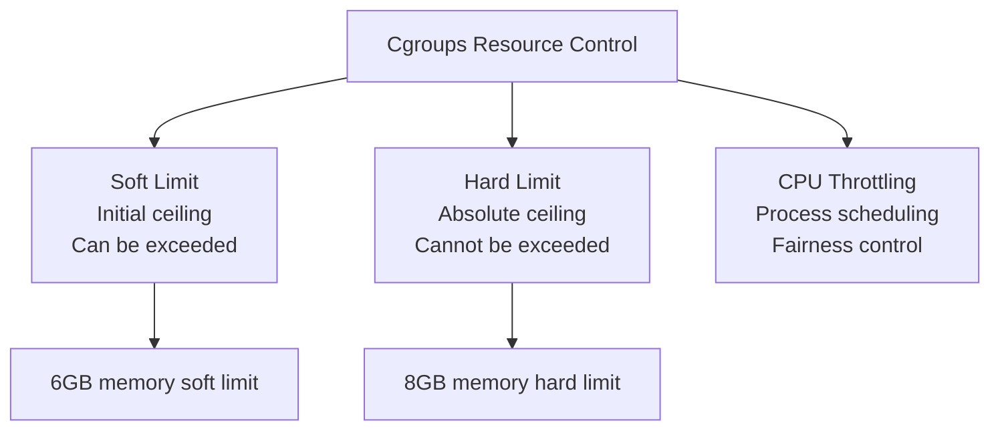

### Resource Management Example

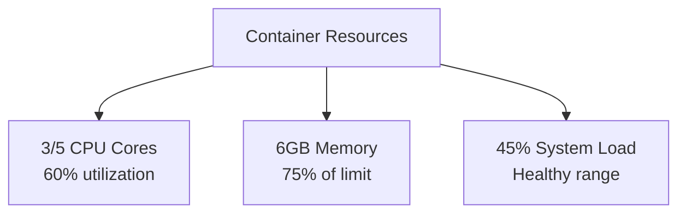

### Container Isolation Limitations

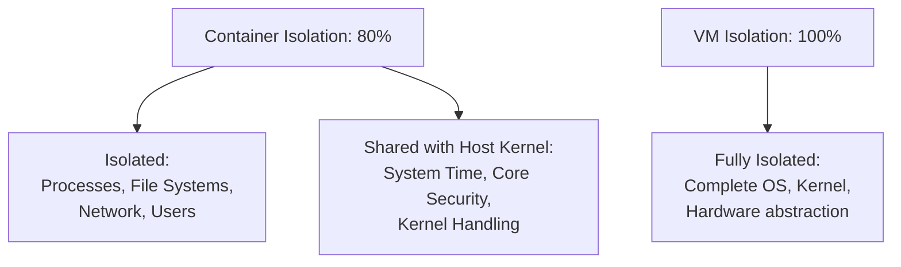

### Security Implication

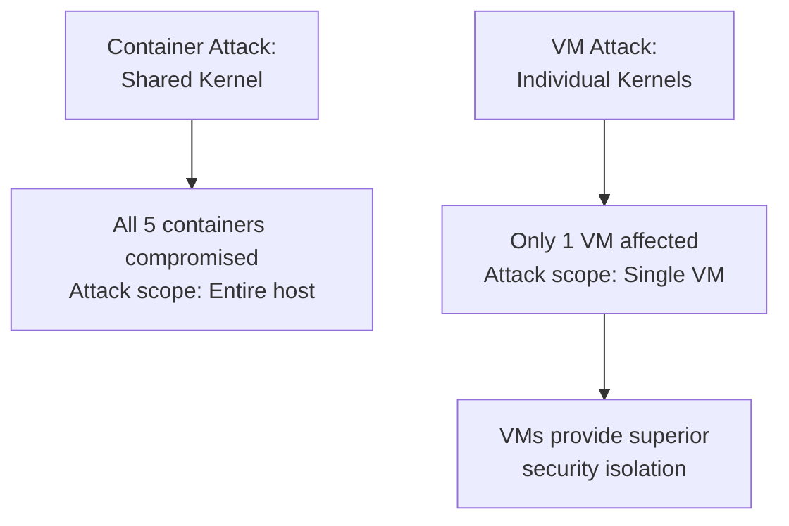

> **Security Risk:** If a vulnerability allows an attack on the shared Linux Kernel, **all containers** running on that OS are compromised. In VMs, each has its own kernel, containing the attack.

---

## VIII. VM vs Micro VM vs Container

### Comparison Matrix

| Factor | Virtual Machine (VM) | Micro VM | Containers |
|--------|---------------------|----------|------------|
| **Creation Time** | 60-120 seconds | 15-30 seconds | 2-5 seconds |
| **Deletion Time** | Minutes | Seconds | Seconds |
| **Isolation** | 100% (Full) | 100% (Same as VM) | 80% (Medium) |
| **Memory Footprint** | ~2GB OS | ~300MB OS | ~50MB |
| **Use Cases** | Critical/Legacy Apps | Secure Microservices | Rapid Scaling Microservices |

### Startup Time Comparison

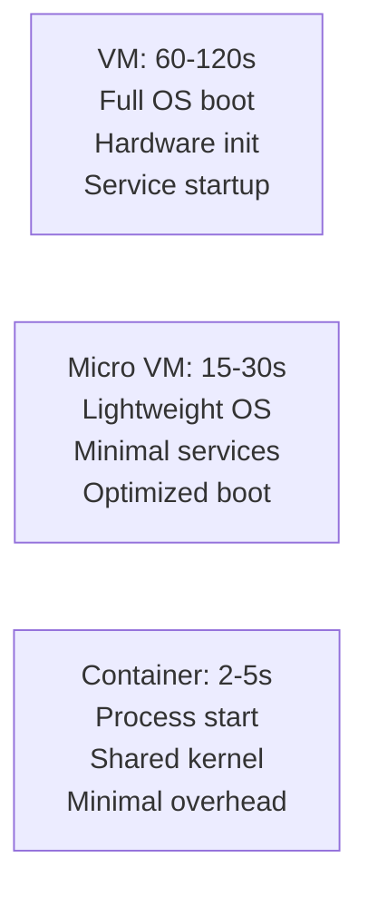

### Memory Footprint

```
2GB   - VM OS (Heavy)
300MB - Micro VM (Light)
50MB  - Container (Minimal)
```

### Use Case Rationale

| Workload Type | Best Choice | Reason |
|---------------|-------------|--------|
| **Critical/Legacy Apps** (CRM, ERP, DB) | VM | Full isolation, security |
| **Secure Microservices** | Micro VM | VM isolation + container speed |
| **Rapid Scaling Microservices** | Container | Speed and scaling capability |

### Micro VM Concept

```mermaid
graph TD
    MV[Micro VM - e.g., AWS Firecracker] --> Speed[Speed<br/>Faster than VM<br/>Slower than native container]
    MV --> Iso[Isolation<br/>Strong VM isolation]
    MV --> Op[Operation<br/>Containers can run inside]
    MV --> Foot[Footprint<br/>300MB vs 2GB OS<br/>Drastically reduced]
    MV --> Boot[Boot Time<br/>Significantly faster<br/>than traditional VM]
```

---

## IX. Monolithic vs Microservices Architecture

### Monolithic Application

```mermaid
graph TD
    Mono[Facebook Monolith<br/>Single Unified Codebase] --> Chat[Chat Module<br/>Messaging System]
    Mono --> Posts[Posts Module<br/>Content System]
    Mono --> Ads[Ads Module<br/>Advertisement System]
    Mono --> Reels[Reels Module<br/>Video System]
    
    Mono -.->|❌ SPOF| Fail[One bug crashes<br/>entire application]
    Mono -.->|Scaling Issue| Diff[Difficult to scale<br/>individual features]
```

### Microservices Architecture

```mermaid
graph TD
    Micro[Microservices] --> CS[Chat Service<br/>Independent Deploy<br/>Auto-scalable<br/>Own Database]
    Micro --> PS[Posts Service<br/>Independent Deploy<br/>Auto-scalable<br/>Own Database]
    Micro --> AS[Ads Service<br/>Independent Deploy<br/>Auto-scalable<br/>Own Database]
    Micro --> RS[Reels Service<br/>Independent Deploy<br/>Auto-scalable<br/>Own Database]
    
    Micro -.->|✅ Fault Isolation| Good[Services fail independently<br/>Scale individually]
```

### Microservices Scaling Example

```mermaid
graph TD
    Scale[Microservices Auto-Scaling] --> C1[Chat Service<br/>3 instances<br/>High demand scaled from 1 → 3]
    Scale --> P1[Posts Service<br/>1 instance<br/>Normal load]
    Scale --> M1[Media Service<br/>2 instances<br/>Peak hours scaled 1 → 2]
    
    Scale --> Process[Auto-Scaling Process]
    Process --> M[Monitor: CPU, memory, requests]
    Process --> A[Analyze: Compare to thresholds]
    Process --> U[Scale UP: Add instances]
    Process --> D[Scale DOWN: Remove excess]
    Process --> B[Balance: Distribute traffic]
```

### Failure Impact Comparison

```mermaid
graph LR
    MonoFail[Monolithic Failure<br/>100% Application Down<br/>One component crashes entire app]
    MicroFail[Microservices Failure<br/>15% Application Down<br/>Only affected service goes down]
```

### Microservices Benefits

| Benefit | Description |
|---------|-------------|
| **Fault Isolation** | If one service fails, others remain operational |
| **Independent Scaling** | Scale specific services based on demand |
| **Technology Choice** | Different services can use different tech stacks |
| **Rapid Scaling** | Containers fit perfectly for microservices needs |

---

## X. Management and Orchestration Layer

### Beyond Hypervisor: Third Vital Layer

```mermaid
graph TD
    Virt[Virtualization Core] --> Isol[Environment Isolation]
    Virt --> RC[Resource Contention]
    Virt --> MO[Management & Orchestration]
    
    MO --> Features[Advanced Features<br/>Hypervisor alone cannot provide]
    Features --> LM[Live Migration]
    Features --> FO[Failover & HA]
```

### Server Virtualization Management

```mermaid
graph TD
    vCenter[VMware vCenter<br/>Centralized Management] --> VM1[VM1: Web Server<br/>8GB RAM]
    vCenter --> VM2[VM2: Database<br/>16GB RAM]
    vCenter --> VM3[VM3: App Server<br/>4GB RAM]
    
    vCenter --> Features[Key Features]
    Features --> F1[Live Migration]
    Features --> F2[High Availability]
    Features --> F3[Resource Pools]
    Features --> F4[DRS - Distributed Resource Scheduler]
```

### Container Orchestration: Kubernetes

```mermaid
graph TD
    K8s[Kubernetes K8s<br/>Container Orchestration Engine] --> N1[Node 1 Worker]
    K8s --> N2[Node 2 Worker]
    
    N1 --> P1[Pod 1]
    N1 --> P2[Pod 2]
    N1 --> P3[Pod 3]
    
    N2 --> P4[Pod 4]
    N2 --> P5[Pod 5]
    N2 --> P6[Pod 6]
    
    K8s --> KFeatures[Key Features]
    KFeatures --> KF1[Auto-healing]
    KFeatures --> KF2[Auto-scaling]
    KFeatures --> KF3[Service Discovery]
    KFeatures --> KF4[Rolling Updates]
```

### Kubernetes Operations

```mermaid
graph TD
    KOps[Kubernetes Process Flow] --> Deploy[1. Deploy<br/>Applications as pods<br/>across cluster nodes]
    Deploy --> Monitor[2. Monitor<br/>Continuously monitor<br/>pod health & resources]
    Monitor --> Scale[3. Auto-scale<br/>Scale pods based on demand]
    Scale --> Heal[4. Self-heal<br/>Restart failed pods<br/>Replace unhealthy containers]
```

### Orchestration Tools Comparison

| Tool | Type | Scale |
|------|------|-------|
| **VMware vCenter** | VM Orchestration | Enterprise VM Management |
| **Docker Swarm** | Container Orchestration | Smaller scale |
| **Kubernetes (K8s)** | Container Orchestration | Most famous, large scale |

---

## XI. Live Migration

### The Power of Live Migration

```mermaid
graph TD
    Before[Pre-Virtualization<br/>Physically transport server<br/>via vehicle and airplane] -->|Old Way| Slow[Slow, downtime required]
    
    VM[Virtual Machine = Folder<br/>Collection of files<br/>virtual hardware, disk binaries] --> LM[Live Migration<br/>Transfer folder/files<br/>across network]
    
    LM --> Amazing[✨ Unprecedented Feature<br/>Video continues playing<br/>during transfer<br/>No interruption]
```

### Live Migration Sequence

```mermaid
graph LR
    Src[Source Server<br/>Cairo, Egypt<br/>Running VM<br/>High CPU Load<br/>Memory: 4GB Active]
    Dst[Target Server<br/>Frankfurt, Germany<br/>Ready to Receive<br/>Available Resources]
    
    Src -->|Step 1| PCopy[Pre-copy<br/>Memory Pages]
    PCopy -->|Step 2| Dirty[Dirty Pages<br/>Sync Changes]
    Dirty -->|Step 3| Stop[Stop & Copy<br/>Brief Pause<br/>2-5 seconds]
    Stop -->|Step 4| Resume[Resume<br/>Start Target VM<br/>Video continues<br/>Active processes]
    Resume --> Dst
    
    Src <-.->|10 Gbps| Dst
```

### Live Migration Benefits

| Benefit | Description |
|---------|-------------|
| **Zero Downtime Maintenance** | Move VMs during hardware updates |
| **Load Balancing** | Distribute load across hosts |
| **Hardware Failure Recovery** | Move VM before host fails |
| **Geographic Optimization** | Move closer to users |
| **Seamless Experience** | No service interruption |

---

## XII. Overall Benefits of Virtualization

### Benefits Summary

```mermaid
graph TD
    Benefits[Virtualization Benefits] --> Iso[Isolation<br/>Reduces Surface of<br/>Failure and Attack]
    Benefits --> RC[Resource Contention<br/>Efficient allocation<br/>across applications]
    Benefits --> CS[Cost Savings<br/>40 services → 6 servers]
    Benefits --> PS[Power & Space Savings<br/>Reduced consumption]
```

### ROI Analysis

```mermaid
graph TD
    ROI[Virtualization ROI] --> Server[Server Consolidation: $2.0M]
    ROI --> Power[Power Savings: $300K]
    ROI --> Space[Space Savings: $150K]
    ROI --> Time[Time Savings: $50K]
    ROI --> Total[Total Annual ROI: $2.5M]
    ROI --> Payback[Payback Period: 8-12 months]
```

### Before vs After Virtualization

| Metric | Before | After | Improvement |
|--------|--------|-------|-------------|
| **Server Count** | 40 Physical | 6 Physical | 85% Reduction |
| **Power Consumption** | 40 × Server Power | 6 × Server Power | 70% Reduction |
| **Deployment Time** | Weeks (hardware procurement) | Minutes (VM creation) | 95% Faster |
| **Failure Recovery** | Hours/Days (hardware replacement) | Minutes (VM restart/migration) | 80% Faster |
| **Resource Utilization** | 15-20% (underutilized) | 70-85% (optimized) | 90% Better |

### Virtualization Journey Summary

```mermaid
graph TD
    Start[Problem:<br/>Multiple Apps on Single Server] -->|Anti-pattern| Risk[SPOF, Resource Contention]
    
    Risk --> Solution[Solution: Virtualization]
    
    Solution --> SV[Server Virtualization<br/>Hypervisor + VMs]
    Solution --> CV[Container Virtualization<br/>Shared Kernel + Containers]
    
    SV --> Orchestration[Orchestration Layer<br/>vCenter / Kubernetes]
    CV --> Orchestration
    
    Orchestration --> Results[Results]
    Results --> R1[85% fewer servers]
    Results --> R2[$2.5M annual savings]
    Results --> R3[70% power reduction]
    Results --> R4[95% faster deployment]
    Results --> R5[Better isolation & security]
```

### What Would Persist Without Virtualization

```mermaid
graph TD
    NoVirt[Without Virtualization] --> P1[High Surface of Attack]
    NoVirt --> P2[High Surface of Failure]
    NoVirt --> P3[Inefficient Resource Utilization]
    NoVirt --> P4[High Operational Costs]
    NoVirt --> P5[Slow Deployment & Recovery]
    NoVirt --> P6[Limited Scalability]
    NoVirt --> P7[Environmental Impact]
    NoVirt --> P8[Excessive Hardware]
```

---

## Key Takeaways

1. **Anti-Patterns** solve one problem but create others; **Best Practices** solve from all angles
2. **Virtualization** divides one resource into multiple resources of the same type
3. **Server Virtualization** 85% reduction in physical servers (40 → 6)
4. **Ring 0 Control** determines Type 1 vs Type 2 hypervisor
5. **Network Virtualization**: VLAN (switches), VRF (routers), Vdom (firewalls)
6. **NFV** virtualizes network functions as software on VMs
7. **LVM alone doesn't provide fault tolerance** - must combine with RAID or Erasure Code
8. **Containers use Linux Namespaces** (isolation) and **Cgroups** (resource control)
9. **Container isolation is only 80%** - shared kernel creates security risk
10. **VMs** (100% isolation, slow) vs **Micro VMs** (100% isolation, fast) vs **Containers** (80% isolation, fastest)
11. **Microservices** require containers for rapid scaling
12. **Kubernetes** orchestrates containers with auto-healing, auto-scaling, service discovery
13. **Live Migration** transfers running VMs across servers with 2-5 second downtime
14. **Total ROI**: $2.5M annual savings, 8-12 month payback period

---

## Next Steps

⬅️ Previous: [Virtualization Crash Course](./08-virtualization.md) | ➡️ Next: [Compute Services](./09-compute-services.md)

---

*This documentation is part of the AWS Cloud Practitioner certification study materials.*