# Network & Storage Virtualization Deep Dive

## The Big Picture

Building on the **Virtualization Crash Course** and **Virtualization Advanced** modules, this deep dive explores how Network Virtualization and NFV are **properly classified across OSI Layers** and how Storage Virtualization exists on a spectrum from device-level to comprehensive platforms.

---

## Learning Objectives

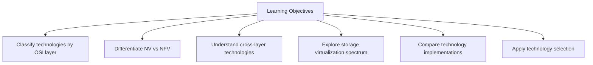

---

## I. Network Virtualization vs NFV: Proper Classification

### Core Definitions

| Concept | Definition |
|---------|-----------|
| **Network Virtualization (NV)** | Creates **virtual networks/connectivity** |
| **Network Function Virtualization (NFV)** | Virtualizes **network services/functions** |

### OSI Layer Mapping

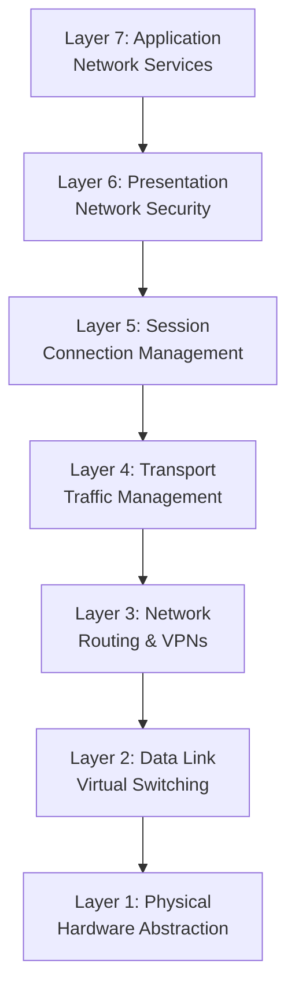

---

## II. Network Technologies by OSI Layer

### Application Layer (Layer 7) - Network Services

| Technology | Classification | Function |
|------------|---------------|----------|
| **Application Delivery Controllers (ADC)** | NFV | Load balancing, SSL acceleration, content caching |
| **Virtual CDN** | NFV | Distributed content caching and delivery |
| **Virtual DNS Services** | NFV | Domain name resolution, DNS load balancing |
| **Virtual Web Proxy** | NFV | Web traffic proxy, content filtering, caching |

### Presentation Layer (Layer 6) - Network Security

| Technology | Classification | Function |
|------------|---------------|----------|
| **Virtual Firewalls** | NFV | Packet filtering, stateful inspection, ACLs |
| **Virtual SSL/TLS Acceleration** | NFV | Encryption/decryption offloading, certificate management |
| **Virtual IDS/IPS** | NFV | Threat detection, intrusion prevention, anomaly detection |
| **Virtual DLP** | NFV | Data loss prevention, content inspection |
| **Virtual PKI/CA** | NFV | Certificate management, digital signing, key distribution |

### Session Layer (Layer 5) - Connection Management

| Technology | Classification | Function |
|------------|---------------|----------|
| **Virtual Session Controllers** | NFV | Session state management, connection persistence |
| **Connection Brokers** | NFV | Connection routing, resource allocation, session management |
| **Virtual Terminal Servers** | NFV | Remote network access, terminal concentration |
| **Virtual SBC (Session Border Controllers)** | NFV | VoIP session control, media gateway functions |

### Transport Layer (Layer 4) - Traffic Management

| Technology | Classification | Function |
|------------|---------------|----------|
| **Virtual Load Balancers** | NFV | Layer 4 load balancing, connection distribution |
| **Virtual QoS/Traffic Shaping** | NFV | Bandwidth management, traffic prioritization |
| **Virtual TCP Optimization** | NFV | Connection optimization, WAN acceleration |
| **Virtual NAT/PAT** | NFV | Address translation, port mapping |
| **Port Virtualization** | Network Virt | Virtual port mapping, protocol abstraction |

### Network Layer (Layer 3) - Routing & VPNs

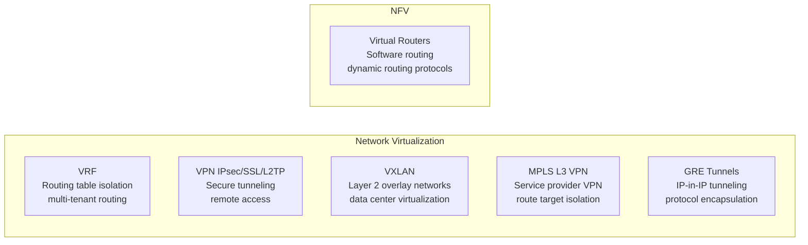

| Technology | Classification | Function |
|------------|---------------|----------|
| **VRF (Virtual Routing)** | Network Virt | Routing table isolation, multi-tenant routing |
| **VPN (IPSec/SSL/L2TP)** | Network Virt | Secure tunneling, remote access, site-to-site |
| **VXLAN** | Network Virt | Layer 2 overlay networks, data center virtualization |
| **MPLS L3 VPN** | Network Virt | Service provider VPN, route target isolation |
| **GRE Tunnels** | Network Virt | IP-in-IP tunneling, protocol encapsulation |
| **Virtual Routers** | NFV | Software routing, dynamic routing protocols |

### Data Link Layer (Layer 2) - Virtual Switching

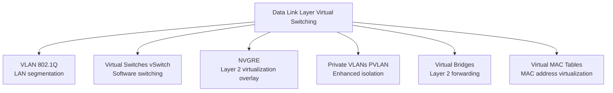

| Technology | Classification | Function |
|------------|---------------|----------|
| **VLAN (802.1Q)** | Network Virt | LAN segmentation, broadcast domain isolation |
| **Virtual Switches (vSwitch)** | Network Virt | Software switching, VM connectivity |
| **NVGRE** | Network Virt | Layer 2 virtualization overlay, tenant isolation |
| **Private VLANs (PVLAN)** | Network Virt | Enhanced VLAN isolation, port-level security |
| **Virtual Bridges** | Network Virt | Layer 2 forwarding, MAC learning |
| **Virtual MAC Tables** | Network Virt | MAC address virtualization, learning optimization |

### Physical Layer (Layer 1) - Hardware Abstraction

| Technology | Classification | Function |
|------------|---------------|----------|
| **Virtual NICs (vNIC)** | Network Virt | Virtual network interfaces, MAC virtualization |
| **SR-IOV** | Network Virt | Hardware NIC virtualization, direct VM access |
| **Port Aggregation (LACP/LAG)** | Network Virt | Physical port bonding, bandwidth aggregation |
| **Hypervisor Networking** | Network Virt | Network hardware abstraction, resource sharing |
| **Optical Network Virtualization** | Network Virt | Wavelength virtualization, optical switching |
| **RAN Virtualization** | Network Virt | Wireless network virtualization, spectrum sharing |

---

## III. Cross-Layer Network Technologies

### What Are Cross-Layer Technologies?

> **Cross-layer network technologies** are networking solutions that operate across **multiple OSI layers simultaneously** rather than being confined to a single layer. They break the traditional "layer isolation" principle to achieve better functionality, performance, or management.

### SDN (Software-Defined Networking)

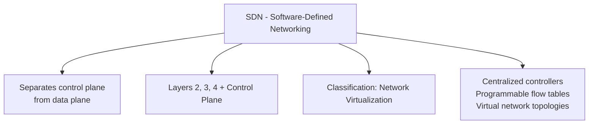

| Aspect | Detail |
|--------|--------|
| **Classification** | Network Virtualization |
| **Layers** | 2, 3, 4 + Control Plane |
| **Key Feature** | Separates control plane from data plane |

### NFV Framework

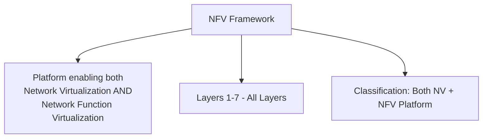

| Aspect | Detail |
|--------|--------|
| **Classification** | Both NV + NFV Platform |
| **Layers** | 1-7 (All Layers) |
| **Key Feature** | Enables both paradigms across all OSI layers |

### Container Networking (CNI)

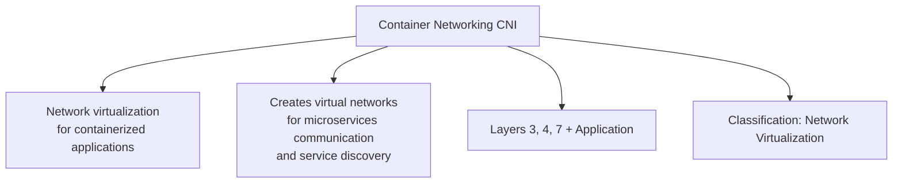

| Aspect | Detail |
|--------|--------|
| **Classification** | Network Virtualization |
| **Layers** | 3, 4, 7 + Application |
| **Key Feature** | Service discovery and microservice communication |

### SD-WAN

| Aspect | Detail |
|--------|--------|
| **Classification** | Both NV + NFV |
| **Layers** | 1, 2, 3, 4 + Management |
| **Key Feature** | Combines virtual WAN connectivity with virtual network functions |

### Cloud Networking (VPC/VNet)

| Aspect | Detail |
|--------|--------|
| **Classification** | Network Virtualization |
| **Layers** | 2, 3, 4 (Cloud-Native) |
| **Key Feature** | Virtual private networks in cloud environments |

### Service Mesh

| Aspect | Detail |
|--------|--------|
| **Classification** | Network Virtualization |
| **Layers** | 4, 5, 7 + Application |
| **Key Feature** | Virtual networking layer for microservices with load balancing, security, observability |

---

## IV. Technology Classification Guide

### Network Virtualization (NV)

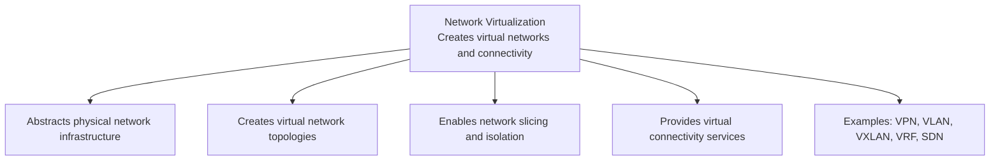

### Network Function Virtualization (NFV)

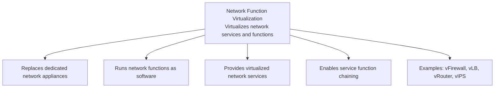

### Hybrid Technologies

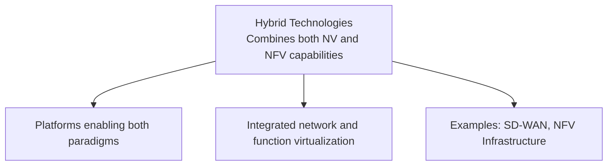

---

## V. Storage Virtualization Spectrum

### Understanding the Spectrum

> **Key Insight:** Storage virtualization exists on a **spectrum**. Technologies don't need to implement all characteristics to be considered legitimate virtualization. Each level addresses specific storage challenges and provides real value.

### Four Virtualization Levels

```mermaid
graph TD
    Spectrum[Storage Virtualization Spectrum] --> Device[Device-Level<br/>Individual storage devices]
    Spectrum --> Host[Host-Level<br/>Server/host management]
    Spectrum --> Network[Network-Level<br/>Across networks]
    Spectrum --> Comprehensive[Comprehensive<br/>Full-scope virtualization]
    
    Device --> D1[RAID]
    Device --> D2[LVM]
    Device --> D3[Windows Dynamic Disks]
    Device --> D4[ZFS/Btrfs]
    
    Host --> H1[Storage Spaces]
    Host --> H2[VMware vSphere Storage]
    Host --> H3[Linux MD Software RAID]
    Host --> H4[Thin Provisioning]
    
    Network --> N1[SAN Virtualization]
    Network --> N2[NAS Clustering]
    Network --> N3[Distributed Storage: Ceph, GlusterFS]
    Network --> N4[Storage Gateways]
    
    Comprehensive --> C1[IBM SAN Volume Controller]
    Comprehensive --> C2[VMware vSAN]
    Comprehensive --> C3[DataCore SANsymphony]
    Comprehensive --> C4[Nutanix HCI]
```

### Level 1: Device-Level Virtualization

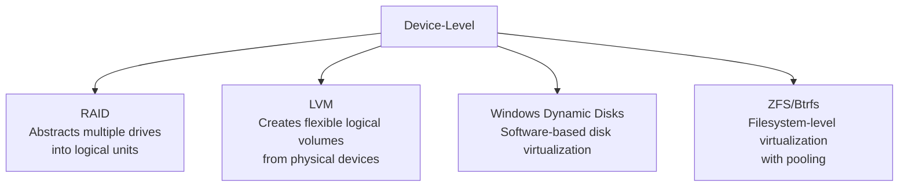

### Level 2: Host-Level Virtualization

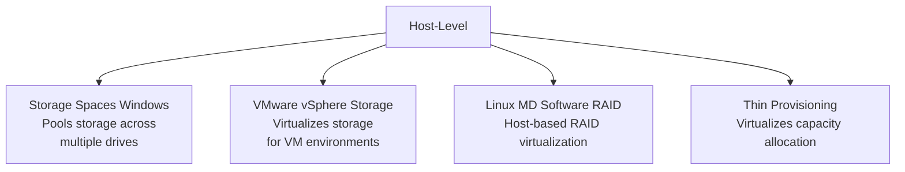

### Level 3: Network-Level Virtualization

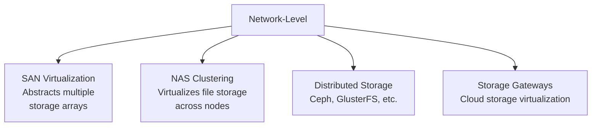

### Level 4: Comprehensive Virtualization

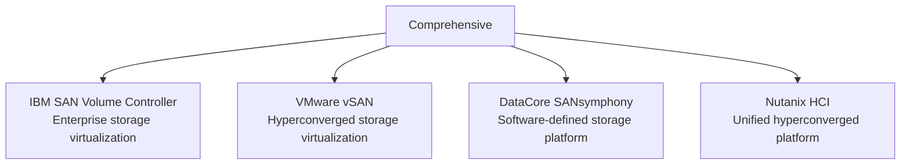

---

## VI. Technology Comparison Matrix

### Virtualization Characteristics

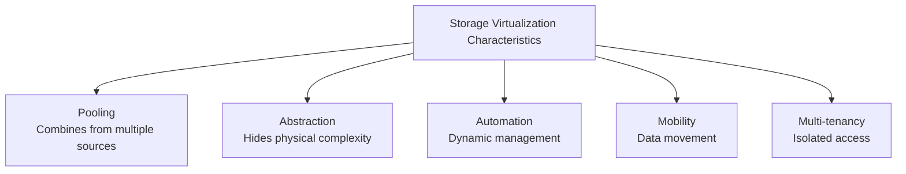

### Implementation Matrix

| Technology | Pooling | Abstraction | Automation | Mobility | Multi-tenancy | Virtualization? |
|------------|---------|-------------|------------|----------|---------------|-----------------|
| **RAID** | ✓ | ✓ | ✗ | ✗ | △ | YES |
| **LVM** | ✓ | ✓ | △ | △ | △ | YES |
| **Storage Spaces** | ✓ | ✓ | △ | △ | △ | YES |
| **VMware vSAN** | ✓ | ✓ | ✓ | ✓ | ✓ | YES |
| **Nutanix** | ✓ | ✓ | ✓ | ✓ | ✓ | YES |

**Legend:** ✓ = Full Support | △ = Partial Support | ✗ = Not Supported

---

## VII. What Makes Technology "Storage Virtualization"

### Qualifying Functions

A technology qualifies as storage virtualization if it provides **any** of these core functions:

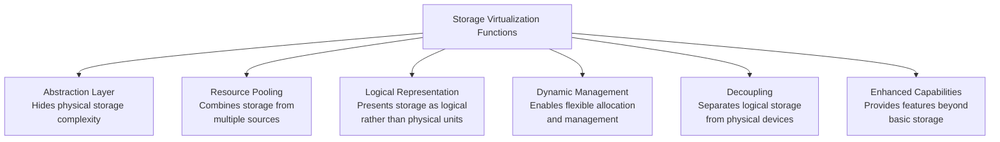

---

## VIII. Technology Evolution Timeline

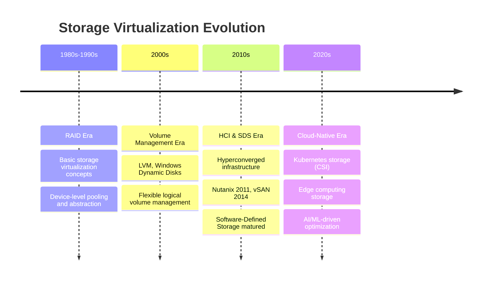

---

## IX. Benefits by Virtualization Level

### Device-Level Benefits

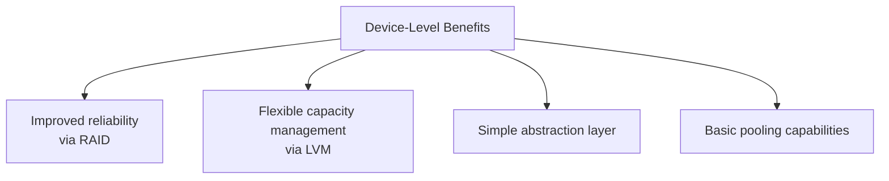

### Host-Level Benefits

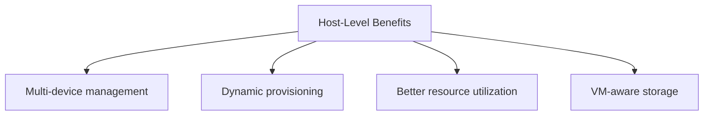

### Network-Level Benefits

```mermaid
graph TD
    Net[Network-Level Benefits] --> B1[Centralized management]
    Net --> B2[Cross-system pooling]
    Net --> B3[Data mobility]
    Net --> B4[Vendor independence]
```

### Comprehensive Benefits

```mermaid
graph TD
    Comp[Comprehensive Benefits] --> B1[Full automation]
    Comp --> B2[Policy-driven management]
    Comp --> B3[Complete abstraction]
    Comp --> B4[Enterprise scalability]
```

---

## X. Common Use Cases

```mermaid
graph TD
    Use[Common Use Cases] --> Home[Home/Small Office<br/>Technologies: RAID, Basic NAS<br/>Simple virtualization for<br/>data protection and pooling]
    Use --> SB[Small Business<br/>Technologies: Storage Spaces,<br/>VMware vSphere<br/>Host-level flexibility and VM support]
    Use --> Ent[Enterprise<br/>Technologies: SAN Virtualization,<br/>vSAN<br/>Comprehensive scalability and automation]
    Use --> Cloud[Cloud/Service Provider<br/>Technologies: Software-Defined Storage<br/>Multi-tenant, fully automated platforms]
```

### Use Case Selection Matrix

| Environment | Technologies | Purpose |
|-------------|-------------|---------|
| **Home/Small Office** | RAID, Basic NAS | Data protection, basic pooling |
| **Small Business** | Storage Spaces, VMware vSphere | Flexibility and VM support |
| **Enterprise** | SAN Virtualization, vSAN | Scalability and automation |
| **Cloud/Service Provider** | Software-Defined Storage | Multi-tenant, automated platforms |

---

## XI. Quick Reference Summary

### Network Classification

```mermaid
graph LR
    NV[Network Virtualization] --> NVExamples[VPN, VLAN, VXLAN, VRF, SDN<br/>Veth, Bridge, vNIC]
    NFV[Network Function Virtualization] --> NFVExamples[vFirewall, vLB, vRouter, vIPS<br/>vDNS, vCDN, vProxy]
    Hybrid[Hybrid NV+NFV] --> HybridExamples[SD-WAN, NFV Infrastructure<br/>Service Mesh]
```

### Storage Classification by Level

| Level | Scope | Examples |
|-------|-------|----------|
| **Device-Level** | Individual storage devices | RAID, LVM, Dynamic Disks, ZFS |
| **Host-Level** | Server/host management | Storage Spaces, vSphere Storage, MD RAID |
| **Network-Level** | Across networks | SAN Virtualization, NAS Clustering, Ceph |
| **Comprehensive** | Full-scope | IBM SVC, vSAN, DataCore, Nutanix HCI |

### Cross-Layer Network Tech

| Technology | Classification | Layers |
|------------|---------------|--------|
| SDN | Network Virt | 2, 3, 4 + Control Plane |
| NFV Framework | Both NV + NFV | 1-7 (All) |
| Container Networking (CNI) | Network Virt | 3, 4, 7 + Application |
| SD-WAN | Both NV + NFV | 1, 2, 3, 4 + Management |
| Cloud Networking (VPC/VNet) | Network Virt | 2, 3, 4 (Cloud-Native) |
| Service Mesh | Network Virt | 4, 5, 7 + Application |

---

## Key Takeaways

1. **Network Virtualization** creates virtual networks/connectivity (VLAN, VRF, VXLAN, SDN)
2. **NFV** virtualizes network functions as software (vFirewall, vLB, vRouter)
3. **Cross-layer technologies** (SDN, SD-WAN, Service Mesh) break OSI layer isolation for better functionality
4. **Network technologies** are properly classified by which OSI layer(s) they operate on
5. **Storage Virtualization exists on a spectrum** - device, host, network, comprehensive levels
6. **Different virtualization levels** provide different benefits - choose based on requirements
7. **Technologies qualify as virtualization** if they provide any core function: abstraction, pooling, logical representation, dynamic management, decoupling, or enhanced capabilities
8. **Storage evolution**: RAID (1980s) → LVM (2000s) → HCI/SDS (2010s) → Cloud-Native (2020s)
9. **Use case selection** depends on environment: home (RAID), SMB (Storage Spaces), enterprise (SAN Virt), cloud (SDS)
10. **Hybrid technologies** like SD-WAN and NFV Infrastructure combine both NV and NFV paradigms

---

## Next Steps

⬅️ Previous: [Virtualization Advanced](./09-virtualization-advanced.md) | ➡️ Next: [Compute Services](./11-compute-services.md)

---

*This documentation is part of the AWS Cloud Practitioner certification study materials.*