# Amazon EC2 Instances

## The Big Picture

> **Amazon EC2 Instances = a virtual server in the AWS Cloud.** When you launch an EC2 instance, the instance type that you specify determines the hardware available to your instance.

EC2 allows users to rent **virtual servers** (known as instances) on which they can run their own applications. Each instance type offers a different balance of compute, memory, network, and storage resources.

---

## What is EC2?

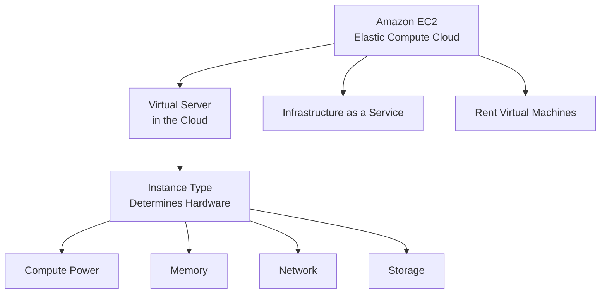

### Definition

| Attribute | Description |
|-----------|-------------|
| **EC2** | Elastic Compute Cloud |
| **Instance** | Virtual server in AWS Cloud |
| **Instance Type** | Determines the hardware configuration |
| **Category** | Infrastructure as a Service (IaaS) |
| **Function** | Renting virtual machines to run applications |

---

## EC2 Capabilities Overview

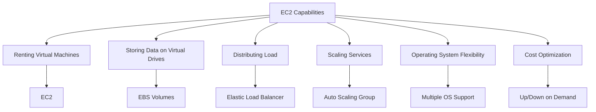

### Core EC2 Capabilities

| Capability | AWS Service | Description |
|------------|-------------|-------------|
| **Renting Virtual Machines** | EC2 | Run virtual servers in the cloud |
| **Storing Data on Virtual Drives** | EBS | Persistent block storage |
| **Distributing Load** | ELB | Distribute traffic across machines |
| **Scaling Services** | ASG | Auto Scaling Group for dynamic scaling |

---

## Instance Types and Use Cases

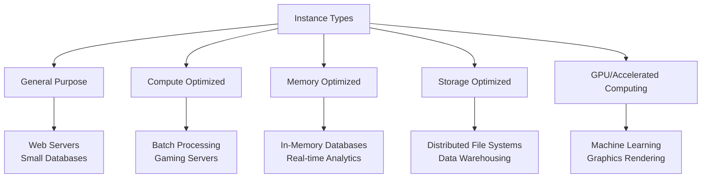

### Instance Type Categories

| Category | Use Cases | Characteristics |
|----------|-----------|-----------------|
| **General Purpose** | Web servers, small databases | Balance of compute, memory, networking |
| **Compute Optimized** | Batch processing, gaming servers | High-performance processors |
| **Memory Optimized** | In-memory databases, real-time analytics | High memory-to-CPU ratio |
| **Storage Optimized** | Distributed file systems, data warehousing | High sequential read/write |
| **GPU Instances** | Machine learning, graphics rendering | Parallel processing capabilities |

---

## Key EC2 Features

### 1. Flexibility and Scalability

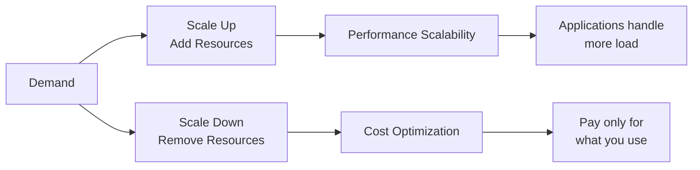

| Feature | Benefit |
|---------|---------|
| **Scale Up** | Add resources as demand increases |
| **Scale Down** | Reduce resources when demand drops |
| **Cost Optimization** | Pay only for what you use |
| **Performance Scalability** | Handle increased workloads |

### 2. Operating System Support

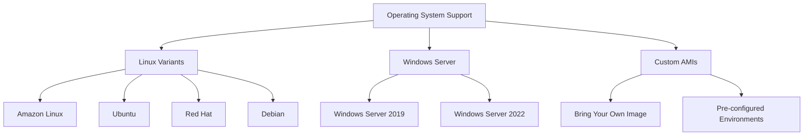

### 3. Common Use Cases

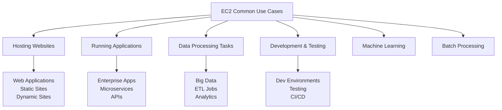

---

## User Data Script

### Bootstrapping with User Data

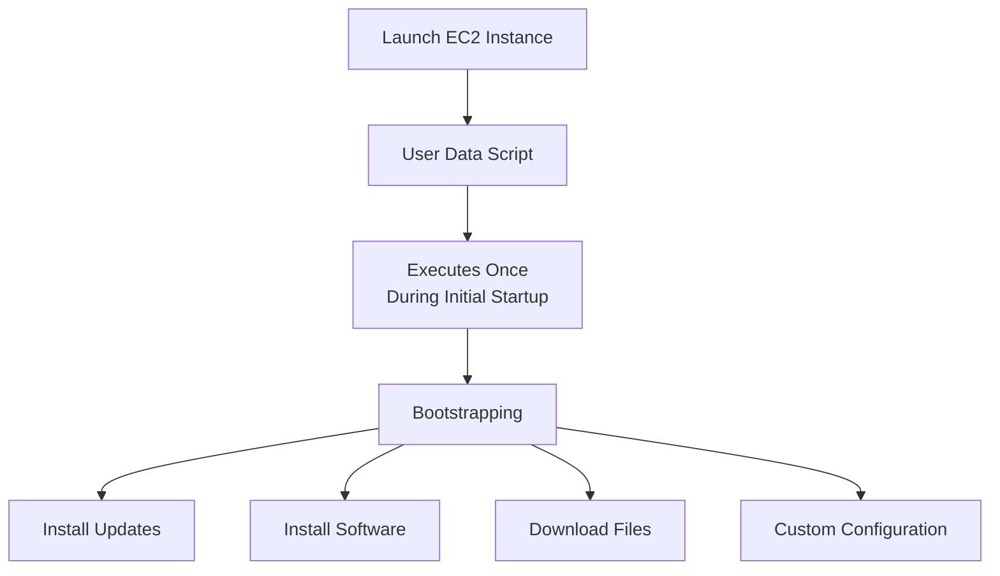

### Key Concepts

| Concept | Description |
|---------|-------------|
| **User Data Script** | Script executed at instance launch |
| **Bootstrapping** | Executing commands upon a machine's startup |
| **Execution Time** | Runs **once** during initial startup |
| **Purpose** | Automate startup tasks |

### User Data Common Tasks

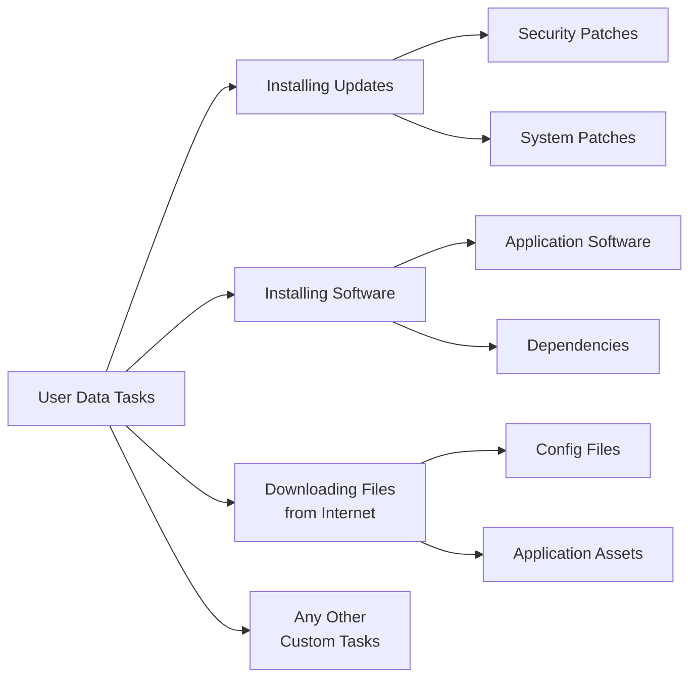

### Example: Web Server Setup

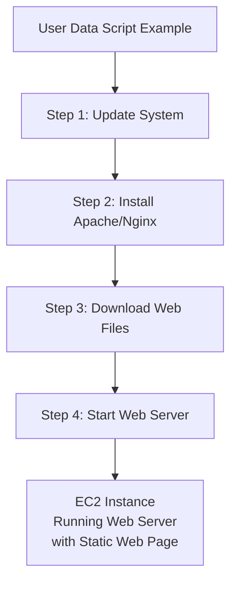

---

## EC2 in the AWS Ecosystem

### Related Services

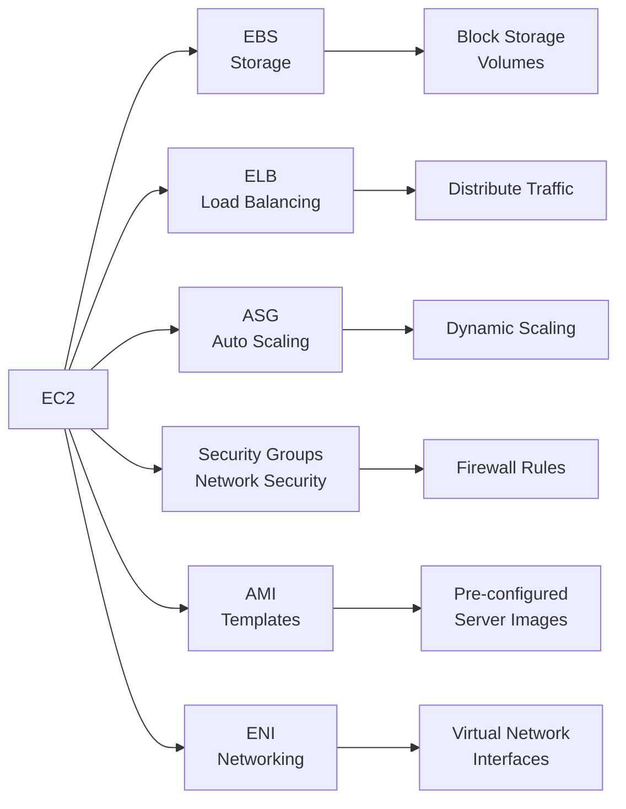

### Service Relationships

| Service | Role | Relationship to EC2 |
|---------|------|---------------------|
| **EBS** | Storage | Persistent block storage for EC2 |
| **ELB** | Load Balancer | Distributes traffic across EC2 instances |
| **ASG** | Auto Scaling | Automatically adjusts EC2 capacity |
| **Security Groups** | Network Security | Virtual firewall for EC2 |
| **AMI** | Templates | Pre-configured images for EC2 launch |
| **ENI** | Networking | Virtual network interface for EC2 |

---

## EC2 Pricing Models

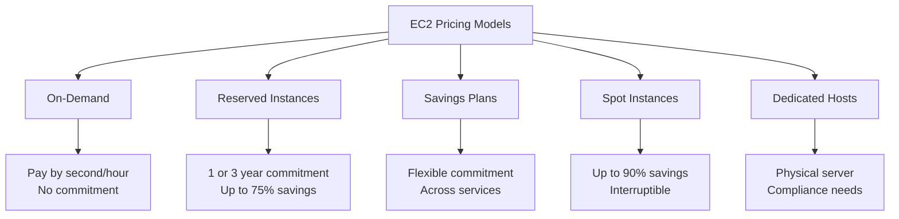

### Pricing Comparison

| Model | Commitment | Savings | Use Case |
|-------|------------|---------|----------|
| **On-Demand** | None | None | Short-term, unpredictable workloads |
| **Reserved** | 1-3 years | Up to 75% | Predictable workloads |
| **Savings Plans** | 1-3 years | Up to 72% | Flexible compute usage |
| **Spot** | None | Up to 90% | Fault-tolerant, flexible workloads |
| **Dedicated Hosts** | On-demand or reservation | None | Compliance, licensing |

---

## EC2 Instance Lifecycle

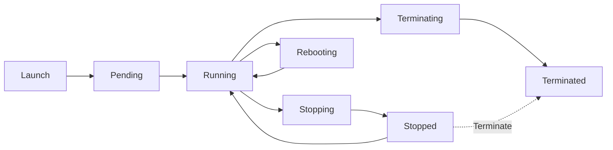

### Lifecycle States

| State | Description |
|-------|-------------|
| **Pending** | Instance is being launched |
| **Running** | Instance is active and billing |
| **Stopping** | Instance is shutting down |
| **Stopped** | Instance is shut down, not billing for compute |
| **Rebooting** | Instance is restarting |
| **Terminating** | Instance is being deleted |
| **Terminated** | Instance is permanently deleted |

---

## Benefits of EC2

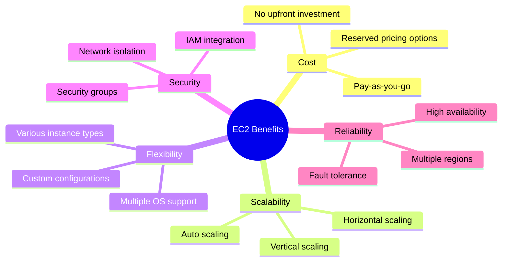

### Key Advantages

| Benefit | Description |
|---------|-------------|
| **Cost-Effective** | Pay-as-you-go pricing, no upfront costs |
| **Scalable** | Scale up/down based on demand |
| **Flexible** | Choose OS, configuration, instance type |
| **Secure** | Built-in security features and IAM integration |
| **Reliable** | High availability across multiple AZs |
| **Global** | Deploy in any region worldwide |

---

## EC2 vs Traditional Servers

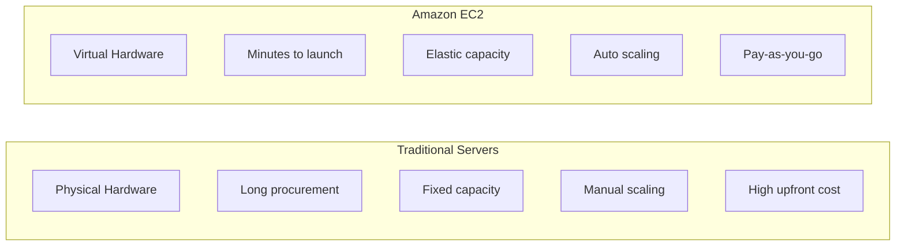

### Comparison

| Aspect | Traditional Servers | Amazon EC2 |
|--------|--------------------|-----------| 
| **Procurement** | Weeks to months | Minutes |
| **Capacity** | Fixed | Elastic |
| **Scaling** | Manual, time-consuming | Automated, instant |
| **Cost Model** | High upfront | Pay-as-you-go |
| **Maintenance** | Customer managed | AWS managed infrastructure |
| **Geographic Reach** | Limited | Global regions |

---

## Key Takeaways

1. **EC2** = Elastic Compute Cloud = Virtual servers in AWS
2. **Instance Type** determines hardware: compute, memory, network, storage
3. **EC2 is IaaS** - Infrastructure as a Service
4. **Core Capabilities**:
   - Rent virtual machines (EC2)
   - Store data on virtual drives (EBS)
   - Distribute load (ELB)
   - Scale services (ASG)
5. **Instance Types** optimized for: General Purpose, Compute, Memory, Storage, GPU
6. **Multiple OS Support**: Linux, Windows, custom AMIs
7. **User Data Script**: Runs once at launch for bootstrapping
8. **Common Tasks**: Install updates, install software, download files, custom config
9. **Related Services**: EBS, ELB, ASG, Security Groups, AMI, ENI
10. **Pricing Options**: On-Demand, Reserved, Savings Plans, Spot, Dedicated Hosts
11. **Benefits**: Cost-effective, scalable, flexible, secure, reliable, global

---

## Next Steps

⬅️ Previous: [Network & Storage Deep Dive](./10-network-storage.md) | ➡️ Next: [EC2 Instance Types](./12-ec2-instance-types.md)

---

*This documentation is part of the AWS Cloud Practitioner certification study materials.*