# EC2 Instance Types & Sizing

## The Big Picture

EC2 offers a **variety of instance types** designed for different use cases. Choosing the right type is critical for **optimal performance and cost**. This module explores instance categories, sizing configuration, and the concept of **Right Sizing**.

---

## EC2 Sizing & Configuration

When configuring an EC2 instance, you need to specify several key attributes:

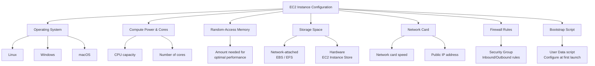

### Configuration Attributes

| Attribute | Description | Options |
|-----------|-------------|---------|
| **Operating System** | OS to run on instance | Linux, Windows, macOS |
| **CPU** | Processing capacity | Varies by instance type |
| **RAM** | Memory size | Varies by instance type |
| **Storage** | Storage space | Network-attached (EBS/EFS) or Hardware (Instance Store) |
| **Network Card** | Network performance | Speed configuration, Public IP |
| **Firewall Rules** | Network security | Security Groups (inbound/outbound) |
| **Bootstrap Script** | Initial configuration | EC2 User Data |

---

## EC2 Naming Convention

AWS follows a **specific naming convention** for EC2 instances:

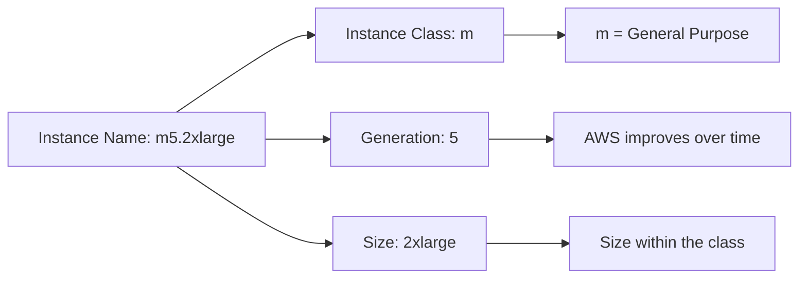

### Naming Breakdown

| Component | Example | Meaning |
|-----------|---------|---------|
| **Instance Class** | `m` | Type of instance (general purpose, compute, memory, etc.) |
| **Generation** | `5` | Version - AWS improves over time |
| **Size** | `2xlarge` | Size within the instance class |

> **Example:** `m5.2xlarge` = General Purpose, 5th generation, 2xlarge size

---

## EC2 Instance Type Categories

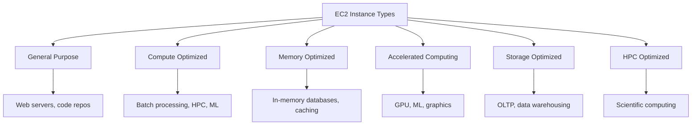

### Instance Type Overview

| Type | Best For | Key Characteristic |
|------|----------|-------------------|
| **General Purpose** | Diverse workloads | Balanced resources |
| **Compute Optimized** | Compute-intensive tasks | High-performance processors |
| **Memory Optimized** | Large data sets in memory | High memory-to-CPU ratio |
| **Accelerated Computing** | GPU workloads | Hardware accelerators |
| **Storage Optimized** | Storage-intensive tasks | High sequential I/O |
| **HPC Optimized** | High-performance computing | Maximum compute power |

---

## General Purpose Instances

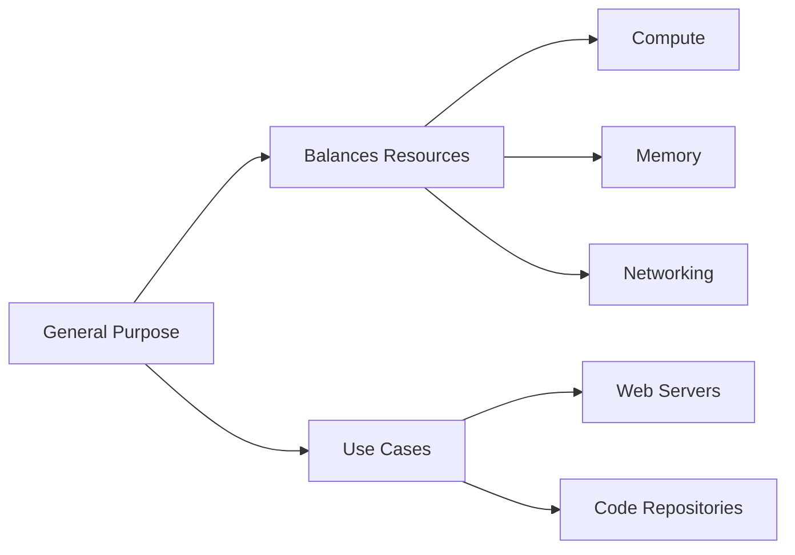

| Aspect | Details |
|--------|---------|
| **Description** | Great for diverse workloads like web servers and code repositories |
| **Balance** | Compute + Memory + Networking resources effectively |
| **Use Cases** | Web servers, code repositories, small databases |

---

## Compute Optimized Instances

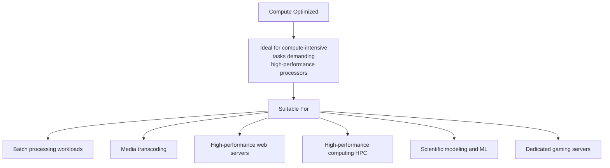

| Aspect | Details |
|--------|---------|
| **Description** | Ideal for compute-intensive tasks demanding high-performance processors |
| **Best For** | Batch processing, media transcoding, HPC |
| **Use Cases** | High-performance web servers, scientific modeling, ML, gaming servers |

---

## Memory Optimized Instances

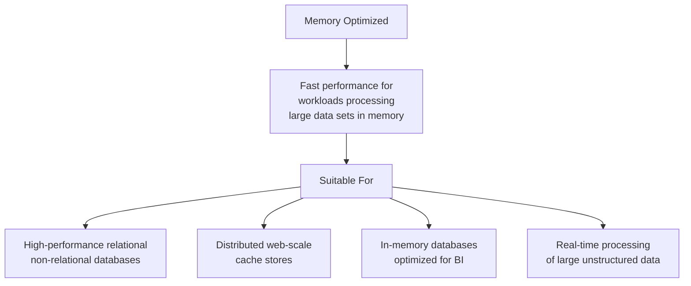

| Aspect | Details |
|--------|---------|
| **Description** | Fast performance for workloads processing large data sets in memory |
| **Best For** | In-memory databases, real-time analytics |
| **Use Cases** | High-performance databases, distributed caches, BI applications |

---

## Storage Optimized Instances

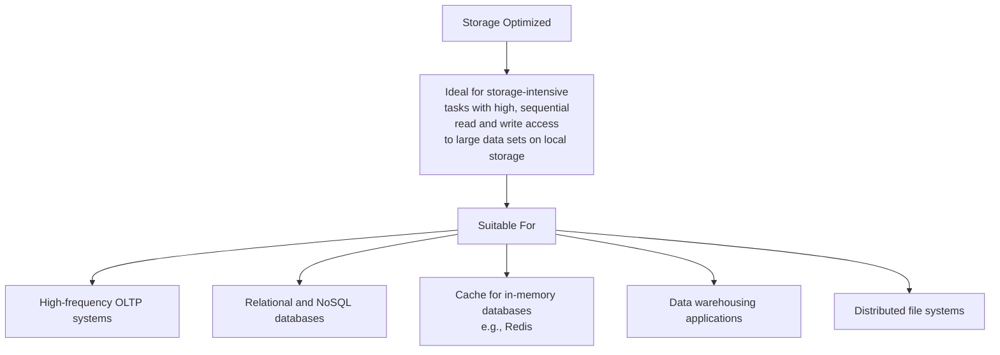

| Aspect | Details |
|--------|---------|
| **Description** | Ideal for storage-intensive tasks with high sequential read/write access |
| **Best For** | OLTP systems, data warehousing |
| **Use Cases** | Relational/NoSQL databases, Redis cache, distributed file systems |

---

## Instance Features Overview

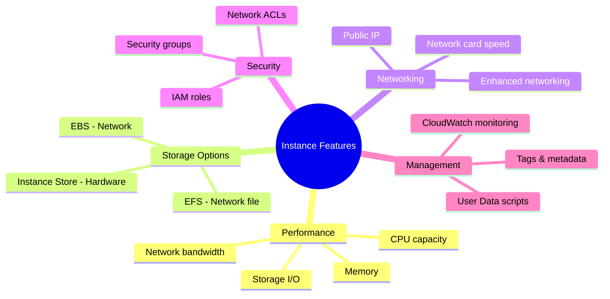

---

## Measuring Instance Performance

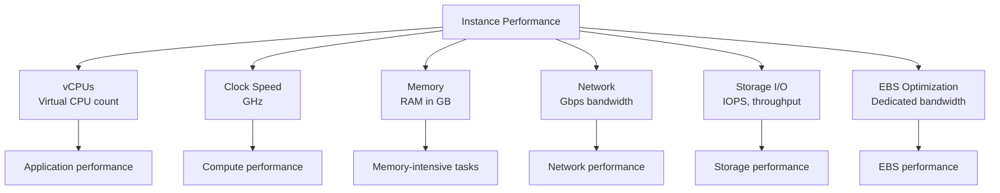

---

## AWS Right Sizing

### What is Right Sizing?

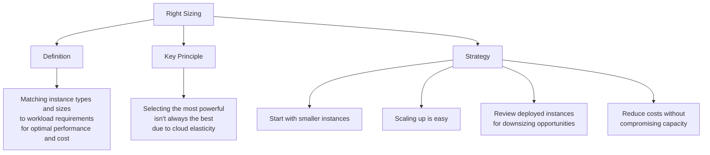

### Right Sizing Process

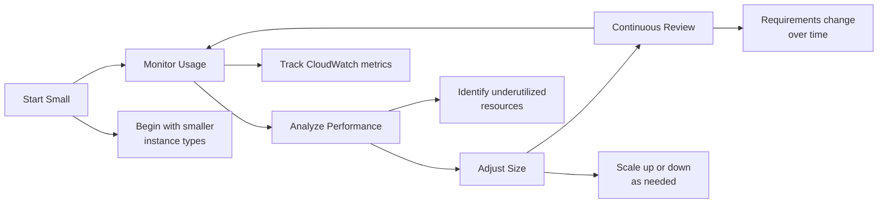

### When to Right Size

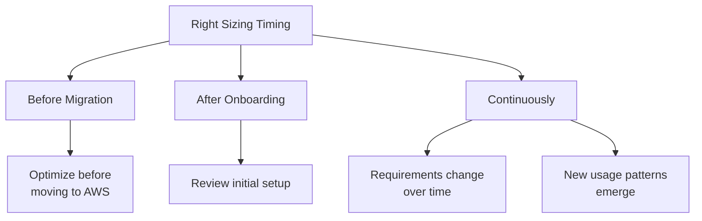

### Right Sizing Tools

| Tool | Description |
|------|-------------|
| **CloudWatch** | Monitor performance metrics |
| **Cost Explorer** | Analyze spending patterns |
| **Trusted Advisor** | AWS optimization recommendations |
| **Third-party tools** | Various optimization platforms |

---

## Instance Selection Strategy

### Decision Flow

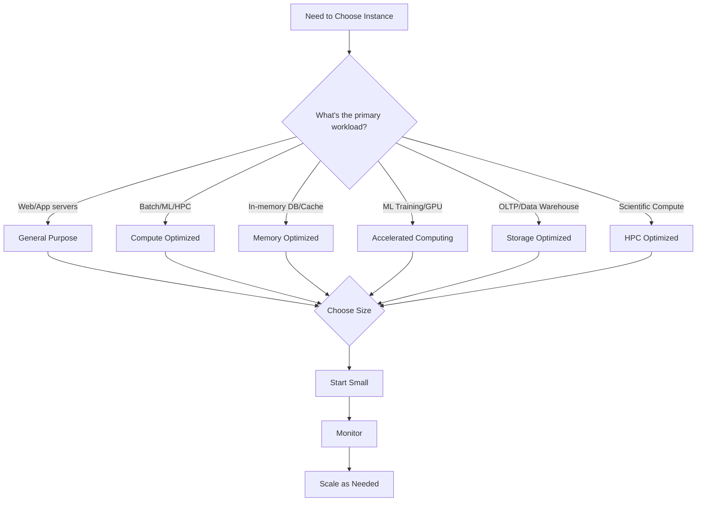

### Selection Matrix

| Workload | Recommended Type | Reason |
|----------|-----------------|--------|
| **Web Server** | General Purpose | Balanced resources |
| **Game Server** | Compute Optimized | High CPU performance |
| **Redis Cache** | Memory Optimized | Fast in-memory access |
| **ML Training** | Accelerated Computing | GPU acceleration |
| **OLTP Database** | Storage Optimized | High I/O performance |
| **HPC Cluster** | HPC Optimized | Maximum compute power |

---

## Comparison: All Instance Types

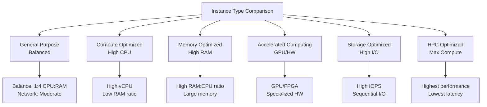

---

## Best Practices

### Start Small, Scale Up

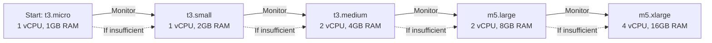

### Best Practices Checklist

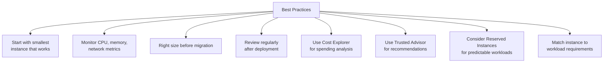

---

## Key Takeaways

1. **EC2 Configuration** includes: OS, CPU, RAM, Storage, Network, Firewall, Bootstrap Script
2. **Naming Convention**: `m5.2xlarge` = class.generation.size
3. **6 Instance Categories**:
   - General Purpose (balanced)
   - Compute Optimized (high CPU)
   - Memory Optimized (high RAM)
   - Accelerated Computing (GPU)
   - Storage Optimized (high I/O)
   - HPC Optimized (maximum performance)
4. **Right Sizing** = matching instance types/sizes to workload requirements
5. **Cloud elasticity** means you don't need to start with the most powerful
6. **Start small and scale up** based on actual usage
7. **Continuous review** - requirements change over time
8. **Tools for Right Sizing**: CloudWatch, Cost Explorer, Trusted Advisor
9. **Use User Data scripts** for initial configuration automation
10. **Choose appropriate storage**: EBS/EFS (network) vs Instance Store (hardware)

---

## Next Steps

⬅️ Previous: [Amazon EC2](./11-amazon-ec2.md) | ➡️ Next: [EC2 Pricing & Purchasing](./13-ec2-pricing.md)

---

*This documentation is part of the AWS Cloud Practitioner certification study materials.*