# EC2 Purchasing Options

## The Big Picture

Amazon EC2 offers **7 purchasing options** to suit different workload requirements and budgetary considerations. Choosing the right option is critical for **cost optimization**.

---

## EC2 Purchasing Options Overview

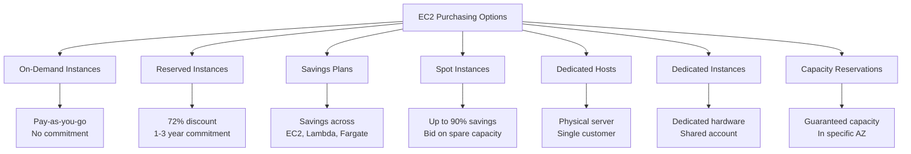

### Quick Comparison

| Option | Discount | Commitment | Best For |
|--------|----------|------------|----------|
| **On-Demand** | 0% | None | Unpredictable workloads |
| **Reserved Instances** | Up to 72% | 1-3 years | Steady-state workloads |
| **Savings Plans** | Up to 72% | 1-3 years | Flexible usage |
| **Spot Instances** | Up to 90% | None | Fault-tolerant workloads |
| **Dedicated Hosts** | None | On-demand/reserved | Compliance, licensing |
| **Dedicated Instances** | None | Per instance | Hardware isolation |
| **Capacity Reservations** | Variable | None/Specific | Capacity guarantee |

---

## 1. On-Demand Instances

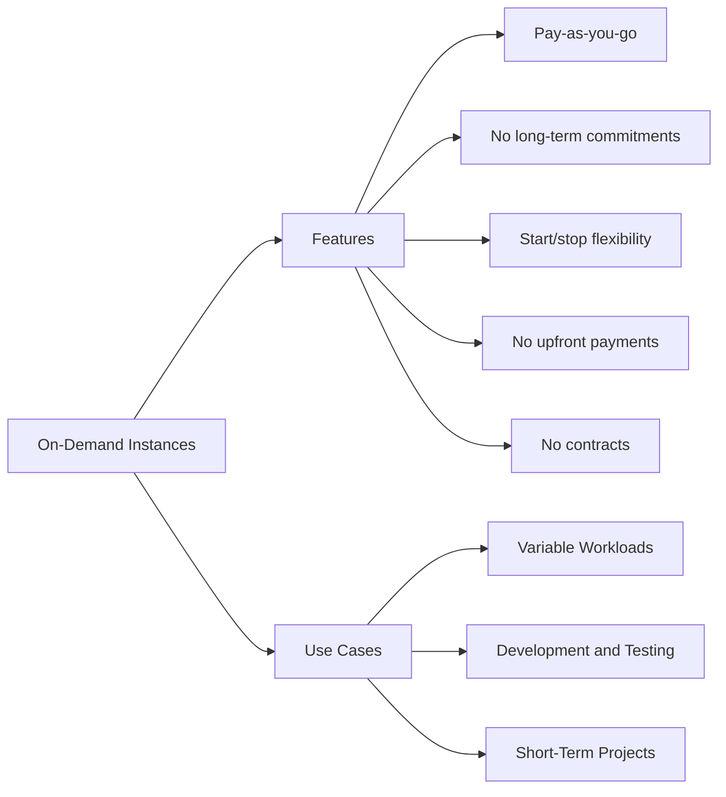

### Key Characteristics

| Aspect | Details |
|--------|---------|
| **Pricing Model** | Pay-as-you-go |
| **Commitment** | None |
| **Payment** | No upfront costs |
| **Flexibility** | Start and stop instances as needed |

### Use Cases

| Use Case | Description |
|----------|-------------|
| **Variable Workloads** | Unpredictable usage patterns or fluctuating workloads |
| **Development and Testing** | Temporary environments without long-term commitments |
| **Short-Term Projects** | Quick provisioning for short-term initiatives |

---

## 2. Reserved Instances

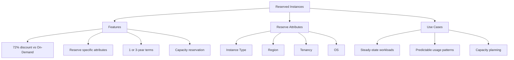

### Reserved Attributes

| Attribute | Description |
|-----------|-------------|
| **Instance Type** | Specific instance type (e.g., m5.large) |
| **Region** | Specific AWS region |
| **Tenancy** | Shared or dedicated |
| **OS** | Linux, Windows, etc. |

### Use Cases

| Use Case | Description |
|----------|-------------|
| **Steady-State Usage** | Predictable workload patterns |
| **Capacity Planning** | Secure reserved capacity for anticipated workloads |

---

## 3. Savings Plans

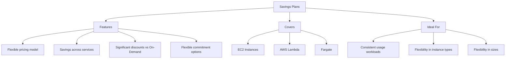

### Key Benefits

| Benefit | Description |
|---------|-------------|
| **Flexibility** | Choose between different commitment options |
| **Broad Coverage** | Compute usage across EC2, Lambda, Fargate |
| **Significant Discounts** | Compared to On-Demand rates |

---

## 4. Spot Instances

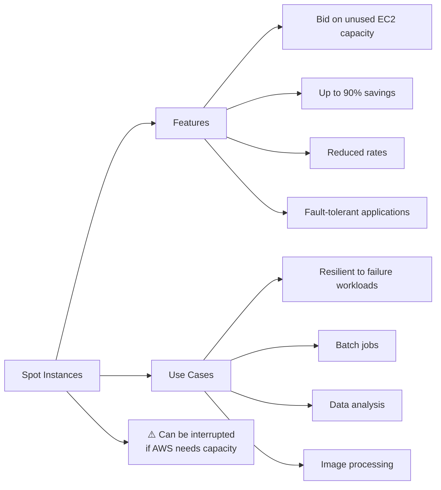

### Key Characteristics

| Aspect | Details |
|--------|---------|
| **Pricing** | Up to 90% less than On-Demand |
| **Capacity** | Spare EC2 capacity |
| **Risk** | Can be interrupted with 2-minute notice |
| **Best For** | Fault-tolerant, flexible workloads |

### Use Cases

| Use Case | Description |
|----------|-------------|
| **Fault-tolerant Workloads** | Resilient to failure |
| **Batch Jobs** | Processing jobs that can be interrupted |
| **Data Analysis** | Analytics that can resume |
| **Image Processing** | Rendering and processing tasks |

---

## 5. Dedicated Hosts

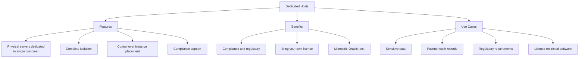

### Key Benefits

| Benefit | Description |
|---------|-------------|
| **Compliance** | Meet regulatory requirements |
| **Licensing** | Use eligible software licenses (Microsoft, Oracle, etc.) |
| **Isolation** | Physical server dedicated to single customer |
| **Control** | Instance placement control |

### Use Cases

| Use Case | Description |
|----------|-------------|
| **Sensitive Data** | Healthcare organizations with patient data subject to strict regulations |
| **License Restrictions** | Software requiring specific hardware |
| **Compliance** | Regulatory requirements demanding dedicated infrastructure |

---

## 6. Dedicated Instances

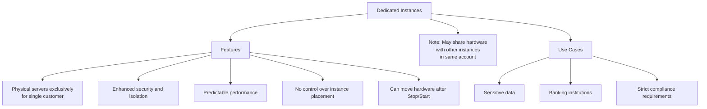

### Dedicated Hosts vs Dedicated Instances

| Aspect | Dedicated Hosts | Dedicated Instances |
|--------|----------------|-------------------|
| **Physical Server** | Fully dedicated to you | Dedicated hardware, but can move |
| **Instance Placement** | Full control | No control |
| **Hardware Movement** | Stays on same host | Can move after Stop/Start |
| **Licensing** | Bring your own | Limited BYOL options |

---

## 7. Capacity Reservations

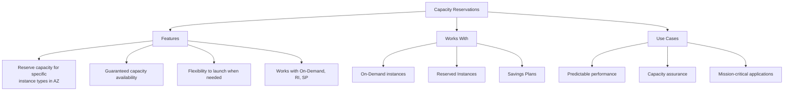

### Key Benefits

| Benefit | Description |
|---------|-------------|
| **Guaranteed Capacity** | Resource availability when needed |
| **Flexible Launch** | Launch instances within reservation as needed |
| **Multiple Pricing** | Combine with On-Demand, RI, or Savings Plans |

---

## How to Choose EC2 Purchasing Options

### Decision Framework

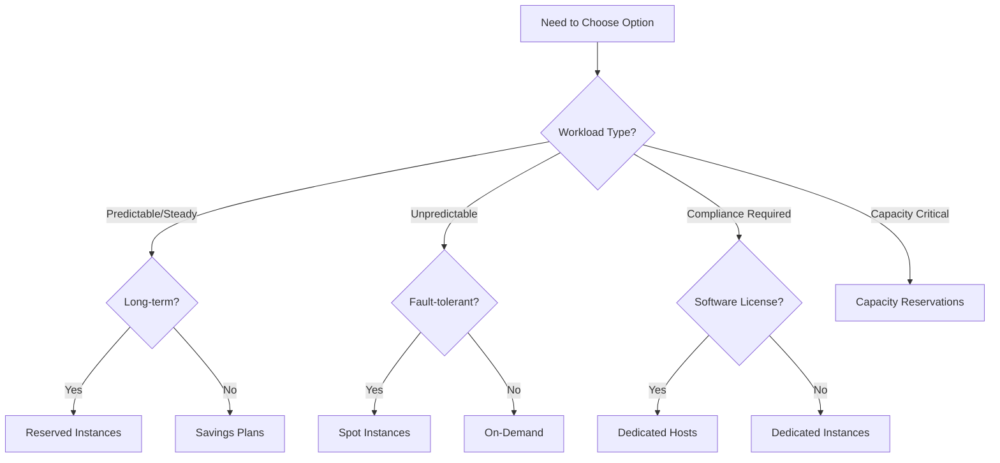

### Step-by-Step Selection Process

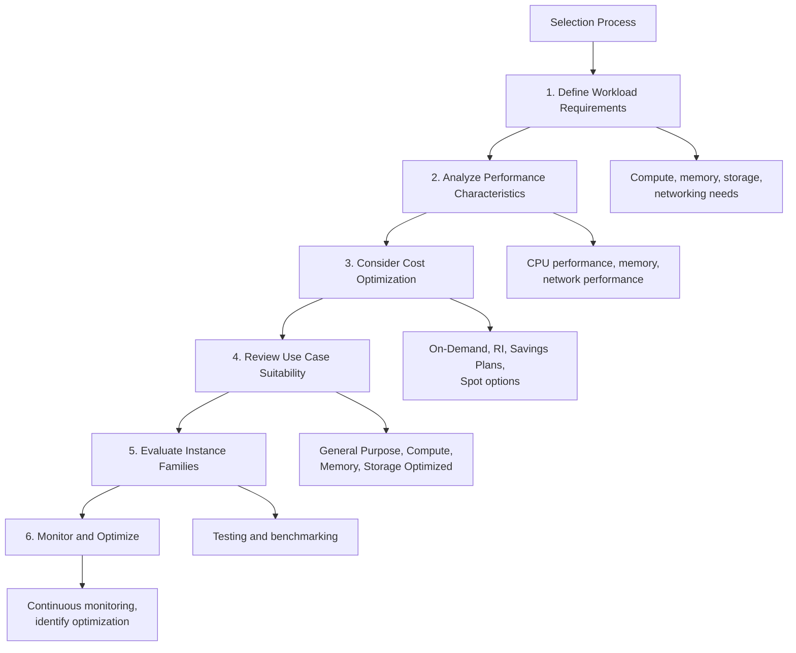

### Detailed Steps

#### Step 1: Define Workload Requirements

| Factor | Considerations |
|--------|---------------|
| Compute | CPU cores needed |
| Memory | RAM requirements |
| Storage | EBS, Instance Store needs |
| Networking | Bandwidth requirements |

#### Step 2: Analyze Performance Characteristics

| Factor | Considerations |
|--------|---------------|
| CPU Performance | Processor speed, architecture |
| Memory Size | GB of RAM |
| Network Performance | Bandwidth, latency |

#### Step 3: Consider Cost Optimization

| Option | When to Use |
|--------|------------|
| **On-Demand** | Short-term, unpredictable |
| **Reserved Instances** | Long-term, predictable |
| **Savings Plans** | Flexible compute usage |
| **Spot Instances** | Fault-tolerant, flexible timing |

#### Step 4: Review Use Case Suitability

| Family | Best For |
|--------|----------|
| General Purpose | Web servers, code repos |
| Compute Optimized | Batch processing, HPC |
| Memory Optimized | In-memory DBs, caching |
| Storage Optimized | OLTP, data warehousing |

#### Step 5: Evaluate Instance Families

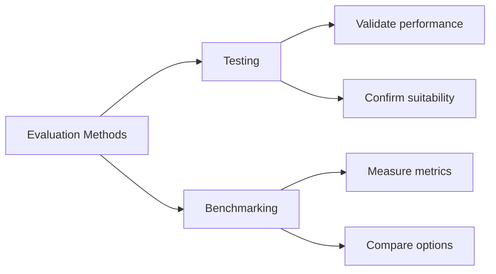

#### Step 6: Monitor and Optimize

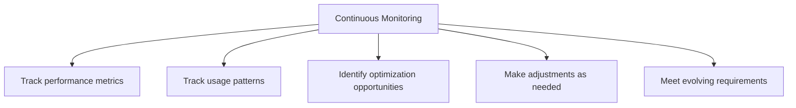

---

## Comparison Matrix

| Option | Discount | Commitment | Interruptible | Use Case |
|--------|----------|------------|----------------|----------|
| **On-Demand** | 0% | None | No | Unpredictable |
| **Reserved** | Up to 72% | 1-3 years | No | Steady-state |
| **Savings Plans** | Up to 72% | 1-3 years | No | Flexible usage |
| **Spot** | Up to 90% | None | Yes (2-min notice) | Fault-tolerant |
| **Dedicated Hosts** | None | On-demand/Reserved | No | Compliance |
| **Dedicated Instances** | None | Per instance | No | Hardware isolation |
| **Capacity Reservations** | Variable | None/Specific | No | Capacity guarantee |

---

## Cost Optimization Strategy

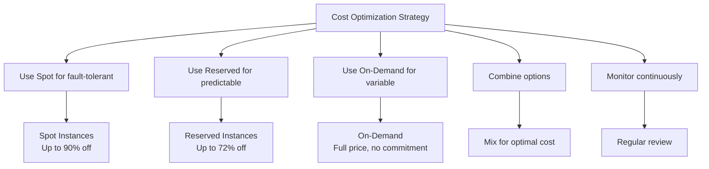

### Combined Approach Example

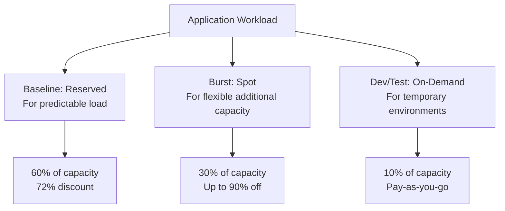

---

## Key Takeaways

1. **7 Purchasing Options** for different needs:
   - On-Demand, Reserved, Savings Plans, Spot, Dedicated Hosts, Dedicated Instances, Capacity Reservations
2. **Discount Levels**:
   - Reserved/Savings Plans: up to 72%
   - Spot: up to 90%
3. **Best for Each**:
   - On-Demand: Variable, short-term
   - Reserved: Steady-state, predictable
   - Savings Plans: Flexible usage across services
   - Spot: Fault-tolerant workloads
   - Dedicated Hosts: Compliance, licensing
   - Dedicated Instances: Hardware isolation
   - Capacity Reservations: Guaranteed capacity
4. **Selection Process**: Define → Analyze → Cost Optimize → Review → Evaluate → Monitor
5. **Spot Instances** can be interrupted with 2-minute notice
6. **Dedicated Hosts** give full control over placement; Dedicated Instances can move
7. **Combined Approach** often provides best cost optimization
8. **Continuous Monitoring** essential for ongoing optimization

---

## Next Steps

⬅️ Previous: [EC2 Instance Types](./12-ec2-instance-types.md) | ➡️ Next: [EBS Volumes](./14-ebs-volumes.md)

---

*This documentation is part of the AWS Cloud Practitioner certification study materials.*