# EC2 Security & Storage

## The Big Picture

This module covers essential EC2 security and storage concepts: **Security Groups, EBS Volumes, Snapshots, AMIs, Instance Store, EFS, and FSx**.

---

## I. Security in EC2

### Security Groups Overview

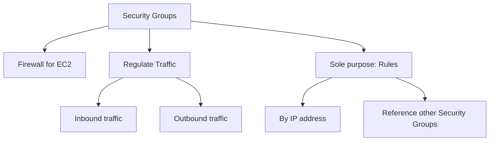

### Security Group Characteristics

| Characteristic | Description |
|----------------|-------------|
| **Purpose** | Firewall for EC2 instances |
| **Composition** | Consists solely of rules |
| **Scope** | Specific region and VPC combination |
| **Attachment** | Can be attached to multiple instances |
| **Operation** | External to EC2 - blocked traffic never reaches the instance |

### What Security Groups Regulate

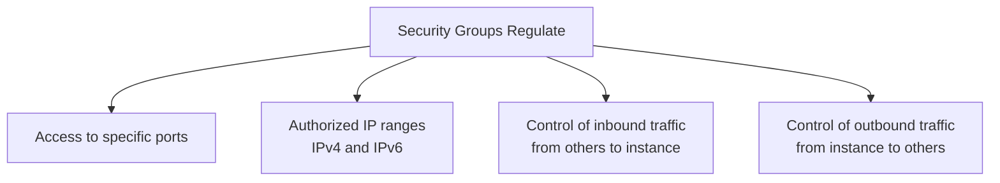

### Default Behaviors

| Traffic Direction | Default Behavior |
|-------------------|------------------|
| **Inbound** | **Blocked** by default |
| **Outbound** | **Allowed** by default |

### Troubleshooting Connection Issues

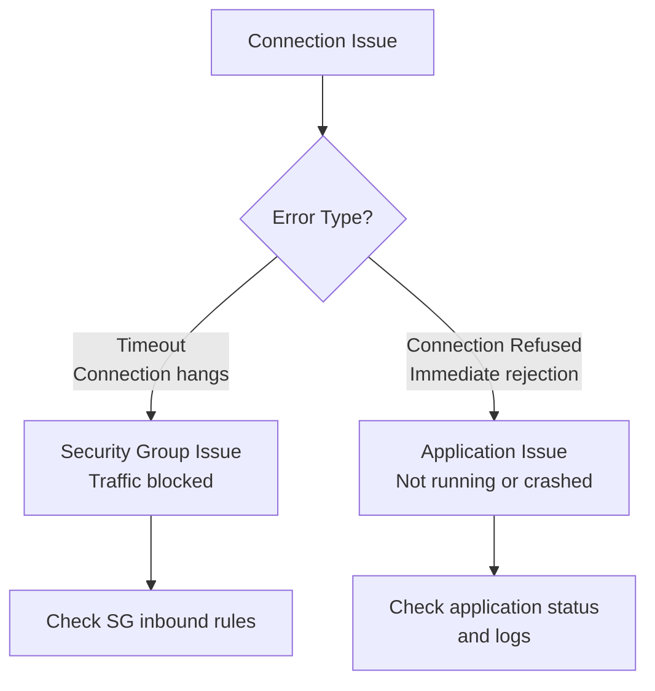

> ⚠️ **Key Insight:**
> - **Timeout** = Security Group issue (traffic blocked)
> - **Connection Refused** = Application issue (not running or crashed)

### SSH Best Practice

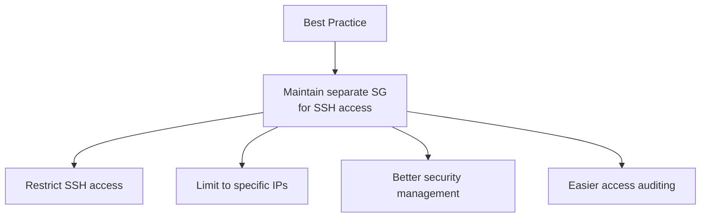

### Useful Ports Reference

| Port | Protocol | Use Case |
|------|----------|----------|
| **22** | SSH | Logging into Linux instances |
| **21** | FTP | Uploading files to a file share |
| **22** | SFTP | Securely uploading files via SSH |
| **80** | HTTP | Accessing unsecured websites |
| **443** | HTTPS | Accessing secured websites |
| **3389** | RDP | Logging into Windows instances |

---

## II. EBS Volumes

### What is EBS?

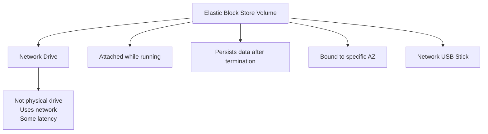

### EBS Key Characteristics

| Characteristic | Description |
|----------------|-------------|
| **Type** | Network drive (not physical) |
| **Attachment** | Mounted to one instance at a time (CCP level) |
| **AZ Binding** | Locked to specific Availability Zone |
| **Latency** | Some network latency (not physical disk) |
| **Detachable** | Can be moved between instances quickly |

### AZ Binding Example

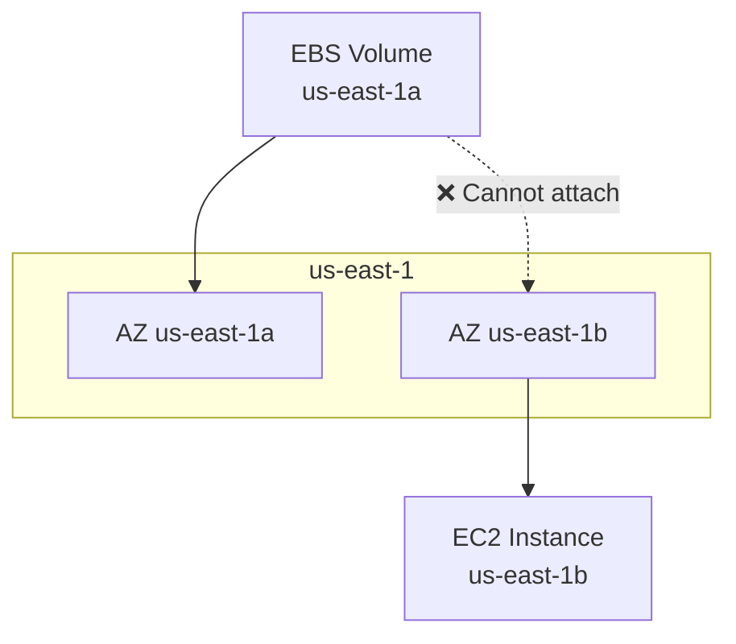

> ⚠️ EBS volumes are locked to an AZ. A volume in `us-east-1a` **cannot** be attached to an instance in `us-east-1b`.

### Moving Volumes Across AZs

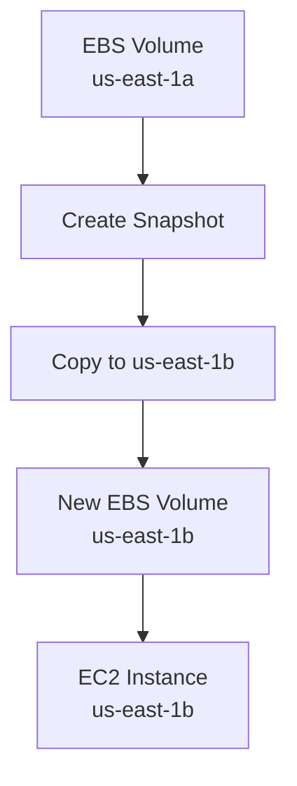

### EBS Capacity and Billing

| Aspect | Description |
|--------|-------------|
| **Provisioning** | Provisioned capacity (GBs and IOPS) |
| **Billing** | Based on provisioned capacity, not usage |
| **Scaling** | Can be increased over time |

### Free Tier

| Tier | Details |
|------|---------|
| **Storage** | 30 GB free EBS storage per month |
| **Types** | General Purpose (SSD) or Magnetic |

### Delete on Termination Attribute

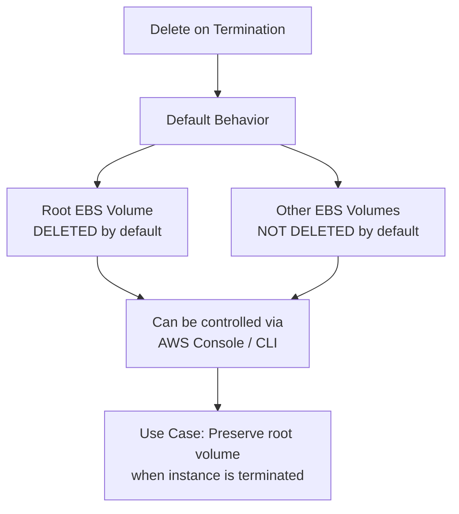

---

## III. EBS Snapshots

### What is an EBS Snapshot?

```mermaid
graph TD
    Snap[EBS Snapshot] --> Def[Definition]
    Def --> D1[Backup of EBS volume<br/>at specific point in time]
    
    Snap --> Features[Features]
    Features --> F1[No need to detach volume<br/>(but recommended for consistency)]
    Features --> F2[Can be copied across AZs]
    Features --> F3[Can be copied across Regions]
```

### Snapshot Recommendations

| Recommendation | Reason |
|----------------|--------|
| **Stop instance before snapshot** | Ensures data consistency |
| **Detach before snapshot** | Recommended for consistency |
| **Copy across AZs/Regions** | Disaster recovery |

### EBS Snapshot Features

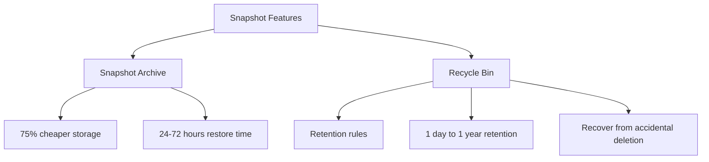

### Snapshot Archive

| Aspect | Details |
|--------|---------|
| **Purpose** | Long-term, infrequent access |
| **Cost** | 75% cheaper than standard |
| **Restore Time** | 24-72 hours |

### Recycle Bin for Snapshots

| Aspect | Details |
|--------|---------|
| **Purpose** | Recover from accidental deletion |
| **Retention** | 1 day to 1 year |
| **Configuration** | Set retention rules |

---

## IV. Amazon Machine Image (AMI)

### What is an AMI?

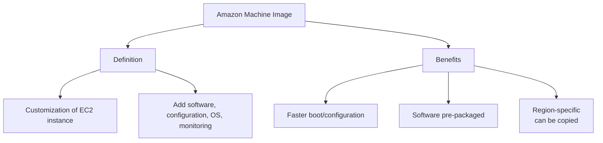

### AMI Sources

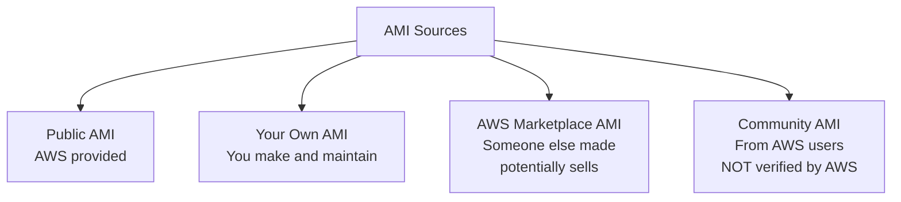

### AMI Source Comparison

| Source | Description | Verified |
|--------|-------------|----------|
| **Public AMI** | AWS-provided | ✅ Yes |
| **Your Own AMI** | You create and maintain | ✅ You verify |
| **Marketplace AMI** | Third-party, potentially paid | ✅ AWS verifies |
| **Community AMI** | AWS users share | ❌ Not verified |

### Creating an AMI

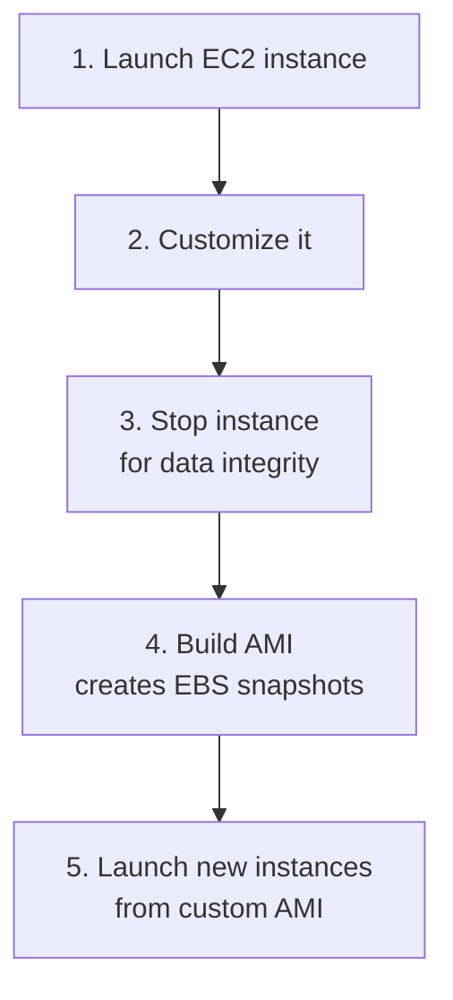

---

## V. EC2 Image Builder

### What is EC2 Image Builder?

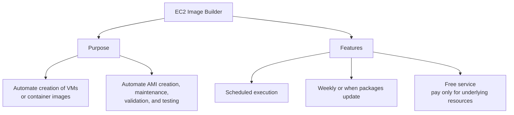

### Image Builder Workflow

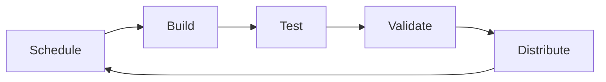

---

## VI. EC2 Instance Store

### Instance Store vs EBS

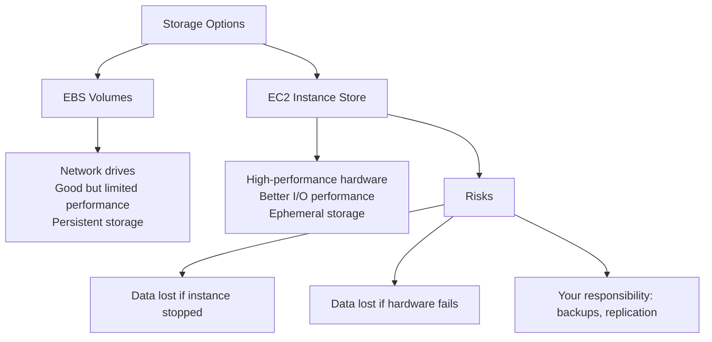

### When to Use Instance Store

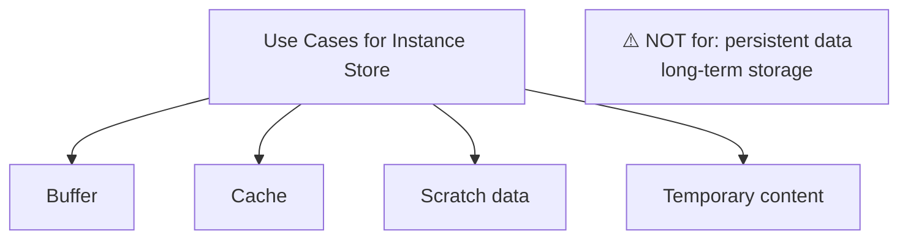

### Storage Comparison Matrix

| Feature | EBS | Instance Store |
|---------|-----|----------------|
| **Performance** | Good (limited) | High I/O |
| **Persistence** | Persists after termination | Lost on stop/termination |
| **Type** | Network drive | Hardware-attached |
| **Backups** | Snapshots | Your responsibility |
| **Use Case** | Persistent data | Buffer, cache, scratch |

---

## VII. EFS - Elastic File System

### What is EFS?

```mermaid
graph TD
    EFS[Elastic File System] --> Def[Definition]
    Def --> D1[Managed NFS]
    Def --> D2[Mounted on 100s of EC2]
    Def --> D3[Linux EC2 only]
    Def --> D4[Multi-AZ support]
    
    EFS --> Features[Features]
    Features --> F1[Highly available]
    Features --> F2[Scalable]
    Features --> F3[Expensive (3x gp2)]
    Features --> F4[Pay per use]
    Features --> F5[No capacity planning]
```

### EFS Key Characteristics

| Characteristic | Description |
|----------------|-------------|
| **Type** | Managed NFS (Network File System) |
| **Mounting** | 100s of EC2 instances |
| **OS Support** | Linux EC2 instances only |
| **Availability** | Multi-AZ |
| **Pricing** | Pay per use, no capacity planning |
| **Cost** | 3x gp2 price (expensive) |

### EFS Infrequent Access (EFS-IA)

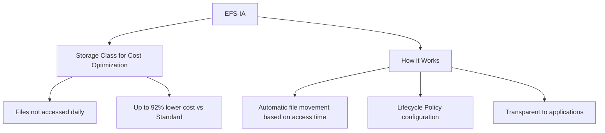

### EFS-IA Configuration

| Aspect | Details |
|--------|---------|
| **Cost Savings** | Up to 92% lower than Standard |
| **Trigger** | Last access time |
| **Configuration** | Lifecycle Policy (e.g., 60 days no access) |
| **Transition** | Transparent to applications |

---

## VIII. Amazon FSx

### What is FSx?

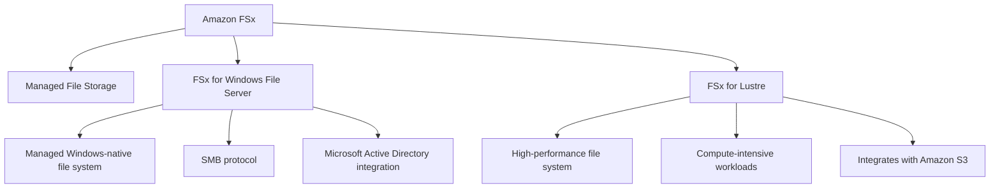

### FSx Options

| Option | Protocol | Use Case |
|--------|----------|----------|
| **FSx for Windows File Server** | SMB | Windows-native file systems |
| **FSx for Lustre** | Lustre | HPC, compute-intensive workloads |

### FSx Key Features

| Feature | Description |
|---------|-------------|
| **Performance** | High performance |
| **Scalability** | Easily scalable |
| **Backups** | Built-in backup capabilities |
| **Integration** | AWS services integration |

---

## IX. EC2 Storage Options Summary

```mermaid
graph TD
    Storage[EC2 Storage Options] --> EBS[EBS Volumes]
    Storage --> Inst[Instance Store]
    Storage --> EFS[EFS]
    Storage --> FSx[FSx]
    
    EBS --> EBS1[Block storage<br/>Single instance<br/>Persistent]
    Inst --> Inst1[Block storage<br/>Single instance<br/>Ephemeral]
    EFS --> EFS1[Network file system<br/>Multi-instance<br/>Linux]
    FSx --> FSx1[Managed file systems<br/>Windows/HPC]
```

### Storage Decision Matrix

| Need | Best Choice |
|------|-------------|
| **Persistent block storage for single instance** | EBS |
| **High-performance temporary storage** | Instance Store |
| **Shared file system for multiple Linux instances** | EFS |
| **Windows-native file system** | FSx for Windows |
| **HPC / compute-intensive workloads** | FSx for Lustre |
| **Infrequent access file storage** | EFS-IA |

---

## Key Takeaways

### Security
1. **Security Groups** = firewall for EC2
2. **Default**: Inbound blocked, Outbound allowed
3. **Scope**: Region and VPC combination
4. **Timeout** = SG issue, **Connection Refused** = Application issue
5. **Best Practice**: Separate SG for SSH access

### Storage
1. **EBS** = Network drive, bound to AZ, persistent
2. **Snapshots** = Backup of EBS, can copy across AZs/Regions
3. **Snapshot Archive** = 75% cheaper, 24-72 hour restore
4. **Recycle Bin** = Recover deleted snapshots
5. **AMI** = Custom EC2 template, multiple sources
6. **EC2 Image Builder** = Automated AMI creation
7. **Instance Store** = High-performance, ephemeral storage
8. **EFS** = Managed NFS for Linux, multi-AZ
9. **EFS-IA** = Up to 92% cheaper for infrequent access
10. **FSx** = Managed Windows/HPC file systems

---

## Next Steps

⬅️ Previous: [EC2 Purchasing Options](./13-ec2-purchasing-options.md) | ➡️ Next: [Load Balancing, Auto Scaling, and Route 53](./15-load-balancing.md)

---

*This documentation is part of the AWS Cloud Practitioner certification study materials.*