# Scalability & High Availability

## The Big Picture

**Scalability** is the ability of an application or system to handle increasing loads by adapting. This module covers scalability types, the relationship with High Availability, and how to implement them in EC2.

---

## Scalability Overview

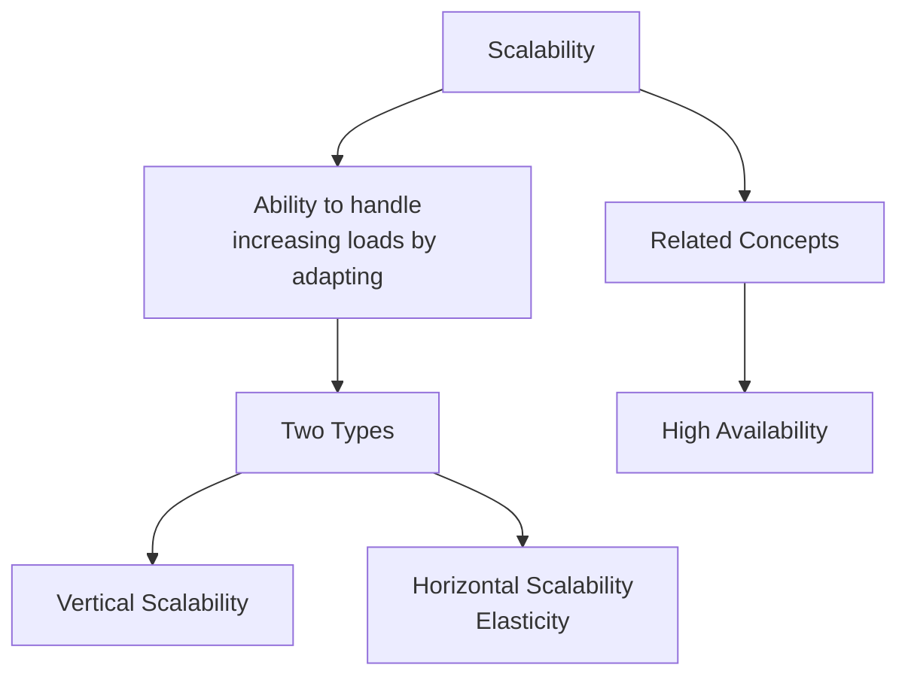

### Key Definitions

| Concept | Definition |
|---------|-----------|
| **Scalability** | Ability to accommodate larger loads by enhancing hardware (scale up) or adding nodes (scale out) |
| **Elasticity** | Automatic scaling based on load in a scalable system (pay-per-use) |
| **Agility** | Quickly provision new IT resources (weeks → minutes) |

---

## Two Types of Scalability

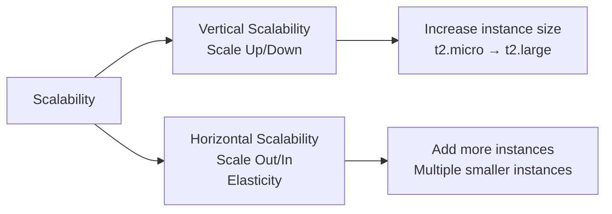

### Comparison

| Aspect | Vertical Scalability | Horizontal Scalability |
|--------|---------------------|------------------------|
| **Action** | Increase size of instance | Increase number of instances |
| **Example** | t2.micro → t2.large | 1 instance → 10 instances |
| **Also Known As** | Scale Up/Down | Scale Out/In, Elasticity |
| **Use Case** | Non-distributed systems (databases) | Distributed systems (web servers) |
| **Limit** | Hardware limitations | Practically unlimited |

---

## Call Center Analogy

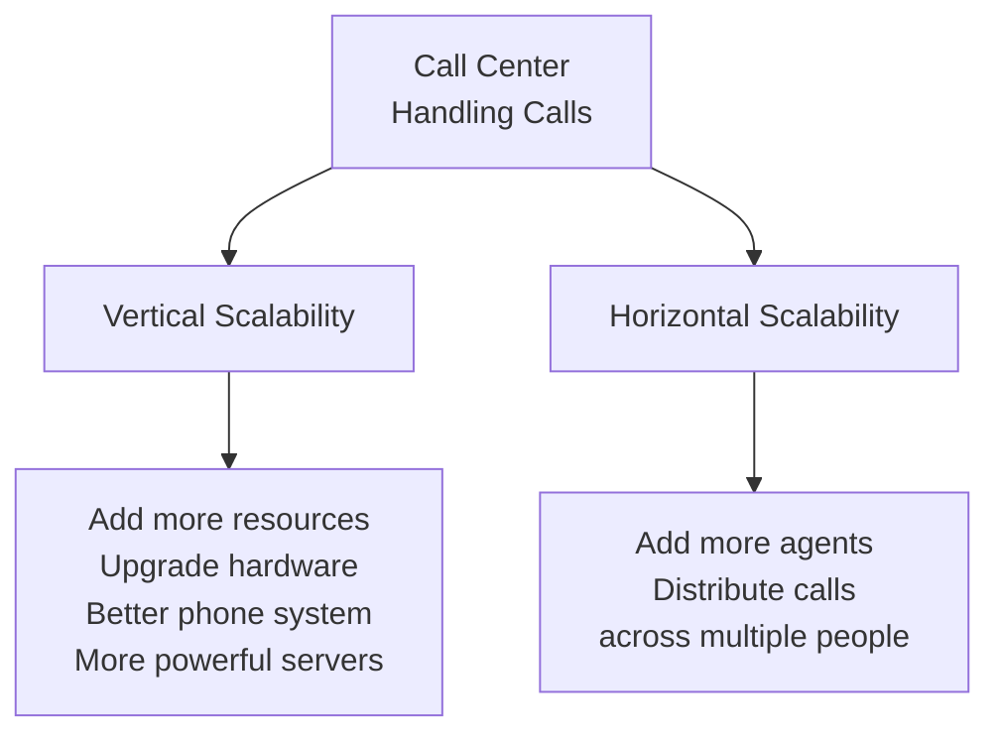

| Type | Analogy |
|------|---------|
| **Vertical Scalability** | Upgrade server hardware to handle increased call volume |
| **Horizontal Scalability** | Add more call center agents to distribute workload |

---

## Vertical Scalability

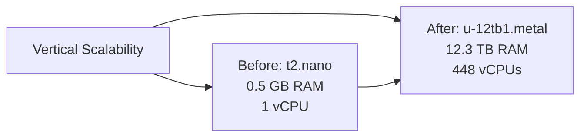

### Key Characteristics

| Aspect | Description |
|--------|-------------|
| **Action** | Increase the size of the instance |
| **Use Case** | Non-distributed systems (e.g., databases) |
| **Limit** | Hardware limitations (maximum instance size) |

### Example Scale Range

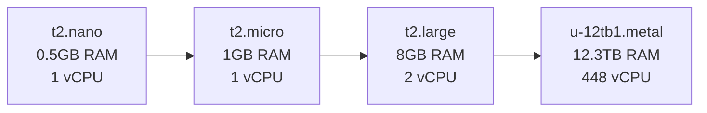

---

## Horizontal Scalability

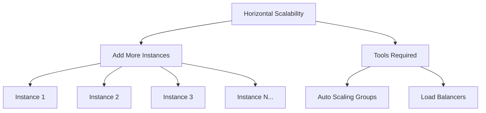

### Key Characteristics

| Aspect | Description |
|--------|-------------|
| **Action** | Increase number of instances |
| **Tools** | Auto Scaling Groups + Load Balancers |
| **Use Case** | Distributed systems (web servers, microservices) |
| **Limit** | Practically unlimited |

---

## High Availability (HA)

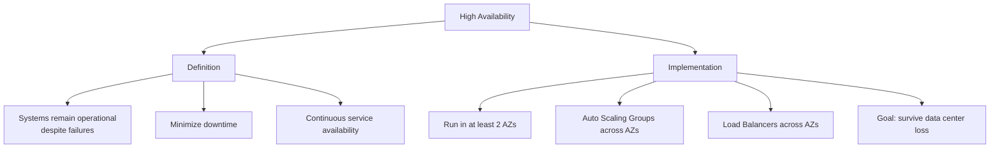

### High Availability Goals

| Goal | Description |
|------|-------------|
| **Survive Data Center Loss** | Continue operating despite AZ failure |
| **Minimize Downtime** | Reduce service interruptions |
| **Multi-AZ Deployment** | Run across at least 2 Availability Zones |
| **Continuous Availability** | Service always accessible |

---

## Scalability vs High Availability

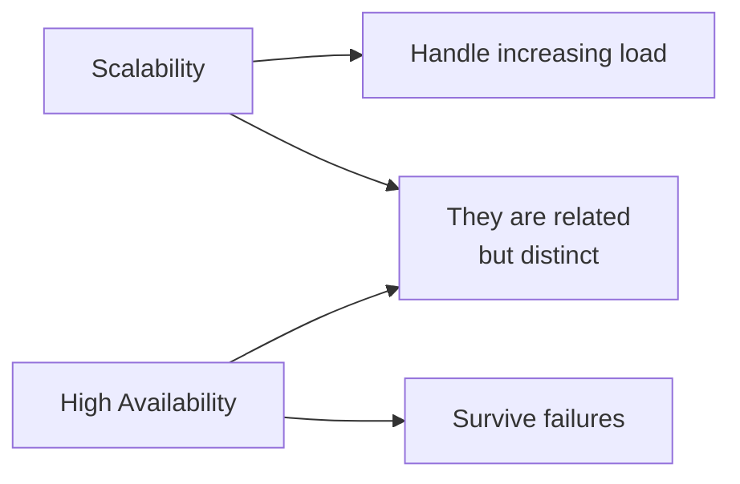

### Key Differences

| Aspect | Scalability | High Availability |
|--------|-------------|-------------------|
| **Goal** | Handle increased load | Survive failures |
| **Question** | "Can it handle more users?" | "Will it stay up if something fails?" |
| **Implementation** | Scale up/out | Multi-AZ, redundancy |
| **Focus** | Capacity | Reliability |

---

## High Availability & Scalability for EC2

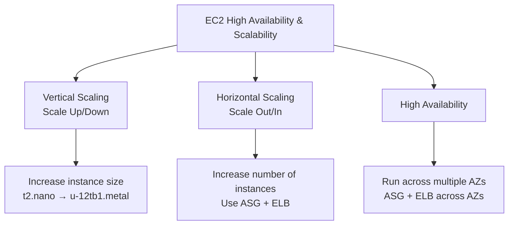

### Vertical Scaling Details

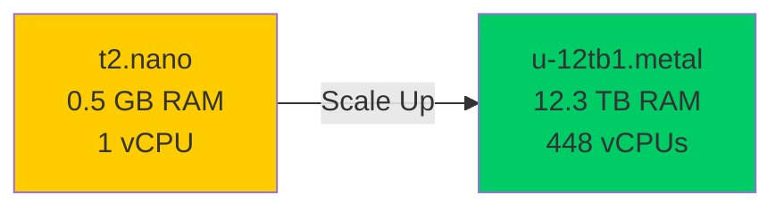

### Horizontal Scaling Details

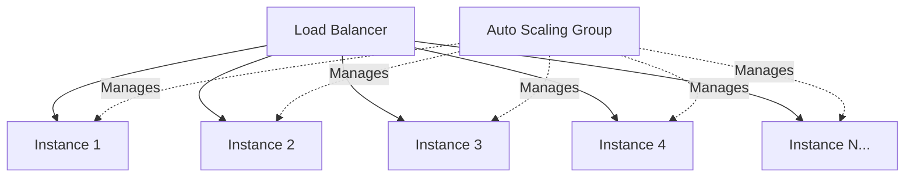

### High Availability Details

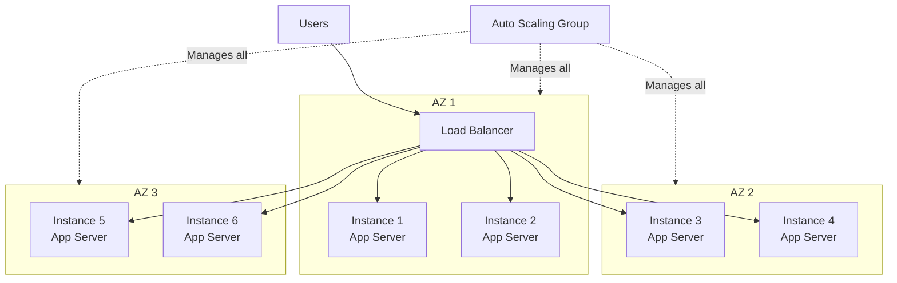

---

## Scalability vs Elasticity vs Agility

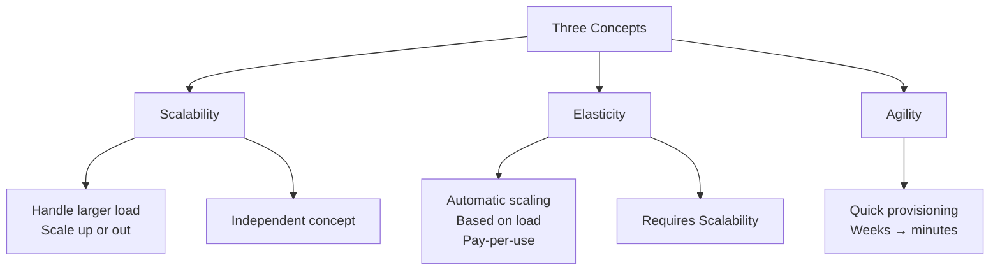

### Detailed Comparison

| Concept | Definition | Key Feature |
|---------|------------|-------------|
| **Scalability** | Ability to accommodate larger load | Scale up (hardware) or scale out (nodes) |
| **Elasticity** | Automatic scaling in scalable system | Pay-per-use, demand matching, cost optimization |
| **Agility** | Quickly provision new IT resources | Reduces time from weeks to minutes |

### Relationship Diagram

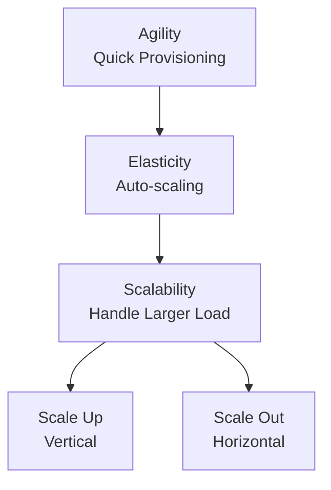

### Practical Example

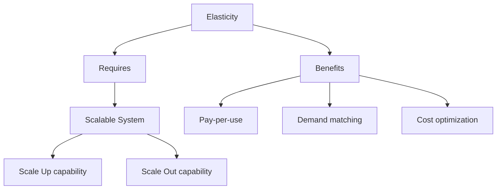

---

## When to Use Each Scaling Type

### Vertical Scaling Decision

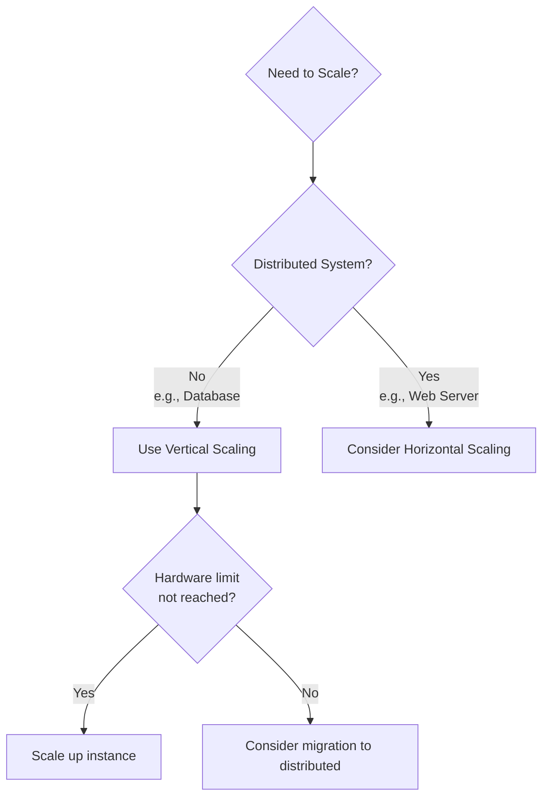

### Horizontal Scaling Decision

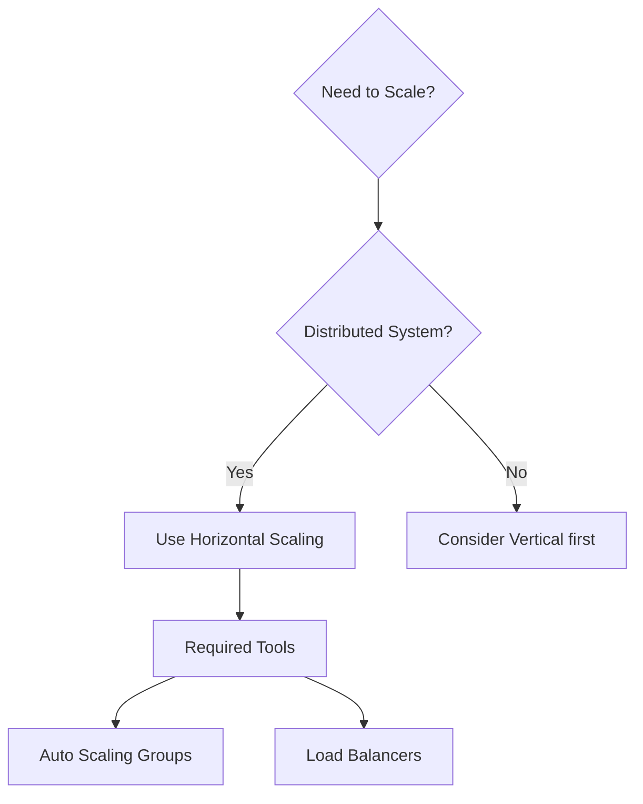

### Use Cases Comparison

| Scenario | Recommended Approach |
|----------|---------------------|
| **Traditional RDBMS database** | Vertical Scaling |
| **NoSQL database (DynamoDB)** | Horizontal Scaling |
| **Web server fleet** | Horizontal Scaling |
| **Single application instance** | Vertical Scaling |
| **Microservices** | Horizontal Scaling |

---

## AWS Tools for Scalability & HA

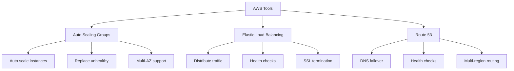

### Tools Summary

| Tool | Purpose |
|------|---------|
| **Auto Scaling Groups (ASG)** | Automatically scale EC2 instances |
| **Elastic Load Balancer (ELB)** | Distribute traffic across instances |
| **Route 53** | DNS failover and traffic routing |

---

## Implementation Architecture

### HA + Scalable Web Application

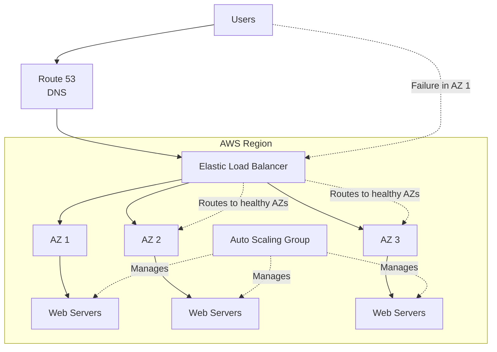

---

## Key Takeaways

1. **Scalability** = Handle increasing loads by adapting
2. **Two Types**:
   - **Vertical**: Increase instance size (Scale Up/Down)
   - **Horizontal**: Increase instance count (Scale Out/In)
3. **Vertical Scalability**:
   - Common for non-distributed systems (databases)
   - Limited by hardware
   - Example: t2.nano → u-12tb1.metal
4. **Horizontal Scalability**:
   - Uses Auto Scaling Groups + Load Balancers
   - Practically unlimited
5. **High Availability**:
   - Survive failures, minimize downtime
   - Run in at least 2 AZs
   - ASG + ELB across multiple AZs
6. **Scalability vs HA**:
   - Scalability = capacity
   - HA = reliability
7. **Elasticity** = automatic scaling based on load
8. **Agility** = quick resource provisioning
9. **AWS Tools**: ASG, ELB, Route 53
10. **Best Practice**: Combine vertical + horizontal + HA for robust architecture

---

## Next Steps

⬅️ Previous: [EC2 Security & Storage](./14-ec2-security-storage.md) | ➡️ Next: [Load Balancing, Auto Scaling, and Route 53](./15-load-balancing.md)

---

*This documentation is part of the AWS Cloud Practitioner certification study materials.*