# Load Balancing & Auto Scaling

## The Big Picture

This module covers **Load Balancers** (distributing traffic across instances) and **Auto Scaling Groups** (dynamically adjusting capacity) - the two key AWS services for building highly available and scalable applications.

---

## I. Load Balancers Overview

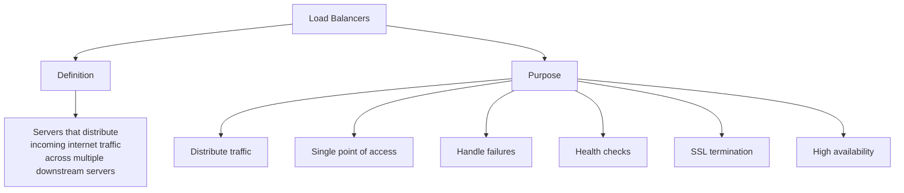

### What Load Balancers Do

| Function | Description |
|----------|-------------|
| **Distribute Traffic** | Across multiple downstream instances |
| **Single Point of Access** | Single DNS endpoint for your application |
| **Failure Handling** | Seamlessly handle failures of downstream instances |
| **Health Checks** | Perform regular health checks on instances |
| **SSL Termination** | Handle HTTPS encryption/decryption |
| **High Availability** | Ensure HA across zones |

---

## Why Use Elastic Load Balancer (ELB)?

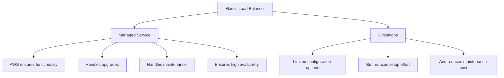

### ELB Benefits vs Custom Load Balancer

| Aspect | Custom Load Balancer | ELB |
|--------|---------------------|-----|
| **Setup** | Manual, complex | Quick, easy |
| **Maintenance** | Your responsibility | AWS managed |
| **Upgrades** | Manual | Automatic |
| **High Availability** | Build yourself | Built-in |
| **Configuration** | Fully customizable | Limited but sufficient |

---

## Four Types of Load Balancers

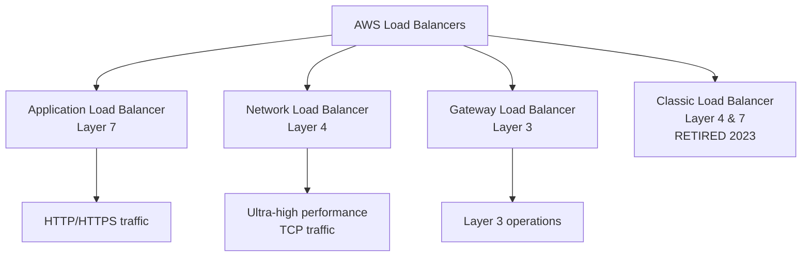

### Load Balancer Types Comparison

| Type | Layer | Use Case | Status |
|------|-------|----------|--------|
| **Application Load Balancer (ALB)** | Layer 7 | HTTP/HTTPS traffic | ✅ Active |
| **Network Load Balancer (NLB)** | Layer 4 | TCP, ultra-high performance | ✅ Active |
| **Gateway Load Balancer** | Layer 3 | Layer 3 routing | ✅ Active |
| **Classic Load Balancer (CLB)** | Layer 4 & 7 | Legacy | ❌ Retired 2023 |

### Detailed Comparison

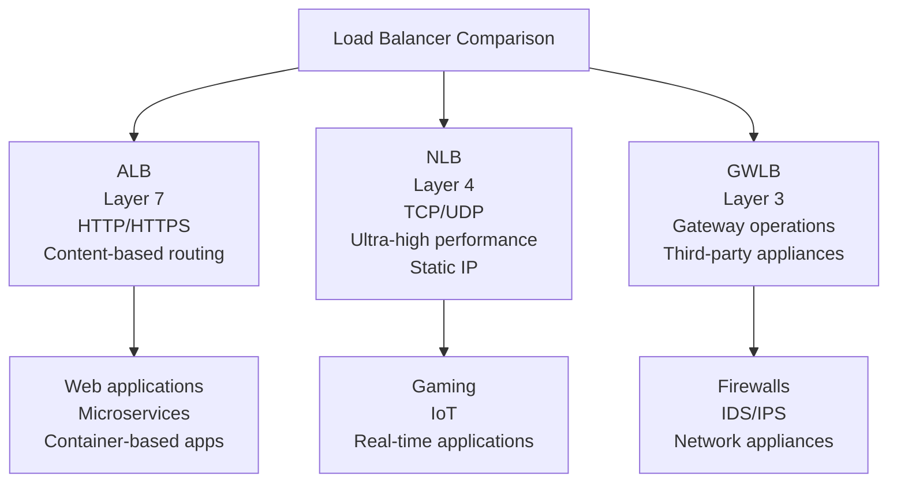

---

## II. Auto Scaling Groups (ASG)

### Why Auto Scaling?

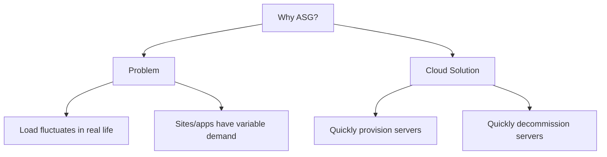

### ASG Goals

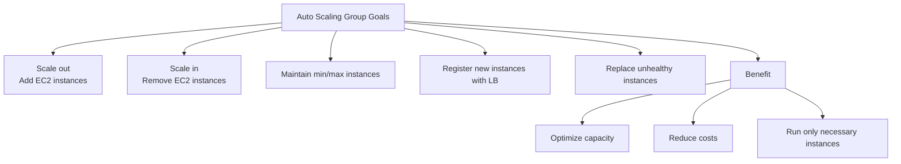

### ASG Capabilities

| Capability | Description |
|------------|-------------|
| **Scale Out** | Add EC2 instances to handle increased load |
| **Scale In** | Remove EC2 instances to reduce excess capacity |
| **Maintain Capacity** | Keep within specified minimum and maximum |
| **Auto Register** | Register new instances with load balancer |
| **Health Replacement** | Replace unhealthy instances |

---

## III. Auto Scaling Strategies

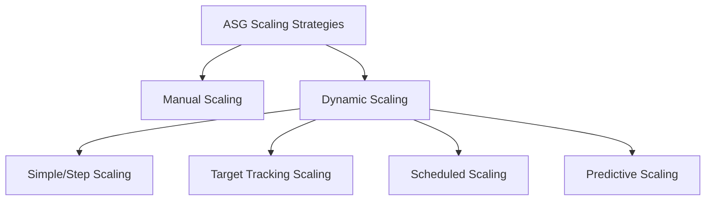

### 1. Manual Scaling

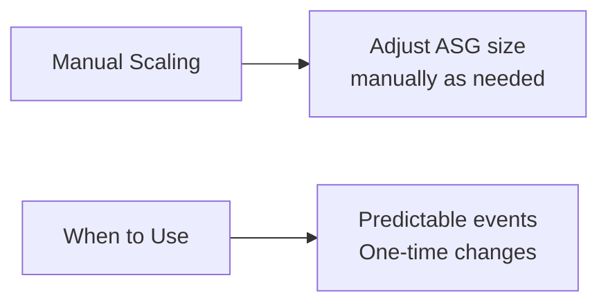

| Aspect | Description |
|--------|-------------|
| **How** | Manually adjust ASG size |
| **When** | One-time changes, predictable events |
| **Use Case** | Special events, maintenance windows |

### 2. Simple / Step Scaling

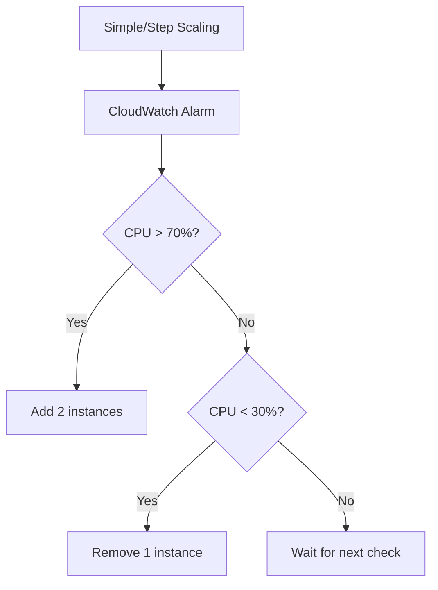

| Aspect | Description |
|--------|-------------|
| **How** | CloudWatch alarm triggers scaling action |
| **Action** | Add/remove specific number of instances |
| **Example** | Add 2 units if CPU > 70%, Remove 1 if CPU < 30% |

### 3. Target Tracking Scaling

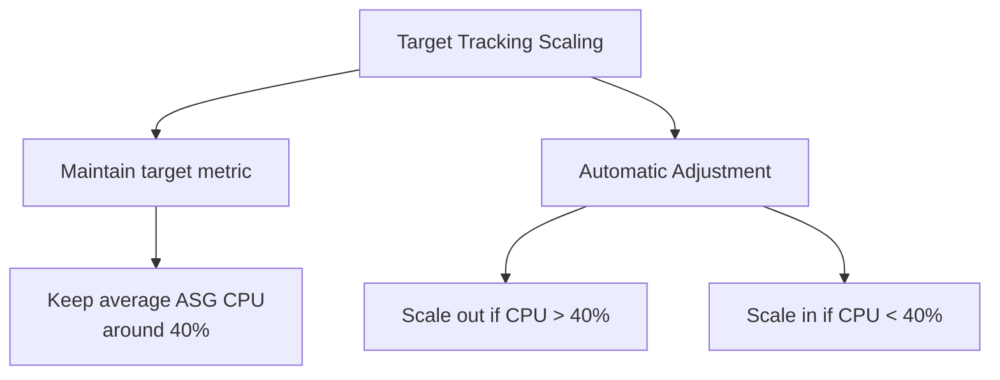

| Aspect | Description |
|--------|-------------|
| **How** | Maintain a target metric value |
| **Example** | Keep average ASG CPU at 40% |
| **Behavior** | Automatically scale up or down |

### 4. Scheduled Scaling

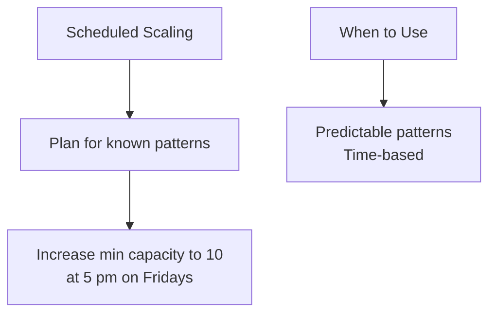

| Aspect | Description |
|--------|-------------|
| **How** | Plan scaling actions based on known patterns |
| **Example** | Increase capacity to 10 at 5 PM Fridays |
| **Use Case** | Predictable traffic spikes |

### 5. Predictive Scaling

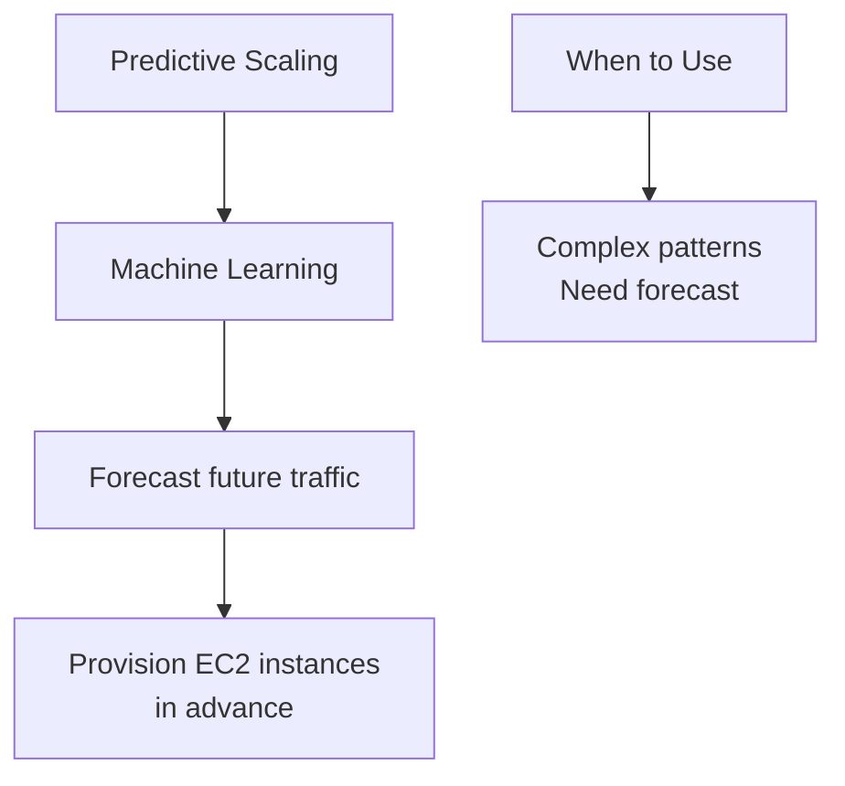

| Aspect | Description |
|--------|-------------|
| **How** | Uses Machine Learning to forecast traffic |
| **Behavior** | Automatically provisions instances in advance |
| **Use Case** | Complex traffic patterns |

---

## Scaling Strategies Comparison

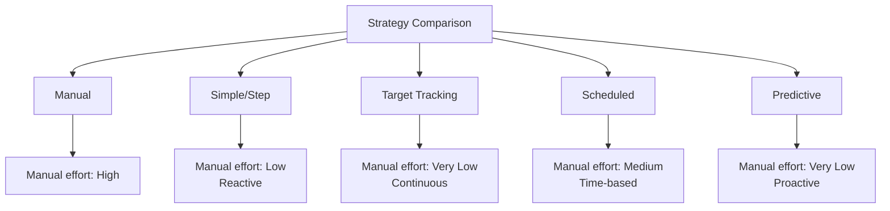

### Strategy Selection Matrix

| Strategy | Automation Level | Trigger | Best For |
|----------|----------------|---------|----------|
| **Manual** | None | Human action | One-time events |
| **Simple/Step** | Reactive | CloudWatch alarm | Simple thresholds |
| **Target Tracking** | Continuous | Target metric | CPU/memory at level |
| **Scheduled** | Time-based | Time schedule | Known patterns |
| **Predictive** | ML-based | Forecast | Complex patterns |

---

## IV. Integration Architecture

### Complete HA + Scalable Architecture

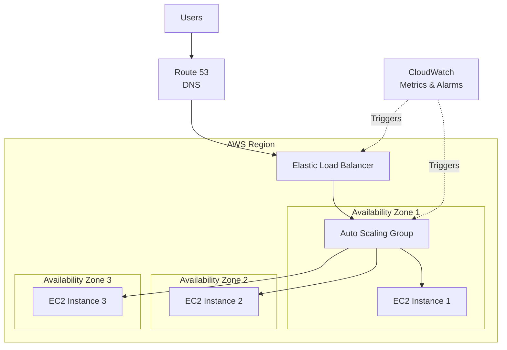

### Health Check Flow

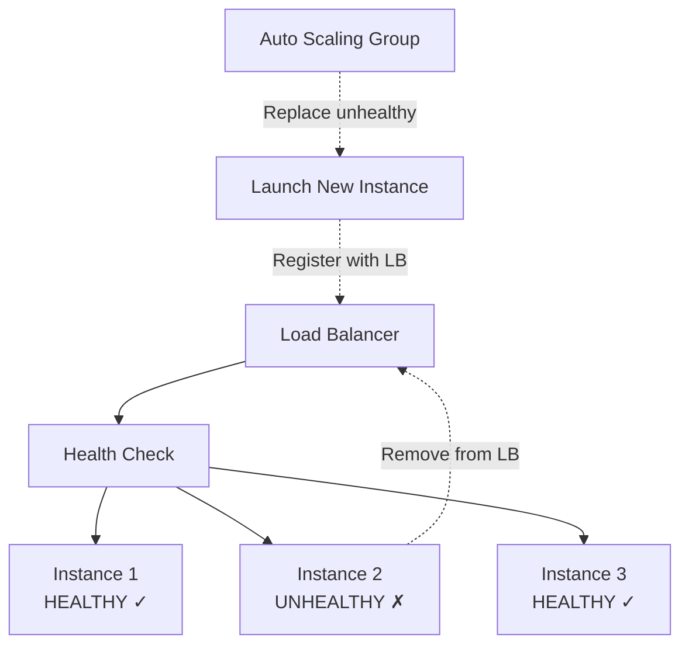

---

## V. Load Balancer + ASG Benefits

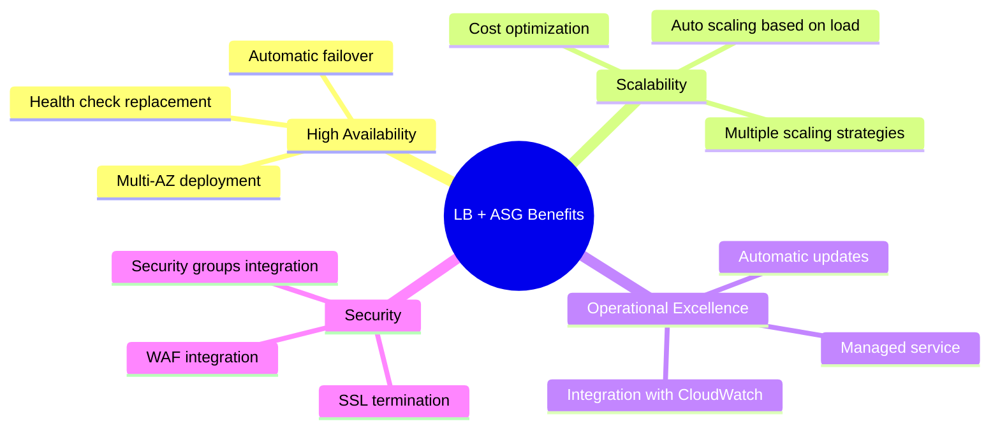

---

## VI. Load Balancer Selection Guide

### Decision Tree

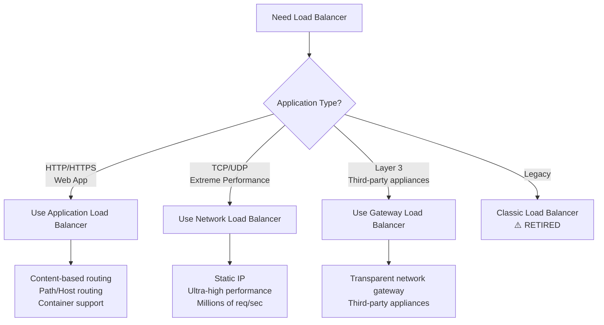

### Recommendation Matrix

| Use Case | Recommended LB | Reason |
|----------|---------------|--------|
| **Web application (HTTP/HTTPS)** | ALB | Layer 7 features, content routing |
| **Microservices / Containers** | ALB | Container support, path routing |
| **Gaming / Real-time** | NLB | Ultra-low latency, static IP |
| **IoT / MQTT** | NLB | TCP support, performance |
| **Network appliances** | GWLB | Layer 3 transparency |
| **Hybrid architectures** | GWLB | Third-party integration |

---

## VII. ASG Configuration Components

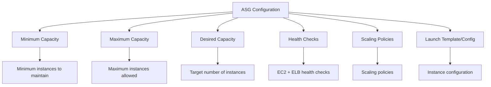

### Capacity Settings

| Setting | Description |
|---------|-------------|
| **Minimum** | Lowest number of instances always running |
| **Maximum** | Highest number of instances allowed |
| **Desired** | Target number at any time |

---

## Key Takeaways

### Load Balancers
1. **4 Types**: ALB (L7), NLB (L4), GWLB (L3), CLB (retired)
2. **Use cases**: ALB for HTTP/HTTPS, NLB for TCP/performance, GWLB for L3
3. **Benefits**: HA, health checks, SSL termination, single access point
4. **Managed service**: AWS handles maintenance, upgrades, HA

### Auto Scaling Groups
1. **Purpose**: Dynamic capacity adjustment
2. **Capabilities**: Scale out/in, health replacement, LB integration
3. **5 Strategies**: Manual, Simple/Step, Target Tracking, Scheduled, Predictive
4. **Integration**: Works with ELB, CloudWatch
5. **Cost optimization**: Run only necessary instances

### Together
1. **HA + Scalability**: Combine LB + ASG for robust architecture
2. **Multi-AZ**: Deploy across multiple Availability Zones
3. **Health checks**: Automatic replacement of unhealthy instances
4. **Scaling triggers**: CloudWatch metrics drive scaling decisions

---

## Next Steps

⬅️ Previous: [Scalability & HA](./15-scalability-high-availability.md) | ➡️ Next: [Route 53, RDS, and Aurora](./17-route53-rds-aurora.md)

---

*This documentation is part of the AWS Cloud Practitioner certification study materials.*
