# VM vs Container Security

## The Big Picture

This module provides a deep analysis of **Server Virtualization (VMs) vs OS Virtualization (Containers)**, focusing on isolation levels, security implications, attack vectors, and best practices.

---

## Learning Objectives

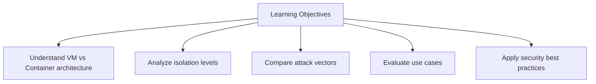

---

## I. Introduction

> **Core Question:** Why is the isolation level of server virtualization (VMs) greater than the isolation level of operating system virtualization (containers)?

**Answer:** The fundamental architectural difference is that **VMs have virtual hardware** while **containers share the host kernel**.

---

## II. Server Virtualization (VMs) Architecture

### VM Components

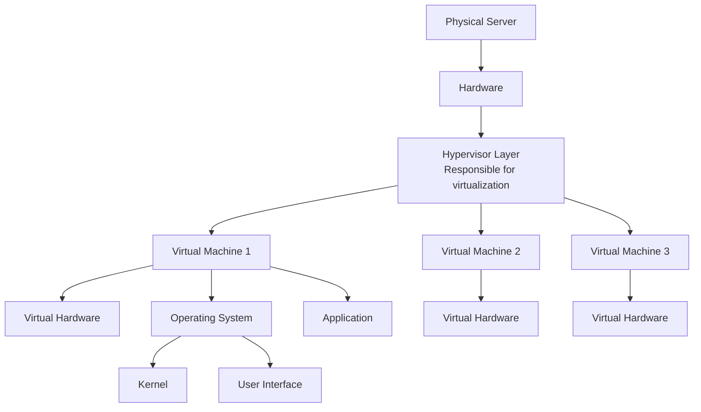

### VM Internal Structure

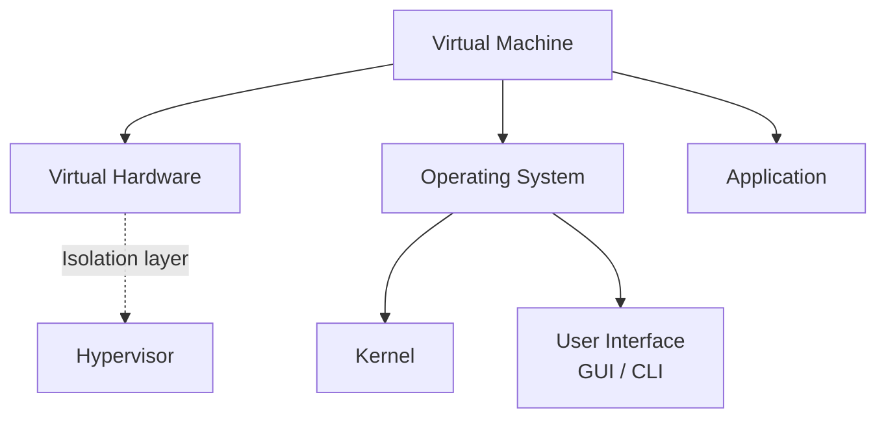

### VM Isolation Scenario

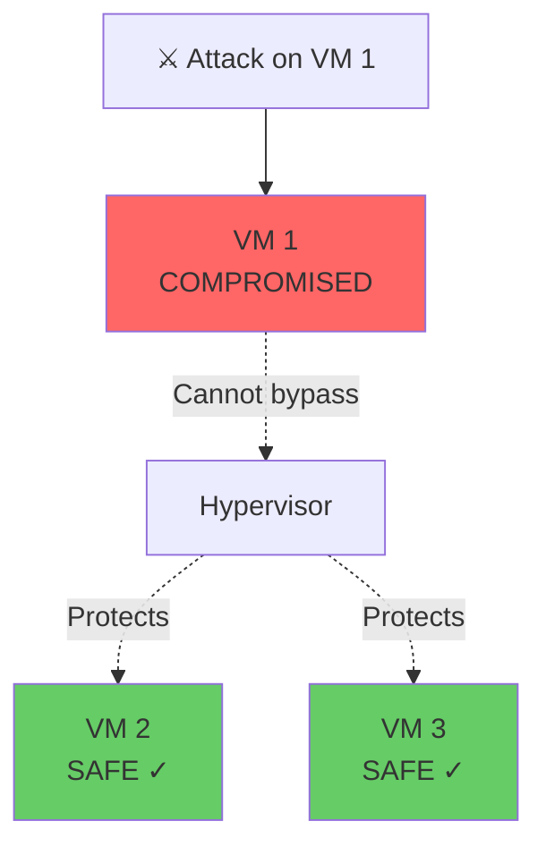

> **Key Insight:** An attacker **cannot bypass** the VM and reach the Hypervisor. The VM is fully isolated.

---

## III. Container Architecture

### Container Components

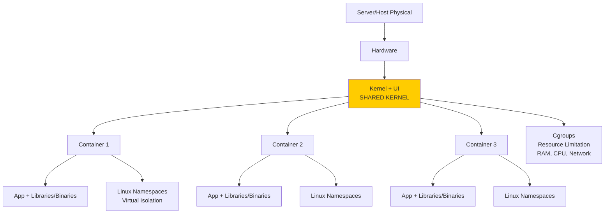

### Container Environment

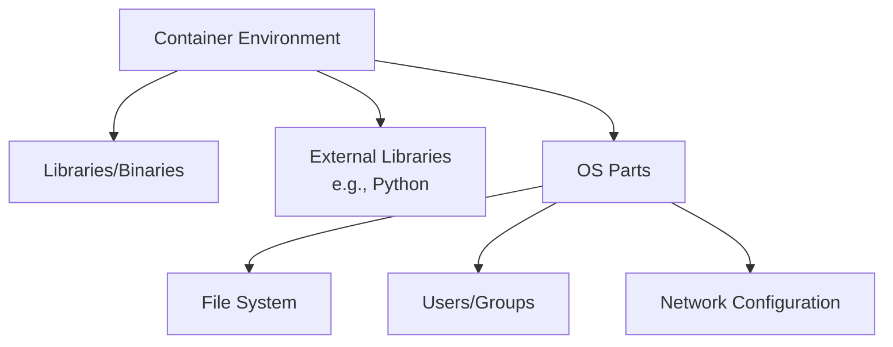

### Role of Linux Namespaces

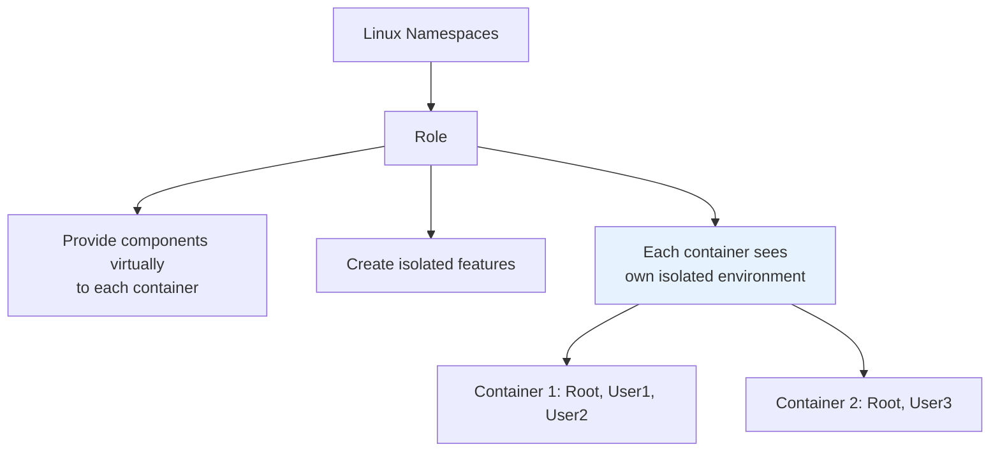

### Role of Cgroups

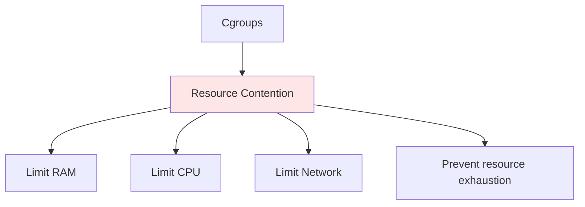

### Container Isolation Scenario (Shared Kernel)

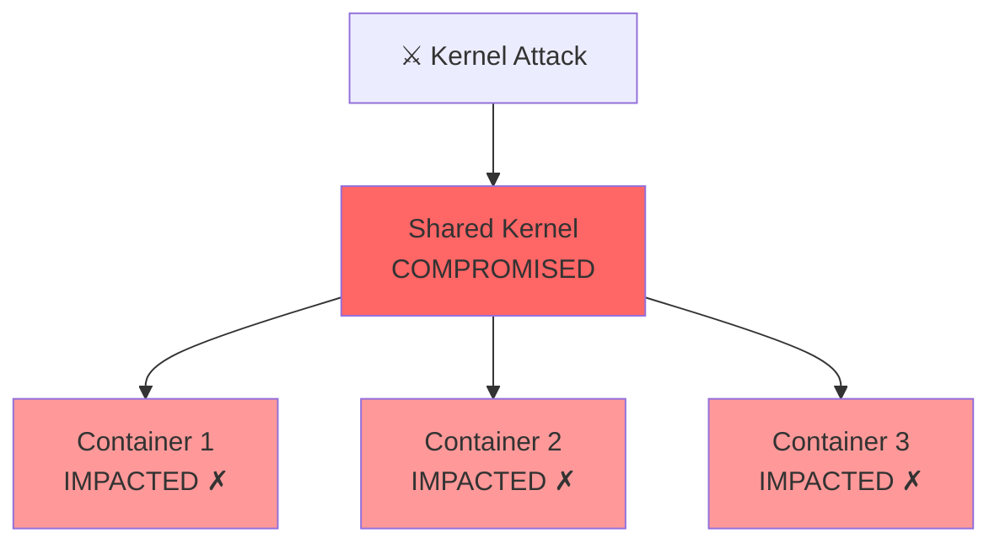

> **Key Warning:** If the **Shared Kernel** is compromised, **ALL containers** on the host are impacted.

---

## IV. Hardware Interaction Comparison

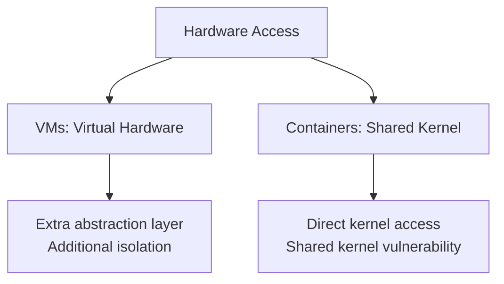

---

## V. Isolation Levels Comparison

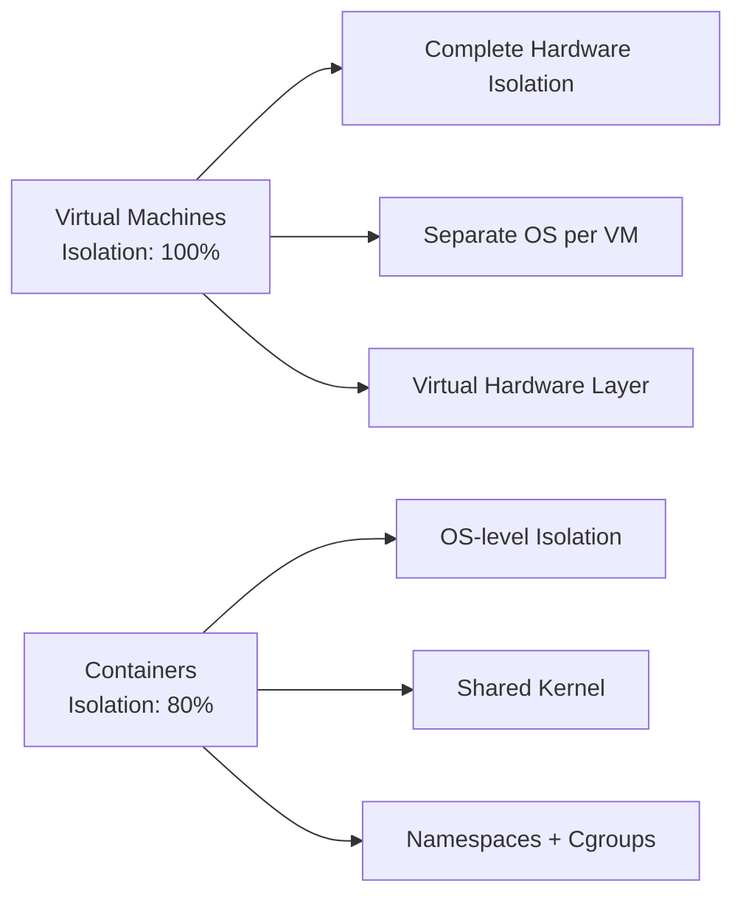

### Detailed Comparison

| Aspect | Virtual Machines | Containers | Instructor's Comment |
|--------|-----------------|------------|---------------------|
| **Attack Target** | Hypervisor | Shared Kernel | "Attacking the Hypervisor in the VM model is extremely difficult" |
| **Hardware Access** | Virtual hardware | Shared Kernel access | "VMs utilize virtual hardware, which adds extra layer" |
| **Privilege Escalation** | Contained within VM | Can affect kernel | "High-privilege attacks might make Kernel vulnerable" |
| **Internet Exposure** | VMs can be internet-facing | Host should NOT be accessible | "Container host should not be internet-accessible" |
| **Overall Isolation** | **Much Higher** | Not as strong | "Containers isolation is not stronger than VMs" |

---

## VI. Isolation Strength Visualization

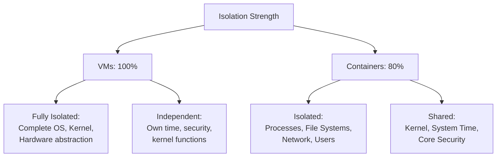

---

## VII. Attack Scenarios

### VM Attack Scenario

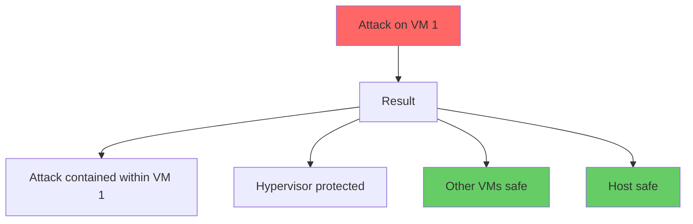

### Container Attack Scenarios

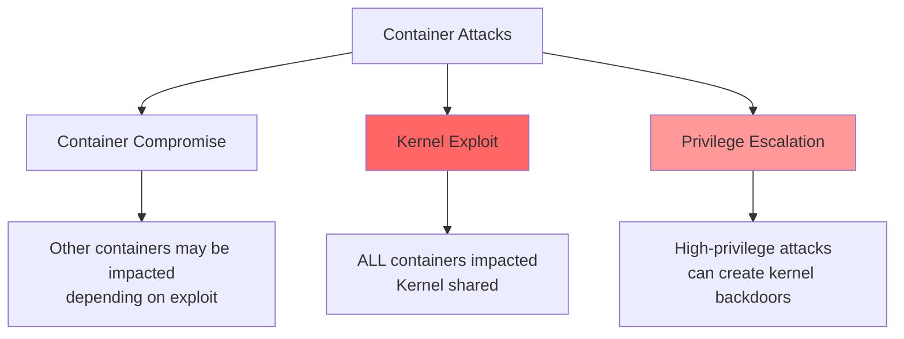

---

## VIII. Container Security: Root vs Rootless

### The Root Privilege Problem

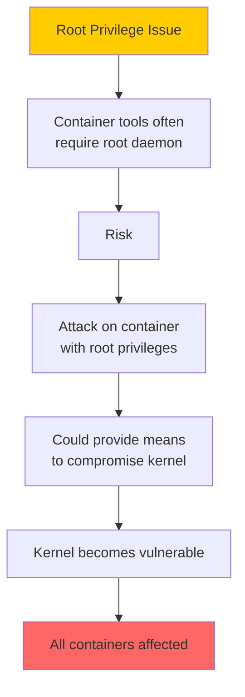

### Docker vs Podman

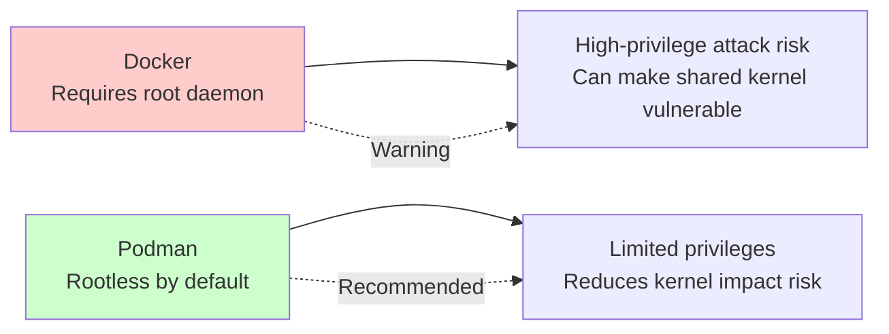

### Comparison

| Container Technology | Default Privilege | Security Implication |
|--------------------|-------------------|---------------------|
| **Docker** | Requires root daemon | High-privilege attack risk - can make shared kernel vulnerable |
| **Podman (Red Hat)** | Rootless by default | Limited privileges - reduces risk of kernel impact |

---

## IX. Security Best Practices

### For Container Deployments

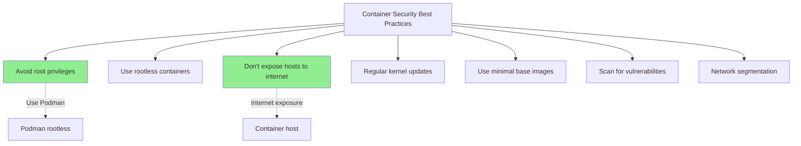

### Best Practices Summary

| Practice | Reason |
|----------|--------|
| **Avoid root privileges** | Prevents kernel-level attacks |
| **Use rootless containers** | Reduces attack surface (e.g., Podman) |
| **Don't expose hosts to internet** | Container hosts should only egress, not ingress |
| **Regular kernel updates** | Patch kernel vulnerabilities |
| **Use minimal base images** | Reduce attack surface |
| **Scan for vulnerabilities** | Detect known issues |
| **Network segmentation** | Limit lateral movement |

---

## X. House vs Apartment Analogy

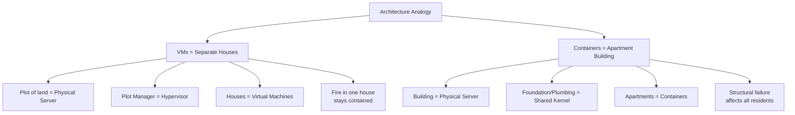

### Detailed Analogy

| Component | VMs (Houses) | Containers (Apartments) |
|-----------|-------------|------------------------|
| **Physical Server** | Plot of land | Building |
| **Manager/Foundation** | Plot Manager (Hypervisor) | Building Foundation (Shared Kernel) |
| **Units** | Separate Houses | Apartments |
| **Boundaries** | Complete walls (OS + Virtual Hardware) | Partitions (Namespaces) |
| **Resource Limits** | Each house independent | Each apartment has power limits (Cgroups) |
| **Failure Impact** | Fire in one house stays contained | Foundation failure affects all apartments |

---

## XI. Technology Timeline

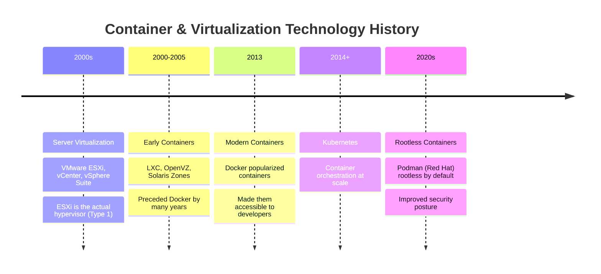

### Technology Examples

| Technology Type | Examples | Notes |
|----------------|----------|-------|
| **Server Virtualization** | VMware ESXi, vCenter, vSphere Suite | ESXi is the actual hypervisor layer |
| **Early Containers** | LXC, OpenVZ, Solaris Zones | Preceded Docker by many years |
| **Modern Containers** | Docker (popular), Podman | Docker popularized but wasn't first |

---

## XII. VMware Components Clarification

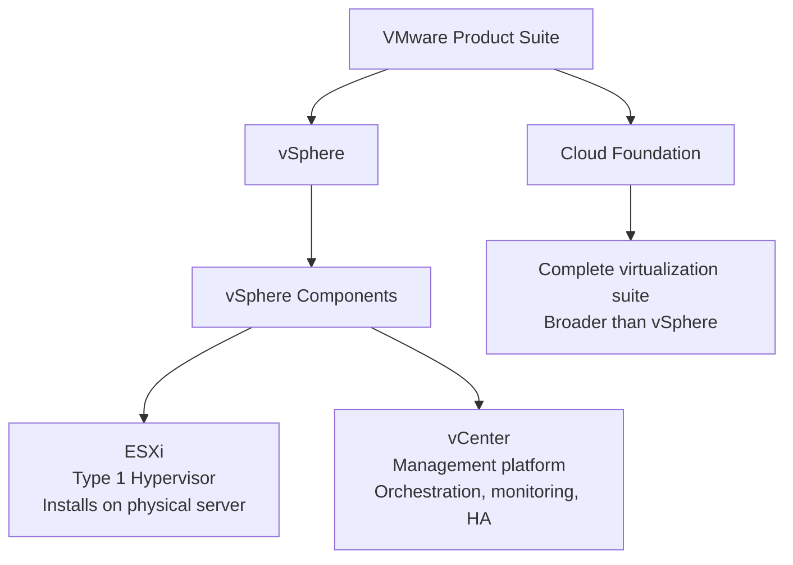

### VMware Components

| Component | Role |
|-----------|------|
| **ESXi** | Type 1 hypervisor - installs directly on physical server hardware |
| **vCenter** | Management platform for orchestration, monitoring, HA |
| **vSphere** | Complete suite including ESXi + vCenter |
| **Cloud Foundation** | Broader complete platform |

---

## XIII. Final Security Analysis

### Why VM Isolation is Higher

```mermaid
graph TD
    Final[VM Isolation > Container Isolation] --> Reason[Reasons]
    
    Reason --> R1[Virtual Hardware Layer<br/>Extra abstraction]
    Reason --> R2[Separate Kernel per VM<br/>No shared component]
    Reason --> R3[Hypervisor Protection<br/>Difficult to attack]
    Reason --> R4[Attack Containment<br/>Stays within VM]
```

### Summary Table

| Architecture Component | Virtual Machines | Containers | Isolation Impact |
|----------------------|-----------------|------------|------------------|
| **Hardware Layer** | Virtual Hardware per VM | Shared Kernel access | VMs have extra abstraction |
| **Operating System** | Complete OS per VM | Shared OS kernel | VMs fully isolated |
| **Attack Containment** | Cannot bypass to hypervisor | Kernel compromise affects all | VMs superior containment |
| **Privilege Escalation** | Isolated within VM boundaries | Root access can create backdoors | VMs prevent cross-system impact |

---

## XIV. Decision Matrix: When to Use What

```mermaid
graph TD
    Q[Choose VM or Container] --> F1{Need Different OS?}
    F1 -->|Yes| VM[Use VMs]
    F1 -->|No| F2{Need Strong Isolation?}
    
    F2 -->|Yes, Critical| VM
    F2 -->|No| F3{Need Rapid Scaling?}
    
    F3 -->|Yes| Container[Use Containers]
    F3 -->|No| F4{Need Legacy Support?}
    
    F4 -->|Yes| VM
    F4 -->|No| Either[Either works]
```

### Use Case Matrix

| Use Case | Recommendation | Reason |
|----------|---------------|--------|
| **Different OS requirements** | VMs | OS-level isolation |
| **Critical applications** (CRM, ERP) | VMs | Strong isolation, security |
| **Microservices** | Containers | Rapid scaling, efficiency |
| **CI/CD pipelines** | Containers | Fast startup, ephemeral |
| **Legacy applications** | VMs | OS flexibility, compatibility |
| **Multi-tenant hosting** | VMs | Strong isolation per tenant |
| **Development environments** | Containers | Quick provisioning |
| **High-security workloads** | VMs + rootless containers | Maximum protection |

---

## Key Takeaways

1. **VM Isolation > Container Isolation** - due to virtual hardware layer
2. **Containers share the kernel** - if kernel compromised, all containers impacted
3. **VMs have virtual hardware** - extra abstraction and isolation layer
4. **Hypervisor attacks are extremely difficult** - good protection layer
5. **Root privileges in containers** = high risk - can create kernel backdoors
6. **Podman rootless** - reduces kernel vulnerability risk
7. **Container hosts should NOT be internet-accessible** - security best practice
8. **VMs**: 100% isolation, 10-50 per host
9. **Containers**: 80% isolation, 100s-1000s per host
10. **Choose based on**: OS requirements, security needs, scaling requirements
11. **Defense in depth**: Use both VMs and rootless containers appropriately
12. **House vs Apartment**: VMs are separate houses, containers are apartments sharing foundation

---

## Next Steps

⬅️ Previous: [Load Balancing & Auto Scaling](./16-load-balancing-auto-scaling.md) | ➡️ Next: [Route 53, RDS, and Aurora](./17-route53-rds-aurora.md)

---

*This documentation is part of the AWS Cloud Practitioner certification study materials.*
